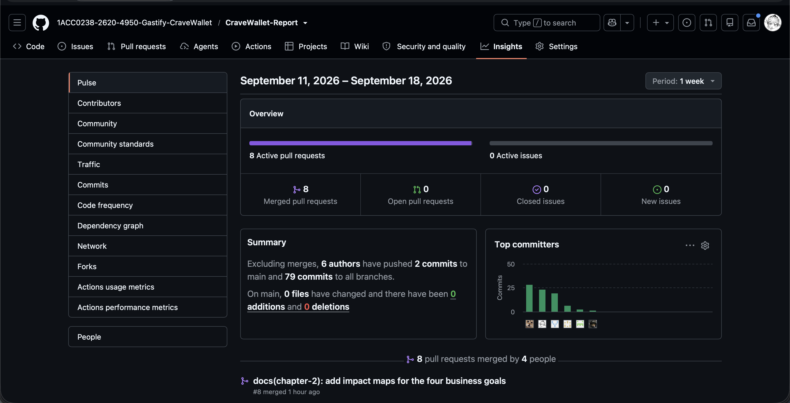

# Registro de Versiones del Informe

| Versión |    Fecha   |      Autor     | Descripción de modificación |
|:-------:|:----------:|:--------------:|:---------------------------:|
|   AV1   | 15/09/2026  | Todo el equipo |       Primera versión       |

# Project Report Collaboration Insights

<!-- pdf:omit-start -->

# Contenido

### [Capítulo I: Presentación](docs/chapter_1.md#capítulo-i-presentación)
- [1.1. Startup Profile](docs/chapter_1.md#11-startup-profile)
  - [1.1.1. Descripción de la Startup](docs/chapter_1.md#111-descripción-de-la-startup)
  - [1.1.2. Perfiles de integrantes del equipo](docs/chapter_1.md#112-perfiles-de-integrantes-del-equipo)
- [1.2. Solution Profile](docs/chapter_1.md#12-solution-profile)
  - [1.2.1. Antecedentes y problemática](docs/chapter_1.md#121-antecedentes-y-problemática)
  - [1.2.2. Lean UX Process](docs/chapter_1.md#122-lean-ux-process)
- [1.3. Segmentos objetivo](docs/chapter_1.md#13-segmentos-objetivo)

### [Capítulo II: Requirements Development and Software Solution Design](docs/chapter_2.md#capítulo-ii-requirements-development-and-software-solution-design)
- [2.1. Competidores](docs/chapter_2.md#21-competidores)
  - [2.1.1. Análisis competitivo](docs/chapter_2.md#211-análisis-competitivo)
  - [2.1.2. Estrategias y tácticas frente a competidores](docs/chapter_2.md#212-estrategias-y-tácticas-frente-a-competidores)
- [2.2. Entrevistas](docs/chapter_2.md#22-entrevistas)
  - [2.2.1. Diseño de entrevistas](docs/chapter_2.md#221-diseño-de-entrevistas)
  - [2.2.2. Registro de entrevistas](docs/chapter_2.md#222-registro-de-entrevistas)
  - [2.2.3. Análisis de entrevistas](docs/chapter_2.md#223-análisis-de-entrevistas)
- [2.3. Needfinding](docs/chapter_2.md#23-needfinding)
  - [2.3.1. User Personas](docs/chapter_2.md#231-user-personas)
  - [2.3.2. User Task Matrix](docs/chapter_2.md#232-user-task-matrix)
  - [2.3.3. User Journey Mapping](docs/chapter_2.md#233-user-journey-mapping)
  - [2.3.4. Empathy Mapping](docs/chapter_2.md#234-empathy-mapping)
  - [2.3.5. Big Picture EventStorming](docs/chapter_2.md#235-big-picture-eventstorming)
  - [2.3.6. Ubiquitous Language](docs/chapter_2.md#236-ubiquitous-language)
- [2.4. Requirements specification](docs/chapter_2.md#24-requirements-specification)
  - [2.4.1. User Stories](docs/chapter_2.md#241-user-stories)
  - [2.4.2. Impact Mapping](docs/chapter_2.md#242-impact-mapping)
  - [2.4.3. Product Backlog](docs/chapter_2.md#243-product-backlog)
- [2.5. Strategic-Level Domain-Driven Design](docs/chapter_2.md#25-strategic-level-domain-driven-design)
  - [2.5.1. EventStorming](docs/chapter_2.md#251-eventstorming)
  - [2.5.2. Context Mapping](docs/chapter_2.md#252-context-mapping)
  - [2.5.3. Software Architecture](docs/chapter_2.md#253-software-architecture)
- [2.6. Tactical-Level Domain-Driven Design](docs/chapter_2.md#26-tactical-level-domain-driven-design)
  - [2.6.1. Bounded Context: Subscription Management](docs/chapter_2.md#261-bounded-context-subscription-management)
  - [2.6.2. Bounded Context: Delivery Expense Management](docs/chapter_2.md#262-bounded-context-delivery-expense-management)
  - [2.6.3. Bounded Context: Premium & Billing](docs/chapter_2.md#263-bounded-context-premium--billing)

### [Capítulo III: Solution UI/UX Design](docs/chapter_3.md#capítulo-iii-solution-uiux-design)
- [3.1. Product design](docs/chapter_3.md#31-product-design)
  - [3.1.1. Style Guidelines](docs/chapter_3.md#311-style-guidelines)
  - [3.1.2. Information Architecture](docs/chapter_3.md#312-information-architecture)
  - [3.1.3. Landing Page UI Design](docs/chapter_3.md#313-landing-page-ui-design)
  - [3.1.4. Mobile Applications UX/UI Design](docs/chapter_3.md#314-mobile-applications-uxui-design)

### [Capítulo IV: Product Implementation & Validation](docs/chapter_4.md#capítulo-iv-product-implementation--validation)
- [4.1. Software Configuration Management](docs/chapter_4.md#41-software-configuration-management)
  - [4.1.1. Software Development Environment Configuration](docs/chapter_4.md#411-software-development-environment-configuration)
  - [4.1.2. Source Code Management](docs/chapter_4.md#412-source-code-management)
  - [4.1.3. Source Code Style Guide & Conventions](docs/chapter_4.md#413-source-code-style-guide--conventions)
  - [4.1.4. Software Deployment Configuration](docs/chapter_4.md#414-software-deployment-configuration)
- [4.2. Landing Page & Mobile Application Implementation](docs/chapter_4.md#42-landing-page--mobile-application-implementation)
  - [4.2.1. Sprint 1](docs/chapter_4.md#421-sprint-1)
- [4.3. Validation Interviews](docs/chapter_4.md#43-validation-interviews)
  - [4.3.1. Diseño de Entrevistas](docs/chapter_4.md#431-diseño-de-entrevistas)
  - [4.3.2. Registro de Entrevistas](docs/chapter_4.md#432-registro-de-entrevistas)
  - [4.3.3. Evaluaciones según heurísticas](docs/chapter_4.md#433-evaluaciones-según-heurísticas)

### [Conclusiones](docs/closing.md#conclusiones)

### [Glosario](docs/closing.md#glosario)

### [Bibliografía](docs/closing.md#bibliografía)

### [Anexos](docs/closing.md#anexos)

<!-- pdf:omit-end -->

<!-- pdf:only
\tableofcontents
-->

# Student Outcome

El curso contribuye al cumplimiento del siguiente Student Outcome ABET:

**ABET - EAC - Student Outcome 7**

**Criterio:** La capacidad de adquirir y aplicar nuevos conocimientos según sea necesario, utilizando estrategias de aprendizaje apropiadas.

En el siguiente cuadro se describen las acciones realizadas por cada integrante y las conclusiones que sustentan el logro del Student Outcome durante la entrega AV1.

| Criterio específico                                                                                                                     | Acciones realizadas | Conclusiones |
|-----------------------------------------------------------------------------------------------------------------------------------------|---------------------|--------------|
| Actualiza conceptos y conocimientos necesarios para su desarrollo profesional y en especial para su proyecto en soluciones de software. | **Aliaga, Alexander** **AV1:** Documentó el Big Picture EventStorming del proceso actual y el EventStorming de diseño de CraveWallet. Organizó los eventos, actores, sistemas, problemas y oportunidades del escenario As-Is; desarrolló el Candidate Context Discovery, los Domain Message Flows y los Bounded Context Canvases que sustentan los contextos de Suscripciones, Gastos y Premium.  **Carpio Peña, Josué Francisco** **AV1:** Registró y consolidó la información de las entrevistas del Segmento 2, incluyendo datos demográficos, ocupación, fecha, duración y responsable. Corrigió la identificación de los entrevistados y organizó los enlaces y tiempos de inicio del video consolidado para mantener trazabilidad entre las grabaciones y el análisis de entrevistas.  **Faustino Hurtado, Anghelo Edwin** **AV1:** Registró las entrevistas de Leonardo Sánchez, Darío Romero y Eduardo Aguirre, incorporando sus enlaces, fechas, horarios, duraciones y perfiles. Integró las evidencias de User Personas y As-Is Journey Maps, preparó la carátula y los metadatos de la entrega, y documentó el Product Backlog de 52 elementos con su enlace y evidencia visual en Trello.  **Roman Zeballos, Sebastian Jared** **AV1:** Desarrolló el análisis de competidores y el diseño de entrevistas; consolidó el análisis cuantitativo de los dos segmentos y elaboró los artefactos de Needfinding. Especificó las 40 User Stories, 6 Technical Stories y 6 Spike Stories, estructuró el Ubiquitous Language, elaboró los cuatro Impact Maps en UXPressia y organizó la priorización y estimación del Product Backlog.  **Sejuro Medina, Mario Gabriel** **AV1:** Redactó la descripción de la startup, el Lean UX Process y los segmentos objetivo; revisó las User Stories para alinearlas con la rúbrica. Desarrolló el Context Mapping, los diagramas C4 de contexto, contenedores y despliegue, y el diseño táctico de los Bounded Contexts Subscription Management, Delivery Expense Management y Premium & Billing con sus diagramas de componentes, clases y base de datos. | **AV1:** Los aportes individuales actualizaron y aplicaron conocimientos de Lean UX, investigación de usuarios, ingeniería de requisitos, EventStorming, priorización ágil, C4 Model y Domain-Driven Design sobre el problema real de gestionar suscripciones y gastos recurrentes. El resultado mantiene trazabilidad entre la problemática, las entrevistas, los artefactos de Needfinding, los requisitos y la arquitectura propuesta para CraveWallet. |
| Reconoce la necesidad del aprendizaje permanente para el desempeño profesional y el desarrollo de proyectos en soluciones de software.  | **Aliaga, Alexander** **AV1:** Estudió la diferencia entre EventStorming As-Is y To-Be, así como el uso correcto de eventos, comandos, políticas, vistas y sistemas externos. Aplicó Candidate Context Discovery y Bounded Context Canvas para convertir los hallazgos del dominio en fronteras de responsabilidad que podrán revisarse durante la implementación.  **Carpio Peña, Josué Francisco** **AV1:** Profundizó en buenas prácticas para documentar entrevistas, normalizar metadatos y construir un video consolidado con tiempos verificables. Reforzó el uso de Git y GitHub para corregir información compartida sin perder la trazabilidad de los cambios realizados por el equipo.  **Faustino Hurtado, Anghelo Edwin** **AV1:** Aprendió a transformar entrevistas en evidencias documentales consistentes y a relacionarlas con User Personas y Journey Maps. Fortaleció el uso de Markdown, Git, GitHub y Trello para integrar perfiles, enlaces, material visual y un Product Backlog versionado dentro del informe académico.  **Roman Zeballos, Sebastian Jared** **AV1:** Investigó técnicas de análisis competitivo, Needfinding, redacción de criterios de aceptación y estimación con Story Points. Aprendió a construir Impact Maps en UXPressia y a conectar objetivos de negocio, actores, impactos, entregables e historias de usuario antes de priorizarlas en el backlog.  **Sejuro Medina, Mario Gabriel** **AV1:** Estudió Lean UX, Context Mapping, C4 Model y diseño táctico de Domain-Driven Design para definir agregados, value objects, servicios, repositorios y adaptadores. Profundizó en la representación de arquitectura y en la separación de responsabilidades entre los contextos del dominio y servicios externos como Stripe y ExchangeRate-API. | **AV1:** El equipo comprobó que cada sección exigió aprendizaje autónomo de métodos, herramientas y tecnologías que no se dominaban al inicio. Ese conocimiento se transfirió mediante commits, revisiones e integración en `develop`, quedando disponible para los demás integrantes. Las siguientes entregas requerirán mantener la consulta de documentación, la validación con usuarios y la revisión colaborativa para implementar y comprobar la solución móvil. |

# Objetivos SMART

Cada integrante plantea dos objetivos para su desarrollo profesional luego de terminar la carrera. Cada meta establece un resultado específico, una medida verificable, una acción viable y relevante para su perfil, y un plazo definido.

| # | Objetivo | Medible | Alcanzable y relevante | Plazo |
| --- | --- | --- | --- | --- |
| **Alexander Aliaga** |  |  |  |  |
| 1 | Completar una formación especializada en Domain-Driven Design y arquitectura de software. | Finalizar el programa elegido y publicar un caso de estudio con tres Bounded Contexts, Context Map y diagramas de arquitectura en un repositorio público. | Cuatro horas semanales de estudio y práctica sobre EventStorming y Bounded Context Canvases ya aplicados en CraveWallet; fortalece su capacidad para modelar dominios complejos. | Dentro de los 12 meses posteriores a la graduación. |
| 2 | Facilitar sesiones de EventStorming para proyectos de software. | Facilitar tres sesiones documentadas, cada una con eventos, decisiones de diseño y acciones de seguimiento aprobadas por los participantes. | Una sesión cada seis meses en proyectos académicos, personales o profesionales; consolida la habilidad de traducir necesidades del negocio en modelos de dominio. | Dentro de los 18 meses posteriores a la graduación. |
| **Josué Francisco Carpio Peña** |  |  |  |  |
| 1 | Obtener la certificación CompTIA Security+. | Aprobar el examen oficial; previamente, lograr al menos 85 % en tres simulacros consecutivos. | Seis horas semanales de estudio sobre seguridad de redes, gestión de riesgos y respuesta a incidentes; formaliza el interés en ciberseguridad reflejado en su perfil profesional. | Dentro de los 12 meses posteriores a la graduación. |
| 2 | Construir un portafolio técnico de ciberseguridad aplicada. | Resolver seis retos Capture The Flag y publicar un informe técnico por cada reto en un repositorio o blog profesional. | Un reto cada tres meses, combinando laboratorios guiados y práctica autónoma; convierte conocimientos de seguridad en evidencia verificable para puestos de desarrollo seguro. | Dentro de los 18 meses posteriores a la graduación. |
| **Anghelo Edwin Faustino Hurtado** |  |  |  |  |
| 1 | Obtener la certificación AWS Certified Developer - Associate. | Aprobar el examen oficial; antes, desplegar una API REST con Spring Boot, base de datos, autenticación y CI/CD como proyecto de práctica. | Cinco horas semanales de estudio y práctica; complementa su formación full-stack con despliegue en la nube y fortalece el perfil de desarrollo de productos digitales. | Dentro de los 12 meses posteriores a la graduación. |
| 2 | Desplegar una aplicación full-stack propia orientada a resolver un problema cotidiano. | Publicar una aplicación con frontend Angular, backend Spring Boot, base de datos y al menos 50 usuarios de prueba que registren retroalimentación. | Reutiliza conocimientos de APIs REST, Git, experiencia de usuario y validación con entrevistas aplicados en CraveWallet. | Dentro de los 18 meses posteriores a la graduación. |
| **Sebastian Jared Roman Zeballos** |  |  |  |  |
| 1 | Completar el Google UX Design Professional Certificate. | Aprobar los siete cursos y publicar el proyecto final junto con dos casos de estudio en un portafolio en línea. | Seis horas semanales de dedicación; amplía el trabajo de interfaces y experiencia de usuario desarrollado en CraveWallet. | Dentro de los 9 meses posteriores a la graduación. |
| 2 | Construir un portafolio de interfaces web accesibles. | Publicar cinco proyectos frontend con diseño responsive, integración de APIs y cumplimiento de los criterios WCAG 2.1 nivel AA. | Un proyecto cada dos meses con Angular, TypeScript, HTML y CSS; fortalece el perfil de desarrollo de interfaces web escalables. | Dentro de los 12 meses posteriores a la graduación. |
| **Mario Gabriel Sejuro Medina** |  |  |  |  |
| 1 | Completar una especialización en desarrollo móvil nativo con Kotlin y Jetpack Compose. | Finalizar la especialización y publicar tres aplicaciones Android funcionales en un repositorio público, incluyendo pruebas unitarias en al menos una de ellas. | Cinco horas semanales de estudio y práctica; profundiza su interés en desarrollo móvil y permite aplicar las decisiones de arquitectura planteadas en CraveWallet. | Dentro de los 12 meses posteriores a la graduación. |
| 2 | Diseñar y desplegar una aplicación móvil fintech con arquitectura mantenible. | Publicar una aplicación móvil conectada a un backend Spring Boot, con autenticación, persistencia y una integración externa en entorno de prueba. | Extiende la experiencia con Flutter, Kotlin, Spring Boot, Stripe y ExchangeRate-API documentada en el proyecto; construye un caso de estudio para puestos de desarrollo móvil. | Dentro de los 18 meses posteriores a la graduación. |
