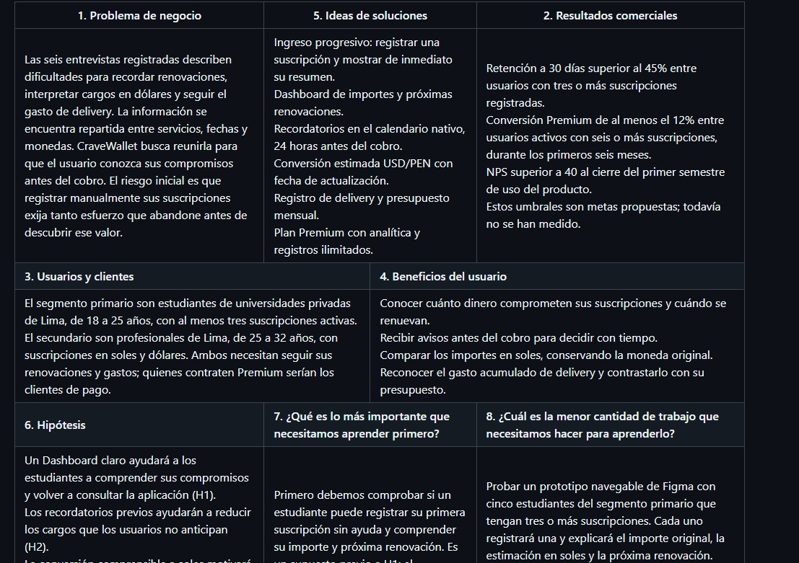

# Capítulo I: Presentación

## 1.1. Startup Profile

### 1.1.1. Descripción de la Startup

**Gastify** es una startup de tecnología financiera personal fundada en Lima, Perú, en 2026, por estudiantes de Ingeniería de Software de la Universidad Peruana de Ciencias Aplicadas (UPC). Su producto insignia, **CraveWallet**, es un gestor integral de suscripciones y gastos recurrentes diseñado para el mercado latinoamericano, con foco en el segmento de universitarios y profesionales jóvenes que enfrentan la proliferación de servicios digitales de suscripción, membresías físicas y plataformas de entrega a domicilio.

La **misión** de Gastify es democratizar la salud financiera personal mediante herramientas móviles inteligentes que devuelvan el control del presupuesto al usuario, eliminando la fricción y la opacidad que genera el ecosistema fragmentado de cobros automáticos, contratos recurrentes y micro-gastos.

La **visión** de Gastify es posicionarse, al término de 2027, como una opción útil para la gestión de compromisos financieros recurrentes en los principales mercados de habla hispana de Latinoamérica, con foco inicial en los segmentos elegidos de Lima. Una expansión a otros mercados requeriría investigación adicional.

CraveWallet propone reunir en una experiencia móvil tres tipos de registro:

1. **Membresías físicas y académicas:** Cuotas mensuales o anuales de instituciones como el Británico o el plan Smart Fit Black, con gestión de fechas de vencimiento y montos en moneda local.
2. **Suscripciones digitales y herramientas:** Plataformas de entretenimiento, educación en línea (Netzun, Cisco Networking Academy), herramientas de productividad (PedidosYa Plus), servicios de infraestructura cloud (MongoDB Atlas) con facturación recurrente en dólares. Las compras puntuales de videojuegos se distinguen de una suscripción.
3. **Gastos recurrentes de delivery:** Categorización y registro de consumos habituales en establecimientos frecuentes como Up Burger, Dunkin', Popeyes, Little Caesars, Papa John's, Burgerboy, Pollivoro, Chifa Delicious y Chifa Monteoro, permitiendo al usuario visualizar el impacto acumulado de sus hábitos de entrega a domicilio.

Los valores fundacionales de Gastify son: **transparencia financiera**, **diseño centrado en el usuario**, **aprendizaje continuo** y **responsabilidad técnica**. Este último valor se relaciona con el Student Outcome 7 del curso: el equipo investiga, evalúa e integra tecnologías nuevas, como el SDK de Stripe y la ExchangeRate-API, y documenta ese aprendizaje durante el desarrollo del producto.

***

### 1.1.2. Perfiles de integrantes del equipo

El equipo de desarrollo de CraveWallet cuenta con cinco integrantes. A continuación se presentan sus perfiles académicos y técnicos.

La tabla 9 presenta a cada integrante con su fotografía, código de estudiante y formación.

*Tabla 9. Perfiles de integrantes del equipo.*

| Integrante                                                                                     | Información |
|------------------------------------------------------------------------------------------------| --- |
|  | **Mario Gabriel Sejuro Medina** **Código de estudiante:** U20241C198 **Carrera:** Ingeniería de Software — Universidad Peruana de Ciencias Aplicadas (UPC)  Estudiante de Ingeniería de Software con interés especializado en el desarrollo de aplicaciones móviles nativas y multiplataforma, arquitectura de software orientada al dominio (*Domain-Driven Design*) y tecnologías de integración de pagos digitales. Cuenta con conocimientos en Kotlin para Android nativo, Flutter para desarrollo multiplataforma, Spring Boot para servicios web RESTful y Angular para aplicaciones web. Ha explorado de forma autónoma la integración de SDKs de terceros, incluyendo Stripe para procesamiento de pagos y ExchangeRate-API para la conversión dinámica de monedas en aplicaciones fintech. |
|  | **Anghelo Edwin Faustino Hurtado** **Código de estudiante:** U20241B331 **Carrera:** Ingeniería de Software — Universidad Peruana de Ciencias Aplicadas (UPC)  Estudiante de sexto ciclo de Ingeniería de Software, con interés en el desarrollo *full-stack* y la construcción de productos digitales centrados en el usuario. Su formación incluye ingeniería de requisitos, bases de datos, desarrollo web, experiencia de usuario y arquitectura de software. Cuenta con conocimientos en Java, Spring Boot, Angular, TypeScript, SQL, APIs REST y control de versiones con Git; busca aplicar estas tecnologías en soluciones web y móviles con una arquitectura mantenible. |
|  | **Sebastian Jared Roman Zeballos** **Código de estudiante:** U202419009 **Carrera:** Ingeniería de Software — Universidad Peruana de Ciencias Aplicadas (UPC)  Estudiante de sexto ciclo de Ingeniería de Software, interesado en el desarrollo de interfaces web, la experiencia de usuario y la integración de servicios mediante APIs. Su formación abarca programación orientada a objetos, estructuras de datos, bases de datos, desarrollo de aplicaciones web y metodologías de trabajo colaborativo. Cuenta con conocimientos en Java, JavaScript, TypeScript, HTML, CSS, Angular, SQL y Git, con interés en crear experiencias digitales claras, funcionales y escalables. |
|                           | **Josué Francisco Carpio Peña** **Código de estudiante:** U202519273 **Carrera:** Ingeniería de Software — Universidad Peruana de Ciencias Aplicadas (UPC)  Estudiante de Ingeniería de Software con interés en el desarrollo de software, la ciberseguridad y la construcción de aplicaciones web y móviles. Su formación abarca programación orientada a objetos, bases de datos, desarrollo de aplicaciones web, arquitectura de software y metodologías de trabajo colaborativo. Cuenta con conocimientos en Java, C#, Python, JavaScript, Vue.js, Spring Boot, SQL, APIs REST y Git, además de fundamentos en redes y ciberseguridad. Tiene especial interés en el hacking ético y en el desarrollo de soluciones de software seguras, escalables y mantenibles. |
|  | **Alexander Aliaga** **Código de estudiante:** U202417693 **Carrera:** Ingeniería de Software — Universidad Peruana de Ciencias Aplicadas (UPC)  Estudiante de Ingeniería de Software con interés en el desarrollo *backend*, las aplicaciones web y la arquitectura de software, con enfoque en la construcción de soluciones escalables y mantenibles. Cuenta con conocimientos en NestJS, .NET con C#, Java Spring Boot, Angular, Vue.js, React, PostgreSQL, MySQL, APIs REST, Git y pruebas de software con Jest y JMeter. |

*Fuente: elaboración del equipo Gastify.*

## 1.2. Solution Profile

### 1.2.1. Antecedentes y problemática

#### Técnica de análisis: 5W + 2H

**Who (¿Quiénes?):** estudiantes de 18–25 años y profesionales de 25–32 años de Lima, como segmentos iniciales de reclutamiento. Los seis relatos de 2.2.2 permiten explorar sus experiencias; no describen a toda la población de esos rangos.

**What (¿Qué?):** los entrevistados describen renovaciones olvidadas, dificultad para anticipar el equivalente en soles de servicios facturados en dólares y seguimiento incompleto del gasto de delivery.

**Where (¿Dónde?):** en la relación entre servicios contratados, calendario personal y revisión de movimientos bancarios. Lima es el alcance elegido por el equipo; no se afirma que concentre el mayor impacto del país sin datos comparables.

**When (¿Cuándo?):** al renovar un servicio o revisar posteriormente el cargo, y al intentar conocer el total gastado durante el mes. Las fechas y montos relatados se conservan en cada ficha de entrevista.

**Why (¿Por qué?):** como hipótesis, el seguimiento de distintas fechas y monedas dificulta anticipar compromisos. Las entrevistas no prueban una intención de los proveedores de ocultar cobros ni que toda herramienta existente sea insuficiente.

**How (¿Cómo?):** algunos participantes llevan el control mentalmente, otros consultan el banco o una hoja de cálculo. La propuesta debe ayudarles a registrar datos y consultar la próxima renovación sin confundir una estimación con el cargo real.

**How Much (¿Cuánto?):**
El informe no dispone de una estimación representativa del número de suscripciones, del gasto mensual en delivery ni de la proporción de servicios olvidados en los segmentos objetivo. Las seis entrevistas de la sección 2.2 permiten explorar el problema, pero no calcular su magnitud poblacional. Como contexto nacional, la Encuesta de Medición de Capacidades Financieras: Perú 2022 encontró que el 41% de la población adulta se ubicó por debajo del nivel mínimo de educación financiera [@sbs2022capacidades, p. 10]. Este indicador se refiere a conocimientos, comportamientos y actitudes financieras; no mide suscripciones ni demuestra la demanda de CraveWallet.

***

### 1.2.2. Lean UX Process

#### 1.2.2.1. Lean UX Problem Statements

El estado actual observado en las entrevistas combina servicios con diferentes fechas de renovación y monedas, gastos de delivery y formas de control dispersas. Existen aplicaciones de presupuesto, información bancaria y calendarios, cuyas funciones se comparan en 2.1. La oportunidad propuesta es facilitar el seguimiento de compromisos para los segmentos investigados; todavía debe comprobarse que esa combinación sea útil y diferenciada.

CraveWallet propone un registro manual de suscripciones, un portafolio con estimaciones en soles, avisos en el calendario 24 horas antes y un resumen de delivery. El foco inicial es el estudiante de Lima de 18–25 años; el segundo segmento es el profesional de 25–32 años. El producto no cancela servicios externos ni conoce automáticamente el tipo de cambio del banco. La conversión depende de cotizaciones disponibles, y el calendario requiere permisos.

Como metas de evaluación se proponen retención a 30 días superior al 45% y reducción autorreportada de cargos no anticipados de al menos el 60% a los 90 días, comparada con una línea de base recogida al iniciar la prueba. No hay mediciones que acrediten esas metas. Antes se comprobará si los participantes pueden registrar y comprender su primera suscripción, como se describe en el canvas.

#### 1.2.2.2. Lean UX Assumptions

Los supuestos siguen el proceso Lean UX [@gothelf2021leanux]. Son afirmaciones por contrastar, no datos de mercado ni decisiones comerciales ya validadas.

##### Business Assumptions

1. Creemos que los segmentos elegidos valorarán reunir importe, próxima renovación y gastos de delivery.
2. Creemos que una propuesta Premium de S/ 9.90 mensuales podría interesar a usuarios que necesitan más registros y análisis; se requiere evaluar disposición de pago y viabilidad comercial.
3. Creemos que el esfuerzo de registro manual es un riesgo principal para la adopción.
4. Proponemos Free con cinco registros activos como punto de partida del análisis de 2.1.1; el equipo debe confirmar límite y tratamiento del exceso al dejar Premium.
5. Creemos que una propuesta enfocada puede diferenciarse de herramientas generales, sin afirmar que ningún competidor resuelva esas tareas.

##### Business Outcome Assumptions

1. Proponemos medir conversión Premium de al menos 12% entre usuarios activos que alcancen el límite gratuito durante los primeros seis meses. Esa tasa por sí sola no demuestra rentabilidad.
2. Proponemos medir retención a 30 días superior al 45% entre usuarios con tres o más registros activos.
3. Proponemos medir NPS superior a 40 al finalizar el primer semestre; no es una medición apropiada para sustituir la observación de una tarea de prototipo.
4. Proponemos comprobar si al menos 50% de usuarios con registros en USD consulta su estimación PEN semanalmente durante el primer mes.

##### User Assumptions

1. Buscamos estudiantes de 18–25 años de Lima que gestionen servicios recurrentes; no se fija una cantidad de servicios o frecuencia de delivery como dato poblacional.
2. Buscamos profesionales de 25–32 años que administren gastos personales y servicios de trabajo o formación. Sus ingresos y hábitos se recogen en las entrevistas.
3. La experiencia debe probarse en dispositivos Android e iOS según el alcance del proyecto; no se atribuyen cuotas de mercado ni especificaciones técnicas a todo el segmento.
4. Creemos que un registro sencillo puede complementar el control mental, bancario o en hojas de cálculo que describen algunos participantes.

##### User Outcome and Benefit Assumptions

1. Comprender el total de compromisos y su próxima renovación.
2. Recibir un aviso antes de la fecha declarada para decidir qué hacer con el proveedor.
3. Distinguir el importe original y su estimación en soles.
4. Reconocer qué categorías de delivery acumulan más gasto en el mes.

##### Feature Assumptions

1. Un Dashboard agrupado puede facilitar la comprensión del portafolio (H1).
2. El calendario nativo puede ayudar a anticipar renovaciones cuando el usuario otorga permisos (H2).
3. La estimación USD/PEN con fecha de actualización puede facilitar la consulta del gasto (H3).
4. El registro de comercio y categoría puede ayudar a comprender el gasto de delivery (H4).
5. Los beneficios Premium podrían motivar una contratación; Stripe es una dependencia técnica a investigar y prototipar, no la evidencia de esa disposición (H5).

#### 1.2.2.3. Lean UX Hypothesis Statements

Cada hipótesis relaciona un resultado del negocio, un segmento, un beneficio para ese usuario y una funcionalidad. Los umbrales son propuestas del equipo para futuras pruebas.

**H1 — Dashboard.** Creemos que lograremos retención a 30 días superior al 45% si estudiantes con tres o más registros activos comprenden el total y las próximas renovaciones mediante un Dashboard agrupado. Se medirá la proporción de la cohorte que vuelve a usar la aplicación al día 30.

**H2 — Calendario.** Creemos que lograremos una reducción autorreportada de cargos no anticipados de al menos 60% si usuarios de ambos segmentos pueden revisar sus próximas renovaciones con avisos programados 24 horas antes. Se comparará el número declarado en períodos equivalentes antes del primer uso y a los 90 días, conservando la línea de base. Un aviso no asegura que el usuario cancele el servicio.

**H3 — Conversión.** Creemos que al menos 50% de los usuarios con registros en USD consultará la estimación semanalmente durante el primer mes si los profesionales comprenden el importe original y la estimación en soles mediante la cotización fechada. Se distinguirá una consulta del usuario de una actualización automática de la API.

**H4 — Delivery.** Creemos que al menos 50% de participantes que registren gastos durante un mes podrá identificar su categoría de mayor gasto si ambos segmentos comprenden el resumen mensual mediante la categorización de delivery. Se verificará su respuesta contra los datos registrados; no se interpreta esa comprensión como ahorro real.

**H5 — Premium.** Creemos que lograremos conversión de al menos 12% en seis meses entre usuarios activos que alcancen el límite Free si quienes necesitan más capacidad pueden continuar el seguimiento con los beneficios de Premium. Se contarán contrataciones confirmadas, no clics en checkout; las pruebas de Stripe no representan ventas. Precio y beneficios requieren validación previa.

#### 1.2.2.4. Lean UX Canvas

La figura 2 presenta el Lean UX Canvas de CraveWallet con la distribución de ocho bloques propuesta por Gothelf [@gothelf2021canvas], y la tabla 10 desarrolla el contenido de cada bloque. Se adapta el marco de Gothelf y Seiden [@gothelf2021leanux]. Las hipótesis completas y sus metas se desarrollan en la sección 1.2.2.3.

<!-- pdf:omit-start -->

*Figura 2. Lean UX Canvas de CraveWallet.*

<!-- pdf:omit-end -->

*Fuente: elaboración del equipo Gastify, adaptada del Lean UX Canvas de Jeff Gothelf [@gothelf2021canvas].*

*Tabla 10. Bloques del Lean UX Canvas de CraveWallet.*

| Bloque | Contenido |
| --- | --- |
| 1. Problema de negocio | Las seis entrevistas registradas describen dificultades para recordar renovaciones, interpretar cargos en dólares y seguir el gasto de delivery. La información se encuentra repartida entre servicios, fechas y monedas. CraveWallet busca reunirla para que el usuario conozca sus compromisos antes del cobro. El riesgo inicial es que registrar manualmente sus suscripciones exija tanto esfuerzo que abandone antes de descubrir ese valor. |
| 2. Resultados comerciales | Retención a 30 días superior al 45% entre usuarios con tres o más suscripciones registradas. Conversión Premium de al menos el 12% entre usuarios activos que alcancen el límite gratuito, durante los primeros seis meses. NPS superior a 40 al cierre del primer semestre de uso del producto. Estos umbrales son metas propuestas; todavía no se han medido. |
| 3. Usuarios y clientes | El segmento primario son estudiantes de universidades privadas de Lima, de 18 a 25 años, con al menos tres suscripciones activas. El secundario son profesionales de Lima, de 25 a 32 años, con suscripciones en soles y dólares. Ambos necesitan seguir sus renovaciones y gastos; quienes contraten Premium serían los clientes de pago. |
| 4. Beneficios del usuario | Conocer cuánto dinero comprometen sus suscripciones y cuándo se renuevan. Recibir avisos antes del cobro para decidir con tiempo. Comparar los importes en soles, conservando la moneda original. Reconocer el gasto acumulado de delivery y contrastarlo con su presupuesto. |
| 5. Ideas de soluciones | Ingreso progresivo: registrar una suscripción y mostrar de inmediato su resumen. Dashboard de importes y próximas renovaciones. Recordatorios en el calendario nativo, 24 horas antes del cobro. Conversión estimada USD/PEN con fecha de actualización. Registro de delivery y presupuesto mensual. Plan Premium con analítica y registros ilimitados. |
| 6. Hipótesis | Un Dashboard claro ayudará a los estudiantes a comprender sus compromisos y volver a consultar la aplicación (H1). Los recordatorios previos ayudarán a reducir los cargos que los usuarios no anticipan (H2). La conversión comprensible a soles motivará a los profesionales a consultar sus importes con regularidad (H3). El resumen de delivery ayudará a ambos segmentos a seguir su presupuesto mensual (H4). Los beneficios de Premium motivarán a usuarios comprometidos a contratar el plan (H5). |
| 7. ¿Qué es lo más importante que necesitamos aprender primero? | Primero debemos comprobar si un estudiante puede registrar su primera suscripción sin ayuda y comprender su importe y próxima renovación. Es un supuesto previo a H1: el Dashboard solo ofrece valor si el usuario incorpora sus datos. Esta prueba inicial evalúa comprensión y esfuerzo; la retención y la disposición a pagar requieren pruebas posteriores. |
| 8. ¿Cuál es la menor cantidad de trabajo que necesitamos hacer para aprenderlo? | Probar un prototipo navegable de Figma con cinco estudiantes del segmento primario que tengan tres o más suscripciones. Cada uno registrará una y explicará el importe original, la estimación en soles y la próxima renovación. Mediremos tiempo, ayuda, errores y abandono. Como criterio exploratorio, al menos cuatro de cinco deberán completar la tarea en cinco minutos o menos sin ayuda y explicar los tres datos. Si no se cumple, ajustaremos el flujo y repetiremos. No se requieren backend ni pagos reales. |

*Fuente: elaboración del equipo Gastify, adaptada del Lean UX Canvas de Jeff Gothelf [@gothelf2021canvas].*

El experimento del bloque 8 es una propuesta pendiente de ejecutar. El criterio de cuatro de cinco participantes sirve para orientar la siguiente iteración; no estima una tasa de éxito poblacional ni demuestra retención o conversión Premium. Se registrará el tiempo desde el inicio del formulario hasta el resumen y se conservarán las observaciones de cada sesión. El importe en soles será una estimación con fecha de actualización; los participantes podrán usar datos ficticios equivalentes a sus suscripciones.

***

## 1.3. Segmentos objetivo

Esta sección delimita dos segmentos iniciales para investigar el problema de CraveWallet. Sus características orientan el reclutamiento y deben contrastarse con las entrevistas y con fuentes específicas del segmento.

***

*Nota: los perfiles siguientes delimitan a quiénes busca estudiar el equipo. Los rangos de ingresos, distritos y servicios son supuestos iniciales para el reclutamiento, y no estadísticas representativas de la población.*

### Segmento 1: Estudiante Universitario Digital

**Descripción general:**
Jóvenes de 18 a 25 años matriculados en universidades privadas de Lima Metropolitana (UPC, PUCP, UP, USIL, ULima, entre otras). Reciben ingresos de mesada familiar o trabajo part-time, con un rango estimado de S/. 400 a S/. 1,500 mensuales. Son nativos digitales con una alta densidad de suscripciones activas en plataformas de entretenimiento, educación en línea y herramientas de productividad. Se busca entrevistar estudiantes que consuman delivery; la frecuencia se recoge en cada sesión, sin atribuir un patrón semanal a todo el segmento.

**Características demográficas:**
- Edad: 18-25 años.
- Género: Mixto (sin preferencia de género dominante en el problema identificado).
- Distrito de residencia: Principalmente Lima Moderna y Lima Top (Miraflores, San Borja, Surco, La Molina, San Miguel, Barranco).
- Estado civil: Soltero/a, sin dependientes.
- Dispositivo primario: Smartphone Android de gama media (Samsung Galaxy A-series, Redmi Note) con conectividad 4G/5G permanente.

**Ejemplos de servicios por explorar:**
Spotify, Netflix, Disney+, Xbox Game Pass, PedidosYa Plus, Cisco Networking Academy y Netzun, como ejemplos de servicios para explorar en las entrevistas. Steam se considera por separado como un ejemplo de compras eventuales.

**Pain points principales:**
1. Descubrimiento tardío de cobros automáticos en estados de cuenta bancarios.
2. Incapacidad de distinguir qué cargos en dólares de la tarjeta corresponden a qué suscripción.
3. Falta de un recordatorio accionable en el canal correcto (notificación push, no email) antes de cada renovación.
4. Desconocimiento del gasto acumulado en delivery semanal y mensual.

**Alcance de la evidencia:**
La selección de estudiantes de 18 a 25 años es una decisión inicial del equipo para delimitar la investigación. La sección 2.2 registra tres entrevistas de este segmento, que sirven para explorar sus experiencias. Esa muestra no permite atribuir una frecuencia de consumo de streaming o delivery a todos los estudiantes de Lima.

***

### Segmento 2: Profesional Joven Activo

**Descripción general:**
Adultos de 25 a 32 años con empleo formal en sectores tecnológicos, creativos o de servicios en Lima Metropolitana. Cuentan con ingresos propios que oscilan entre S/. 2,000 y S/. 5,000 mensuales. Gestionan un portafolio más complejo de suscripciones que combina herramientas de productividad y desarrollo profesional (con facturación frecuente en dólares), membresías físicas con contratos anuales, y plataformas de delivery para sus almuerzos y cenas de trabajo.

**Características demográficas:**
- Edad: 25-32 años.
- Género: Mixto.
- Distrito de residencia: Lima Moderna y Lima Centro (Miraflores, San Isidro, Jesús María, Lince, Pueblo Libre, Surco).
- Estado civil: Soltero/a o en pareja, ocasionalmente con gastos compartidos de hogar.
- Dispositivo primario: Smartphone Android o iOS de gama media-alta, con uso frecuente de laptop para trabajo remoto.

**Ejemplos de servicios por explorar:**
Smart Fit, Británico, MongoDB Atlas, GitHub Copilot, Notion, Adobe Creative Cloud, PedidosYa Plus y LinkedIn Learning, como ejemplos de servicios para explorar en las entrevistas.

**Pain points principales:**
1. Mezcla de gastos profesionales y personales sin categorización diferenciada.
2. Suscripciones a servicios cloud (MongoDB Atlas, AWS) con facturación variable basada en consumo, difícil de presupuestar.
3. Falta de visibilidad del retorno sobre la inversión (ROI) de cada suscripción educativa o de productividad.
4. Renovaciones anuales de membresías físicas que representan un impacto significativo en la liquidez mensual cuando ocurren.

**Alcance de la evidencia:**
La selección de profesionales de 25 a 32 años es una decisión inicial del equipo. La sección 2.2 registra tres entrevistas de este segmento, que permiten explorar la gestión de gastos personales y profesionales. Esa muestra no estima el gasto promedio en delivery ni el crecimiento del gasto digital de los profesionales de Lima.
