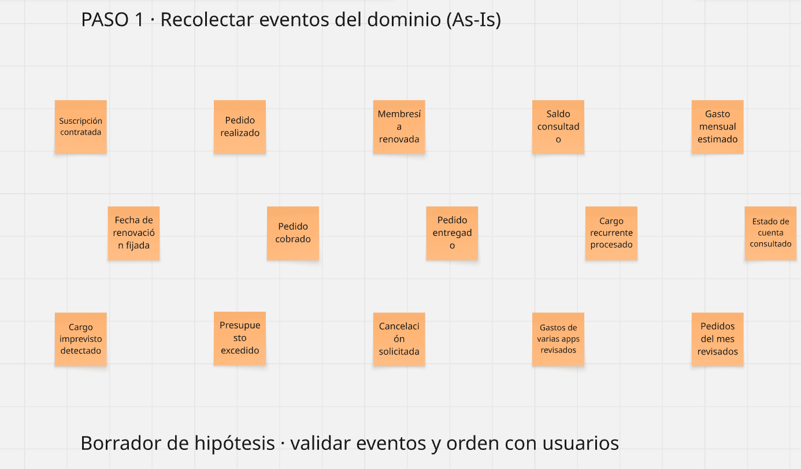
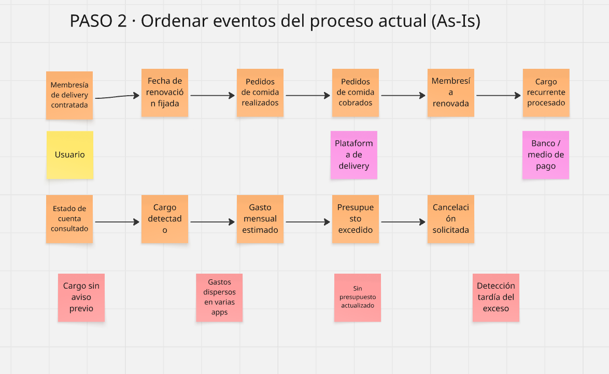
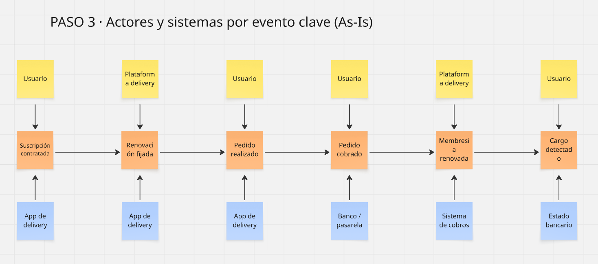
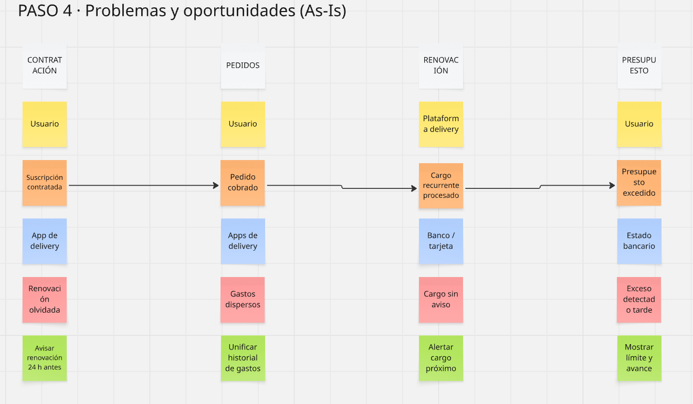
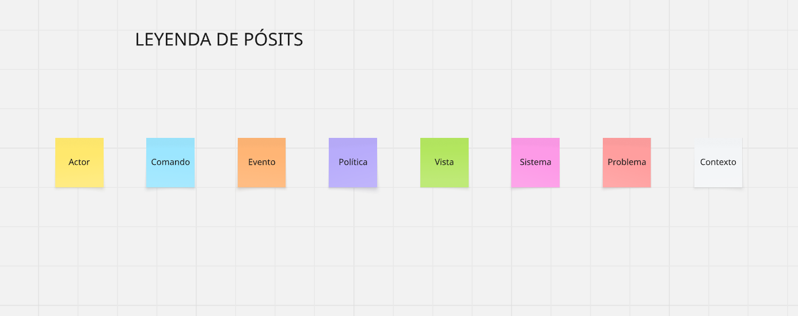
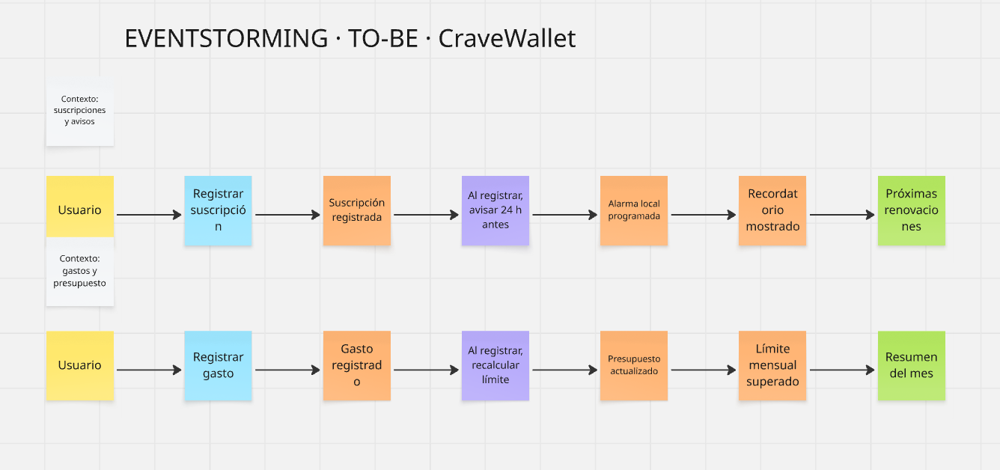
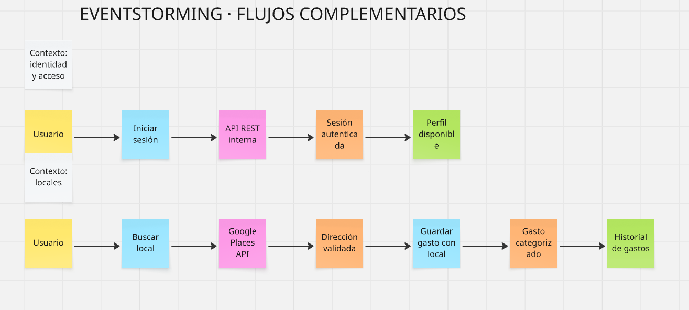
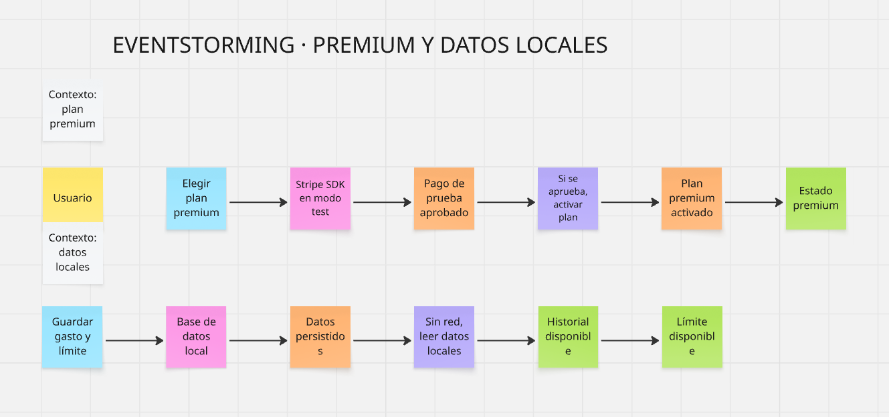
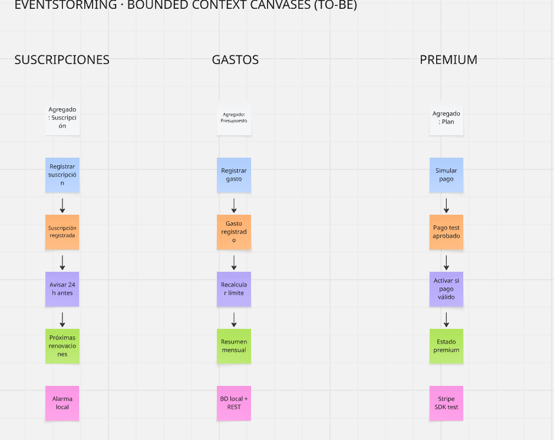

# Capítulo II: Requirements Development and Software Solution Design

## 2.1. Competidores

El mercado de aplicaciones de gestión de finanzas personales es maduro a nivel global, pero se encuentra escasamente especializado en el problema concreto que aborda CraveWallet: la administración proactiva de compromisos financieros recurrentes en un portafolio multimoneda. La mayoría de las soluciones disponibles para el usuario peruano proviene de mercados europeos o estadounidenses y opera bajo el paradigma del registro de gastos *post-facto*, es decir, clasifica lo que el usuario ya gastó en lugar de anticipar lo que está por cobrarse de forma automática.

Para delimitar el entorno competitivo se aplicaron tres criterios de inclusión: (a) disponibilidad efectiva de la aplicación en tiendas móviles accesibles desde Perú, (b) presencia de al menos una funcionalidad orientada al seguimiento de gastos recurrentes o suscripciones, y (c) modelo de negocio basado en un producto digital, freemium o de monetización indirecta. Bajo estos criterios se identificaron tres competidores directos y un conjunto de competidores indirectos.

Se identificaron tres competidores directos:

1. **Spendee** (Spendee a.s., República Checa). Aplicación móvil de gestión de finanzas personales con fuerte énfasis en el diseño visual y en las *wallets* compartidas. Su propuesta central es la categorización de gastos con reportes gráficos y el soporte nativo de múltiples divisas, lo que la convierte en la alternativa más cercana a CraveWallet en el atributo de conversión monetaria. Opera bajo un modelo freemium con dos niveles de pago, cuyo diferencial principal es la sincronización bancaria automática y el número de carteras disponibles [@spendee2026premium]. No ofrece un módulo específico de suscripciones: el usuario debe modelar cada cobro recurrente como una transacción programada dentro de una categoría genérica.
2. **Fintonic** (Fintonic Servicios Financieros, España). Agregador financiero que conecta cuentas bancarias y tarjetas para ofrecer una vista consolidada de movimientos, con un sistema de alertas que notifica cargos duplicados, comisiones bancarias y pagos próximos [@fintonic2026app]. Es la solución del conjunto analizado cuyo sistema de alertas se aproxima más a la lógica de anticipación de CraveWallet. Su modelo de negocio no cobra al usuario final: monetiza mediante un *marketplace* de productos financieros (préstamos y seguros) basado en el perfil que construye con los datos agregados. Resulta especialmente relevante para este análisis que Fintonic cerró sus operaciones en Chile en marzo de 2023, retirándose del único mercado hispanoamericano donde había desplegado su modelo de agregación bancaria [@dfmercados2023fintonic]. Esa retirada constituye evidencia directa de la dificultad de sostener la agregación bancaria como propuesta de valor en Latinoamérica, y respalda la decisión de CraveWallet de no depender de ella.
3. **Wallet by BudgetBakers** (BudgetBakers s.r.o., República Checa). Gestor de finanzas personales y familiares orientado al control presupuestario por categorías. Su fortaleza técnica es la sincronización bancaria con una amplia red de entidades y el soporte multimoneda con tipos de cambio en tiempo real, además del seguimiento de carteras de inversión [@budgetbakers2026premium]. Opera bajo modelo freemium con un nivel Premium mensual y, de forma intermitente, una licencia vitalicia. Al igual que Spendee, trata las suscripciones como un caso particular de transacción recurrente y no como una entidad de dominio con ciclo de vida propio.

Además de los competidores directos, existen alternativas que resuelven parcialmente el problema y que compiten por el mismo espacio mental del usuario:

| Competidor indirecto | Oferta parcialmente similar | Limitación frente a CraveWallet |
| --- | --- | --- |
| **Bobby** (gestor de suscripciones) | Registro manual de suscripciones con recordatorios y pago único de bajo costo, sin cuota recurrente. | Alcance limitado a iOS, sin conversión de divisas en tiempo real, sin categorización de gastos de delivery y sin adaptación al mercado peruano [@cnbc2026trackers]. |
| **Rocket Money** | Detección automática de suscripciones y servicio de cancelación asistida por agentes humanos. | Disponible únicamente en Estados Unidos; su nivel Premium (USD 7 a 14 mensuales) resulta inviable para el poder adquisitivo del segmento objetivo [@rocketmoney2026subs]. |
| **Aplicaciones de banca móvil** (BCP, Interbank, BBVA, Yape) | Historial de movimientos y notificaciones de cargo en tarjeta. | Muestran el cargo cuando ya ocurrió, no lo anticipan; fragmentan la información por entidad y no consolidan suscripciones de distintos bancos ni divisas. |
| **Hojas de cálculo** (Google Sheets, Excel) | Control manual totalmente personalizable y sin costo. | Alta fricción de mantenimiento, ausencia de notificaciones proactivas y dependencia de la disciplina del usuario. |

***

### 2.1.1. Análisis competitivo

El análisis competitivo que se presenta a continuación tiene como propósito responder a la siguiente pregunta guía:

> **¿Por qué llevar a cabo este análisis?**
> ¿Qué atributos del producto permiten a CraveWallet ocupar un espacio defendible en el mercado peruano de gestión financiera personal, frente a competidores internacionales que cuentan con mayor madurez tecnológica, base instalada y capacidad de inversión en marketing, pero que no han adaptado su propuesta de valor a la realidad multimoneda, académica y de consumo por delivery del usuario joven limeño?

El objetivo es contrastar la percepción inicial registrada en los *Business Assumptions* del Capítulo I con un análisis detallado de perfil, marketing, producto y posicionamiento estratégico, de modo que las fortalezas identificadas para CraveWallet sostengan sus oportunidades y se traduzcan en la ventaja competitiva declarada.

#### Competitive Analysis Landscape

*Nota: los precios consignados son referenciales a septiembre de 2026 y pueden variar según la región de la tienda de aplicaciones y la divisa de facturación.*

| | **CraveWallet** (Gastify) | **Spendee** | **Fintonic** | **Wallet by BudgetBakers** |
| --- | --- | --- | --- | --- |
| **Overview** | Startup peruana fundada en 2026 por estudiantes de Ingeniería de Software de la UPC. Aplicación móvil de gestión de suscripciones, membresías y gastos recurrentes para el mercado latinoamericano, con foco inicial en Lima. Producto en fase de validación temprana. | Empresa checa con más de una década en el mercado y presencia global en App Store y Google Play. Producto maduro de gestión de finanzas personales con énfasis en visualización de datos y carteras compartidas. | Fintech española autorizada y supervisada por el Banco de España. Agregador financiero con amplia base instalada en España. Cerró operaciones en Chile en 2023, su única incursión hispanoamericana. | Empresa checa con un ecosistema de productos financieros (Wallet, Board, ShareCost). Producto maduro orientado a finanzas personales y familiares, con red de sincronización bancaria de más de 15 000 entidades. |
| **Ventaja competitiva** ¿Qué valor ofrece a los clientes? | Única solución que trata la suscripción como entidad de dominio con ciclo de vida propio: anticipa el cobro 24 horas antes mediante el calendario nativo del dispositivo, expresa el portafolio completo en soles con conversión diaria vía ExchangeRate-API y categoriza el gasto de delivery con comercios limeños precargados. | Experiencia de usuario cuidada y jerarquía visual superior del gasto por categorías. Soporte robusto de múltiples divisas y carteras compartidas entre varios usuarios. | Alertas automáticas sobre cargos duplicados, comisiones bancarias indebidas y pagos próximos, sin costo para el usuario final y sin necesidad de registro manual. | Amplitud funcional: presupuestos por categoría, seguimiento de inversiones, cuentas compartidas y sincronización bancaria automática con actualización de saldos en tiempo real. |
| **Mercado objetivo** | Estudiantes universitarios de 18 a 25 años y profesionales jóvenes de 25 a 32 años de Lima Metropolitana, con portafolio mixto en soles y dólares y consumo frecuente de delivery. | Usuarios globales de clase media urbana, de 25 a 45 años, interesados en el control visual del gasto y en compartir presupuestos de hogar o viaje. | Usuarios bancarizados del mercado español, de 25 a 55 años, con múltiples productos financieros contratados y necesidad de consolidarlos. | Usuarios globales de 25 a 50 años, hogares y familias con necesidad de presupuestar por categorías y de administrar cuentas compartidas. |
| **Estrategias de marketing** | Marketing orgánico de bajo costo: presencia en comunidades universitarias de Lima, contenido educativo sobre salud financiera en redes sociales de alcance juvenil y alianzas con oficinas de bienestar estudiantil. Estrategia de nicho con mensaje hiperlocal. | Posicionamiento ASO en tiendas de aplicaciones, contenido de marca en blog y Medium, y reseñas en medios especializados de finanzas personales. | Marketing de adquisición basado en el gancho del ahorro ("detecta comisiones indebidas") y monetización posterior mediante colocación de productos financieros de terceros. | ASO internacional, programa de contenidos y posicionamiento como suite de productos financieros para el hogar. |
| **Productos & Servicios** | Dashboard unificado de suscripciones activas; integración con el calendario nativo; conversión automática PEN/USD; módulo de registro y categorización de gastos de delivery; nivel Premium con analítica avanzada y registros ilimitados. | Registro de transacciones, presupuestos, carteras múltiples y compartidas, reportes gráficos, soporte multimoneda y sincronización bancaria en el nivel superior. | Agregación de cuentas y tarjetas, clasificación automática de movimientos, alertas de cargos y comisiones, *marketplace* de préstamos y seguros con evaluación de perfil propia. | Registro y sincronización de transacciones, presupuestos por categoría, seguimiento de inversiones, informes, cuentas compartidas y soporte multimoneda con tipo de cambio en tiempo real. |
| **Precios & Costos** | Freemium. Nivel gratuito con hasta cinco suscripciones registradas. Nivel Premium: S/ 9.90 mensuales, procesado con el SDK de Stripe. Precio fijado en moneda local, sin exposición del usuario al tipo de cambio. | Freemium. Nivel Premium desde USD 2.99 mensuales (USD 22.99 anuales) y nivel superior con sincronización bancaria en el rango de USD 5.99 mensuales (USD 35.99 anuales), con prueba gratuita de 7 días. | Gratuito para el usuario final. Monetización indirecta mediante comisiones por la colocación de préstamos y seguros de entidades asociadas. | Freemium. Nivel Premium en torno a EUR 4.49 mensuales, con descuento por pago anual y licencia vitalicia ofrecida de forma intermitente. |
| **Canales de distribución** (Web y/o Móvil) | Móvil: Google Play y App Store. Web: landing page informativa con enlace de descarga. Sin canal de banca ni intermediarios financieros. | Móvil: Google Play y App Store. Web: sitio corporativo y aplicación web complementaria. | Móvil: Google Play y App Store. Web: portal con simuladores y contratación de productos financieros. | Móvil: Google Play y App Store. Web: aplicación web completa y sitio corporativo del ecosistema BudgetBakers. |

#### Análisis FODA enfocado en la competencia

Para cada competidor, y para CraveWallet, se identifican sus fortalezas, debilidades, oportunidades y amenazas, con foco específico en la competencia: cada fortaleza se contrasta con la de los demás actores del cuadro y cada debilidad se lee como el espacio que un competidor puede ocupar primero.

##### CraveWallet (Gastify)

| Fortalezas | Debilidades |
| --- | --- |
| • Especialización en el dominio de suscripciones recurrentes, que ningún competidor modela como entidad propia. • Conocimiento directo del contexto limeño: comercios de delivery, institutos y gimnasios locales precargados. • Precio en soles, sin fricción cambiaria. • Arquitectura DDD que permite incorporar nuevos tipos de compromiso recurrente sin reescribir el núcleo. | • Ausencia total de base instalada y de reconocimiento de marca. • Equipo reducido y capacidad de desarrollo limitada. • Dependencia del registro manual durante el onboarding, principal riesgo identificado en los *Business Assumptions*. • Dependencia de APIs de terceros (Stripe, ExchangeRate-API). |

| Oportunidades | Amenazas |
| --- | --- |
| • Segmento joven peruano desatendido, con alta densidad de suscripciones y sin herramienta localizada. • Crecimiento sostenido del consumo por delivery en Lima. • Vacío dejado por Fintonic en la región. • Posibilidad de alianzas con universidades e institutos cuyas cuotas ya forman parte del portafolio del usuario. | • Que un competidor con base instalada añada un módulo de suscripciones antes de que CraveWallet alcance masa crítica. • Que los bancos peruanos incorporen alertas de recurrencia en sus propias aplicaciones. • Cambios en las condiciones comerciales de Stripe o de la API de tipo de cambio. • Fricción de onboarding que frene la adopción. |

##### Spendee

| Fortalezas | Debilidades |
| --- | --- |
| • Base instalada consolidada, marca reconocida y calidad de diseño superior. • Soporte multimoneda maduro y probado. • Carteras compartidas, funcionalidad con alta retención. | • No ofrece módulo de suscripciones ni alertas de renovación anticipadas. • Precios en dólares, que exponen al usuario peruano a la variación cambiaria. • Sincronización bancaria sin cobertura efectiva de entidades peruanas. |

| Oportunidades | Amenazas |
| --- | --- |
| • Expansión hacia mercados emergentes. • Incorporación de un módulo de suscripciones apoyada en su base de usuarios existente. | • Entrada de soluciones especializadas de nicho que erosionen su base en segmentos concretos. • Presión de precios de alternativas gratuitas. |

##### Fintonic

| Fortalezas | Debilidades |
| --- | --- |
| • Gratuidad total para el usuario y ausencia de fricción de registro manual gracias a la agregación bancaria. • Respaldo regulatorio del Banco de España, que genera confianza. | • Retirada comprobada del mercado hispanoamericano tras el cierre de Chile en 2023, que evidencia la fragilidad de su modelo fuera de España. • Modelo de negocio basado en la colocación de productos financieros, que genera desconfianza respecto del uso de los datos. • Sin localización para Perú. |

| Oportunidades | Amenazas |
| --- | --- |
| • Reactivación de su expansión regional aprovechando el avance de la banca abierta en Latinoamérica. | • Regulación creciente sobre el uso de datos financieros para la colocación de productos de terceros. • Desconfianza del usuario latinoamericano hacia la cesión de credenciales bancarias. |

##### Wallet by BudgetBakers

| Fortalezas | Debilidades |
| --- | --- |
| • Mayor amplitud funcional del conjunto analizado y la red de sincronización bancaria más extensa. • Ecosistema de productos complementarios que aumenta el valor de permanencia. | • Interfaz densa y curva de aprendizaje elevada para un usuario joven que busca resolver una tarea puntual. • Precio en euros. • Cobertura bancaria peruana marginal, lo que reduce su funcionalidad diferencial a un registro manual equivalente al de cualquier competidor. |

| Oportunidades | Amenazas |
| --- | --- |
| • Aprovechar su red de sincronización para incorporar detección automática de suscripciones si amplía la cobertura bancaria en la región. | • Competencia de soluciones más simples y enfocadas, que resuelven una tarea específica con menor curva de aprendizaje. |

#### Interpretación del análisis

El contraste entre los cuatro perfiles revela un patrón consistente: **ninguno de los competidores analizados trata la suscripción como una entidad de dominio con ciclo de vida propio**. Spendee y Wallet la reducen a una transacción recurrente dentro de una categoría genérica, mientras que Fintonic la infiere a posteriori del movimiento bancario ya ejecutado. Esta es la brecha que sostiene la ventaja competitiva de CraveWallet y la que da sentido a la decisión arquitectónica de modelar el Bounded Context de suscripciones de forma independiente.

Un segundo hallazgo es que la sincronización bancaria automática, principal fortaleza técnica de Spendee y Wallet y razón de ser de Fintonic, **no se traduce en ventaja efectiva en el mercado peruano**, porque la cobertura de entidades locales es marginal. El cierre de las operaciones chilenas de Fintonic en 2023 confirma que esa dependencia es precisamente el punto de quiebre del modelo en la región. En la práctica, el usuario peruano de cualquiera de los tres competidores termina registrando sus movimientos a mano, es decir, con la misma fricción que tendría en CraveWallet pero sin ninguna de sus funcionalidades específicas.

El tercer hallazgo es de naturaleza económica. Los tres competidores facturan en divisa extranjera. Para un estudiante con ingresos de entre S/ 400 y S/ 1 500 mensuales, pagar USD 5.99 por una aplicación que no resuelve su problema concreto es una propuesta débil; la fijación del precio Premium de CraveWallet en S/ 9.90 elimina esa barrera y, además, es coherente con el propio discurso del producto sobre la opacidad del gasto en dólares.

***

### 2.1.2. Estrategias y tácticas frente a competidores

A partir del cruce de la matriz FODA se definen cuatro estrategias preliminares. Cada una responde a un cuadrante del cruce (fortalezas-oportunidades, fortalezas-amenazas, debilidades-oportunidades y debilidades-amenazas) y se descompone en tácticas concretas, verificables en el horizonte de los sprints planificados.

***

#### Estrategia 1 (FO). Especialización en el dominio de suscripciones como territorio de marca

*Aprovechar la especialización funcional para capturar el segmento joven desatendido.*

Frente a competidores generalistas, CraveWallet no compite como "otra app de finanzas personales" sino como el gestor de compromisos recurrentes. Todo el producto y su comunicación se ordenan alrededor de esa única promesa.

**Tácticas:**

1. Priorizar en el Product Backlog las historias del Dashboard unificado y de la integración con el calendario nativo por encima de cualquier funcionalidad de registro de gasto genérico, de modo que la primera versión pública ya exhiba el diferencial.
2. Construir el mensaje de la landing page sobre el momento de dolor concreto ("descubriste el cobro cuando ya te lo descontaron") en lugar de sobre categorías abstractas de presupuesto.
3. Precargar el catálogo de comercios, institutos y gimnasios limeños en el onboarding, de manera que el usuario reconozca su propio contexto en los primeros treinta segundos de uso.

#### Estrategia 2 (FO). Localización monetaria y comercial como barrera de entrada

*Convertir el conocimiento del contexto peruano en una ventaja difícil de replicar por un competidor extranjero.*

**Tácticas:**

1. Expresar la totalidad del portafolio en soles mediante la conversión diaria con ExchangeRate-API, mostrando siempre el monto original y el convertido para sostener la promesa de transparencia.
2. Fijar el precio Premium en soles (S/ 9.90) y comunicarlo de forma explícita frente a la facturación en dólares o euros de los competidores.
3. Mantener el catálogo local de comercios y servicios como activo del producto, ampliándolo con las sugerencias que se recojan en las entrevistas de la sección 2.2.

#### Estrategia 3 (DO). Reducción agresiva de la fricción de onboarding

*Neutralizar la principal debilidad propia aprovechando la ausencia de sincronización bancaria efectiva de los competidores.*

Dado que en el mercado peruano el usuario de Spendee, Fintonic o Wallet también registra manualmente, la competencia real no se juega en la automatización sino en cuál de las aplicaciones hace ese registro más rápido y menos tedioso.

**Tácticas:**

1. Reducir el alta de una suscripción a tres toques mediante plantillas preconfiguradas de los servicios más frecuentes del segmento (Spotify, Netflix, Smart Fit, PedidosYa Plus, entre otros), con monto y ciclo de facturación ya poblados.
2. Diseñar un onboarding progresivo que exija una sola suscripción para mostrar valor y solicite las siguientes de forma incremental, en lugar de bloquear el acceso hasta completar el portafolio.
3. Instrumentar la medición del tiempo de completitud del onboarding y de la tasa de abandono por paso, para validar o refutar el supuesto de fricción declarado en el Capítulo I.
4. Validar esta hipótesis en el prototipo de Figma antes de escribir código de producción, conforme a lo comprometido en el bloque 8 del Lean UX Canvas.

#### Estrategia 4 (FA). Defensa del nicho ante la reacción de competidores y bancos

*Construir permanencia antes de que un competidor con base instalada replique la funcionalidad.*

**Tácticas:**

1. Acumular valor histórico en la cuenta del usuario: cuanto más largo sea su registro de renovaciones y de gasto en delivery, mayor será el costo de cambiarse a otra herramienta.
2. Mantener el nivel gratuito genuinamente útil (hasta cinco suscripciones), de modo que la competencia por precio de alternativas gratuitas no desplace al producto antes de la conversión.
3. Aislar las integraciones de terceros (Stripe, ExchangeRate-API) tras interfaces del dominio en la capa de infraestructura, para que un cambio de proveedor no comprometa el núcleo funcional ante variaciones de condiciones comerciales.
4. Explorar alianzas con oficinas de bienestar estudiantil e institutos de idiomas, un canal de adquisición que los competidores internacionales no pueden activar desde fuera del país.

***

## 2.2. Entrevistas

Esta sección documenta el proceso de investigación cualitativa mediante el cual se recoge información directa de representantes de los dos segmentos objetivo definidos en la sección 1.3. El propósito de las entrevistas no es validar la solución propuesta, sino comprender el comportamiento, las motivaciones y las frustraciones reales de los usuarios frente a la gestión de sus compromisos financieros recurrentes, de modo que los arquetipos (User Personas) y los artefactos de Needfinding de la sección 2.3 se construyan sobre evidencia recolectada y no sobre supuestos del equipo.

### 2.2.1. Diseño de entrevistas

#### Objetivos de la investigación

El diseño del instrumento responde a cinco objetivos de investigación, derivados directamente de los supuestos declarados en el Lean UX Process del Capítulo I:

| # | Objetivo de investigación | Supuesto que pone a prueba |
| --- | --- | --- |
| OI-1 | Caracterizar demográfica y biográficamente a los representantes de cada segmento, para sustentar los atributos objetivos de los User Personas. | *User Assumptions* 1 y 2 (rangos de edad, ingreso y ocupación). |
| OI-2 | Describir el portafolio real de suscripciones, membresías y gastos recurrentes de cada entrevistado, incluyendo la divisa de facturación. | *User Assumptions* 1 y 4 (densidad de 4 a 8 suscripciones y ausencia de registro formal). |
| OI-3 | Reconstruir cómo el usuario se entera hoy de un cobro automático y qué hace cuando lo descubre. | *Feature Assumption* 2 (valor de la alerta anticipada). |
| OI-4 | Identificar las frustraciones y los objetivos personales asociados al control del presupuesto mensual. | *User Outcome and Benefit Assumptions* 1 a 4. |
| OI-5 | Levantar el perfil tecnológico y de canales digitales: dispositivos, sistema operativo, aplicaciones de uso diario, marcas de referencia e influencias. | *User Assumption* 3 (Android de gama media como dispositivo primario). |

#### Metodología

| Aspecto | Definición |
| --- | --- |
| **Tipo de entrevista** | Semiestructurada, individual y en profundidad. El guion fija los temas obligatorios, pero permite al entrevistador profundizar con preguntas complementarias según las respuestas. |
| **Duración estimada** | De 20 a 30 minutos por entrevista. |
| **Muestra** | De 3 a 5 entrevistados por segmento, conforme a lo exigido en el enunciado del trabajo final. |
| **Criterios de selección** | Segmento 1: estudiante de universidad privada de Lima Metropolitana, de 18 a 25 años, con al menos tres suscripciones digitales activas. Segmento 2: profesional de 25 a 32 años con empleo formal en Lima Metropolitana, con al menos una suscripción facturada en dólares o una membresía física vigente. |
| **Modalidad** | Remota mediante videollamada, o presencial con grabación, según disponibilidad del entrevistado. |
| **Registro** | Grabación en video con consentimiento informado previo, consolidada en un único archivo editado según la nomenclatura indicada en el enunciado. |
| **Rol del entrevistador** | Un integrante conduce la entrevista y toma notas del comportamiento no verbal. Las preguntas se formulan en el orden del guion, sin adelantar la descripción de CraveWallet. |

#### Buenas prácticas aplicadas al diseño

El instrumento se elaboró siguiendo las prácticas recomendadas para la investigación cualitativa en diseño de producto [@portigal2013interviewing; @gothelf2021leanux]:

1. **Preguntas abiertas y neutrales.** Se evita toda formulación que sugiera la respuesta esperada o que mencione una funcionalidad del producto antes de que el entrevistado exprese la necesidad por su cuenta.
2. **Conducta pasada antes que intención futura.** Las preguntas indagan sobre hechos concretos ya ocurridos ("cuéntame la última vez que...") en lugar de escenarios hipotéticos, porque la intención declarada es un predictor débil del comportamiento real.
3. **Profundización por capas (*laddering*).** Cada pregunta principal se acompaña de preguntas complementarias que descienden del hecho a la motivación, con el fin de llegar al porqué y no quedarse en el qué.
4. **De lo general a lo específico.** El guion abre con temas amplios y cómodos (biografía, rutina) y reserva los temas sensibles (ingresos, cobros no anticipados) para el tramo medio, cuando ya existe confianza.
5. **Ausencia de pitch.** La descripción de CraveWallet se reserva para la pregunta de cierre, de modo que no contamine las respuestas previas.
6. **Silencio productivo.** El entrevistador tolera las pausas antes de reformular, práctica que favorece las respuestas espontáneas más ricas.

#### Trazabilidad entre atributos del arquetipo y preguntas

La siguiente matriz garantiza que cada característica exigida para la construcción de los User Personas tenga al menos una pregunta que la levante, de modo que ningún atributo del arquetipo de la sección 2.3.1 provenga de la intuición del equipo. Ambos guiones se numeraron en paralelo, de modo que la pregunta *n* de un segmento cubre el mismo atributo que la pregunta *n* del otro.

| Atributo del User Persona | Pregunta (Segmento 1) | Pregunta (Segmento 2) |
| --- | --- | --- |
| Edad, distrito, estado civil, composición familiar | 1, 2 | 1, 2 |
| Ocupación, nivel educativo, ingresos | 3, 4 | 3, 4 |
| Antecedentes y biografía | 5 | 5 |
| Personalidad y actitud frente al dinero | 6, 7 | 6, 7 |
| Habilidades y alfabetización digital y financiera | 8 | 8 |
| Dispositivos preferidos y sistema operativo | 9 | 9 |
| Canales digitales de interacción y navegador | 10 | 10 |
| Afinidad por marcas e influencias | 11 | 11 |
| Portafolio de suscripciones y divisa | 12, 13 | 12, 13 |
| Hábitos de delivery y gasto asociado | 14 | 14 |
| Objetivos, frustraciones y reacción al concepto | 15 | 15 |

*(El género de cada entrevistado no se pregunta directamente: se registra por observación del entrevistador en la ficha de la página siguiente, igual que la edad y el distrito quedan confirmados ahí una vez respondida la pregunta 1.)*

***

#### Guion de entrevista — Segmento 1: Estudiante Universitario Digital

Las 15 preguntas se aplican en el mismo orden a los 3 a 5 entrevistados del segmento; lo que varía entre entrevistas son las respuestas, no el guion.

1. Para empezar, cuéntame quién eres: tu nombre, tu edad, en qué distrito vives y con quién (solo, con tu familia o compartiendo departamento), y hace cuánto.
2. ¿Cómo está compuesta tu familia o el hogar donde vives, y cuál es tu estado civil o situación sentimental actual? ¿Comparten gastos o suscripciones con tu pareja, tu familia o tus amigos?
3. ¿Qué carrera estudias, en qué universidad y en qué ciclo vas? ¿Trabajas o haces prácticas además de estudiar, y cuántas horas a la semana?
4. ¿De dónde proviene el dinero que administras cada mes? Sin necesidad de la cifra exacta, ¿dirías que está más cerca de S/ 500, S/ 1 000 o S/ 1 500, y es un monto fijo o variable?
5. Cuéntame cómo fue que empezaste a manejar tu propio dinero: ¿qué te enseñaron en casa sobre el ahorro y recuerdas cuál fue la primera suscripción que pagaste tú mismo?
6. ¿Cómo describirías tu forma de gastar: más planificada o más impulsiva? Dame un ejemplo reciente de cada una.
7. ¿Llevas algún control de tus gastos? Cuéntame cómo lo haces (app, hoja de cálculo, papel o mentalmente), desde cuándo, y qué sientes cuando revisas tu estado de cuenta a fin de mes.
8. ¿Qué tan cómodo te sientes probando una aplicación nueva, la exploras solo o prefieres que alguien te la enseñe? ¿Has usado alguna vez una app de finanzas personales o presupuesto? ¿Cuál y por qué la dejaste?
9. ¿Qué celular usas, hace cuánto lo tienes, y qué otros dispositivos usas en el día (laptop, tablet, smartwatch)?
10. ¿Cuáles son las tres aplicaciones que más abres al día, y por dónde te enteras de las cosas: notificaciones, correo o redes? ¿Qué navegador usas en la laptop?
11. ¿Hay alguna marca o aplicación que consideres bien hecha y te guste usar? ¿A quién sigues o escuchas cuando quieres aprender algo sobre dinero o tecnología?
12. Hagamos una lista: ¿qué servicios te cobran todos los meses de forma automática, con qué medio se pagan, y cuáles de esos te cobran en dólares? ¿Sabes cuánto terminas pagando en soles?
13. Cuéntame la última vez que te cobraron algo que no tenías presente: ¿cómo te diste cuenta, cuánto tiempo pasó y qué hiciste después? ¿Cómo sabes hoy cuándo se te va a renovar una suscripción?
14. ¿Pagas alguna plataforma por motivos de estudio y tus gastos cambian según la época del ciclo? Pensando en la última semana, ¿cuántas veces pediste delivery, y cuánto crees que gastaste en delivery el mes pasado?
15. Si pudieras cambiar una cosa de cómo manejas tu dinero hoy, ¿cuál sería? ¿Qué es lo que más te molesta del manejo de tus suscripciones y has intentado cancelar alguna? *(Cierre)* Te cuento brevemente en qué estamos trabajando: una app que reúne todas tus suscripciones, te avisa un día antes de cada cobro y te muestra el total en soles. ¿Qué opinas, qué le falta y la recomendarías a tus amigos?

***

#### Guion de entrevista — Segmento 2: Profesional Joven Activo

Las 15 preguntas se aplican en el mismo orden a los 3 a 5 entrevistados del segmento; lo que varía entre entrevistas son las respuestas, no el guion.

1. Cuéntame quién eres: tu nombre, tu edad, en qué distrito vives y con quién (solo, en pareja, con roommates o con tu familia), y hace cuánto.
2. ¿Cómo está compuesto tu hogar (tienes dependientes o apoyas económicamente a alguien) y cuál es tu estado civil? Si vives en pareja, ¿cómo organizan los gastos comunes?
3. ¿A qué te dedicas y hace cuánto trabajas en eso? ¿Trabajas en planilla, por recibos o de forma independiente, y de manera presencial, híbrida o remota?
4. ¿Tus ingresos son fijos o varían mes a mes? ¿Recibes bonos o ingresos por proyectos aparte, y en qué moneda te pagan?
5. Cuéntame cómo llegaste a la forma en que hoy organizas tu dinero: ¿cambió algo cuando empezaste a trabajar?
6. ¿Cómo describirías tu perfil financiero: ordenado, improvisado, o depende del mes? Dame un ejemplo concreto del último mes.
7. ¿Qué herramienta usas hoy para llevar el control de tus gastos (Excel, la app del banco, una app de finanzas, ninguna), y separas tus gastos personales de los profesionales?
8. ¿Qué tan cómodo te sientes conectando tus cuentas bancarias a una aplicación de terceros? ¿Has probado alguna app de finanzas personales? ¿Cuál y por qué la dejaste?
9. ¿Qué celular usas y con qué sistema operativo, y qué otros dispositivos usas para trabajar?
10. ¿Qué aplicaciones son parte de tu rutina de trabajo diaria (cuáles pagas tú y cuáles tu empresa), y cómo prefieres que te avisen de algo importante: correo, notificación push, WhatsApp o calendario?
11. ¿Qué producto digital consideras que está bien hecho y por qué? ¿Dónde te informas sobre finanzas, inversión o tecnología?
12. Listemos todo lo que se te cobra de forma recurrente, personal y de trabajo: ¿cuántas de esas se te cobran en dólares y sabes cuánto te terminan costando en soles?
13. ¿Tienes alguna suscripción cuyo monto cambia según cuánto la uses, o alguna membresía con contrato anual? Cuéntame la última vez que un cobro automático te descuadró el mes.
14. ¿Cómo resuelves tus almuerzos y cenas en un día típico de trabajo? ¿Tienes alguna membresía de delivery y cuánto crees que gastaste en delivery el mes pasado?
15. ¿Cuáles son tus metas financieras para los próximos dos años y qué es lo más frustrante de administrar tus pagos recurrentes? *(Cierre)* Estamos construyendo una app que centraliza tus suscripciones, te avisa un día antes de cada renovación y convierte todo a soles automáticamente. ¿Qué te parece, qué le falta y la recomendarías en tu trabajo?

***

#### Consentimiento y ficha de registro

Antes de iniciar la grabación, el entrevistador lee el siguiente texto y solicita confirmación verbal en video:

> "Esta conversación se está grabando con fines exclusivamente académicos, para un trabajo del curso de Aplicaciones para Dispositivos Móviles de la UPC. No vamos a usar tus datos con ningún fin comercial y puedes pedirnos que detengamos la grabación en cualquier momento. ¿Estás de acuerdo con que grabemos?"

Cada entrevista se registra con la siguiente ficha, que se completa durante la sesión y sirve de base para el resumen de la sección 2.2.2:

| Campo | Contenido |
| --- | --- |
| Nombres y apellidos | |
| Género | |
| Edad | |
| Distrito de residencia | |
| Ocupación | |
| Segmento objetivo | Segmento 1 o Segmento 2 |
| Fecha y hora de la entrevista | |
| Modalidad | Remota o presencial |
| Duración | |
| Entrevistador | |
| Timing de inicio en el video consolidado | |
| URL del video | |

### 2.2.2. Registro de entrevistas

Esta sección consolida, para cada uno de los dos segmentos, tres entrevistas realizadas siguiendo el guion y la ficha de la sección 2.2.1. Las sesiones se editarán en un único video, pendiente de subir al OneDrive indicado por el docente con la nomenclatura `upc-pre-<periodo>-1acc0238-<NRC>-<startup>-needfinding-<avn/tbn>`; hasta que esa edición esté lista, los campos de timing, URL y captura de cada ficha quedan marcados como pendientes. Para cada entrevista se incluye la ficha completa y un resumen redactado que describe las respuestas obtenidas en cada bloque del guion, cubriendo tanto los rasgos objetivos (demografía, portafolio de suscripciones, dispositivos) como los subjetivos (personalidad, marcas de referencia, frustraciones) exigidos por el enunciado.

***

#### Entrevista 1 — Segmento 1: Lui Gamero

| Campo | Contenido |
| --- | --- |
| Nombres y apellidos | Lui Gamero |
| Género | Masculino |
| Edad | 19 años |
| Distrito de residencia | Comas |
| Ocupación | Estudiante de Ingeniería de Software (6.º ciclo), freelance de desarrollo web |
| Segmento objetivo | Segmento 1 |
| Fecha y hora de la entrevista | [[PENDIENTE]] |
| Modalidad | Remota |
| Duración | [[PENDIENTE]] |
| Entrevistador | Anghelo Faustino |
| Timing de inicio en el video consolidado | [[PENDIENTE: video sin subir]] |
| URL del video | [[PENDIENTE: video sin subir]] |

Lui vive con su familia en Comas y comparte la cuenta de Netflix con amigos de la universidad, turnándose el pago. Su ingreso proviene de proyectos freelance de desarrollo web (~15 horas semanales) y es variable, cercano a S/ 500 al mes; el tipo de cambio variable sobre ese ingreso irregular le genera un descuadre difícil de prever. Empezó a manejar dinero propio con la indicación familiar de ahorrar para emergencias, y su primera suscripción pagada fue Spotify Premium. Se describe como mitad planificado, mitad impulsivo (ejemplo de compra impulsiva de comida de madrugada) y lleva el control de gastos solo mentalmente, lo que le genera estrés al revisar el estado de cuenta por las variaciones del tipo de cambio. Al estudiar software se siente muy cómodo explorando aplicaciones nuevas por su cuenta; probó la app Wallet pero la abandonó por lo tedioso de registrar cada gasto a mano. Usa un Xiaomi de dos años y una laptop para programar; sus tres aplicaciones más usadas son WhatsApp, YouTube y Rappi, se entera de todo por notificaciones push y navega en Chrome. Considera GitHub una aplicación bien hecha y sigue a creadores como Midudev para temas de tecnología. Paga Spotify, Netflix y un servidor en la nube con su tarjeta de débito; el servidor se cobra en dólares y nunca sabe cuánto pagará en soles. Olvidó cancelar una herramienta de diseño contratada para un trabajo freelance y fue cobrado un mes después sin darse cuenta a tiempo; hoy no tiene forma de saber cuándo se renuevan sus suscripciones. No paga plataformas fijas de estudio, pero incrementa sus pedidos de delivery en época de parciales; estima un gasto de S/ 150 mensuales en delivery. Su principal frustración es no saber cuánto le van a cobrar por el tipo de cambio y que los cobros sean silenciosos; reaccionó positivamente al concepto de CraveWallet, destacando el aviso anticipado y la conversión a soles como lo que necesita para asegurar saldo, y afirmó que lo recomendaría a sus compañeros de facultad.

***

#### Entrevista 2 — Segmento 1: Darío Romero

| Campo | Contenido |
| --- | --- |
| Nombres y apellidos | Darío Romero |
| Género | Masculino |
| Edad | 20 años |
| Distrito de residencia | Surquillo |
| Ocupación | Estudiante de Ingeniería de Software (6.º ciclo) |
| Segmento objetivo | Segmento 1 |
| Fecha y hora de la entrevista | [[PENDIENTE]] |
| Modalidad | Remota |
| Duración | [[PENDIENTE]] |
| Entrevistador | Anghelo Faustino |
| Timing de inicio en el video consolidado | [[PENDIENTE: video sin subir]] |
| URL del video | [[PENDIENTE: video sin subir]] |

Darío vive con sus padres en Surquillo y tiene pareja, con quien no comparte suscripciones formales aunque ella usa su cuenta de HBO. No trabaja ni hace prácticas; se dedica por completo a sus estudios y recibe una propina semanal de sus padres que suma cerca de S/ 500 fijos al mes. En casa le enseñaron a no gastar más de lo que tiene, y su primera suscripción propia fue una membresía de videojuego en PlayStation. Intenta planificar sus gastos para no quedarse sin dinero a fin de mes, pero reconoce ceder al impulso (pidió delivery por pereza de cocinar); su único control de gastos es abrir la app del banco constantemente para revisar el saldo, y siente alivio si llega a fin de mes sin quedar en cero. Le encanta probar aplicaciones nuevas por su cuenta; probó Monefy pero la abandonó porque se olvidaba de registrar compras pequeñas. Usa un Samsung Galaxy de un año y su laptop con frecuencia; sus tres aplicaciones más usadas son Instagram, Discord y WhatsApp, se guía completamente por notificaciones push y navega con Brave. Considera Discord una aplicación muy robusta y aprende sobre tecnología en foros y TikTok. Paga HBO Max, iCloud y Xbox Game Pass con su tarjeta de débito; cree que iCloud se cobra en dólares pero nunca sabe cuánto pagará en soles hasta ver el movimiento bancario. Mantuvo una suscripción de PedidosYa contratada por una promoción, la olvidó, fue cobrado durante dos meses seguidos y recién la canceló al notar el descuento por casualidad; actualmente no sabe cuándo se renuevan sus otras suscripciones. No paga plataformas de estudio porque usa software libre; pidió delivery unas tres veces la semana anterior a la entrevista y estima un gasto mensual de S/ 200. Su principal frustración es olvidarse de lo que paga y lo compleja que resulta la cancelación dentro de las configuraciones de cada app; reaccionó de forma positiva al concepto de CraveWallet, señalando que un aviso al calendario del celular antes de cada cobro le daría tranquilidad.

***

#### Entrevista 3 — Segmento 1: Eduardo Aguirre

| Campo | Contenido |
| --- | --- |
| Nombres y apellidos | Eduardo Aguirre |
| Género | Masculino |
| Edad | 19 años |
| Distrito de residencia | Ate |
| Ocupación | Estudiante de Ingeniería de Software (6.º ciclo), trabajador de club nocturno los fines de semana |
| Segmento objetivo | Segmento 1 |
| Fecha y hora de la entrevista | [[PENDIENTE]] |
| Modalidad | Remota |
| Duración | [[PENDIENTE]] |
| Entrevistador | Anghelo Faustino |
| Timing de inicio en el video consolidado | [[PENDIENTE: video sin subir]] |
| URL del video | [[PENDIENTE: video sin subir]] |

Eduardo vive con su madre y hermanos en Ate, es soltero y aporta a los gastos de internet del hogar. Trabaja en un club nocturno los fines de semana (~24 horas semanales), lo que le genera un ingreso fijo cercano a S/ 1 500 al mes, además de propinas ocasionales. Aprendió a manejar dinero por su cuenta al empezar a trabajar de madrugada, y su primera suscripción fue Apple Music. Se describe como muy impulsivo por sus horarios: sale cansado del trabajo a las 4 a. m. y pide comida por delivery sin fijarse en el precio. No lleva ningún control formal, solo mental, y se sorprende a fin de mes por la cantidad que gasta en comida y pagos pequeños. Se siente cómodo explorando aplicaciones nuevas solo, pero nunca ha usado una app de finanzas porque le parecen aburridas y demandantes de tiempo. Usa un iPhone 12 y una laptop para la universidad; sus tres aplicaciones más usadas son WhatsApp, Rappi y TikTok, se entera de todo por notificaciones push y navega en Chrome. Le gusta la interfaz de Rappi por su rapidez y escucha podcasts en Spotify mientras trabaja para aprender sobre tecnología. Paga Apple Music, ChatGPT Plus, Amazon Prime y el gimnasio Smart Fit con su tarjeta de débito; ChatGPT y Amazon se cobran en dólares y nunca sabe el monto exacto en soles porque el tipo de cambio del banco varía. Dejó de ir al gimnasio un par de meses por la carga académica y laboral, pero Smart Fit le siguió cobrando automáticamente; recién se dio cuenta a los dos meses revisando el detalle bancario, y hoy solo nota el descuento sin conocer las fechas de cobro. Paga ChatGPT para apoyarse en sus estudios y programación; es el que más gasta en delivery del segmento, con cinco pedidos la última semana y un estimado de S/ 400 mensuales. Su principal frustración es no ser consciente de sus "gastos hormiga" digitales y de comida, y que las suscripciones no avisen antes de cobrar; reaccionó de forma muy positiva al concepto, destacando que el conversor a soles en tiempo real y el aviso previo le habrían ayudado a cancelar el gimnasio a tiempo, y afirmó que definitivamente usaría la aplicación.

***

#### Entrevista 4 — Segmento 2: Micaela Rodriguez

| Campo | Contenido |
| --- | --- |
| Nombres y apellidos | Micaela Rodriguez |
| Género | [[PENDIENTE: observación del entrevistador]] |
| Edad | 24 años |
| Distrito de residencia | [[PENDIENTE: confirmar distrito exacto]] |
| Ocupación | Arquitecta en un estudio de diseño, modalidad híbrida |
| Segmento objetivo | Segmento 2 |
| Fecha y hora de la entrevista | [[PENDIENTE]] |
| Modalidad | Remota |
| Duración | [[PENDIENTE]] |
| Entrevistador | Josué Carpio |
| Timing de inicio en el video consolidado | [[PENDIENTE: video sin subir]] |
| URL del video | [[PENDIENTE: video sin subir]] |

Micaela comparte departamento con dos roommates desde hace año y medio, sin dependientes y soltera; divide alquiler, luz e internet en partes iguales mediante una hoja de Excel compartida. Es arquitecta con tres años en un estudio de diseño, en planilla y modalidad híbrida (dos veces por semana en oficina). Su sueldo es fijo en soles, con bonos ocasionales cada tres o cuatro meses cuando cierran proyectos grandes. Su forma de organizar el dinero cambió por completo al empezar a trabajar y asumir el pago de alquiler, volviéndose más estricta que en su etapa de estudiante. Se considera ordenada con sus gastos fijos, aunque el mes pasado usó más tarjeta de crédito de lo previsto por varios cumpleaños seguidos. Usa la app de su banco para ver saldos, sin separar gastos personales de los profesionales (incluidos los programas de arquitectura que ella misma paga). No se siente cómoda conectando sus cuentas bancarias a una app de terceros por temor a que la hackeen; probó Wallet, pero la abandonó porque clasificar todo manualmente le daba pereza. Usa un iPhone 13 con iOS y una laptop con Windows armada para renderizado. Sus apps de trabajo son Slack (pagada por la empresa), AutoCAD y Adobe Creative Cloud (que paga ella); para avisos importantes prefiere el calendario, que es lo único que revisa siempre. Considera Notion un producto bien hecho por lo limpio y funcional, y se informa sobre finanzas en cuentas de Instagram y artículos de LinkedIn. Paga Spotify, Netflix, Adobe y almacenamiento de Google Drive; Adobe y Drive se cobran en dólares, lo que le molesta porque el banco aplica un tipo de cambio alto e impredecible. No tiene suscripciones de monto variable, pero fue cobrada por la renovación anual de una app de meditación en dólares (~$60) que la descuadró al enterarse recién tras el débito de su cuenta sueldo. Cocina los días remotos y pide delivery por Rappi cuando va a oficina, sin membresía de delivery; estima S/ 400 mensuales solo en almuerzos. Su meta financiera es ahorrar para una maestría, y su frustración son los "gastos fantasma" y el tipo de cambio en su contra; reaccionó de forma muy positiva al concepto, señalando que la conversión a soles en tiempo real sincronizada con su calendario la convencería de inmediato y que lo recomendaría en su trabajo.

***

#### Entrevista 5 — Segmento 2: Leonardo Caycho

| Campo | Contenido |
| --- | --- |
| Nombres y apellidos | Leonardo Caycho |
| Género | [[PENDIENTE: observación del entrevistador]] |
| Edad | 30 años |
| Distrito de residencia | [[PENDIENTE: confirmar distrito exacto]] |
| Ocupación | Ingeniero Industrial, supervisor de planta |
| Segmento objetivo | Segmento 2 |
| Fecha y hora de la entrevista | [[PENDIENTE]] |
| Modalidad | Remota |
| Duración | [[PENDIENTE]] |
| Entrevistador | Josué Carpio |
| Timing de inicio en el video consolidado | [[PENDIENTE: video sin subir]] |
| URL del video | [[PENDIENTE: video sin subir]] |

Leonardo vive con su enamorada desde hace dos años, sin hijos, y mantienen una cuenta mancomunada con un aporte fijo mensual de cada uno para cubrir alquiler, luz y compras del hogar. Es ingeniero industrial, supervisor de planta hace cuatro años, en planilla y de forma 100 % presencial. Su ingreso es fijo en soles, con utilidades anuales que no alteran el sueldo mensual. Cubre sus gastos fijos a inicio de mes y usa el resto de su tarjeta para vivir; asumir un hogar en pareja cambió su forma de organizarse frente a su etapa de soltero. Se describe como muy improvisado: pasa todo por la tarjeta de crédito para ganar puntos pero pierde el rastro de los gastos, como ocurrió en una salida donde cubrió la cuenta y los taxis sin registrar nada. Solo revisa movimientos en la app del banco y no separa gastos personales de los profesionales. No conectaría sus cuentas bancarias a una app de terceros porque el banco advierte contra ello; probó Spendee, pero la abandonó al mes por lo complicado de configurar los gastos como suscripciones mensuales. Usa un Samsung Galaxy S22 con Android y una laptop de la empresa. Sus apps de trabajo son WhatsApp, Outlook y Teams (pagadas por la empresa); prefiere que los avisos importantes lleguen por el calendario de Google o notificación del celular. Considera la app de Uber perfecta por su rapidez y lee noticias de economía en Gestión ocasionalmente. Paga Amazon Prime, HBO Max, YouTube Premium, el gimnasio Smart Fit y LinkedIn Premium; LinkedIn y Amazon se cobran en dólares, y no sabe cuánto le cuestan en soles, solo nota que baja la línea de su tarjeta. Sacó LinkedIn Premium para buscar trabajo, lo consiguió y olvidó cancelarlo, siendo cobrado unos tres meses seguidos de casi $40 hasta notarlo en su estado de cuenta, lo que le generó mucha rabia. Lleva almuerzo a la oficina entre semana pero pide comida chatarra todos los fines de semana, con membresía PedidosYa Plus; estima un gasto de S/ 600 mensuales en delivery, su "punto débil". Su meta financiera es comprar un auto, y su frustración es que las empresas no avisan antes de seguir cobrando; reaccionó positivamente al concepto, indicando que un aviso 24 horas antes le habría evitado el problema con LinkedIn y que plantillas fáciles para agregar sus gastos lo convencerían de pagar la suscripción.

***

#### Entrevista 6 — Segmento 2: Andrea Vargas

| Campo | Contenido |
| --- | --- |
| Nombres y apellidos | Andrea Vargas |
| Género | [[PENDIENTE: observación del entrevistador]] |
| Edad | 29 años |
| Distrito de residencia | [[PENDIENTE: confirmar distrito exacto]] |
| Ocupación | Analista de Finanzas en un banco, modalidad híbrida |
| Segmento objetivo | Segmento 2 |
| Fecha y hora de la entrevista | [[PENDIENTE]] |
| Modalidad | Remota |
| Duración | [[PENDIENTE]] |
| Entrevistador | Josué Carpio |
| Timing de inicio en el video consolidado | [[PENDIENTE: video sin subir]] |
| URL del video | [[PENDIENTE: video sin subir]] |

Andrea vive sola hace tres años, sin dependientes, soltera, y cubre el 100 % de sus propios gastos. Es analista de finanzas en un banco, en planilla y modalidad híbrida (mitad de semana en casa, mitad en oficina). Su ingreso es fijo en soles, con un bono anual por metas. Haber estudiado finanzas la volvió metódica: apenas le pagan, separa un 20 % para ahorros y divide el resto entre vivienda, servicios y gustos. Se considera muy ordenada, aunque a veces cae en gastos de tecnología innecesarios, como una licencia de software de productividad que compró el mes pasado sin necesitarla realmente. Lleva un Excel muy detallado y separa por completo sus gastos personales de los profesionales usando tarjetas distintas. Por su trabajo, sabe que no debe conectar sus cuentas bancarias a aplicaciones de terceros y no se siente cómoda haciéndolo; probó Fintonic, pero la eliminó porque la sincronización fallaba mucho con los bancos peruanos. Usa un iPhone 14 y monitores adicionales conectados a la laptop de la empresa. Sus apps de trabajo son Excel, PowerBI y Outlook (pagadas por la empresa); depende totalmente de su calendario de Apple para avisos personales importantes. Le gusta mucho la app de su banco por lo limpia que es, se informa en el Diario Financiero y escucha podcasts de economía. Paga iCloud, ChatGPT Plus, Canva Pro, Netflix y Disney+; las tres primeras se cobran en dólares, lo que le obliga a actualizar manualmente la celda del tipo de cambio en su Excel cada fin de mes para que cuadren sus números. Tiene una membresía anual de una academia de cursos de finanzas que le renovó automáticamente en febrero (~$150) aunque ya no usaba la plataforma, porque olvidó que ese mes era la fecha de corte. Va a restaurantes cercanos los días de oficina y cocina los días remotos, con un gasto mínimo en delivery (máximo S/ 100 mensuales). Su meta financiera es invertir en un fondo mutuo extranjero, y su frustración es la falta de transparencia de las empresas sobre las fechas de cobro; reaccionó positivamente al concepto, señalando que resolver la conversión de divisas automáticamente sin necesidad de conectar cuentas bancarias sería una gran herramienta.

### 2.2.3. Análisis de entrevistas

El análisis se realiza por segmento objetivo, a partir de los resúmenes de la sección 2.2.2, trazando cada hallazgo a las entrevistas concretas de las que proviene. Con tres entrevistados por segmento, cada patrón compartido por los tres equivale al 100 %, por dos al 67 % y por uno al 33 %; estos porcentajes alimentarán directamente los User Personas de la sección 2.3.1.

#### Segmento 1: Estudiante Universitario Digital (Lui, Darío, Eduardo)

| Característica | % | Entrevistas de sustento |
| --- | --- | --- |
| Ingreso mensual fijo | 67 % | Darío, Eduardo |
| Sin herramienta formal de control de gastos | 100 % | Lui, Darío, Eduardo |
| Probó y abandonó una app de finanzas | 67 % | Lui, Darío |
| Suscripción activa cobrada en dólares | 100 % | Lui, Darío, Eduardo |
| Caso de cobro automático olvidado | 100 % | Lui, Darío, Eduardo |
| Se entera de cargos solo revisando el banco (sin alerta previa) | 100 % | Lui, Darío, Eduardo |
| Dispositivo Android | 67 % | Lui, Darío |
| Se informa por notificaciones push | 100 % | Lui, Darío, Eduardo |
| Reacción positiva al concepto | 100 % | Lui, Darío, Eduardo |

- **Ingreso.** El 67 % (Darío, Eduardo) reporta un ingreso fijo mensual; el 33 % (Lui) tiene ingreso variable por trabajo freelance. El rango declarado va de S/ 500 a S/ 1 500.
- **Control de gastos.** El 100 % no usa ninguna herramienta de presupuesto: 67 % lo lleva mentalmente (Lui, Eduardo) y 33 % revisa constantemente la app del banco sin registrar nada (Darío).
- **Experiencia previa con apps de finanzas.** El 67 % (Lui con Wallet, Darío con Monefy) probó una app de finanzas y la abandonó por fricción de registro manual; el 33 % (Eduardo) nunca probó ninguna por considerarlas aburridas.
- **Suscripciones en dólares.** El 100 % tiene al menos una suscripción cobrada en dólares (servidor en la nube, iCloud, ChatGPT/Amazon) y ninguno sabe el monto exacto en soles antes de ver el cargo.
- **Cobro no anticipado.** El 100 % relata un caso concreto de cobro automático olvidado (herramienta de diseño, PedidosYa, Smart Fit) del que se enteró entre uno y dos meses después, siempre revisando el detalle bancario, nunca por una alerta previa.
- **Delivery.** El 100 % pide delivery semanalmente; el gasto mensual estimado va de S/ 150 a S/ 400, con el mayor gasto asociado a quien tiene el horario más irregular (Eduardo, trabajo nocturno).
- **Perfil tecnológico.** El 67 % usa Android (Lui, Darío) y 33 % iPhone (Eduardo); el 100 % se entera de todo por notificaciones push y usa WhatsApp entre sus tres apps más frecuentes.
- **Reacción al concepto.** El 100 % reacciona positivamente y menciona espontáneamente el aviso anticipado y la conversión a soles como los dos elementos de mayor valor percibido.

#### Segmento 2: Profesional Joven Activo (Micaela, Leonardo, Andrea)

| Característica | % | Entrevistas de sustento |
| --- | --- | --- |
| Ingreso mensual fijo en soles | 100 % | Micaela, Leonardo, Andrea |
| Separa gastos personales de los profesionales | 33 % | Andrea |
| Rechaza conectar sus cuentas bancarias a una app de terceros | 100 % | Micaela, Leonardo, Andrea |
| Probó y abandonó una app de finanzas | 100 % | Micaela, Leonardo, Andrea |
| Suscripción activa cobrada en dólares | 100 % | Micaela, Leonardo, Andrea |
| Caso de renovación automática no anticipada (monto alto) | 100 % | Micaela, Leonardo, Andrea |
| Depende del calendario digital para avisos importantes | 100 % | Micaela, Leonardo, Andrea |
| Reacción positiva al concepto | 100 % | Micaela, Leonardo, Andrea |

- **Ingreso.** El 100 % tiene ingreso fijo mensual en soles, con algún tipo de ingreso variable adicional (bonos, utilidades) que no altera el sueldo base.
- **Separación de gastos.** El 33 % (Andrea) separa formalmente sus gastos personales de los profesionales con tarjetas distintas; el 67 % (Micaela, Leonardo) no hace ninguna separación.
- **Desconfianza a conectar cuentas bancarias.** El 100 % expresa incomodidad explícita ante la idea de conectar sus cuentas bancarias a una aplicación de terceros, por temor a seguridad (Micaela), por advertencia del banco (Leonardo) o por conocimiento profesional del riesgo (Andrea).
- **Experiencia previa con apps de finanzas.** El 100 % probó una app de finanzas personales (Wallet, Spendee, Fintonic) y la abandonó, por fricción de registro manual (Micaela, Leonardo) o por fallas de sincronización con bancos peruanos (Andrea).
- **Suscripciones en dólares.** El 100 % tiene suscripciones cobradas en dólares (Adobe/Drive, LinkedIn/Amazon, iCloud/ChatGPT/Canva) y los tres mencionan explícitamente la fricción del tipo de cambio bancario.
- **Cobro no anticipado.** El 100 % relata una renovación automática que lo tomó por sorpresa (app de meditación, LinkedIn Premium, academia de finanzas), en los tres casos de monto relativamente alto (~$40-150) y detectada solo al revisar el estado de cuenta.
- **Delivery.** El 100 % pide delivery con cierta regularidad; el gasto mensual estimado va de S/ 100 a S/ 600, con la mayor variabilidad del segmento.
- **Dependencia del calendario digital.** El 100 % menciona el calendario (Apple o Google) como su canal preferido para avisos importantes, por encima de correo o notificaciones sueltas.
- **Reacción al concepto.** El 100 % reacciona positivamente y valora en particular la conversión automática a soles; dos de tres (Micaela, Andrea) además destacan no tener que conectar sus cuentas bancarias como un punto a favor frente a lo que ya rechazaron de otras apps.

Los dos segmentos coinciden en tres hallazgos transversales que sustentarán directamente el Needfinding: ninguna de las seis personas recibe hoy una alerta anticipada de cobro (se enteran siempre después, revisando el banco), el 100 % de la muestra tiene al menos una suscripción facturada en dólares sin saber su equivalente en soles hasta el cargo, y el 100 % relata un episodio concreto de cobro automático olvidado. La diferencia principal entre segmentos es la relación con la conexión de cuentas bancarias: el Segmento 1 no la menciona como objeción, mientras que el 100 % del Segmento 2 la rechaza explícitamente, lo que condiciona el diseño de la propuesta de valor por segmento.

## 2.3. Needfinding

El Needfinding traduce los hallazgos de la sección 2.2 en los artefactos de diseño que sirven de puente hacia la especificación de requisitos de la sección 2.4: primero los arquetipos de usuario, luego las tareas y los recorridos que esos arquetipos ejecutan hoy sin CraveWallet, y finalmente el vocabulario compartido del dominio. El criterio de trabajo para todas las subsecciones es el mismo que ya rigió el diseño de las entrevistas en 2.2.1: cualquier dato que aparezca en un persona, una tarea o un evento debe poder rastrearse hasta una respuesta concreta registrada en 2.2.2 y cuantificada en 2.2.3, sin excepción.

### 2.3.1. User Personas

Se elabora una ficha de User Persona por cada segmento objetivo en UXPressia. Cada atributo de la ficha —demográfico, tecnológico o de comportamiento— se traza al porcentaje correspondiente del análisis de la sección 2.2.3; ningún rasgo se añade sin ese respaldo. Las capturas de las fichas se incorporan a continuación como evidencia visual de los arquetipos.

#### User Persona 1: Camila Torres — Estudiante Universitario Digital

***

#### User Persona 2: Renzo Salazar — Profesional Joven Activo

### 2.3.2. User Task Matrix

El User Task Matrix concentra las tareas que Camila Torres (Segmento 1) y Renzo Salazar (Segmento 2) realizan hoy para gestionar sus suscripciones y gastos recurrentes, independientemente de la existencia de CraveWallet. Cada tarea proviene de un comportamiento descrito en las entrevistas y cuantificado en la sección 2.2.3; no se incluye ninguna opción o característica de software.

<table>
  <thead>
    <tr>
      <th rowspan="2">Tarea</th>
      <th colspan="2">Camila Torres (Segmento 1)</th>
      <th colspan="2">Renzo Salazar (Segmento 2)</th>
    </tr>
    <tr>
      <th>Frecuencia</th>
      <th>Importancia</th>
      <th>Frecuencia</th>
      <th>Importancia</th>
    </tr>
  </thead>
  <tbody>
    <tr><td>Elegir el medio de pago al activar una nueva suscripción</td><td>Baja</td><td>Media</td><td>Baja</td><td>Media</td></tr>
    <tr><td>Revisar el saldo o los movimientos bancarios al cierre del mes</td><td>Media</td><td>Alta</td><td>Media</td><td>Alta</td></tr>
    <tr><td>Convertir mentalmente el monto de una suscripción en dólares a soles</td><td>Alta</td><td>Alta</td><td>Alta</td><td>Alta</td></tr>
    <tr><td>Recordar cuándo se renueva cada suscripción activa</td><td>Baja</td><td>Alta</td><td>Baja</td><td>Alta</td></tr>
    <tr><td>Detectar que una suscripción activa ya no se está usando</td><td>Baja</td><td>Media</td><td>Baja</td><td>Alta</td></tr>
    <tr><td>Cancelar una suscripción localizando la opción dentro de cada app</td><td>Baja</td><td>Media</td><td>Baja</td><td>Alta</td></tr>
    <tr><td>Llevar un registro propio de gastos mensuales</td><td>Media</td><td>Media</td><td>Media</td><td>Media</td></tr>
    <tr><td>Pedir delivery de comida</td><td>Alta</td><td>Baja</td><td>Media</td><td>Baja</td></tr>
    <tr><td>Ajustar el gasto de delivery según la rutina (oficina/remoto o época de exámenes)</td><td>Media</td><td>Baja</td><td>Media</td><td>Baja</td></tr>
    <tr><td>Compartir el costo de una suscripción con otra persona</td><td>Baja</td><td>Baja</td><td>No reportada</td><td>Baja</td></tr>
    <tr><td>Separar los gastos personales de los profesionales</td><td>No aplica</td><td>Baja</td><td>Baja</td><td>Media</td></tr>
    <tr><td>Actualizar manualmente el tipo de cambio en un registro propio (Excel u hoja de cálculo)</td><td>No reportada</td><td>Baja</td><td>Baja</td><td>Media</td></tr>
  </tbody>
</table>

**Leyenda:** Frecuencia e Importancia se expresan en tres niveles: Baja, Media y Alta.

Del cuadro se desprenden tres lecturas. La primera es que la tarea con mayor frecuencia e importancia combinadas para ambas personas es convertir mentalmente el monto de una suscripción en dólares a soles: ocurre en cada ciclo de facturación y concentra la principal fuente de fricción reportada en 2.2.3 (100 % de la muestra en ambos segmentos). La segunda es que recordar la fecha de renovación de cada suscripción es una tarea que ambas personas intentan realizar con poca frecuencia y ningún sistema de apoyo, pero cuyo fracaso concentra la mayor importancia percibida, porque es la causa directa de todos los cobros no anticipados relatados en las entrevistas; detectar que una suscripción ya no se usa y cancelarla a tiempo son tareas derivadas de ese mismo problema, con mayor importancia para Renzo porque los montos en juego son más altos (~$40-150 frente a compromisos más chicos en Segmento 1). La tercera es que dos tareas son exclusivas de un segmento: separar gastos personales de profesionales y actualizar manualmente el tipo de cambio en un registro propio solo aparecen en la rutina de Renzo, porque ningún entrevistado de Segmento 1 reporta gastos de tipo profesional ni lleva un registro formal en hoja de cálculo.

Entre las tareas compartidas por ambos segmentos, destaca especialmente revisar el saldo o los movimientos bancarios al cierre del mes, porque es hoy el único mecanismo —tardío y reactivo— con el que ambas personas se enteran de un cargo, en ausencia de cualquier alerta anticipada.

### 2.3.3. User Journey Mapping

Se elabora un User Journey Map As-Is por cada User Persona en UXPressia, vinculado a su ficha correspondiente en la misma herramienta, ilustrando el recorrido end-to-end que hoy sigue cada persona con un servicio de suscripción, sin la ayuda de CraveWallet: desde que contrata el servicio hasta que descubre —o no— el cobro de su renovación. Ambos journeys comparten la misma estructura de etapas, derivada de los patrones de 2.2.3, aunque difieren en las emociones e intensidad de cada una.

#### Journey de Camila Torres (Segmento 1)

El mapa muestra que Camila pasa de una contratación motivada por promociones o recomendaciones a una gestión pasiva de la suscripción. El cobro ocurre sin aviso y recién lo identifica al revisar su banco, lo que lleva la experiencia desde una aceptación inicial hasta la sorpresa, el estrés y la resignación. La principal oportunidad consiste en anticipar el cobro y mostrar su equivalente en soles sin exigirle un registro manual.

1. **Contratación.** Activa una suscripción (streaming, música, herramienta de estudio) con su tarjeta de débito, generalmente por una promoción o recomendación; no revisa condiciones de renovación.
2. **Uso regular.** Usa el servicio con normalidad durante el ciclo, sin pensar en el costo ni en la fecha de corte.
3. **Cobro automático silencioso.** Llega la fecha de renovación sin ningún aviso previo; si la suscripción está en dólares, el monto en soles varía según el tipo de cambio del banco ese día (100 % de la muestra).
4. **Descubrimiento tardío.** Se entera del cargo al revisar el estado de cuenta o el saldo de forma reactiva, entre unos días y hasta dos meses después del cobro (100 %); la emoción dominante es sorpresa o estrés, especialmente cuando el monto no cuadra con lo presupuestado.
5. **Reacción.** En la mayoría de los casos no hace nada de inmediato por desconocer el proceso de cancelación o por priorizar otras cosas; cuando decide cancelar, describe el proceso como poco intuitivo dentro de cada app.
6. **Repetición del ciclo.** Sin un sistema de recordatorio propio, el mismo patrón se repite en el siguiente ciclo de facturación.

#### Journey de Renzo Salazar (Segmento 2)

El mapa muestra que Renzo contrata servicios profesionales o personales de mayor impacto económico, pero tampoco recibe información anticipada sobre la renovación. Descubre los cargos al revisar sus extractos, experimenta frustración o enojo y termina dependiendo de revisiones manuales porque rechaza vincular sus cuentas bancarias. La oportunidad principal es ofrecer transparencia, alertas anticipadas y control seguro sin conexión bancaria.

1. **Contratación.** Activa una suscripción de trabajo o personal, muchas veces en dólares (herramientas profesionales, membresías), con tarjeta de débito o crédito propia.
2. **Uso regular.** Usa el servicio de forma constante; en varios casos deja de usarlo activamente (por ejemplo, tras conseguir empleo o dejar de ir al gimnasio) sin recordar que la suscripción sigue activa.
3. **Cobro automático silencioso.** La renovación —mensual o anual— se procesa sin aviso; el 100 % de la muestra reporta desconocer el monto exacto en soles antes de ver el cargo.
4. **Descubrimiento tardío.** Nota el cobro al revisar el estado de cuenta o la línea de su tarjeta, a veces varios meses después en el caso de renovaciones anuales de montos altos (~$40-150); la emoción dominante es frustración o enojo, agravada por sentir que "las empresas asumen que uno quiere seguir pagando".
5. **Reacción.** Cancela la suscripción una vez que la detecta, pero ya asumió el cargo no planeado; ninguno de los tres reporta haber logrado anticiparse a un cobro.
6. **Repetición del ciclo.** El rechazo a conectar sus cuentas bancarias a aplicaciones de terceros (100 %) lo mantiene dependiendo de la revisión manual, por lo que el patrón se repite con cada suscripción nueva que contrata.

### 2.3.4. Empathy Mapping

Se elabora un Empathy Map por cada User Persona en la herramienta indicada, colocando al arquetipo al centro y completando cada cuadrante a partir de las citas y comportamientos recogidos en las entrevistas y consolidados en 2.2.3.

[[PENDIENTE: captura de los Empathy Maps en la herramienta indicada]]

#### Empathy Map de Camila Torres (Segmento 1)

- **Qué dice:** "Nunca sé cuánto me van a cobrar hasta que veo el movimiento en el banco"; "me da flojera registrar cada gasto a mano".
- **Qué piensa:** que llevar un control de gastos requiere demasiado esfuerzo para un ingreso que ya es ajustado y variable; que las apps de finanzas que probó eran más trabajo que ayuda.
- **Qué hace:** revisa el saldo del banco de forma reactiva, generalmente a fin de mes; paga suscripciones y delivery con tarjeta de débito sin llevar un registro paralelo.
- **Qué escucha:** recomendaciones de apps y contenido de tecnología por redes y creadores que sigue (por ejemplo, canales de YouTube sobre programación y tecnología).
- **Frustraciones (Pains):** cobros en dólares que no puede prever; suscripciones olvidadas que descubre tarde; herramientas de control de gastos que exigen registro manual constante.
- **Motivaciones (Gains):** saber de antemano cuánto le costará cada suscripción en soles; recibir un aviso antes de cada cobro para asegurar que tenga saldo disponible.

#### Empathy Map de Renzo Salazar (Segmento 2)

- **Qué dice:** "No pienso conectar mi cuenta del banco a otra app"; "las empresas asumen que uno siempre quiere seguir pagando".
- **Qué piensa:** que las apps de finanzas personales existentes son poco confiables (fallan al sincronizar o son complicadas de configurar) y que conectar sus cuentas bancarias es un riesgo innecesario.
- **Qué hace:** revisa movimientos bancarios y líneas de tarjeta periódicamente; depende del calendario digital para recordatorios de trabajo, pero no lo usa para sus suscripciones personales.
- **Qué escucha:** contenido de finanzas e inversión en redes profesionales (LinkedIn, Instagram) y medios económicos.
- **Frustraciones (Pains):** renovaciones automáticas de montos altos que descubre tarde; falta de transparencia de las empresas sobre fechas de cobro; desconfianza hacia soluciones que requieren vincular cuentas bancarias.
- **Motivaciones (Gains):** anticipar cobros en dólares y su conversión a soles sin tener que conectar sus cuentas bancarias; mantener el orden entre gastos personales y profesionales con el mínimo esfuerzo adicional.

### 2.3.5. Big Picture EventStorming

Antes de diseñar cualquier pantalla, se reconstruyó en Miro, con la técnica del Big Picture EventStorming, la manera en que un usuario del segmento maneja sus suscripciones, membresías y gastos de delivery sin ayuda de una herramienta dedicada. El tablero sitúa en una línea de tiempo los eventos del proceso actual —desde la contratación de un servicio hasta el descubrimiento del cobro de su renovación—, los actores, los sistemas que intervienen y los puntos donde ese proceso falla. Los hallazgos de 2.2.3 sirvieron como insumo; esta sección describe el problema actual, sin incorporar todavía funciones de CraveWallet.

El tablero representa una **síntesis preliminar del proceso actual (As-Is)** basada en las entrevistas de 2.2.2 y los patrones de 2.2.3. Los pósits naranjas expresan hechos ya ocurridos, escritos en pasado; los amarillos identifican actores, los azules sistemas que intervienen hoy, los rojos fricciones y los verdes oportunidades. El orden y la frecuencia de cada evento deben contrastarse con usuarios antes de tratarlos como un proceso universal.

#### Paso 1: recolectar eventos del dominio

Primero se reunieron, sin imponer un orden, los hechos que aparecen en la contratación y renovación de membresías, el consumo de delivery y la revisión del dinero disponible. El tablero incluye *suscripción contratada*, *fecha de renovación fijada*, *pedido realizado*, *pedido cobrado*, *pedido entregado*, *membresía renovada*, *cargo recurrente procesado*, *saldo consultado*, *estado de cuenta consultado*, *cargo imprevisto detectado*, *gasto mensual estimado*, *pedidos del mes revisados*, *gastos de varias apps revisados*, *presupuesto excedido* y *cancelación solicitada*. Se distinguen los **hechos** de las acciones deseadas: «recibir un recordatorio» sería una solución propuesta, mientras que «cargo imprevisto detectado» describe el proceso presente.

*Figura: recolección inicial de eventos del proceso actual, todavía sin orden temporal. El tablero indica que son hipótesis por validar con usuarios.*

#### Paso 2: ordenar los eventos

La secuencia propuesta comienza con la contratación de una membresía de delivery y la fijación de su fecha de renovación. Después aparecen pedidos de comida realizados y cobrados, la renovación de la membresía y el cargo recurrente. La consulta del estado de cuenta permite detectar el cargo; al estimar el gasto mensual se reconoce el exceso presupuestario y puede solicitarse la cancelación. Los pedidos y la renovación no tienen una dependencia causal: comparten el período de consumo y pueden ocurrir en distinto orden. Las flechas son una hipótesis de lectura del recorrido general, no una regla de negocio según la cual deba existir un pedido para que la membresía se renueve.

*Figura: orden temporal tentativo; en rojo se señalan los cobros sin aviso, la dispersión del gasto y el descubrimiento tardío del exceso.*

#### Paso 3: añadir actores y sistemas

Se ubicaron sobre los eventos el **usuario** y la **plataforma de delivery**; debajo, la **aplicación de delivery**, el **banco o pasarela**, el **sistema de cobros** y el **estado bancario**. En la muestra de seis eventos clave, el usuario contrata la suscripción, realiza el pedido y consulta el cargo; la plataforma fija la renovación y la ejecuta. La aplicación de delivery y el banco conservan piezas distintas de la información. Esa separación explica por qué el usuario necesita reconstruir el gasto a partir de varias fuentes y por qué el estado de cuenta solo permite una detección posterior.

*Figura: actores en amarillo, eventos en naranja y sistemas que participan en azul.*

#### Paso 4: identificar problemas y oportunidades

| Momento del proceso | Problema observado o inferido de las entrevistas | Oportunidad de mejora |
| --- | --- | --- |
| Contratación | La renovación puede olvidarse después de contratar la membresía. | Avisar 24 horas antes de la renovación. |
| Pedidos de delivery | Los cargos quedan dispersos entre distintas aplicaciones. | Unificar el historial de gastos. |
| Renovación | El cargo recurrente se procesa sin aviso oportuno. | Alertar sobre el cargo próximo. |
| Presupuesto | El exceso se detecta tarde al consultar el estado bancario. | Mostrar el límite mensual y el avance del gasto. |

*Figura: cuatro momentos del proceso As-Is con actor, evento, sistema, problema y oportunidad de mejora.*

El resultado del Big Picture sitúa el mayor punto de dolor **entre la renovación y la revisión bancaria**: el usuario recibe la información útil cuando ya no puede evitar ese cargo. También revela que los pedidos de delivery afectan el mismo presupuesto, aunque cada pedido sea una decisión puntual y no un cobro recurrente. Estas oportunidades orientan el diseño posterior de 2.5.1; no se presentan como funciones que ya existan en el proceso As-Is.

### 2.3.6. Ubiquitous Language

El siguiente glosario recoge los términos del dominio del negocio identificados a partir de las entrevistas (2.2.2), el análisis de patrones (2.2.3) y el Needfinding, de modo que todo el equipo —y cualquier stakeholder que revise este informe— use el mismo vocabulario al describir el problema y la solución. Los términos se registran en inglés, con su equivalente de uso corriente en español entre paréntesis; solo se incluyen términos del dominio del negocio, no términos técnicos de ingeniería de software.

<table>
  <thead>
    <tr>
      <th>Término</th>
      <th>Definición</th>
    </tr>
  </thead>
  <tbody>
    <tr>
      <td><b>Subscription</b> (Suscripción)</td>
      <td>Servicio digital o membresía cuyo acceso se paga de forma periódica y automática, sin que el usuario deba autorizar cada cobro individualmente.</td>
    </tr>
    <tr>
      <td><b>Recurring Charge</b> (Cobro recurrente)</td>
      <td>Cargo que una Subscription genera de forma automática en cada Billing Cycle, sin intervención activa del usuario en el momento del cobro.</td>
    </tr>
    <tr>
      <td><b>Billing Cycle</b> (Ciclo de facturación)</td>
      <td>Intervalo de tiempo, típicamente mensual o anual, entre dos Recurring Charges consecutivos de una misma Subscription.</td>
    </tr>
    <tr>
      <td><b>Renewal</b> (Renovación)</td>
      <td>Evento en el que, al finalizar un Billing Cycle, la Subscription continúa vigente y genera un nuevo Recurring Charge sin que el usuario deba confirmarlo.</td>
    </tr>
    <tr>
      <td><b>Subscription Portfolio</b> (Portafolio de suscripciones)</td>
      <td>Conjunto de todas las Subscriptions activas que mantiene un usuario en un momento dado, sin importar en qué moneda se facturen.</td>
    </tr>
    <tr>
      <td><b>Silent Charge</b> (Cobro silencioso)</td>
      <td>Recurring Charge que se procesa sin ningún aviso previo al usuario, de modo que este solo se entera al revisar su cuenta bancaria después de ocurrido.</td>
    </tr>
    <tr>
      <td><b>Exchange Rate</b> (Tipo de cambio)</td>
      <td>Valor que el banco emisor de la tarjeta aplica para convertir un Recurring Charge facturado en una moneda distinta al sol al monto final debitado.</td>
    </tr>
    <tr>
      <td><b>Currency Conversion</b> (Conversión de divisas)</td>
      <td>Cálculo del monto equivalente en soles de un Recurring Charge facturado originalmente en otra moneda, aplicando el Exchange Rate vigente.</td>
    </tr>
    <tr>
      <td><b>Advance Alert</b> (Alerta anticipada)</td>
      <td>Aviso enviado al usuario antes de que se procese un Recurring Charge, con tiempo suficiente para verificar saldo o decidir si cancela la Subscription.</td>
    </tr>
    <tr>
      <td><b>Ghost Expense</b> (Gasto fantasma)</td>
      <td>Recurring Charge de una Subscription que el usuario ya no usa activamente pero que continúa pagando por no haberla cancelado a tiempo.</td>
    </tr>
    <tr>
      <td><b>Cutoff Date</b> (Fecha de corte)</td>
      <td>Día específico del Billing Cycle en el que se procesa el Renewal de una Subscription.</td>
    </tr>
    <tr>
      <td><b>Cancellation</b> (Cancelación)</td>
      <td>Acción del usuario de dar de baja una Subscription para que no genere un nuevo Recurring Charge en el siguiente Billing Cycle.</td>
    </tr>
    <tr>
      <td><b>Budget Mismatch</b> (Descuadre)</td>
      <td>Situación en la que un Recurring Charge no anticipado o un Exchange Rate desfavorable hace que el gasto real del mes supere lo que el usuario había previsto.</td>
    </tr>
    <tr>
      <td><b>Bank Statement Review</b> (Revisión del estado de cuenta)</td>
      <td>Práctica manual y reactiva mediante la cual el usuario identifica sus Recurring Charges revisando los movimientos de su cuenta o tarjeta, en ausencia de una Advance Alert.</td>
    </tr>
    <tr>
      <td><b>Shared Subscription</b> (Suscripción compartida)</td>
      <td>Subscription cuyo costo se divide informalmente entre varias personas que la usan, sin un mecanismo formal de cobro o registro de esa división.</td>
    </tr>
    <tr>
      <td><b>Spending Category</b> (Categoría de gasto)</td>
      <td>Agrupación temática de una Subscription (streaming, educación, fitness, delivery, cloud) que permite consolidar el Subscription Portfolio por rubro.</td>
    </tr>
    <tr>
      <td><b>Delivery Expense</b> (Gasto de delivery)</td>
      <td>Gasto puntual, no recurrente por definición pero de alta frecuencia, generado por un pedido de comida a domicilio; se distingue de un Recurring Charge porque cada pedido requiere una decisión activa del usuario.</td>
    </tr>
    <tr>
      <td><b>Bank Account Linking</b> (Vinculación de cuentas bancarias)</td>
      <td>Mecanismo por el cual una aplicación de terceros accede a los movimientos de la cuenta bancaria de un usuario; el Segmento 2 lo rechaza de forma explícita en el 100 % de las entrevistas.</td>
    </tr>
    <tr>
      <td><b>Free Tier</b> (Plan gratuito)</td>
      <td>Nivel de acceso a CraveWallet sin costo, con un límite en la cantidad de Subscriptions que un usuario puede registrar en su Subscription Portfolio.</td>
    </tr>
    <tr>
      <td><b>Premium Tier</b> (Plan Premium)</td>
      <td>Nivel de acceso de pago que elimina el límite de registro del Free Tier y añade beneficios como analítica avanzada del Subscription Portfolio.</td>
    </tr>
    <tr>
      <td><b>Delivery Budget Limit</b> (Límite de gasto en delivery)</td>
      <td>Monto máximo que un usuario se fija para su Delivery Expense acumulado del mes, usado para generar un aviso cuando el gasto real se acerca a ese límite.</td>
    </tr>
  </tbody>
</table>

## 2.4. Requirements specification

La especificación que sigue traduce en requisitos concretos lo que las entrevistas y el Needfinding revelen sobre el comportamiento real de los dos segmentos, leído junto con las Feature Assumptions y los Hypothesis Statements ya declarados en el Capítulo I, y alcanza a la aplicación móvil, al backend propio y al landing page: los tres productos definidos en el alcance del proyecto. El resultado se organiza en tres piezas complementarias. Primero, el catálogo de historias (User Stories agrupadas en Epics, junto con las Technical Stories de infraestructura y las Spike Stories de investigación). Segundo, un Impact Map que conecta cada historia con los Business Outcome Assumptions de la sección 1.2.2.2. Tercero, el Product Backlog, donde esas historias reciben estimación de esfuerzo y prioridad.

### 2.4.1. User Stories

Cada historia adoptará el punto de vista de uno de los dos segmentos objetivo del Capítulo I, agrupados bajo el rol genérico **usuario** cuando la historia les aplique a ambos por igual; se exceptúan las historias del landing page, escritas desde quien todavía no tiene cuenta, y las Technical Stories y Spike Stories, que documentan trabajo interno del equipo de desarrollo. Los criterios de aceptación se expresarán en Gherkin (Dado, Cuando, Entonces) y la prioridad de cada historia se derivará de las Hypothesis Statements de la sección 1.2.2.3: Alta cuando sostiene el Dashboard, la anticipación del cobro o la reducción de la fricción de onboarding; Media cuando completa un ciclo de uso ya cubierto por esas historias de prioridad Alta; Baja para lo que extiende la propuesta sin ser indispensable para validar las hipótesis.

#### Epics

A partir de las Feature Assumptions del Capítulo I y de las tácticas de la sección 2.1.2 se anticipa el siguiente conjunto de Epics. Esta lista es preliminar: se ajustará con lo que arroje el Needfinding de la sección 2.3 antes de redactar las historias individuales, para que cada una tenga sustento directo en las entrevistas y no solo en las hipótesis del Capítulo I.

| Epic ID | Nombre | Descripción |
| --- | --- | --- |
| EP01 | Autenticación y perfil | Inicio de sesión en CraveWallet y edición de los datos del perfil del usuario. |
| EP02 | Alta de suscripciones | Registro de una suscripción, membresía o gasto recurrente, con plantillas preconfiguradas de los servicios más frecuentes del segmento para reducir la fricción de onboarding. |
| EP03 | Dashboard unificado | Vista consolidada de las suscripciones activas, agrupadas por categoría y ordenadas por próxima fecha de renovación. |
| EP04 | Recordatorios vía calendario nativo | Agendado automático de un recordatorio 24 horas antes de cada cobro, integrado con el calendario del dispositivo. |
| EP05 | Conversión de divisas en tiempo real | Expresión del portafolio completo en soles, con conversión diaria de los montos facturados en dólares vía ExchangeRate-API. |
| EP06 | Categorización de gastos de delivery | Registro y categorización de pedidos de delivery, con catálogo precargado de comercios limeños frecuentes. |
| EP07 | CraveWallet Premium | Conversión al nivel Premium mediante el SDK de Stripe, con analítica avanzada y registro ilimitado de suscripciones. |
| EP08 | Landing page | Sitio informativo que explica el problema de los cobros recurrentes no anticipados, la propuesta de CraveWallet y el enlace de descarga de la aplicación. |
| EP09 | Servicios RESTful | Technical Stories del backend propio que expone los endpoints consumidos por la aplicación móvil. |
| EP10 | Investigación técnica | Spike Stories orientadas a despejar la incertidumbre técnica de las integraciones con Stripe y ExchangeRate-API antes de comprometerlas en el backlog. |

Tras el Needfinding de la sección 2.3, la lista de Epics se mantiene sin cambios: los diez Epics anticipados ya cubren, sin excepción, los hallazgos de las personas Camila Torres y Renzo Salazar (conversión a soles, recordatorio anticipado, fricción de registro y cancelación). A continuación se detallan las 40 User Stories de los ocho Epics orientados a usuario (EP01-EP08), las 6 Technical Stories del backend propio (EP09) y las 6 Spike Stories de investigación técnica (EP10), un total de 52 historias.

#### Historias de usuario

##### EP01 Autenticación y perfil

<table>
  <thead>
    <tr>
      <th>Story ID</th>
      <th>User</th>
      <th>Priority</th>
      <th>Epic</th>
    </tr>
  </thead>
  <tbody>
    <tr>
      <td>US01</td>
      <td>Usuario</td>
      <td>Alta</td>
      <td>EP01</td>
    </tr>
    <tr>
      <td><b>Title</b></td>
      <td colspan="3">Registrarme con correo y contraseña</td>
    </tr>
    <tr>
      <td><b>Description</b></td>
      <td colspan="3">Como usuario nuevo, deseo crear una cuenta con mi correo y una contraseña, para empezar a registrar mis suscripciones en CraveWallet.</td>
    </tr>
    <tr>
      <td><b>Acceptance Criteria</b></td>
      <td colspan="3"><b>Escenario 1: Registro exitoso</b> Dado que el usuario no tiene una cuenta en CraveWallet, Cuando ingresa un correo válido no registrado y una contraseña que cumple la política mínima de seguridad, Entonces el sistema crea la cuenta y da inicio a la sesión.  <b>Escenario 2: Correo ya registrado</b> Dado que el correo ingresado ya tiene una cuenta asociada, Cuando el usuario intenta registrarse con ese correo, Entonces el sistema rechaza el registro e indica que el correo ya está en uso.  <b>Escenario 3: Contraseña insegura</b> Dado que el usuario está completando el registro, Cuando ingresa una contraseña que no cumple la longitud o complejidad mínima, Entonces el sistema no crea la cuenta e indica el motivo del rechazo.</td>
    </tr>
  </tbody>
</table>

<table>
  <thead>
    <tr>
      <th>Story ID</th>
      <th>User</th>
      <th>Priority</th>
      <th>Epic</th>
    </tr>
  </thead>
  <tbody>
    <tr>
      <td>US02</td>
      <td>Usuario</td>
      <td>Alta</td>
      <td>EP01</td>
    </tr>
    <tr>
      <td><b>Title</b></td>
      <td colspan="3">Iniciar sesión</td>
    </tr>
    <tr>
      <td><b>Description</b></td>
      <td colspan="3">Como usuario registrado, deseo iniciar sesión con mi correo y contraseña, para acceder a mi portafolio de suscripciones.</td>
    </tr>
    <tr>
      <td><b>Acceptance Criteria</b></td>
      <td colspan="3"><b>Escenario 1: Credenciales correctas</b> Dado que el usuario tiene una cuenta registrada, Cuando ingresa su correo y contraseña correctos, Entonces el sistema inicia sesión y muestra el Dashboard.  <b>Escenario 2: Credenciales incorrectas</b> Dado que el usuario tiene una cuenta registrada, Cuando ingresa una contraseña incorrecta, Entonces el sistema rechaza el ingreso e indica que las credenciales no son válidas, sin especificar cuál de los dos campos falló.</td>
    </tr>
  </tbody>
</table>

<table>
  <thead>
    <tr>
      <th>Story ID</th>
      <th>User</th>
      <th>Priority</th>
      <th>Epic</th>
    </tr>
  </thead>
  <tbody>
    <tr>
      <td>US03</td>
      <td>Usuario</td>
      <td>Media</td>
      <td>EP01</td>
    </tr>
    <tr>
      <td><b>Title</b></td>
      <td colspan="3">Configurar mi moneda de referencia</td>
    </tr>
    <tr>
      <td><b>Description</b></td>
      <td colspan="3">Como usuario, deseo confirmar que mi moneda de referencia es el sol peruano al configurar mi perfil, para que el Dashboard y la conversión de divisas usen esa moneda como base.</td>
    </tr>
    <tr>
      <td><b>Acceptance Criteria</b></td>
      <td colspan="3"><b>Escenario 1: Confirmación por defecto</b> Dado que el usuario completa su perfil por primera vez, Cuando llega a la sección de moneda de referencia, Entonces el sistema muestra el sol peruano (PEN) preseleccionado y permite confirmarlo.</td>
    </tr>
  </tbody>
</table>

<table>
  <thead>
    <tr>
      <th>Story ID</th>
      <th>User</th>
      <th>Priority</th>
      <th>Epic</th>
    </tr>
  </thead>
  <tbody>
    <tr>
      <td>US33</td>
      <td>Usuario</td>
      <td>Media</td>
      <td>EP01</td>
    </tr>
    <tr>
      <td><b>Title</b></td>
      <td colspan="3">Cerrar sesión</td>
    </tr>
    <tr>
      <td><b>Description</b></td>
      <td colspan="3">Como usuario, deseo cerrar sesión en CraveWallet, para proteger mi cuenta cuando uso un dispositivo compartido o prestado.</td>
    </tr>
    <tr>
      <td><b>Acceptance Criteria</b></td>
      <td colspan="3"><b>Escenario 1: Cierre exitoso</b> Dado que el usuario tiene una sesión iniciada, Cuando selecciona cerrar sesión desde su perfil, Entonces el sistema invalida su sesión y lo regresa a la pantalla de inicio de sesión.</td>
    </tr>
  </tbody>
</table>

##### EP02 Alta de suscripciones

<table>
  <thead>
    <tr>
      <th>Story ID</th>
      <th>User</th>
      <th>Priority</th>
      <th>Epic</th>
    </tr>
  </thead>
  <tbody>
    <tr>
      <td>US04</td>
      <td>Usuario</td>
      <td>Alta</td>
      <td>EP02</td>
    </tr>
    <tr>
      <td><b>Title</b></td>
      <td colspan="3">Registrar una suscripción desde el catálogo precargado</td>
    </tr>
    <tr>
      <td><b>Description</b></td>
      <td colspan="3">Como usuario, deseo elegir un servicio de un catálogo con los nombres, logos y monedas de facturación de las suscripciones más frecuentes de mi segmento, para no tener que llenar esos datos a mano.</td>
    </tr>
    <tr>
      <td><b>Acceptance Criteria</b></td>
      <td colspan="3"><b>Escenario 1: Selección desde el catálogo</b> Dado que el usuario abre el catálogo precargado, Cuando selecciona un servicio (por ejemplo, Spotify o Netflix) e ingresa el monto y la fecha de su próximo cobro, Entonces el sistema registra la suscripción con el nombre, el logo y la moneda de facturación ya definidos por el catálogo.  <b>Escenario 2: Búsqueda dentro del catálogo</b> Dado que el catálogo tiene más de veinte servicios, Cuando el usuario escribe parte del nombre en el buscador, Entonces el sistema filtra la lista para mostrar solo las coincidencias.</td>
    </tr>
  </tbody>
</table>

<table>
  <thead>
    <tr>
      <th>Story ID</th>
      <th>User</th>
      <th>Priority</th>
      <th>Epic</th>
    </tr>
  </thead>
  <tbody>
    <tr>
      <td>US05</td>
      <td>Usuario</td>
      <td>Alta</td>
      <td>EP02</td>
    </tr>
    <tr>
      <td><b>Title</b></td>
      <td colspan="3">Registrar una suscripción personalizada</td>
    </tr>
    <tr>
      <td><b>Description</b></td>
      <td colspan="3">Como usuario, deseo registrar manualmente una suscripción que no está en el catálogo precargado, para llevar el control de servicios menos comunes (como una membresía física o una herramienta cloud específica).</td>
    </tr>
    <tr>
      <td><b>Acceptance Criteria</b></td>
      <td colspan="3"><b>Escenario 1: Registro manual completo</b> Dado que el servicio que el usuario quiere registrar no aparece en el catálogo, Cuando ingresa manualmente el nombre, el monto, la moneda de facturación y la fecha del próximo cobro, Entonces el sistema registra la suscripción como personalizada.  <b>Escenario 2: Campos obligatorios incompletos</b> Dado que el usuario está registrando una suscripción personalizada, Cuando intenta guardarla sin completar el monto o la fecha del próximo cobro, Entonces el sistema no la registra e indica qué campos faltan.</td>
    </tr>
  </tbody>
</table>

<table>
  <thead>
    <tr>
      <th>Story ID</th>
      <th>User</th>
      <th>Priority</th>
      <th>Epic</th>
    </tr>
  </thead>
  <tbody>
    <tr>
      <td>US06</td>
      <td>Usuario</td>
      <td>Media</td>
      <td>EP02</td>
    </tr>
    <tr>
      <td><b>Title</b></td>
      <td colspan="3">Editar una suscripción registrada</td>
    </tr>
    <tr>
      <td><b>Description</b></td>
      <td colspan="3">Como usuario, deseo editar el monto, la fecha o la categoría de una suscripción ya registrada, para corregir datos o reflejar un cambio de plan.</td>
    </tr>
    <tr>
      <td><b>Acceptance Criteria</b></td>
      <td colspan="3"><b>Escenario 1: Edición exitosa</b> Dado que el usuario tiene una suscripción registrada, Cuando modifica su monto, fecha de cobro o categoría y guarda los cambios, Entonces el sistema actualiza la suscripción con los nuevos valores.</td>
    </tr>
  </tbody>
</table>

<table>
  <thead>
    <tr>
      <th>Story ID</th>
      <th>User</th>
      <th>Priority</th>
      <th>Epic</th>
    </tr>
  </thead>
  <tbody>
    <tr>
      <td>US07</td>
      <td>Usuario</td>
      <td>Alta</td>
      <td>EP02</td>
    </tr>
    <tr>
      <td><b>Title</b></td>
      <td colspan="3">Cancelar una suscripción registrada</td>
    </tr>
    <tr>
      <td><b>Description</b></td>
      <td colspan="3">Como usuario, deseo marcar una suscripción registrada como cancelada, para dejar de recibir recordatorios de un servicio que ya no uso, sin perder su historial.</td>
    </tr>
    <tr>
      <td><b>Acceptance Criteria</b></td>
      <td colspan="3"><b>Escenario 1: Cancelación exitosa</b> Dado que el usuario tiene una suscripción activa, Cuando la marca como cancelada desde su detalle, Entonces el sistema deja de incluirla en el total del Dashboard y en los próximos recordatorios, pero conserva su historial de cobros pasados.  <b>Escenario 2: Confirmación antes de cancelar</b> Dado que el usuario selecciona la opción de cancelar una suscripción, Cuando confirma la acción en el diálogo de verificación, Entonces el sistema aplica la cancelación; si el usuario descarta el diálogo, la suscripción permanece activa.</td>
    </tr>
  </tbody>
</table>

<table>
  <thead>
    <tr>
      <th>Story ID</th>
      <th>User</th>
      <th>Priority</th>
      <th>Epic</th>
    </tr>
  </thead>
  <tbody>
    <tr>
      <td>US26</td>
      <td>Usuario</td>
      <td>Baja</td>
      <td>EP02</td>
    </tr>
    <tr>
      <td><b>Title</b></td>
      <td colspan="3">Ver el historial de suscripciones canceladas</td>
    </tr>
    <tr>
      <td><b>Description</b></td>
      <td colspan="3">Como usuario, deseo ver la lista de suscripciones que cancelé en el pasado, para recordar qué servicios usé antes o reactivar una si vuelvo a necesitarla.</td>
    </tr>
    <tr>
      <td><b>Acceptance Criteria</b></td>
      <td colspan="3"><b>Escenario 1: Consulta del historial</b> Dado que el usuario tiene al menos una suscripción cancelada, Cuando abre la sección de suscripciones canceladas, Entonces el sistema lista cada una con la fecha en que fue cancelada y su último monto registrado.</td>
    </tr>
  </tbody>
</table>

<table>
  <thead>
    <tr>
      <th>Story ID</th>
      <th>User</th>
      <th>Priority</th>
      <th>Epic</th>
    </tr>
  </thead>
  <tbody>
    <tr>
      <td>US34</td>
      <td>Usuario</td>
      <td>Media</td>
      <td>EP02</td>
    </tr>
    <tr>
      <td><b>Title</b></td>
      <td colspan="3">Previsualizar el monto en soles antes de guardar una suscripción en dólares</td>
    </tr>
    <tr>
      <td><b>Description</b></td>
      <td colspan="3">Como usuario, deseo ver una previsualización del monto en soles mientras registro una suscripción en dólares, para saber de antemano cuánto representará en mi presupuesto antes de guardarla.</td>
    </tr>
    <tr>
      <td><b>Acceptance Criteria</b></td>
      <td colspan="3"><b>Escenario 1: Previsualización en tiempo real</b> Dado que el usuario está registrando una suscripción y elige dólares como moneda de facturación, Cuando ingresa el monto original, Entonces el sistema muestra junto al campo el equivalente estimado en soles con el tipo de cambio del día, antes de que confirme el registro.</td>
    </tr>
  </tbody>
</table>

##### EP03 Dashboard unificado

<table>
  <thead>
    <tr>
      <th>Story ID</th>
      <th>User</th>
      <th>Priority</th>
      <th>Epic</th>
    </tr>
  </thead>
  <tbody>
    <tr>
      <td>US08</td>
      <td>Usuario</td>
      <td>Alta</td>
      <td>EP03</td>
    </tr>
    <tr>
      <td><b>Title</b></td>
      <td colspan="3">Ver el total mensual de mis suscripciones activas en soles</td>
    </tr>
    <tr>
      <td><b>Description</b></td>
      <td colspan="3">Como usuario, deseo ver en el Dashboard el monto total que gasto al mes en suscripciones activas, ya convertido a soles, para conocer mi compromiso financiero recurrente en una sola cifra.</td>
    </tr>
    <tr>
      <td><b>Acceptance Criteria</b></td>
      <td colspan="3"><b>Escenario 1: Portafolio mixto de monedas</b> Dado que el usuario tiene suscripciones activas facturadas en soles y en dólares, Cuando abre el Dashboard, Entonces el sistema muestra el total mensual sumando todas las suscripciones convertidas a soles con el tipo de cambio del día.  <b>Escenario 2: Sin suscripciones registradas</b> Dado que el usuario no tiene ninguna suscripción registrada, Cuando abre el Dashboard, Entonces el sistema muestra el total en S/ 0.00 e invita a registrar la primera suscripción.</td>
    </tr>
  </tbody>
</table>

<table>
  <thead>
    <tr>
      <th>Story ID</th>
      <th>User</th>
      <th>Priority</th>
      <th>Epic</th>
    </tr>
  </thead>
  <tbody>
    <tr>
      <td>US09</td>
      <td>Usuario</td>
      <td>Alta</td>
      <td>EP03</td>
    </tr>
    <tr>
      <td><b>Title</b></td>
      <td colspan="3">Ver mis suscripciones agrupadas por categoría</td>
    </tr>
    <tr>
      <td><b>Description</b></td>
      <td colspan="3">Como usuario, deseo ver mis suscripciones activas agrupadas por categoría (streaming, educación, fitness, delivery, cloud), para entender en qué rubros concentro mi gasto recurrente.</td>
    </tr>
    <tr>
      <td><b>Acceptance Criteria</b></td>
      <td colspan="3"><b>Escenario 1: Agrupación con subtotales</b> Dado que el usuario tiene suscripciones activas en más de una categoría, Cuando abre la vista de categorías del Dashboard, Entonces el sistema agrupa las suscripciones por categoría y muestra el subtotal mensual en soles de cada grupo.</td>
    </tr>
  </tbody>
</table>

<table>
  <thead>
    <tr>
      <th>Story ID</th>
      <th>User</th>
      <th>Priority</th>
      <th>Epic</th>
    </tr>
  </thead>
  <tbody>
    <tr>
      <td>US10</td>
      <td>Usuario</td>
      <td>Alta</td>
      <td>EP03</td>
    </tr>
    <tr>
      <td><b>Title</b></td>
      <td colspan="3">Ver mis suscripciones ordenadas por próxima fecha de renovación</td>
    </tr>
    <tr>
      <td><b>Description</b></td>
      <td colspan="3">Como usuario, deseo ver mis suscripciones activas ordenadas de la más próxima a la más lejana a cobrarse, para anticipar qué cargo viene primero.</td>
    </tr>
    <tr>
      <td><b>Acceptance Criteria</b></td>
      <td colspan="3"><b>Escenario 1: Orden ascendente por fecha</b> Dado que el usuario tiene varias suscripciones activas con distintas fechas de cobro, Cuando abre el Dashboard en la vista de próximos cobros, Entonces el sistema las lista en orden ascendente según la fecha del próximo cobro.</td>
    </tr>
  </tbody>
</table>

<table>
  <thead>
    <tr>
      <th>Story ID</th>
      <th>User</th>
      <th>Priority</th>
      <th>Epic</th>
    </tr>
  </thead>
  <tbody>
    <tr>
      <td>US11</td>
      <td>Usuario</td>
      <td>Media</td>
      <td>EP03</td>
    </tr>
    <tr>
      <td><b>Title</b></td>
      <td colspan="3">Ver el detalle de una suscripción desde el Dashboard</td>
    </tr>
    <tr>
      <td><b>Description</b></td>
      <td colspan="3">Como usuario, deseo ver el detalle completo de una suscripción desde el Dashboard, para revisar su historial de cobros y su fecha de renovación sin salir del flujo principal.</td>
    </tr>
    <tr>
      <td><b>Acceptance Criteria</b></td>
      <td colspan="3"><b>Escenario 1: Apertura del detalle</b> Dado que el usuario está en el Dashboard, Cuando selecciona una suscripción de la lista, Entonces el sistema abre su vista de detalle con el monto original, la moneda, el monto convertido a soles, la categoría y el historial de cobros pasados.</td>
    </tr>
  </tbody>
</table>

<table>
  <thead>
    <tr>
      <th>Story ID</th>
      <th>User</th>
      <th>Priority</th>
      <th>Epic</th>
    </tr>
  </thead>
  <tbody>
    <tr>
      <td>US27</td>
      <td>Usuario</td>
      <td>Baja</td>
      <td>EP03</td>
    </tr>
    <tr>
      <td><b>Title</b></td>
      <td colspan="3">Buscar una suscripción por nombre en el Dashboard</td>
    </tr>
    <tr>
      <td><b>Description</b></td>
      <td colspan="3">Como usuario con muchas suscripciones registradas, deseo buscar una por su nombre en el Dashboard, para encontrarla rápido sin recorrer toda la lista.</td>
    </tr>
    <tr>
      <td><b>Acceptance Criteria</b></td>
      <td colspan="3"><b>Escenario 1: Coincidencia encontrada</b> Dado que el usuario tiene varias suscripciones activas, Cuando escribe parte del nombre en el buscador del Dashboard, Entonces el sistema filtra la lista y muestra solo las suscripciones cuyo nombre coincide.  <b>Escenario 2: Sin coincidencias</b> Dado que el texto ingresado no coincide con ninguna suscripción, Cuando el usuario busca, Entonces el sistema muestra un mensaje indicando que no se encontraron resultados.</td>
    </tr>
  </tbody>
</table>

<table>
  <thead>
    <tr>
      <th>Story ID</th>
      <th>User</th>
      <th>Priority</th>
      <th>Epic</th>
    </tr>
  </thead>
  <tbody>
    <tr>
      <td>US35</td>
      <td>Usuario</td>
      <td>Baja</td>
      <td>EP03</td>
    </tr>
    <tr>
      <td><b>Title</b></td>
      <td colspan="3">Ver el ahorro estimado por cancelar una suscripción antes de su renovación</td>
    </tr>
    <tr>
      <td><b>Description</b></td>
      <td colspan="3">Como usuario, deseo ver cuánto me ahorré al cancelar una suscripción antes de que se renovara, para reconocer el valor de usar CraveWallet a tiempo.</td>
    </tr>
    <tr>
      <td><b>Acceptance Criteria</b></td>
      <td colspan="3"><b>Escenario 1: Cancelación antes del cobro</b> Dado que el usuario cancela una suscripción activa antes de su próxima fecha de cobro, Cuando confirma la cancelación, Entonces el sistema le muestra el monto en soles que evitó pagar en ese ciclo.</td>
    </tr>
  </tbody>
</table>

##### EP04 Recordatorios vía calendario nativo

<table>
  <thead>
    <tr>
      <th>Story ID</th>
      <th>User</th>
      <th>Priority</th>
      <th>Epic</th>
    </tr>
  </thead>
  <tbody>
    <tr>
      <td>US12</td>
      <td>Usuario</td>
      <td>Alta</td>
      <td>EP04</td>
    </tr>
    <tr>
      <td><b>Title</b></td>
      <td colspan="3">Recibir un recordatorio 24 horas antes de un cobro automático</td>
    </tr>
    <tr>
      <td><b>Description</b></td>
      <td colspan="3">Como usuario, deseo que CraveWallet agende un recordatorio en mi calendario nativo 24 horas antes de cada cobro de una suscripción activa, para tener tiempo de verificar mi saldo o cancelarla antes de que se renueve.</td>
    </tr>
    <tr>
      <td><b>Acceptance Criteria</b></td>
      <td colspan="3"><b>Escenario 1: Recordatorio agendado al registrar</b> Dado que el usuario registra una suscripción activa con una fecha de próximo cobro, Cuando confirma el registro, Entonces el sistema agenda un evento en el calendario nativo del dispositivo 24 horas antes de esa fecha, con el nombre del servicio y el monto estimado.  <b>Escenario 2: Reagendado tras editar la fecha de cobro</b> Dado que una suscripción ya tiene un recordatorio agendado, Cuando el usuario edita su fecha de próximo cobro, Entonces el sistema elimina el evento anterior y agenda uno nuevo 24 horas antes de la fecha actualizada.</td>
    </tr>
  </tbody>
</table>

<table>
  <thead>
    <tr>
      <th>Story ID</th>
      <th>User</th>
      <th>Priority</th>
      <th>Epic</th>
    </tr>
  </thead>
  <tbody>
    <tr>
      <td>US13</td>
      <td>Usuario</td>
      <td>Alta</td>
      <td>EP04</td>
    </tr>
    <tr>
      <td><b>Title</b></td>
      <td colspan="3">Que se elimine el recordatorio de una suscripción cancelada</td>
    </tr>
    <tr>
      <td><b>Description</b></td>
      <td colspan="3">Como usuario, deseo que al cancelar una suscripción se elimine también su recordatorio en el calendario, para no recibir avisos de un cobro que ya no va a ocurrir.</td>
    </tr>
    <tr>
      <td><b>Acceptance Criteria</b></td>
      <td colspan="3"><b>Escenario 1: Eliminación automática</b> Dado que una suscripción activa tiene un recordatorio agendado en el calendario, Cuando el usuario la marca como cancelada (US07), Entonces el sistema elimina el evento correspondiente del calendario nativo.</td>
    </tr>
  </tbody>
</table>

<table>
  <thead>
    <tr>
      <th>Story ID</th>
      <th>User</th>
      <th>Priority</th>
      <th>Epic</th>
    </tr>
  </thead>
  <tbody>
    <tr>
      <td>US14</td>
      <td>Usuario</td>
      <td>Media</td>
      <td>EP04</td>
    </tr>
    <tr>
      <td><b>Title</b></td>
      <td colspan="3">Otorgar permiso de acceso al calendario</td>
    </tr>
    <tr>
      <td><b>Description</b></td>
      <td colspan="3">Como usuario, deseo que la aplicación me pida permiso para acceder a mi calendario la primera vez que lo necesite, para entender por qué lo solicita y decidir si lo autorizo.</td>
    </tr>
    <tr>
      <td><b>Acceptance Criteria</b></td>
      <td colspan="3"><b>Escenario 1: Permiso otorgado</b> Dado que el usuario registra su primera suscripción con fecha de cobro, Cuando el sistema solicita permiso de acceso al calendario y el usuario lo acepta, Entonces el sistema agenda el recordatorio correspondiente.  <b>Escenario 2: Permiso denegado</b> Dado que el sistema solicita permiso de acceso al calendario, Cuando el usuario lo deniega, Entonces el sistema registra la suscripción igualmente, sin agendar el recordatorio, e informa que puede habilitar el permiso más tarde desde ajustes.</td>
    </tr>
  </tbody>
</table>

<table>
  <thead>
    <tr>
      <th>Story ID</th>
      <th>User</th>
      <th>Priority</th>
      <th>Epic</th>
    </tr>
  </thead>
  <tbody>
    <tr>
      <td>US28</td>
      <td>Usuario</td>
      <td>Media</td>
      <td>EP04</td>
    </tr>
    <tr>
      <td><b>Title</b></td>
      <td colspan="3">Ver la lista de mis próximos recordatorios agendados</td>
    </tr>
    <tr>
      <td><b>Description</b></td>
      <td colspan="3">Como usuario, deseo ver dentro de CraveWallet la lista de los recordatorios que se agendaron en mi calendario, para confirmar que todas mis suscripciones activas tienen uno programado.</td>
    </tr>
    <tr>
      <td><b>Acceptance Criteria</b></td>
      <td colspan="3"><b>Escenario 1: Lista con recordatorios agendados</b> Dado que el usuario tiene suscripciones activas con recordatorio agendado, Cuando abre la sección de recordatorios, Entonces el sistema lista cada suscripción con la fecha y hora en que se enviará su recordatorio.  <b>Escenario 2: Suscripción sin recordatorio</b> Dado que una suscripción activa no tiene recordatorio agendado por haber denegado el permiso de calendario, Cuando el usuario abre la sección de recordatorios, Entonces el sistema la marca como "sin recordatorio" y ofrece el acceso directo a los ajustes de permiso.</td>
    </tr>
  </tbody>
</table>

<table>
  <thead>
    <tr>
      <th>Story ID</th>
      <th>User</th>
      <th>Priority</th>
      <th>Epic</th>
    </tr>
  </thead>
  <tbody>
    <tr>
      <td>US36</td>
      <td>Usuario</td>
      <td>Alta</td>
      <td>EP04</td>
    </tr>
    <tr>
      <td><b>Title</b></td>
      <td colspan="3">Recibir una notificación push además del recordatorio de calendario</td>
    </tr>
    <tr>
      <td><b>Description</b></td>
      <td colspan="3">Como usuario, deseo recibir una notificación push de CraveWallet 24 horas antes de un cobro, además del evento agendado en mi calendario, para enterarme del aviso aunque no revise mi calendario ese día.</td>
    </tr>
    <tr>
      <td><b>Acceptance Criteria</b></td>
      <td colspan="3"><b>Escenario 1: Envío de la notificación</b> Dado que una suscripción activa tiene un recordatorio agendado, Cuando faltan 24 horas para su próximo cobro, Entonces el sistema envía una notificación push al dispositivo del usuario con el nombre del servicio y el monto estimado en soles.</td>
    </tr>
  </tbody>
</table>

##### EP05 Conversión de divisas en tiempo real

<table>
  <thead>
    <tr>
      <th>Story ID</th>
      <th>User</th>
      <th>Priority</th>
      <th>Epic</th>
    </tr>
  </thead>
  <tbody>
    <tr>
      <td>US15</td>
      <td>Usuario</td>
      <td>Alta</td>
      <td>EP05</td>
    </tr>
    <tr>
      <td><b>Title</b></td>
      <td colspan="3">Ver el monto en soles de una suscripción facturada en dólares</td>
    </tr>
    <tr>
      <td><b>Description</b></td>
      <td colspan="3">Como usuario, deseo ver junto al monto original en dólares de una suscripción su equivalente en soles, calculado con el tipo de cambio del día, para saber cuánto me costará realmente antes de que se cobre.</td>
    </tr>
    <tr>
      <td><b>Acceptance Criteria</b></td>
      <td colspan="3"><b>Escenario 1: Conversión disponible</b> Dado que el usuario tiene una suscripción registrada en dólares, Cuando consulta su detalle, Entonces el sistema muestra el monto original en dólares junto al monto equivalente en soles, calculado con el tipo de cambio consultado ese día a la API externa.  <b>Escenario 2: API de tipo de cambio no disponible</b> Dado que el servicio externo de tipo de cambio no responde, Cuando el usuario consulta una suscripción en dólares, Entonces el sistema muestra el último tipo de cambio guardado junto con la fecha en que se obtuvo, indicando que no es el valor del día.</td>
    </tr>
  </tbody>
</table>

<table>
  <thead>
    <tr>
      <th>Story ID</th>
      <th>User</th>
      <th>Priority</th>
      <th>Epic</th>
    </tr>
  </thead>
  <tbody>
    <tr>
      <td>US16</td>
      <td>Usuario</td>
      <td>Media</td>
      <td>EP05</td>
    </tr>
    <tr>
      <td><b>Title</b></td>
      <td colspan="3">Ver el tipo de cambio utilizado y su fecha de actualización</td>
    </tr>
    <tr>
      <td><b>Description</b></td>
      <td colspan="3">Como usuario, deseo ver qué tipo de cambio usó CraveWallet para convertir mis suscripciones en dólares y cuándo se actualizó, para confiar en que el monto mostrado es razonable.</td>
    </tr>
    <tr>
      <td><b>Acceptance Criteria</b></td>
      <td colspan="3"><b>Escenario 1: Consulta del tipo de cambio</b> Dado que el usuario está viendo el detalle de una suscripción en dólares, Cuando abre la información de conversión, Entonces el sistema muestra el valor del tipo de cambio aplicado y la fecha y hora en que se obtuvo de la API externa.</td>
    </tr>
  </tbody>
</table>

<table>
  <thead>
    <tr>
      <th>Story ID</th>
      <th>User</th>
      <th>Priority</th>
      <th>Epic</th>
    </tr>
  </thead>
  <tbody>
    <tr>
      <td>US17</td>
      <td>Usuario</td>
      <td>Alta</td>
      <td>EP05</td>
    </tr>
    <tr>
      <td><b>Title</b></td>
      <td colspan="3">Ver mi portafolio completo unificado en soles</td>
    </tr>
    <tr>
      <td><b>Description</b></td>
      <td colspan="3">Como usuario, deseo que el total del Dashboard sume todas mis suscripciones en una sola moneda, sin importar en qué divisa se facture cada una, para no tener que hacer yo mismo la conversión mental.</td>
    </tr>
    <tr>
      <td><b>Acceptance Criteria</b></td>
      <td colspan="3"><b>Escenario 1: Suma de monedas mixtas</b> Dado que el usuario tiene suscripciones registradas en soles y en dólares, Cuando el sistema calcula el total mensual del Dashboard, Entonces convierte cada suscripción en dólares a soles con el tipo de cambio vigente antes de sumarlas al total.</td>
    </tr>
  </tbody>
</table>

<table>
  <thead>
    <tr>
      <th>Story ID</th>
      <th>User</th>
      <th>Priority</th>
      <th>Epic</th>
    </tr>
  </thead>
  <tbody>
    <tr>
      <td>US29</td>
      <td>Usuario</td>
      <td>Baja</td>
      <td>EP05</td>
    </tr>
    <tr>
      <td><b>Title</b></td>
      <td colspan="3">Ver el historial del tipo de cambio aplicado a una suscripción</td>
    </tr>
    <tr>
      <td><b>Description</b></td>
      <td colspan="3">Como usuario, deseo ver cómo varió mes a mes el tipo de cambio aplicado a una suscripción en dólares, para entender por qué el monto en soles no es siempre el mismo.</td>
    </tr>
    <tr>
      <td><b>Acceptance Criteria</b></td>
      <td colspan="3"><b>Escenario 1: Historial con varios meses</b> Dado que una suscripción en dólares lleva más de un mes activa, Cuando el usuario consulta su historial de conversión, Entonces el sistema lista el tipo de cambio y el monto en soles aplicados en cada Billing Cycle anterior.</td>
    </tr>
  </tbody>
</table>

<table>
  <thead>
    <tr>
      <th>Story ID</th>
      <th>User</th>
      <th>Priority</th>
      <th>Epic</th>
    </tr>
  </thead>
  <tbody>
    <tr>
      <td>US37</td>
      <td>Usuario</td>
      <td>Baja</td>
      <td>EP05</td>
    </tr>
    <tr>
      <td><b>Title</b></td>
      <td colspan="3">Ver la variación del tipo de cambio respecto al cobro anterior</td>
    </tr>
    <tr>
      <td><b>Description</b></td>
      <td colspan="3">Como usuario, deseo ver si el tipo de cambio subió o bajó respecto al cobro anterior de una suscripción en dólares, para entender por qué el monto en soles cambió de un mes a otro.</td>
    </tr>
    <tr>
      <td><b>Acceptance Criteria</b></td>
      <td colspan="3"><b>Escenario 1: Variación mostrada</b> Dado que una suscripción en dólares lleva más de un Billing Cycle activa, Cuando el usuario consulta su detalle, Entonces el sistema muestra la variación porcentual del tipo de cambio respecto al cobro anterior.</td>
    </tr>
  </tbody>
</table>

##### EP06 Categorización de gastos de delivery

<table>
  <thead>
    <tr>
      <th>Story ID</th>
      <th>User</th>
      <th>Priority</th>
      <th>Epic</th>
    </tr>
  </thead>
  <tbody>
    <tr>
      <td>US18</td>
      <td>Usuario</td>
      <td>Media</td>
      <td>EP06</td>
    </tr>
    <tr>
      <td><b>Title</b></td>
      <td colspan="3">Registrar un pedido de delivery desde un catálogo de comercios frecuentes</td>
    </tr>
    <tr>
      <td><b>Description</b></td>
      <td colspan="3">Como usuario, deseo registrar un pedido de delivery eligiendo el comercio de un catálogo precargado con negocios frecuentes de Lima, para no tener que escribir el nombre cada vez que pido.</td>
    </tr>
    <tr>
      <td><b>Acceptance Criteria</b></td>
      <td colspan="3"><b>Escenario 1: Registro desde el catálogo</b> Dado que el usuario abre el registro de un nuevo gasto de delivery, Cuando selecciona un comercio del catálogo precargado e ingresa el monto del pedido, Entonces el sistema registra el gasto con la fecha del día, el comercio y el monto.  <b>Escenario 2: Comercio no listado</b> Dado que el comercio no aparece en el catálogo, Cuando el usuario escribe manualmente su nombre y confirma el registro, Entonces el sistema lo guarda como un gasto de delivery personalizado.</td>
    </tr>
  </tbody>
</table>

<table>
  <thead>
    <tr>
      <th>Story ID</th>
      <th>User</th>
      <th>Priority</th>
      <th>Epic</th>
    </tr>
  </thead>
  <tbody>
    <tr>
      <td>US19</td>
      <td>Usuario</td>
      <td>Media</td>
      <td>EP06</td>
    </tr>
    <tr>
      <td><b>Title</b></td>
      <td colspan="3">Ver el total gastado en delivery en el mes</td>
    </tr>
    <tr>
      <td><b>Description</b></td>
      <td colspan="3">Como usuario, deseo ver cuánto llevo gastado en delivery en el mes en curso, para tomar conciencia del impacto acumulado de mis pedidos.</td>
    </tr>
    <tr>
      <td><b>Acceptance Criteria</b></td>
      <td colspan="3"><b>Escenario 1: Total del mes con pedidos registrados</b> Dado que el usuario tiene al menos un gasto de delivery registrado en el mes en curso, Cuando abre la sección de delivery, Entonces el sistema muestra la suma de todos los pedidos del mes en soles.  <b>Escenario 2: Sin pedidos registrados</b> Dado que el usuario no registró ningún pedido en el mes en curso, Cuando abre la sección de delivery, Entonces el sistema muestra el total en S/ 0.00.</td>
    </tr>
  </tbody>
</table>

<table>
  <thead>
    <tr>
      <th>Story ID</th>
      <th>User</th>
      <th>Priority</th>
      <th>Epic</th>
    </tr>
  </thead>
  <tbody>
    <tr>
      <td>US20</td>
      <td>Usuario</td>
      <td>Baja</td>
      <td>EP06</td>
    </tr>
    <tr>
      <td><b>Title</b></td>
      <td colspan="3">Ver la tendencia de mi gasto de delivery por semana</td>
    </tr>
    <tr>
      <td><b>Description</b></td>
      <td colspan="3">Como usuario, deseo ver un resumen semanal de mi gasto en delivery de las últimas semanas, para notar si aumenta en ciertas épocas (por ejemplo, exámenes o semanas de más carga laboral).</td>
    </tr>
    <tr>
      <td><b>Acceptance Criteria</b></td>
      <td colspan="3"><b>Escenario 1: Comparación entre semanas</b> Dado que el usuario tiene gastos de delivery registrados en al menos dos semanas distintas, Cuando abre la tendencia semanal, Entonces el sistema muestra el total gastado en cada una de las últimas cuatro semanas.</td>
    </tr>
  </tbody>
</table>

<table>
  <thead>
    <tr>
      <th>Story ID</th>
      <th>User</th>
      <th>Priority</th>
      <th>Epic</th>
    </tr>
  </thead>
  <tbody>
    <tr>
      <td>US30</td>
      <td>Usuario</td>
      <td>Baja</td>
      <td>EP06</td>
    </tr>
    <tr>
      <td><b>Title</b></td>
      <td colspan="3">Editar o eliminar un gasto de delivery registrado por error</td>
    </tr>
    <tr>
      <td><b>Description</b></td>
      <td colspan="3">Como usuario, deseo editar o eliminar un gasto de delivery que registré con un monto equivocado o por duplicado, para que el total del mes sea correcto.</td>
    </tr>
    <tr>
      <td><b>Acceptance Criteria</b></td>
      <td colspan="3"><b>Escenario 1: Edición del monto</b> Dado que el usuario tiene un gasto de delivery registrado, Cuando corrige su monto y guarda el cambio, Entonces el sistema actualiza el gasto y recalcula el total del mes.  <b>Escenario 2: Eliminación</b> Dado que el usuario registró un gasto de delivery por duplicado, Cuando lo elimina, Entonces el sistema lo quita del total del mes.</td>
    </tr>
  </tbody>
</table>

<table>
  <thead>
    <tr>
      <th>Story ID</th>
      <th>User</th>
      <th>Priority</th>
      <th>Epic</th>
    </tr>
  </thead>
  <tbody>
    <tr>
      <td>US38</td>
      <td>Usuario</td>
      <td>Media</td>
      <td>EP06</td>
    </tr>
    <tr>
      <td><b>Title</b></td>
      <td colspan="3">Definir un límite mensual de gasto en delivery y recibir aviso al acercarme</td>
    </tr>
    <tr>
      <td><b>Description</b></td>
      <td colspan="3">Como usuario, deseo definir un límite mensual de gasto en delivery y recibir un aviso cuando esté por alcanzarlo, para controlar mejor ese gasto de alta frecuencia.</td>
    </tr>
    <tr>
      <td><b>Acceptance Criteria</b></td>
      <td colspan="3"><b>Escenario 1: Definición del límite</b> Dado que el usuario abre la configuración de delivery, Cuando ingresa un monto límite mensual y lo guarda, Entonces el sistema lo usa como referencia para el mes en curso.  <b>Escenario 2: Aviso cercano al límite</b> Dado que el usuario definió un límite mensual, Cuando su gasto acumulado del mes alcanza el 80 % de ese límite, Entonces el sistema le envía un aviso.</td>
    </tr>
  </tbody>
</table>

##### EP07 CraveWallet Premium

<table>
  <thead>
    <tr>
      <th>Story ID</th>
      <th>User</th>
      <th>Priority</th>
      <th>Epic</th>
    </tr>
  </thead>
  <tbody>
    <tr>
      <td>US21</td>
      <td>Usuario</td>
      <td>Media</td>
      <td>EP07</td>
    </tr>
    <tr>
      <td><b>Title</b></td>
      <td colspan="3">Ver la propuesta de valor y el precio de Premium</td>
    </tr>
    <tr>
      <td><b>Description</b></td>
      <td colspan="3">Como usuario del plan gratuito, deseo ver qué incluye el plan Premium y su precio mensual, para decidir si me conviene suscribirme.</td>
    </tr>
    <tr>
      <td><b>Acceptance Criteria</b></td>
      <td colspan="3"><b>Escenario 1: Consulta del plan</b> Dado que el usuario tiene el plan gratuito, Cuando abre la sección Premium, Entonces el sistema muestra el precio mensual (S/ 9.90), los beneficios incluidos (registro ilimitado de suscripciones, analítica avanzada, recordatorios prioritarios) y las limitaciones actuales del plan gratuito.</td>
    </tr>
  </tbody>
</table>

<table>
  <thead>
    <tr>
      <th>Story ID</th>
      <th>User</th>
      <th>Priority</th>
      <th>Epic</th>
    </tr>
  </thead>
  <tbody>
    <tr>
      <td>US22</td>
      <td>Usuario</td>
      <td>Media</td>
      <td>EP07</td>
    </tr>
    <tr>
      <td><b>Title</b></td>
      <td colspan="3">Suscribirme al plan Premium</td>
    </tr>
    <tr>
      <td><b>Description</b></td>
      <td colspan="3">Como usuario del plan gratuito, deseo pagar el plan Premium con mi tarjeta a través de un flujo seguro, para acceder de inmediato a sus beneficios.</td>
    </tr>
    <tr>
      <td><b>Acceptance Criteria</b></td>
      <td colspan="3"><b>Escenario 1: Pago exitoso</b> Dado que el usuario ingresó los datos de una tarjeta válida en el flujo de pago de Stripe, Cuando confirma la suscripción, Entonces el sistema activa el plan Premium de inmediato y elimina las restricciones del plan gratuito.  <b>Escenario 2: Pago rechazado</b> Dado que el usuario intenta pagar con una tarjeta que Stripe rechaza, Cuando confirma la suscripción, Entonces el sistema no activa el plan Premium e indica que el pago fue rechazado, permitiendo intentar con otra tarjeta.</td>
    </tr>
  </tbody>
</table>

<table>
  <thead>
    <tr>
      <th>Story ID</th>
      <th>User</th>
      <th>Priority</th>
      <th>Epic</th>
    </tr>
  </thead>
  <tbody>
    <tr>
      <td>US23</td>
      <td>Usuario</td>
      <td>Baja</td>
      <td>EP07</td>
    </tr>
    <tr>
      <td><b>Title</b></td>
      <td colspan="3">Cancelar mi suscripción Premium</td>
    </tr>
    <tr>
      <td><b>Description</b></td>
      <td colspan="3">Como usuario Premium, deseo cancelar mi suscripción, para volver al plan gratuito y dejar de pagar el monto mensual.</td>
    </tr>
    <tr>
      <td><b>Acceptance Criteria</b></td>
      <td colspan="3"><b>Escenario 1: Cancelación efectiva al fin del período pagado</b> Dado que el usuario tiene el plan Premium activo, Cuando cancela la suscripción desde su perfil, Entonces el sistema mantiene los beneficios Premium hasta el final del período ya pagado y luego lo devuelve automáticamente al plan gratuito.</td>
    </tr>
  </tbody>
</table>

<table>
  <thead>
    <tr>
      <th>Story ID</th>
      <th>User</th>
      <th>Priority</th>
      <th>Epic</th>
    </tr>
  </thead>
  <tbody>
    <tr>
      <td>US31</td>
      <td>Usuario</td>
      <td>Baja</td>
      <td>EP07</td>
    </tr>
    <tr>
      <td><b>Title</b></td>
      <td colspan="3">Ver mi historial de pagos Premium</td>
    </tr>
    <tr>
      <td><b>Description</b></td>
      <td colspan="3">Como usuario Premium, deseo ver el historial de los pagos mensuales que hice por la suscripción, para tener un registro de cuánto he pagado en total.</td>
    </tr>
    <tr>
      <td><b>Acceptance Criteria</b></td>
      <td colspan="3"><b>Escenario 1: Historial con pagos registrados</b> Dado que el usuario tiene al menos un pago Premium confirmado, Cuando abre la sección de historial de pagos, Entonces el sistema lista cada pago con su fecha y monto.</td>
    </tr>
  </tbody>
</table>

<table>
  <thead>
    <tr>
      <th>Story ID</th>
      <th>User</th>
      <th>Priority</th>
      <th>Epic</th>
    </tr>
  </thead>
  <tbody>
    <tr>
      <td>US39</td>
      <td>Usuario</td>
      <td>Media</td>
      <td>EP07</td>
    </tr>
    <tr>
      <td><b>Title</b></td>
      <td colspan="3">Ver cuántas suscripciones puedo registrar en el plan gratuito</td>
    </tr>
    <tr>
      <td><b>Description</b></td>
      <td colspan="3">Como usuario del plan gratuito, deseo ver cuántas suscripciones llevo registradas frente al límite del plan gratuito, para saber cuándo me conviene pasar a Premium.</td>
    </tr>
    <tr>
      <td><b>Acceptance Criteria</b></td>
      <td colspan="3"><b>Escenario 1: Cerca del límite</b> Dado que el usuario tiene el plan gratuito con un límite de suscripciones, Cuando registra una nueva suscripción cercana al límite, Entonces el sistema le muestra cuántas suscripciones lleva registradas del total permitido.  <b>Escenario 2: Límite alcanzado</b> Dado que el usuario alcanzó el límite del plan gratuito, Cuando intenta registrar una suscripción adicional, Entonces el sistema le impide continuar y lo invita a pasar a Premium.</td>
    </tr>
  </tbody>
</table>

##### EP08 Landing page

<table>
  <thead>
    <tr>
      <th>Story ID</th>
      <th>User</th>
      <th>Priority</th>
      <th>Epic</th>
    </tr>
  </thead>
  <tbody>
    <tr>
      <td>US24</td>
      <td>Visitante</td>
      <td>Media</td>
      <td>EP08</td>
    </tr>
    <tr>
      <td><b>Title</b></td>
      <td colspan="3">Ver la propuesta de valor de CraveWallet</td>
    </tr>
    <tr>
      <td><b>Description</b></td>
      <td colspan="3">Como visitante que todavía no tiene cuenta, deseo entender en el landing page qué problema resuelve CraveWallet y cómo funciona, para decidir si quiero descargarla.</td>
    </tr>
    <tr>
      <td><b>Acceptance Criteria</b></td>
      <td colspan="3"><b>Escenario 1: Primera visita</b> Dado que un visitante entra al landing page, Cuando la página carga, Entonces el sistema muestra el problema de los cobros automáticos no anticipados, la propuesta de valor de CraveWallet y los enlaces de descarga para Android e iOS.</td>
    </tr>
  </tbody>
</table>

<table>
  <thead>
    <tr>
      <th>Story ID</th>
      <th>User</th>
      <th>Priority</th>
      <th>Epic</th>
    </tr>
  </thead>
  <tbody>
    <tr>
      <td>US25</td>
      <td>Visitante</td>
      <td>Media</td>
      <td>EP08</td>
    </tr>
    <tr>
      <td><b>Title</b></td>
      <td colspan="3">Comparar el plan gratuito y el plan Premium</td>
    </tr>
    <tr>
      <td><b>Description</b></td>
      <td colspan="3">Como visitante, deseo ver una comparación clara entre el plan gratuito y el plan Premium en el landing page, para saber qué esperar antes de descargar la aplicación.</td>
    </tr>
    <tr>
      <td><b>Acceptance Criteria</b></td>
      <td colspan="3"><b>Escenario 1: Tabla comparativa</b> Dado que el visitante llega a la sección de precios del landing page, Cuando la revisa, Entonces ve una tabla comparativa con las funciones del plan gratuito y del plan Premium, incluyendo el precio mensual de este último.</td>
    </tr>
  </tbody>
</table>

<table>
  <thead>
    <tr>
      <th>Story ID</th>
      <th>User</th>
      <th>Priority</th>
      <th>Epic</th>
    </tr>
  </thead>
  <tbody>
    <tr>
      <td>US32</td>
      <td>Visitante</td>
      <td>Baja</td>
      <td>EP08</td>
    </tr>
    <tr>
      <td><b>Title</b></td>
      <td colspan="3">Consultar preguntas frecuentes en el landing page</td>
    </tr>
    <tr>
      <td><b>Description</b></td>
      <td colspan="3">Como visitante, deseo consultar una sección de preguntas frecuentes en el landing page, para resolver dudas comunes (seguridad, moneda, costo de Premium) antes de descargar la aplicación.</td>
    </tr>
    <tr>
      <td><b>Acceptance Criteria</b></td>
      <td colspan="3"><b>Escenario 1: Consulta de una pregunta</b> Dado que el visitante está en la sección de preguntas frecuentes, Cuando selecciona una pregunta, Entonces la página despliega la respuesta correspondiente sin recargar.</td>
    </tr>
  </tbody>
</table>

<table>
  <thead>
    <tr>
      <th>Story ID</th>
      <th>User</th>
      <th>Priority</th>
      <th>Epic</th>
    </tr>
  </thead>
  <tbody>
    <tr>
      <td>US40</td>
      <td>Visitante</td>
      <td>Baja</td>
      <td>EP08</td>
    </tr>
    <tr>
      <td><b>Title</b></td>
      <td colspan="3">Dejar mi correo para recibir novedades del lanzamiento</td>
    </tr>
    <tr>
      <td><b>Description</b></td>
      <td colspan="3">Como visitante, deseo dejar mi correo en el landing page para recibir novedades del lanzamiento de CraveWallet, para enterarme cuando esté disponible o de futuras promociones.</td>
    </tr>
    <tr>
      <td><b>Acceptance Criteria</b></td>
      <td colspan="3"><b>Escenario 1: Registro exitoso</b> Dado que el visitante ingresa un correo con formato válido en el formulario de novedades, Cuando lo envía, Entonces el sistema lo registra y muestra un mensaje de confirmación.  <b>Escenario 2: Correo con formato inválido</b> Dado que el visitante ingresa un texto que no tiene formato de correo, Cuando intenta enviarlo, Entonces el sistema no lo registra e indica que el formato no es válido.</td>
    </tr>
  </tbody>
</table>

#### Technical Stories

Las Technical Stories describen los servicios RESTful de desarrollo propio que sostienen la aplicación móvil. Se redactan desde el rol Developer y sus criterios de aceptación son escenarios de solicitud y respuesta.

<table>
  <thead>
    <tr>
      <th>Story ID</th>
      <th>User</th>
      <th>Priority</th>
      <th>Epic</th>
    </tr>
  </thead>
  <tbody>
    <tr>
      <td>TS01</td>
      <td>Developer</td>
      <td>Alta</td>
      <td>EP09</td>
    </tr>
    <tr>
      <td><b>Title</b></td>
      <td colspan="3">Servicio de autenticación y perfil</td>
    </tr>
    <tr>
      <td><b>Description</b></td>
      <td colspan="3">Como desarrollador, deseo contar con endpoints para registrar, autenticar y actualizar el perfil de un usuario, para que la aplicación móvil gestione sesiones sin lógica de negocio propia.</td>
    </tr>
    <tr>
      <td><b>Acceptance Criteria</b></td>
      <td colspan="3"><b>Escenario 1: Registro</b> Dado un correo no registrado, Cuando el cliente envía POST /api/v1/auth/register con correo y contraseña, Entonces el servicio responde 201 Created con un token de acceso y un token de renovación.  <b>Escenario 2: Inicio de sesión</b> Dado credenciales válidas, Cuando el cliente envía POST /api/v1/auth/login, Entonces el servicio responde 200 OK con un nuevo par de tokens; y con credenciales inválidas responde 401 Unauthorized.  <b>Escenario 3: Actualización de perfil</b> Dado un usuario autenticado, Cuando envía PATCH /api/v1/users/me con su moneda de referencia, Entonces el servicio responde 200 OK con el perfil actualizado.</td>
    </tr>
  </tbody>
</table>

<table>
  <thead>
    <tr>
      <th>Story ID</th>
      <th>User</th>
      <th>Priority</th>
      <th>Epic</th>
    </tr>
  </thead>
  <tbody>
    <tr>
      <td>TS02</td>
      <td>Developer</td>
      <td>Alta</td>
      <td>EP09</td>
    </tr>
    <tr>
      <td><b>Title</b></td>
      <td colspan="3">Servicio de suscripciones</td>
    </tr>
    <tr>
      <td><b>Description</b></td>
      <td colspan="3">Como desarrollador, deseo contar con endpoints para crear, listar, actualizar y cancelar suscripciones, para que la aplicación móvil administre el Subscription Portfolio del usuario.</td>
    </tr>
    <tr>
      <td><b>Acceptance Criteria</b></td>
      <td colspan="3"><b>Escenario 1: Creación</b> Dado un usuario autenticado, Cuando envía POST /api/v1/subscriptions con nombre, monto, moneda, categoría y fecha de próximo cobro, Entonces el servicio responde 201 Created con la suscripción en estado ACTIVE.  <b>Escenario 2: Listado con total convertido</b> Dado un usuario autenticado con suscripciones registradas, Cuando envía GET /api/v1/subscriptions, Entonces el servicio responde 200 OK con la lista de suscripciones y el total mensual ya convertido a soles.  <b>Escenario 3: Cancelación</b> Dado una suscripción ACTIVE del usuario, Cuando envía POST /api/v1/subscriptions/{id}/cancel, Entonces el servicio responde 200 OK con la suscripción en estado CANCELLED, sin eliminar su historial de cobros.</td>
    </tr>
  </tbody>
</table>

<table>
  <thead>
    <tr>
      <th>Story ID</th>
      <th>User</th>
      <th>Priority</th>
      <th>Epic</th>
    </tr>
  </thead>
  <tbody>
    <tr>
      <td>TS03</td>
      <td>Developer</td>
      <td>Alta</td>
      <td>EP09</td>
    </tr>
    <tr>
      <td><b>Title</b></td>
      <td colspan="3">Servicio de conversión de divisas</td>
    </tr>
    <tr>
      <td><b>Description</b></td>
      <td colspan="3">Como desarrollador, deseo contar con un endpoint interno que resuelva el tipo de cambio vigente USD/PEN, consultando y cacheando ExchangeRate-API, para que el resto de servicios no dependan directamente de un proveedor externo.</td>
    </tr>
    <tr>
      <td><b>Acceptance Criteria</b></td>
      <td colspan="3"><b>Escenario 1: Consulta con caché vigente</b> Dado que el servicio ya consultó el tipo de cambio en las últimas 24 horas, Cuando el cliente envía GET /api/v1/exchange-rate?from=USD&to=PEN, Entonces el servicio responde 200 OK con el valor cacheado y la fecha en que se obtuvo, sin llamar a la API externa.  <b>Escenario 2: Caché vencida</b> Dado que el valor cacheado tiene más de 24 horas, Cuando el cliente hace la misma solicitud, Entonces el servicio consulta ExchangeRate-API, actualiza la caché y responde 200 OK con el nuevo valor.  <b>Escenario 3: Proveedor externo caído</b> Dado que ExchangeRate-API no responde, Cuando el servicio necesita actualizar la caché vencida, Entonces responde 200 OK con el último valor cacheado y un indicador de que el dato no es del día.</td>
    </tr>
  </tbody>
</table>

<table>
  <thead>
    <tr>
      <th>Story ID</th>
      <th>User</th>
      <th>Priority</th>
      <th>Epic</th>
    </tr>
  </thead>
  <tbody>
    <tr>
      <td>TS04</td>
      <td>Developer</td>
      <td>Alta</td>
      <td>EP09</td>
    </tr>
    <tr>
      <td><b>Title</b></td>
      <td colspan="3">Servicio de recordatorios</td>
    </tr>
    <tr>
      <td><b>Description</b></td>
      <td colspan="3">Como desarrollador, deseo contar con un endpoint que genere el payload del evento de calendario para una suscripción, para que la aplicación móvil lo agende en el calendario nativo del dispositivo 24 horas antes del cobro.</td>
    </tr>
    <tr>
      <td><b>Acceptance Criteria</b></td>
      <td colspan="3"><b>Escenario 1: Generación del evento</b> Dado una suscripción ACTIVE con fecha de próximo cobro, Cuando el cliente envía GET /api/v1/subscriptions/{id}/reminder, Entonces el servicio responde 200 OK con el título, la fecha (24 horas antes del cobro) y la descripción del evento a agendar.  <b>Escenario 2: Suscripción cancelada</b> Dado una suscripción CANCELLED, Cuando el cliente solicita su recordatorio, Entonces el servicio responde 404 Not Found.</td>
    </tr>
  </tbody>
</table>

<table>
  <thead>
    <tr>
      <th>Story ID</th>
      <th>User</th>
      <th>Priority</th>
      <th>Epic</th>
    </tr>
  </thead>
  <tbody>
    <tr>
      <td>TS05</td>
      <td>Developer</td>
      <td>Media</td>
      <td>EP09</td>
    </tr>
    <tr>
      <td><b>Title</b></td>
      <td colspan="3">Servicio de gastos de delivery</td>
    </tr>
    <tr>
      <td><b>Description</b></td>
      <td colspan="3">Como desarrollador, deseo contar con endpoints para registrar, listar y editar gastos de delivery, para que la aplicación móvil calcule el total y la tendencia mensual sin lógica de negocio propia.</td>
    </tr>
    <tr>
      <td><b>Acceptance Criteria</b></td>
      <td colspan="3"><b>Escenario 1: Registro</b> Dado un usuario autenticado, Cuando envía POST /api/v1/delivery-expenses con comercio, monto y fecha, Entonces el servicio responde 201 Created con el gasto registrado.  <b>Escenario 2: Total del mes</b> Dado un usuario autenticado con gastos registrados, Cuando envía GET /api/v1/delivery-expenses/summary?month=actual, Entonces el servicio responde 200 OK con el total del mes y el desglose por semana.</td>
    </tr>
  </tbody>
</table>

<table>
  <thead>
    <tr>
      <th>Story ID</th>
      <th>User</th>
      <th>Priority</th>
      <th>Epic</th>
    </tr>
  </thead>
  <tbody>
    <tr>
      <td>TS06</td>
      <td>Developer</td>
      <td>Media</td>
      <td>EP09</td>
    </tr>
    <tr>
      <td><b>Title</b></td>
      <td colspan="3">Servicio de suscripción Premium y webhooks de Stripe</td>
    </tr>
    <tr>
      <td><b>Description</b></td>
      <td colspan="3">Como desarrollador, deseo contar con un endpoint que inicie el flujo de pago recurrente de Stripe y un webhook que reciba sus eventos de confirmación y cancelación, para activar o desactivar el plan Premium del usuario de forma confiable.</td>
    </tr>
    <tr>
      <td><b>Acceptance Criteria</b></td>
      <td colspan="3"><b>Escenario 1: Inicio del pago</b> Dado un usuario autenticado en el plan gratuito, Cuando envía POST /api/v1/premium/checkout, Entonces el servicio responde 200 OK con la sesión de pago de Stripe a la que debe redirigirse el cliente.  <b>Escenario 2: Confirmación por webhook</b> Dado que Stripe confirma un pago exitoso, Cuando el webhook POST /api/v1/premium/webhook recibe el evento `invoice.paid`, Entonces el servicio activa el plan Premium del usuario correspondiente.  <b>Escenario 3: Cancelación por webhook</b> Dado que Stripe notifica el fin del período pagado tras una cancelación, Cuando el webhook recibe el evento `customer.subscription.deleted`, Entonces el servicio devuelve al usuario al plan gratuito.</td>
    </tr>
  </tbody>
</table>

#### Spike Stories

Las Spike Stories cubren la investigación técnica necesaria antes de comprometer en el backlog las dos integraciones de terceros que el equipo no ha usado en clase: el SDK de Stripe y ExchangeRate-API, declaradas como el feature de aprendizaje autónomo del proyecto en la sección 1.1.1 del Capítulo I. Cada integración se investiga en dos spikes en lugar de uno solo: un spike de documentación y decisión, y un spike de prototipo, de modo que ninguno supere los 5 puntos ni concentre más de una jornada de trabajo continua.

**Definition of Done común a los seis spikes.** El prototipo o el informe de decisión queda registrado en una rama del repositorio; los hallazgos se comparten con el equipo en la sesión de refinamiento del backlog y se usan para crear o refinar las historias de implementación correspondientes; y cada spike se completa dentro del sprint en que se planifica.

<table>
  <thead>
    <tr>
      <th>Story ID</th>
      <th>User</th>
      <th>Priority</th>
      <th>Epic</th>
    </tr>
  </thead>
  <tbody>
    <tr>
      <td>SP01</td>
      <td>Developer</td>
      <td>Alta</td>
      <td>EP10</td>
    </tr>
    <tr>
      <td><b>Title</b></td>
      <td colspan="3">Investigar y documentar la integración con ExchangeRate-API</td>
    </tr>
    <tr>
      <td><b>Description</b></td>
      <td colspan="3">Como desarrollador, deseo investigar y documentar cómo consumir ExchangeRate-API dentro de sus límites de uso, para decidir con evidencia el diseño de caché del Servicio de conversión de divisas (TS03) antes de construirlo.</td>
    </tr>
    <tr>
      <td><b>Acceptance Criteria</b></td>
      <td colspan="3"><b>Escenario 1: Documentación revisada</b> Dado que el equipo necesita el tipo de cambio USD/PEN actualizado, Cuando el desarrollador revisa el plan gratuito de ExchangeRate-API y sus límites de solicitudes, Entonces documenta la frecuencia máxima de consulta viable y la estrategia de caché necesaria para no exceder el límite.  <b>Escenario 2: Diseño de caché documentado</b> Dado que el equipo conoce los límites del proveedor, Cuando el desarrollador define cómo se invalida y renueva el valor cacheado, Entonces el informe queda listo para orientar el prototipo del spike SP02 y la implementación de TS03.</td>
    </tr>
  </tbody>
</table>

<table>
  <thead>
    <tr>
      <th>Story ID</th>
      <th>User</th>
      <th>Priority</th>
      <th>Epic</th>
    </tr>
  </thead>
  <tbody>
    <tr>
      <td>SP02</td>
      <td>Developer</td>
      <td>Alta</td>
      <td>EP10</td>
    </tr>
    <tr>
      <td><b>Title</b></td>
      <td colspan="3">Prototipar el consumo y caché de ExchangeRate-API</td>
    </tr>
    <tr>
      <td><b>Description</b></td>
      <td colspan="3">Como desarrollador, deseo construir un prototipo del diseño de caché definido en SP01, para confirmar con evidencia que soporta el volumen de consultas antes de implementar TS03.</td>
    </tr>
    <tr>
      <td><b>Acceptance Criteria</b></td>
      <td colspan="3"><b>Escenario 1: Prototipo bajo carga</b> Dado el diseño de caché documentado en SP01, Cuando el desarrollador construye un prototipo del backend que consulta y cachea el tipo de cambio, Entonces el prototipo responde correctamente ante al menos diez solicitudes consecutivas sin exceder el límite del proveedor, y queda registrado en una rama del repositorio.  <b>Escenario 2: Hallazgos y estimación</b> Dado que el spike está completo, Cuando el desarrollador compila los hallazgos, Entonces el informe incluye el manejo de caídas del proveedor y una estimación en puntos de historia para TS03.</td>
    </tr>
  </tbody>
</table>

<table>
  <thead>
    <tr>
      <th>Story ID</th>
      <th>User</th>
      <th>Priority</th>
      <th>Epic</th>
    </tr>
  </thead>
  <tbody>
    <tr>
      <td>SP03</td>
      <td>Developer</td>
      <td>Alta</td>
      <td>EP10</td>
    </tr>
    <tr>
      <td><b>Title</b></td>
      <td colspan="3">Investigar las alternativas de integración con el calendario nativo</td>
    </tr>
    <tr>
      <td><b>Description</b></td>
      <td colspan="3">Como desarrollador, deseo comparar las APIs de calendario nativo de Android e iOS y las bibliotecas multiplataforma disponibles, para elegir con evidencia cuál usar antes de prototipar el recordatorio de 24 horas antes de cada cobro (US12).</td>
    </tr>
    <tr>
      <td><b>Acceptance Criteria</b></td>
      <td colspan="3"><b>Escenario 1: Alternativas evaluadas</b> Dado que la aplicación debe agendar eventos en Android e iOS, Cuando el desarrollador evalúa las APIs de calendario nativo de cada plataforma y las bibliotecas multiplataforma disponibles, Entonces documenta para cada alternativa los permisos requeridos, la compatibilidad con el framework elegido y sus limitaciones.  <b>Escenario 2: Alternativa elegida</b> Dado el comparativo documentado, Cuando el equipo selecciona la alternativa, Entonces el informe queda listo para orientar el prototipo del spike SP04.</td>
    </tr>
  </tbody>
</table>

<table>
  <thead>
    <tr>
      <th>Story ID</th>
      <th>User</th>
      <th>Priority</th>
      <th>Epic</th>
    </tr>
  </thead>
  <tbody>
    <tr>
      <td>SP04</td>
      <td>Developer</td>
      <td>Alta</td>
      <td>EP10</td>
    </tr>
    <tr>
      <td><b>Title</b></td>
      <td colspan="3">Prototipar el agendado de eventos en el calendario nativo</td>
    </tr>
    <tr>
      <td><b>Description</b></td>
      <td colspan="3">Como desarrollador, deseo construir un prototipo que agende un evento con la alternativa elegida en SP03, para confirmar con evidencia su funcionamiento en un dispositivo físico antes de implementar US12, US13 y US14.</td>
    </tr>
    <tr>
      <td><b>Acceptance Criteria</b></td>
      <td colspan="3"><b>Escenario 1: Prototipo en dispositivo físico</b> Dada la alternativa elegida en SP03, Cuando el desarrollador construye un prototipo que agenda un evento de prueba en un dispositivo físico, Entonces el evento aparece correctamente en la aplicación de calendario nativa y el prototipo queda registrado en una rama del repositorio.  <b>Escenario 2: Hallazgos</b> Dado que el spike está completo, Cuando el desarrollador documenta los hallazgos, Entonces el informe incluye el manejo del caso en que el usuario deniega el permiso y una estimación en puntos de historia para US12, US13 y US14.</td>
    </tr>
  </tbody>
</table>

<table>
  <thead>
    <tr>
      <th>Story ID</th>
      <th>User</th>
      <th>Priority</th>
      <th>Epic</th>
    </tr>
  </thead>
  <tbody>
    <tr>
      <td>SP05</td>
      <td>Developer</td>
      <td>Media</td>
      <td>EP10</td>
    </tr>
    <tr>
      <td><b>Title</b></td>
      <td colspan="3">Investigar el flujo de suscripción recurrente del SDK de Stripe</td>
    </tr>
    <tr>
      <td><b>Description</b></td>
      <td colspan="3">Como desarrollador, deseo revisar la documentación de Stripe Billing y del SDK móvil, para decidir con evidencia el flujo de pago recurrente antes de prototiparlo para el plan Premium (US22).</td>
    </tr>
    <tr>
      <td><b>Acceptance Criteria</b></td>
      <td colspan="3"><b>Escenario 1: Documentación revisada</b> Dado que el equipo necesita cobrar una suscripción mensual recurrente, Cuando el desarrollador revisa la documentación de Stripe Billing y del SDK móvil correspondiente, Entonces documenta el flujo de creación del cliente, el método de pago y la suscripción recurrente, junto con el manejo de webhooks para confirmar el cobro.  <b>Escenario 2: Flujo documentado</b> Dado el flujo revisado, Cuando el equipo lo valida internamente, Entonces el informe queda listo para orientar el prototipo del spike SP06.</td>
    </tr>
  </tbody>
</table>

<table>
  <thead>
    <tr>
      <th>Story ID</th>
      <th>User</th>
      <th>Priority</th>
      <th>Epic</th>
    </tr>
  </thead>
  <tbody>
    <tr>
      <td>SP06</td>
      <td>Developer</td>
      <td>Media</td>
      <td>EP10</td>
    </tr>
    <tr>
      <td><b>Title</b></td>
      <td colspan="3">Prototipar el pago recurrente con el SDK de Stripe</td>
    </tr>
    <tr>
      <td><b>Description</b></td>
      <td colspan="3">Como desarrollador, deseo construir un prototipo del flujo documentado en SP05, para confirmar con evidencia que un pago de prueba se completa y confirma antes de implementar US21, US22 y US23.</td>
    </tr>
    <tr>
      <td><b>Acceptance Criteria</b></td>
      <td colspan="3"><b>Escenario 1: Prototipo con tarjeta de prueba</b> Dado el flujo documentado en SP05, Cuando el desarrollador construye un prototipo que completa un pago de prueba con una tarjeta de test de Stripe, Entonces el prototipo recibe la confirmación del webhook y queda registrado en una rama del repositorio.  <b>Escenario 2: Hallazgos y estimación</b> Dado que el spike está completo, Cuando el desarrollador compila los hallazgos, Entonces el informe incluye el tratamiento de pagos rechazados y cancelaciones, y una estimación en puntos de historia para US21, US22 y US23.</td>
    </tr>
  </tbody>
</table>

### 2.4.2. Impact Mapping

El Impact Map vincula los objetivos de negocio de CraveWallet con las personas que pueden hacerlos posibles, el cambio de comportamiento que se espera de ellas, lo que el producto entrega para provocar ese cambio y las historias que lo implementan. El equipo lo elabora en la herramienta indicada a partir de las fichas de User Persona de Camila Torres y Renzo Salazar (2.3.1), respondiendo en cada nivel las preguntas del método: quiénes ayudan a lograr la meta, qué tendrían que hacer, qué puede hacer el negocio digital para provocarlo y con qué historias. Se elabora un mapa por cada Business Goal.

Los Business Goals se derivan, con los criterios SMART, de los Business Outcome Assumptions declarados en la sección 1.2.2.2 del Capítulo I.

| Business Goal | Enunciado |
| --- | --- |
| BG01 | Reducir los cargos no anticipados por renovación automática en al menos 60 % entre los usuarios activos, dentro de los 90 días desde su primer uso. |
| BG02 | Alcanzar una retención a 30 días superior al 45 % entre los usuarios que han registrado 3 o más suscripciones activas. |
| BG03 | Lograr que al menos el 12 % de los usuarios activos mensuales con 6 o más suscripciones registradas convierta al plan Premium, dentro de los primeros 6 meses de operación. |
| BG04 | Alcanzar un Net Promoter Score superior a 40 puntos al término del primer semestre posterior al lanzamiento. |

Los actores son los dos User Personas del proyecto: **Camila Torres**, del Segmento 1, y **Renzo Salazar**, del Segmento 2. Los deliverables corresponden a las Epics de la especificación, y cada historia aparece con su código. Las Technical Stories y las Spike Stories no aparecen en los mapas porque no modifican el comportamiento de un actor; entran al Product Backlog por la dependencia técnica de las historias que sí lo hacen.

#### Business Goal 01: anticipación del cobro

Este mapa responde a qué tiene que cambiar para que un usuario deje de enterarse de un cobro automático solo al revisar su banco, el hallazgo transversal de la sección 2.2.3. De Camila Torres y de Renzo Salazar se espera el mismo cambio de comportamiento: que revisen el recordatorio que reciben antes del cobro y decidan a tiempo si mantienen o cancelan la suscripción, en lugar de descubrirlo después (recordatorios vía calendario nativo, con las historias de agendar, reagendar y eliminar el recordatorio, y de recibir la notificación push complementaria).

[[PENDIENTE: captura del Impact Map del Business Goal 01 en la herramienta indicada]]

#### Business Goal 02: retención por uso del Dashboard

El segundo mapa sostiene la hipótesis de que un usuario vuelve a la aplicación si el Dashboard le ahorra el trabajo mental de sumar su portafolio de suscripciones. De ambas personas se espera que consulten el Dashboard con regularidad en lugar de llevar la cuenta mentalmente o revisando el banco (Dashboard unificado, con las historias de ver el total en soles, agrupar por categoría, ordenar por próxima renovación, buscar y ver el ahorro de una cancelación a tiempo); y que registren cada suscripción nueva apenas la contratan, en lugar de dejarla fuera del control (alta de suscripciones, con el catálogo precargado, el registro personalizado y la previsualización del monto en soles).

[[PENDIENTE: captura del Impact Map del Business Goal 02 en la herramienta indicada]]

#### Business Goal 03: conversión a Premium

El tercer mapa se concentra en los usuarios de mayor compromiso, con 6 o más suscripciones registradas. De ambas personas se espera que perciban el límite del plan gratuito y decidan pagar por eliminarlo, en vez de abandonar el registro de sus suscripciones adicionales (plan Premium, con las historias de conocer el precio, suscribirse vía Stripe, ver el historial de pagos y ver cuánto falta para el límite gratuito).

[[PENDIENTE: captura del Impact Map del Business Goal 03 en la herramienta indicada]]

#### Business Goal 04: recomendación del producto

El cuarto mapa depende de que ambas personas perciban que CraveWallet resuelve mejor que la competencia (2.1) su problema principal. Se espera que un visitante entienda la propuesta de valor antes de descargar la aplicación (landing page, con las historias de ver la propuesta de valor, comparar planes y consultar preguntas frecuentes), y que un usuario activo experimente en conjunto el Dashboard, la conversión de divisas y los recordatorios como una solución coherente que lo lleve a recomendarla.

[[PENDIENTE: captura del Impact Map del Business Goal 04 en la herramienta indicada]]

### 2.4.3. Product Backlog

El backlog consolida las 40 User Stories, las 6 Technical Stories y las 6 Spike Stories de la especificación, estimadas en Story Points con la escala 1, 2, 3 y 5 (ninguna historia supera los 5 puntos: los spikes que hubieran pesado 8 se dividieron en un spike de investigación y uno de prototipo) y ordenadas por el valor que aportan al negocio, no por tipo de historia. El orden sigue el Impact Map: primero lo que un visitante necesita para decidir descargar la aplicación (landing page, que el enunciado exige desde el primer sprint) junto con los tres spikes de investigación, que no dependen de ningún sprint de construcción y por eso se adelantan; luego la autenticación, junto con el alta de suscripciones y el Dashboard que dependen de ella, porque sin cuenta no hay portafolio que mostrar; después los spikes de prototipo y las historias de conversión de divisas y recordatorios, que sostienen la hipótesis principal de anticipar el cobro; y al final el spike de Stripe, el delivery y el plan Premium, que extienden la propuesta sin ser indispensables para las primeras hipótesis. La autenticación no encabeza el backlog por sí sola: entra en el Sprint 2 como habilitadora del alta de suscripciones y el Dashboard, no como prioridad de seguridad aislada.

Los sprints corresponden a las entregas del curso: el Sprint 1 a TB1, el Sprint 2 a AV2 y los Sprints 3 y 4 a TB2. Se administra además en la herramienta que indique el docente, cuyo enlace y captura quedan pendientes de incorporar.

[[PENDIENTE: captura y URL del Product Backlog en la herramienta indicada]]

| # Orden | User Story Id | Título | Story Points (1 / 2 / 3 / 5) | Sprint |
| --- | --- | --- | --- | --- |
| 1 | SP01 | Investigar y documentar la integración con ExchangeRate-API | 3 | 1 |
| 2 | SP03 | Investigar las alternativas de integración con el calendario nativo | 3 | 1 |
| 3 | SP05 | Investigar el flujo de suscripción recurrente del SDK de Stripe | 3 | 1 |
| 4 | US24 | Ver la propuesta de valor de CraveWallet | 2 | 1 |
| 5 | US25 | Comparar el plan gratuito y el plan Premium | 2 | 1 |
| 6 | US32 | Consultar preguntas frecuentes en el landing page | 2 | 1 |
| 7 | US40 | Dejar mi correo para recibir novedades del lanzamiento | 1 | 1 |
| 8 | TS01 | Servicio de autenticación y perfil | 5 | 2 |
| 9 | US01 | Registrarme con correo y contraseña | 3 | 2 |
| 10 | US02 | Iniciar sesión | 2 | 2 |
| 11 | US03 | Configurar mi moneda de referencia | 1 | 2 |
| 12 | US33 | Cerrar sesión | 1 | 2 |
| 13 | TS02 | Servicio de suscripciones | 5 | 2 |
| 14 | US04 | Registrar una suscripción desde el catálogo precargado | 3 | 2 |
| 15 | US05 | Registrar una suscripción personalizada | 3 | 2 |
| 16 | US06 | Editar una suscripción registrada | 2 | 2 |
| 17 | US07 | Cancelar una suscripción registrada | 2 | 2 |
| 18 | US26 | Ver el historial de suscripciones canceladas | 1 | 2 |
| 19 | US34 | Previsualizar el monto en soles antes de guardar una suscripción en dólares | 2 | 2 |
| 20 | US08 | Ver el total mensual de mis suscripciones activas en soles | 5 | 2 |
| 21 | US09 | Ver mis suscripciones agrupadas por categoría | 3 | 2 |
| 22 | US10 | Ver mis suscripciones ordenadas por próxima fecha de renovación | 2 | 2 |
| 23 | US11 | Ver el detalle de una suscripción desde el Dashboard | 2 | 2 |
| 24 | US27 | Buscar una suscripción por nombre en el Dashboard | 2 | 2 |
| 25 | US35 | Ver el ahorro estimado por cancelar una suscripción antes de su renovación | 3 | 2 |
| 26 | SP02 | Prototipar el consumo y caché de ExchangeRate-API | 5 | 3 |
| 27 | TS03 | Servicio de conversión de divisas | 5 | 3 |
| 28 | US15 | Ver el monto en soles de una suscripción facturada en dólares | 5 | 3 |
| 29 | US16 | Ver el tipo de cambio utilizado y su fecha de actualización | 2 | 3 |
| 30 | US17 | Ver mi portafolio completo unificado en soles | 3 | 3 |
| 31 | US29 | Ver el historial del tipo de cambio aplicado a una suscripción | 2 | 3 |
| 32 | US37 | Ver la variación del tipo de cambio respecto al cobro anterior | 2 | 3 |
| 33 | SP04 | Prototipar el agendado de eventos en el calendario nativo | 5 | 3 |
| 34 | TS04 | Servicio de recordatorios | 3 | 3 |
| 35 | US12 | Recibir un recordatorio 24 horas antes de un cobro automático | 5 | 3 |
| 36 | US13 | Que se elimine el recordatorio de una suscripción cancelada | 2 | 3 |
| 37 | US14 | Otorgar permiso de acceso al calendario | 3 | 3 |
| 38 | US28 | Ver la lista de mis próximos recordatorios agendados | 2 | 3 |
| 39 | US36 | Recibir una notificación push además del recordatorio de calendario | 3 | 3 |
| 40 | SP06 | Prototipar el pago recurrente con el SDK de Stripe | 5 | 4 |
| 41 | TS05 | Servicio de gastos de delivery | 3 | 4 |
| 42 | US18 | Registrar un pedido de delivery desde un catálogo de comercios frecuentes | 3 | 4 |
| 43 | US19 | Ver el total gastado en delivery en el mes | 2 | 4 |
| 44 | US20 | Ver la tendencia de mi gasto de delivery por semana | 3 | 4 |
| 45 | US30 | Editar o eliminar un gasto de delivery registrado por error | 2 | 4 |
| 46 | US38 | Definir un límite mensual de gasto en delivery y recibir aviso al acercarme | 3 | 4 |
| 47 | TS06 | Servicio de suscripción Premium y webhooks de Stripe | 5 | 4 |
| 48 | US21 | Ver la propuesta de valor y el precio de Premium | 2 | 4 |
| 49 | US22 | Suscribirme al plan Premium | 5 | 4 |
| 50 | US23 | Cancelar mi suscripción Premium | 2 | 4 |
| 51 | US31 | Ver mi historial de pagos Premium | 1 | 4 |
| 52 | US39 | Ver cuántas suscripciones puedo registrar en el plan gratuito | 2 | 4 |

El total es de 148 Story Points: 16 en el Sprint 1, 47 en el Sprint 2, 47 en el Sprint 3 y 38 en el Sprint 4. Los spikes de investigación (SP01, SP03, SP05) abren el Sprint 1 junto al landing page porque no dependen de ningún sprint de construcción; sus spikes de prototipo correspondientes (SP02, SP04, SP06) se ubican al inicio del sprint donde se implementa la funcionalidad que investigan, para que sus hallazgos lleguen frescos a esa construcción. El Sprint 2 y el Sprint 3 concentran la mayor carga porque en ellos se construye, respectivamente, el núcleo de valor (autenticación, alta de suscripciones y Dashboard) y la hipótesis principal del producto (conversión de divisas y recordatorios anticipados).

El backlog se administra en la herramienta que indique el docente, donde cada historia se registra como tarjeta con su código, título, puntos y sprint, en el mismo orden de esta tabla.

## 2.5. Strategic-Level Domain-Driven Design

El hallazgo central de la sección 2.1.1 —que ningún competidor trata la suscripción como una entidad de dominio con ciclo de vida propio— es la razón por la que el diseño estratégico de Domain-Driven Design [@evans2003ddd] pesa tanto como el resto del capítulo: antes de escribir una sola clase, el equipo debe fijar dónde termina un Bounded Context y empieza otro, para que esa diferenciación competitiva no se diluya al mezclar la lógica de suscripciones con la del acceso a la cuenta o el envío de recordatorios.

El trabajo parte del Big Picture EventStorming y del Ubiquitous Language del Needfinding (secciones 2.3.5 y 2.3.6), que describen cómo un usuario administra sus compromisos recurrentes hoy, sin CraveWallet. El segundo ejercicio de EventStorming cambia de propósito: diseña el proceso de la solución e incorpora los comandos, las políticas, los agregados y las vistas de lectura necesarios para registrar una suscripción, verla en el Dashboard, recibir un recordatorio con 24 horas de anticipación y, si corresponde, pasar a Premium. Las historias individuales de la sección 2.4 aún deben contrastarse con este modelo.

De ese segundo EventStorming surgen Bounded Contexts candidatos mediante dos técnicas complementarias: *start-with-value*, que delimita el subconjunto del dominio del que depende la ventaja competitiva de CraveWallet (anticipar el cobro y mantener el portafolio expresado en soles), y *look-for-pivotal-events*, que toma los cambios de estado significativos del ciclo —una suscripción queda registrada, se programa una alerta, una cuenta pasa a Premium— como señales de frontera. El contexto core se separa de los subdominios de apoyo y genéricos; las relaciones y patrones de Context Mapping se detallarán en 2.5.2. Las respuestas de Stripe y ExchangeRate-API deberán pasar por una capa de traducción, conforme a la Estrategia 4 de 2.1.2.

La arquitectura de software que cierra la sección se representará con el C4 Model, en sus niveles de contexto, contenedores y despliegue.

### 2.5.1. EventStorming

La leyenda empleada en los flujos To-Be distingue actor (amarillo), comando (celeste), evento confirmado (naranja), política (violeta), vista (verde), sistema externo o de infraestructura (rosado), problema (rojo) y contexto (blanco). En el Big Picture As-Is el azul se reservó para los sistemas actuales; al pasar al diseño de la solución se utiliza esta leyenda específica para no mezclar ambas lecturas.

*Figura: convención de colores utilizada en los flujos y canvases de la solución.*

#### 2.5.1.1. Candidate Context Discovery

El segundo EventStorming modela el proceso **To-Be**: las acciones que el usuario iniciaría en CraveWallet y los cambios de estado que la aplicación tendría que conservar. Se partió del valor que distingue al producto —anticipar una renovación y comprender su efecto en el presupuesto— y se localizaron eventos que cambian el significado de la información: *suscripción registrada*, *alarma local programada*, *gasto registrado*, *límite mensual superado* y *plan Premium activado*. Estos eventos ayudan a proponer fronteras sin confundir las pantallas con los límites del dominio. En el tablero, los dos recorridos principales aparecen bajo los rótulos «suscripciones y avisos» y «gastos y presupuesto».

*Figura: dos recorridos de valor que permiten descubrir los contextos candidatos Suscripciones y Gastos.*

| Contexto candidato | Responsabilidad y eventos propios | Tipo de subdominio |
| --- | --- | --- |
| **Suscripciones** | Mantener el ciclo de vida, la fecha de renovación, el importe y la moneda de cada suscripción; emitir *Suscripción registrada* y coordinar *Alarma local programada*. | Core: concentra la anticipación del cobro. |
| **Gastos** | Registrar pedidos de delivery, clasificarlos y contrastar el acumulado del mes con un límite; emitir *Gasto registrado* y *Límite mensual superado*. | Apoyo: conecta el consumo cotidiano con el presupuesto. |
| **Premium** | Conservar el nivel de acceso y aplicar los límites del plan gratuito tras el resultado de una operación de prueba; emitir *Plan Premium activado* solo cuando el pago de prueba haya sido aprobado. | Genérico o de apoyo: habilita funciones, pero no define el ciclo de una suscripción externa. |

La autenticación por el backend RESTful, las notificaciones locales, el calendario del dispositivo y el almacenamiento local son capacidades que colaboran con estos contextos; no se representan como si fueran eventos de negocio. ExchangeRate-API, Google Places API y Stripe permanecen como dependencias externas. Su integración debe traducir las respuestas técnicas a conceptos propios del dominio antes de afectar una suscripción, un gasto o un nivel de acceso. Las fronteras propuestas son candidatas y se revisarán cuando el equipo detalle las historias de usuario y sus reglas.

#### 2.5.1.2. Domain Message Flows Modeling

El flujo de mensajes enlaza **actor → comando → evento → política → vista o acción derivada**. Los comandos describen una intención y pueden ser rechazados; los eventos naranjas describen un hecho confirmado. Las políticas violetas reaccionan a esos hechos, mientras que las vistas verdes muestran al usuario el estado resultante. Este criterio impide llamar «evento» a una pantalla abierta o a un aviso que todavía no se ha programado.

| Flujo | Comando y evento principal | Reacción y resultado observable |
| --- | --- | --- |
| Suscripción y renovación | *Registrar suscripción* → *Suscripción registrada*. | La política «al registrar, avisar 24 h antes» programa una alarma local; cuando llega el momento se muestra el recordatorio y se actualiza la vista de próximas renovaciones. |
| Pedido y presupuesto | *Registrar gasto* → *Gasto registrado*. | La política recalcula el límite, actualiza el presupuesto y, si corresponde, registra *Límite mensual superado* en el resumen del mes. |
| Cuenta e identidad | *Iniciar sesión* → *Sesión autenticada*. | La API REST interna valida la cuenta y deja disponible el perfil. |
| Local y categorización | *Buscar local* → *Dirección validada*; después *Guardar gasto con local* → *Gasto categorizado*. | Google Places API ayuda a encontrar y validar el local. El historial de gastos muestra el registro persistido. |
| Plan Premium | *Elegir plan Premium* → *Pago de prueba aprobado*. | Solo ante la aprobación se activa el plan y cambia la vista de estado Premium. El SDK de Stripe se utiliza en modo de prueba. |
| Persistencia local | *Guardar gasto y límite* → *Datos persistidos*. | La base de datos local permite leer el historial y el límite cuando no hay red. |

*Figura: flujos complementarios de autenticación, validación de locales y registro del gasto.*

*Figura: activación del plan en el entorno de prueba de Stripe y lectura sin conexión de datos persistidos.*

En el recorrido principal, la aplicación **no ejecuta ni cancela el cobro que realiza el proveedor de delivery**. Su responsabilidad es registrar la obligación, avisar antes de la renovación y reflejar el gasto que el usuario consigna. La conversión de divisas es una estimación para planificar; el importe final depende del tipo de cambio aplicado por la entidad que procese el cargo.

#### 2.5.1.3. Bounded Context Canvases

Los canvases resumen una primera regla por contexto. Cada columna del tablero distingue el agregado que protege la consistencia, el comando recibido, el evento emitido, la política que reacciona, la vista de lectura y la dependencia que debe adaptarse. El objetivo es comprobar que cada evento tenga un responsable claro antes de pasar al Context Mapping de 2.5.2.

| Contexto | Agregado y regla de consistencia | Vista y colaboración |
| --- | --- | --- |
| **Suscripciones** | **Suscripción**: una fecha de próxima renovación válida y un importe con moneda original acompañan a cada registro activo. *Registrar suscripción* produce *Suscripción registrada*; la política de anticipación programa el aviso. | Portafolio y próximas renovaciones. Consulta al tipo de cambio mediante un adaptador y delega la alarma al dispositivo. |
| **Gastos** | **Presupuesto mensual**: el gasto de delivery se suma al período y se compara con el límite vigente. *Registrar gasto* produce *Gasto registrado*; la política de límite puede producir *Límite mensual superado*. | Resumen mensual e historial local. Google Places aporta sugerencias de locales, sin convertirse en la fuente de verdad del importe pagado. |
| **Premium** | **Plan**: el nivel Premium solo cambia después de verificar el resultado de la operación de prueba. *Simular pago* produce *Pago test aprobado* y la política activa el plan si el pago es válido. | Estado Premium y funciones disponibles. Stripe queda detrás de un adaptador para que sus estados técnicos no entren directamente al modelo de dominio. |

*Figura: agregado, comando, evento, política, vista y dependencia de cada contexto candidato.*

En conjunto, los tres canvases muestran dos recorridos de valor distintos que comparten la cuenta del usuario: **anticipar renovaciones** y **vigilar gastos de delivery**. Premium modifica el acceso a funcionalidades, pero no debe alterar los hechos históricos de suscripciones o gastos. Este diseño constituye una hipótesis de frontera que servirá para detallar las relaciones entre contextos en la sección siguiente.

### 2.5.2. Context Mapping

[[PENDIENTE]]

### 2.5.3. Software Architecture

#### 2.5.3.1. Software Architecture Context Level Diagrams

[[PENDIENTE]]

#### 2.5.3.2. Software Architecture Container Level Diagrams

[[PENDIENTE]]

#### 2.5.3.3. Software Architecture Deployment Diagrams

[[PENDIENTE]]

## 2.6. Tactical-Level Domain-Driven Design

Esta sección desarrollará el diseño táctico de cada Bounded Context identificado en la sección 2.5, siguiendo las capas ya adoptadas por el equipo conforme al perfil de Mario descrito en la sección 1.1.2: Domain Layer, Application Layer, Interface Layer e Infrastructure Layer.

### 2.6.1. Bounded Context: [[NombreDelBoundedContext]]

#### 2.6.1.1. Domain Layer

[[PENDIENTE]]

#### 2.6.1.2. Interface Layer

[[PENDIENTE]]

#### 2.6.1.3. Application Layer

[[PENDIENTE]]

#### 2.6.1.4. Infrastructure Layer

[[PENDIENTE]]

#### 2.6.1.5. Bounded Context Software Architecture Component Level Diagrams

[[PENDIENTE]]

#### 2.6.1.6. Bounded Context Software Architecture Code Level Diagrams

##### 2.6.1.6.1. Bounded Context Domain Layer Class Diagrams

[[PENDIENTE]]

##### 2.6.1.6.2. Bounded Context Database Design Diagram

[[PENDIENTE]]
