# Capítulo II: Requirements Development and Software Solution Design

## 2.1. Competidores

Se comparan funciones públicas de Spendee, Fintonic y Wallet by BudgetBakers con la propuesta de CraveWallet. La consulta de fuentes oficiales se actualizó el 7 de octubre de 2026. Se distingue lo documentado por cada proveedor de lo que el equipo todavía debe probar: la comparación no demuestra ausencia de competidores en Perú, superioridad de experiencia ni diferencias en su arquitectura interna.

Como alternativas indirectas se consideran el calendario, las aplicaciones bancarias y las hojas de cálculo que aparecen en los relatos de 2.2.2. Sus limitaciones se describen como experiencias de los entrevistados, no como una auditoría de todos los bancos o productos disponibles.

### 2.1.1. Análisis competitivo

El análisis busca identificar qué tareas resuelven otras herramientas y qué combinación propone CraveWallet para los dos segmentos. Las edades e ingresos del público de un competidor no se asignan sin una fuente; tampoco se infiere su estrategia comercial completa a partir de una pantalla.

#### Competitive Analysis Landscape

La tabla compara la oferta publicada. Las funciones de CraveWallet son propuestas de alcance; no se califican como capacidades ya implementadas.

La tabla 11 presenta competitive analysis landscape.

*Tabla 11. Competitive Analysis Landscape.*

| Atributo | CraveWallet (Gastify) | Spendee | Fintonic | Wallet by BudgetBakers |
| --- | --- | --- | --- | --- |
| Overview | Proyecto académico de aplicación móvil para gestionar suscripciones registradas y gastos de delivery. | Aplicación de seguimiento de finanzas con nivel básico y planes de pago [@spendee2026premium]. | Servicio de información financiera conectado a bancos, FinScore e intermediación de préstamos [@fintonic2026app]. | Aplicación de seguimiento de finanzas con funciones gratuitas y Premium [@budgetbakers2026premium]. |
| Valor propuesto o publicado | Reunir importe original, estimación PEN, próxima renovación y gastos de delivery. Su utilidad requiere validación. | Premium publica importación y categorización automática, presupuestos y carteras compartidas. | Publica conexión bancaria de lectura, puntuación financiera y comparación de financiación. | Publica niveles Premium y una prueba; las funciones concretas se consultan en la aplicación y pueden variar entre plataformas. |
| Mercado objetivo | Reclutamiento inicial: estudiantes de 18–25 y profesionales de 25–32 años de Lima, definido por el equipo. | La fuente consultada no define un rango de edad o ingreso. | La página consultada corresponde a la oferta de España; no demuestra cobertura bancaria peruana. | La fuente consultada no define un rango de edad o ingreso. |
| Marketing observado / propuesto | Propuesta: difusión en comunidades universitarias y prueba del mensaje de recordatorios y estimación en soles. | La página de ayuda explica beneficios y planes; no acredita una estrategia completa de adquisición. | La página presenta FinScore y comparación de préstamos como parte de su oferta. | El centro de ayuda explica planes, prueba y continuidad de datos al terminar Premium. |
| Productos y servicios | Propuestos: portafolio, avisos en calendario, estimación USD/PEN, registro de gastos y plan propio. | Premium: cuentas conectadas, importación, categorización, carteras y presupuestos. | FinScore, información bancaria de lectura e intermediación de financiación. | Seguimiento de finanzas y oferta Premium mensual, anual y vitalicia; revisar la aplicación para las funciones del plan elegido. |
| Precios y costos | Propuesta: Free con cinco registros activos; Premium S/ 9.90/mes. Límite y precio pendientes de confirmación/validación. | La ayuda publica Premium USD 5.99/mes o USD 35.99/año, con variaciones por país e impuestos; no se asume que sea el precio de la tienda peruana. | La página anuncia comparación de préstamos sin costo y FinScore gratuito; no se generaliza a todo producto financiero. | La ayuda remite a los precios actuales dentro de la aplicación. No se fija un precio peruano sin observar la tienda. |
| Diferenciación por comprobar | Validar que el registro manual y la combinación de recordatorios, soles y gastos de delivery resulten útiles para los entrevistados. | Contrastar la tarea concreta en una prueba comparable; no se afirma que carezca de gestión de pagos recurrentes. | Contrastar la necesidad de conexión bancaria con la preferencia de los tres profesionales entrevistados. | Contrastar la simplicidad de las tareas y no solo el número de funciones. |

*Fuente: comparación de Gastify a partir de las fuentes oficiales citadas en el cuadro; alcance de CraveWallet propuesto.*

#### Análisis FODA enfocado en la competencia

Las siguientes apreciaciones son hipótesis estratégicas del equipo derivadas del alcance y las entrevistas, no resultados de una evaluación comercial.

##### CraveWallet (Gastify)

- **Fortaleza propuesta:** tareas acotadas a renovaciones, estimación en soles y gastos de delivery.
- **Debilidad:** exige registro manual y todavía no acredita implementación ni adopción.
- **Oportunidad por validar:** los seis resúmenes de entrevista describen dificultades para anticipar cargos y comprender importes en dólares.
- **Amenaza:** los usuarios pueden resolver parte de esas tareas con herramientas existentes o abandonar el registro manual.

##### Spendee

- **Fortaleza documentada:** importación, categorización, presupuestos y carteras compartidas en Premium.
- **Aspecto por contrastar:** qué tan sencillo resulta registrar y anticipar un compromiso recurrente en la versión disponible al segmento.
- **Oportunidad / amenaza para CraveWallet:** aprender de su organización del gasto y comprobar si nuestra tarea específica aporta valor suficiente para cambiar de herramienta.

##### Fintonic

- **Fortaleza documentada:** información bancaria conectada y FinScore dentro de su oferta española.
- **Aspecto por contrastar:** disponibilidad y funcionamiento para las cuentas de los participantes en Perú.
- **Oportunidad / amenaza para CraveWallet:** investigar un flujo sin conexión bancaria, sin afirmar que la agregación sea inviable o insegura por definición.

##### Wallet by BudgetBakers

- **Fortaleza documentada:** oferta gratuita/Premium, prueba y conservación de datos al dejar el nivel pagado.
- **Aspecto por contrastar:** funciones y precios de la plataforma que usarían los participantes.
- **Oportunidad / amenaza para CraveWallet:** reducir esfuerzo de registro sin suponer que tener más funciones perjudica necesariamente la experiencia.

#### Interpretación del análisis

La diferenciación de CraveWallet se plantea como una combinación de tareas para los segmentos elegidos. Las fuentes consultadas no prueban que ningún producto haga lo mismo. El equipo deberá contrastar el flujo de primera suscripción con usuarios, medir el esfuerzo de registro y evaluar la comprensión de importe, estimación y próxima renovación conforme al experimento de 1.2.2.4.

### 2.1.2. Estrategias y tácticas frente a competidores

#### Estrategia 1. Priorizar la anticipación de renovaciones

Diseñar el portafolio alrededor de fecha, importe y estado del registro. Probar si el usuario identifica el próximo cargo y puede preparar un recordatorio con permiso del dispositivo. La propuesta no cancela contratos ni ejecuta cobros externos.

#### Estrategia 2. Explicar los importes en soles

Conservar importe y moneda original, mostrar la estimación PEN con fecha de actualización y evitar presentar esa estimación como el cargo exacto del banco. El precio Premium propuesto requiere una prueba de disposición de pago.

#### Estrategia 3. Reducir el esfuerzo de registro

Prototipar el alta de la primera suscripción con campos claros y ejemplos de servicios. Medir tiempo, errores y necesidad de ayuda antes de afirmar que el flujo se completa en tres toques. El experimento inicial con cinco estudiantes no demuestra retención ni conversión.

#### Estrategia 4. Proteger las reglas ante cambios externos

Usar adaptadores para cotizaciones, comercios y facturación. Verificar los casos de falla y mantener el registro manual de comercios. SP01–SP06 investigan o prototipan las integraciones planificadas; los resultados deben adjuntarse cuando existan.

## 2.2. Entrevistas

Esta sección documenta el proceso de investigación cualitativa mediante el cual se recoge información directa de representantes de los dos segmentos objetivo definidos en la sección 1.3. El propósito de las entrevistas no es validar la solución propuesta, sino comprender el comportamiento, las motivaciones y las frustraciones reales de los usuarios frente a la gestión de sus compromisos financieros recurrentes, de modo que los arquetipos (User Personas) y los artefactos de Needfinding de la sección 2.3 se construyan sobre evidencia recolectada y no sobre supuestos del equipo.

### 2.2.1. Diseño de entrevistas

#### Objetivos de la investigación

El diseño del instrumento responde a cinco objetivos de investigación, derivados directamente de los supuestos declarados en el Lean UX Process del Capítulo I:

La tabla 12 presenta objetivos de la investigación.

*Tabla 12. Objetivos de la investigación.*

| # | Objetivo de investigación | Supuesto que pone a prueba |
| --- | --- | --- |
| OI-1 | Caracterizar demográfica y biográficamente a los representantes de cada segmento, para sustentar los atributos objetivos de los User Personas. | *User Assumptions* 1 y 2 (rangos de edad, ingreso y ocupación). |
| OI-2 | Describir el portafolio real de suscripciones, membresías y gastos recurrentes de cada entrevistado, incluyendo la divisa de facturación. | *User Assumptions* 1 y 4 (densidad de 4 a 8 suscripciones y ausencia de registro formal). |
| OI-3 | Reconstruir cómo el usuario se entera hoy de un cobro automático y qué hace cuando lo descubre. | *Feature Assumption* 2 (valor de la alerta anticipada). |
| OI-4 | Identificar las frustraciones y los objetivos personales asociados al control del presupuesto mensual. | *User Outcome and Benefit Assumptions* 1 a 4. |
| OI-5 | Levantar el perfil tecnológico y de canales digitales: dispositivos, sistema operativo, aplicaciones de uso diario, marcas de referencia e influencias. | *User Assumption* 3 (Android de gama media como dispositivo primario). |

*Fuente: elaboración del equipo Gastify.*

#### Metodología

La tabla 13 presenta metodología.

*Tabla 13. Metodología.*

| Aspecto | Definición |
| --- | --- |
| **Tipo de entrevista** | Semiestructurada, individual y en profundidad. El guion fija los temas obligatorios, pero permite al entrevistador profundizar con preguntas complementarias según las respuestas. |
| **Duración estimada** | De 20 a 30 minutos por entrevista. |
| **Muestra** | De 3 a 5 entrevistados por segmento, conforme a lo exigido en el enunciado del trabajo final. |
| **Criterios de selección** | Segmento 1: estudiante de universidad privada de Lima Metropolitana, de 18 a 25 años, con al menos tres suscripciones digitales activas. Segmento 2: profesional de 25 a 32 años con empleo formal en Lima Metropolitana, con al menos una suscripción facturada en dólares o una membresía física vigente. |
| **Modalidad** | Remota mediante videollamada, o presencial con grabación, según disponibilidad del entrevistado. |
| **Registro** | Grabación en video con consentimiento informado previo, consolidada en un único archivo editado según la nomenclatura indicada en el enunciado. |
| **Rol del entrevistador** | Un integrante conduce la entrevista y toma notas del comportamiento no verbal. Las preguntas se formulan en el orden del guion, sin adelantar la descripción de CraveWallet. |

*Fuente: elaboración del equipo Gastify.*

#### Buenas prácticas aplicadas al diseño

El instrumento se elaboró siguiendo las prácticas recomendadas para la investigación cualitativa en diseño de producto [@portigal2013interviewing; @gothelf2021leanux]:

1. **Preguntas abiertas y neutrales.** Se evita toda formulación que sugiera la respuesta esperada o que mencione una funcionalidad del producto antes de que el entrevistado exprese la necesidad por su cuenta.
2. **Conducta pasada antes que intención futura.** Las preguntas indagan sobre hechos concretos ya ocurridos ("cuéntame la última vez que...") en lugar de escenarios hipotéticos, porque la intención declarada es un predictor débil del comportamiento real.
3. **Profundización por capas (*laddering*).** Cada pregunta principal se acompaña de preguntas complementarias que descienden del hecho a la motivación, con el fin de llegar al porqué y no quedarse en el qué.
4. **De lo general a lo específico.** El guion abre con temas amplios y cómodos (biografía, rutina) y reserva los temas sensibles (ingresos, cobros no anticipados) para el tramo medio, cuando ya existe confianza.
5. **Ausencia de pitch.** La descripción de CraveWallet se reserva para la pregunta de cierre, de modo que no contamine las respuestas previas.
6. **Silencio productivo.** El entrevistador tolera las pausas antes de reformular, práctica que favorece las respuestas espontáneas más ricas.

#### Trazabilidad entre atributos del arquetipo y preguntas

La matriz relaciona los atributos de las personas con las preguntas de investigación. La existencia de una pregunta no prueba por sí sola que la entrevista haya obtenido esa información; cada atributo debe contrastarse con la ficha y el video. Ambos guiones se numeraron en paralelo, de modo que la pregunta *n* de un segmento cubre el mismo atributo que la pregunta *n* del otro.

La tabla 14 presenta trazabilidad entre atributos del arquetipo y preguntas.

*Tabla 14. Trazabilidad entre atributos del arquetipo y preguntas.*

| Atributo del User Persona | Pregunta (Segmento 1) | Pregunta (Segmento 2) |
| --- | --- | --- |
| Edad, distrito, estado civil, composición familiar | 1, 2 | 1, 2 |
| Ocupación, nivel educativo, ingresos | 3, 4 | 3, 4 |
| Antecedentes y biografía | 5 | 5 |
| Personalidad y actitud frente al dinero | 6, 7 | 6, 7 |
| Habilidades y alfabetización digital y financiera | 8 | 8 |
| Dispositivos preferidos y sistema operativo | 9 | 9 |
| Canales digitales de interacción y navegador | 10 | 10 |
| Afinidad por marcas e influencias | 11 | 11 |
| Portafolio de suscripciones y divisa | 12, 13 | 12, 13 |
| Hábitos de delivery y gasto asociado | 14 | 14 |
| Objetivos, frustraciones y reacción al concepto | 15 | 15 |

*Fuente: elaboración del equipo Gastify.*

*(El género de cada entrevistado no se pregunta directamente: se registra por observación del entrevistador en la ficha de la página siguiente, igual que la edad y el distrito quedan confirmados ahí una vez respondida la pregunta 1.)*

***

#### Guion de entrevista — Segmento 1: Estudiante Universitario Digital

Las 15 preguntas se aplican en el mismo orden a los 3 a 5 entrevistados del segmento; lo que varía entre entrevistas son las respuestas, no el guion.

1. Para empezar, cuéntame quién eres: tu nombre, tu edad, en qué distrito vives y con quién (solo, con tu familia o compartiendo departamento), y hace cuánto.
2. ¿Cómo está compuesta tu familia o el hogar donde vives, y cuál es tu estado civil o situación sentimental actual? ¿Comparten gastos o suscripciones con tu pareja, tu familia o tus amigos?
3. ¿Qué carrera estudias, en qué universidad y en qué ciclo vas? ¿Trabajas o haces prácticas además de estudiar, y cuántas horas a la semana?
4. ¿De dónde proviene el dinero que administras cada mes? Sin necesidad de la cifra exacta, ¿dirías que está más cerca de S/ 500, S/ 1 000 o S/ 1 500, y es un monto fijo o variable?
5. Cuéntame cómo fue que empezaste a manejar tu propio dinero: ¿qué te enseñaron en casa sobre el ahorro y recuerdas cuál fue la primera suscripción que pagaste tú mismo?
6. ¿Cómo describirías tu forma de gastar: más planificada o más impulsiva? Dame un ejemplo reciente de cada una.
7. ¿Llevas algún control de tus gastos? Cuéntame cómo lo haces (app, hoja de cálculo, papel o mentalmente), desde cuándo, y qué sientes cuando revisas tu estado de cuenta a fin de mes.
8. ¿Qué tan cómodo te sientes probando una aplicación nueva, la exploras solo o prefieres que alguien te la enseñe? ¿Has usado alguna vez una app de finanzas personales o presupuesto? ¿Cuál y por qué la dejaste?
9. ¿Qué celular usas, hace cuánto lo tienes, y qué otros dispositivos usas en el día (laptop, tablet, smartwatch)?
10. ¿Cuáles son las tres aplicaciones que más abres al día, y por dónde te enteras de las cosas: notificaciones, correo o redes? ¿Qué navegador usas en la laptop?
11. ¿Hay alguna marca o aplicación que consideres bien hecha y te guste usar? ¿A quién sigues o escuchas cuando quieres aprender algo sobre dinero o tecnología?
12. Hagamos una lista: ¿qué servicios te cobran todos los meses de forma automática, con qué medio se pagan, y cuáles de esos te cobran en dólares? ¿Sabes cuánto terminas pagando en soles?
13. Cuéntame la última vez que te cobraron algo que no tenías presente: ¿cómo te diste cuenta, cuánto tiempo pasó y qué hiciste después? ¿Cómo sabes hoy cuándo se te va a renovar una suscripción?
14. ¿Pagas alguna plataforma por motivos de estudio y tus gastos cambian según la época del ciclo? Pensando en la última semana, ¿cuántas veces pediste delivery, y cuánto crees que gastaste en delivery el mes pasado?
15. Si pudieras cambiar una cosa de cómo manejas tu dinero hoy, ¿cuál sería? ¿Qué es lo que más te molesta del manejo de tus suscripciones y has intentado cancelar alguna? *(Cierre)* Te cuento brevemente en qué estamos trabajando: una app que reúne todas tus suscripciones, te avisa un día antes de cada cobro y te muestra el total en soles. ¿Qué opinas, qué le falta y la recomendarías a tus amigos?

***

#### Guion de entrevista — Segmento 2: Profesional Joven Activo

Las 15 preguntas se aplican en el mismo orden a los 3 a 5 entrevistados del segmento; lo que varía entre entrevistas son las respuestas, no el guion.

1. Cuéntame quién eres: tu nombre, tu edad, en qué distrito vives y con quién (solo, en pareja, con roommates o con tu familia), y hace cuánto.
2. ¿Cómo está compuesto tu hogar (tienes dependientes o apoyas económicamente a alguien) y cuál es tu estado civil? Si vives en pareja, ¿cómo organizan los gastos comunes?
3. ¿A qué te dedicas y hace cuánto trabajas en eso? ¿Trabajas en planilla, por recibos o de forma independiente, y de manera presencial, híbrida o remota?
4. ¿Tus ingresos son fijos o varían mes a mes? ¿Recibes bonos o ingresos por proyectos aparte, y en qué moneda te pagan?
5. Cuéntame cómo llegaste a la forma en que hoy organizas tu dinero: ¿cambió algo cuando empezaste a trabajar?
6. ¿Cómo describirías tu perfil financiero: ordenado, improvisado, o depende del mes? Dame un ejemplo concreto del último mes.
7. ¿Qué herramienta usas hoy para llevar el control de tus gastos (Excel, la app del banco, una app de finanzas, ninguna), y separas tus gastos personales de los profesionales?
8. ¿Qué tan cómodo te sientes conectando tus cuentas bancarias a una aplicación de terceros? ¿Has probado alguna app de finanzas personales? ¿Cuál y por qué la dejaste?
9. ¿Qué celular usas y con qué sistema operativo, y qué otros dispositivos usas para trabajar?
10. ¿Qué aplicaciones son parte de tu rutina de trabajo diaria (cuáles pagas tú y cuáles tu empresa), y cómo prefieres que te avisen de algo importante: correo, notificación push, WhatsApp o calendario?
11. ¿Qué producto digital consideras que está bien hecho y por qué? ¿Dónde te informas sobre finanzas, inversión o tecnología?
12. Listemos todo lo que se te cobra de forma recurrente, personal y de trabajo: ¿cuántas de esas se te cobran en dólares y sabes cuánto te terminan costando en soles?
13. ¿Tienes alguna suscripción cuyo monto cambia según cuánto la uses, o alguna membresía con contrato anual? Cuéntame la última vez que un cobro automático te descuadró el mes.
14. ¿Cómo resuelves tus almuerzos y cenas en un día típico de trabajo? ¿Tienes alguna membresía de delivery y cuánto crees que gastaste en delivery el mes pasado?
15. ¿Cuáles son tus metas financieras para los próximos dos años y qué es lo más frustrante de administrar tus pagos recurrentes? *(Cierre)* Estamos construyendo una app que centraliza tus suscripciones, te avisa un día antes de cada renovación y convierte todo a soles automáticamente. ¿Qué te parece, qué le falta y la recomendarías en tu trabajo?

***

#### Consentimiento y datos de registro

Antes de iniciar la grabación, el entrevistador lee el siguiente texto y solicita confirmación verbal en video:

> "Esta conversación se está grabando con fines exclusivamente académicos, para un trabajo del curso de Aplicaciones para Dispositivos Móviles de la UPC. No vamos a usar tus datos con ningún fin comercial y puedes pedirnos que detengamos la grabación en cualquier momento. ¿Estás de acuerdo con que grabemos?"

Cada entrevista se registra con la siguiente ficha, que se completa durante la sesión y sirve de base para el resumen de la sección 2.2.2:

Para cada sesión se registran nombre, edad, segmento, modalidad, fecha, duración, entrevistador, URL y minuto de inicio en el video consolidado. Las seis fichas completadas se presentan en 2.2.2. El consentimiento debe conservarse con la evidencia de la sesión; este texto no acredita por sí solo su obtención.

### 2.2.2. Registro de entrevistas

***

#### Entrevista 1 — Segmento 1: Leonardo Sánchez

La tabla 15 presenta entrevista 1 — segmento 1: leonardo sánchez.

*Tabla 15. Entrevista 1 — Segmento 1: Leonardo Sánchez.*

| Campo | Contenido |
| --- | --- |
| Nombres y apellidos | Leonardo Sánchez |
| Género | Masculino |
| Edad | 20 años |
| Distrito de residencia | San Juan de Lurigancho |
| Ocupación | Estudiante de Ingeniería de Software (6.º ciclo), freelance de desarrollo web |
| Segmento objetivo | Segmento 1 |
| Fecha y hora de la entrevista | 17/09/2026, 8:00 p. m. |
| Modalidad | Remota |
| Duración | 7:56 min |
| Entrevistador | Anghelo Faustino |
| Timing de inicio en el video consolidado | 0:03 min |
| URL del video | https://acortar.link/svpXy4 |

*Fuente: registro de Entrevista 1 — Segmento 1: Leonardo Sánchez; video enlazado en la ficha.*

Leonardo vive con sus padres en San Juan de Lurigancho, está soltero y comparte algunas suscripciones con amigos de la universidad para repartir los gastos. Estudia Ingeniería de Software en sexto ciclo y realiza ocasionalmente trabajos independientes de páginas web y programación, a los que dedica entre 10 y 15 horas semanales. El dinero que administra proviene del apoyo de sus padres y de esos proyectos; suele estar cerca de S/ 500 mensuales, aunque el monto varía. En casa le enseñaron a separar dinero para emergencias y su primera suscripción pagada con tarjeta propia fue Spotify Premium. Intenta planificar los pasajes, la comida y los gastos universitarios, pero reconoce compras impulsivas de delivery o videojuegos. Lleva el control mentalmente y revisa el saldo en la app del banco, por lo que a fin de mes le preocupa descubrir que gastó más de lo calculado. Se siente cómodo explorando aplicaciones nuevas por su cuenta; probó Monefy, pero la abandonó porque olvidaba registrar cada compra. Usa un Samsung y una laptop para estudiar, programar y trabajar; sus aplicaciones más frecuentes son WhatsApp, YouTube e Instagram, recibe novedades mediante notificaciones y navega con Chrome. Considera GitHub una aplicación bien diseñada y aprende sobre tecnología mediante canales de programación, TikTok y foros. Paga Spotify, Netflix y servicios de almacenamiento o programación con su tarjeta de débito; algunos se cobran en dólares y solo conoce el monto en soles después de revisar el movimiento bancario. En una ocasión olvidó cancelar la prueba gratuita de una plataforma para un proyecto y descubrió el cobro mediante la notificación del banco. No paga una plataforma académica permanente, aunque ocasionalmente compra cursos o herramientas; en épocas de parciales aumenta su consumo de delivery y estima un gasto cercano a S/ 120 mensuales. Le gustaría controlar mejor sus gastos y conocer por anticipado el monto de sus suscripciones; valoró positivamente que CraveWallet reúna los cobros, muestre su equivalente en soles y envíe alertas previas, y sugirió incorporar límites mensuales.

***

#### Entrevista 2 — Segmento 1: Darío Romero

La tabla 16 presenta entrevista 2 — segmento 1: darío romero.

*Tabla 16. Entrevista 2 — Segmento 1: Darío Romero.*

| Campo | Contenido |
| --- | --- |
| Nombres y apellidos | Darío Romero |
| Género | Masculino |
| Edad | 20 años |
| Distrito de residencia | Surquillo |
| Ocupación | Estudiante de Ingeniería de Software (6.º ciclo) |
| Segmento objetivo | Segmento 1 |
| Fecha y hora de la entrevista | 17/09/2026, 6:00 p. m. |
| Modalidad | Remota |
| Duración | 7:10 min |
| Entrevistador | Anghelo Faustino |
| Timing de inicio en el video consolidado | 8:00 min |
| URL del video | https://acortar.link/svpXy4 |

*Fuente: registro de Entrevista 2 — Segmento 1: Darío Romero; video enlazado en la ficha.*

Darío vive con sus padres en Surquillo y tiene pareja, con quien no comparte suscripciones formales aunque ella usa su cuenta de HBO. No trabaja ni hace prácticas; se dedica por completo a sus estudios y recibe una propina semanal de sus padres que suma cerca de S/ 500 fijos al mes. En casa le enseñaron a no gastar más de lo que tiene, y su primera suscripción propia fue una membresía de videojuego en PlayStation. Intenta planificar sus gastos para no quedarse sin dinero a fin de mes, pero reconoce ceder al impulso (pidió delivery por pereza de cocinar); su único control de gastos es abrir la app del banco constantemente para revisar el saldo, y siente alivio si llega a fin de mes sin quedar en cero. Le encanta probar aplicaciones nuevas por su cuenta; probó Monefy pero la abandonó porque se olvidaba de registrar compras pequeñas. Usa un Samsung Galaxy de un año y su laptop con frecuencia; sus tres aplicaciones más usadas son Instagram, Discord y WhatsApp, se guía completamente por notificaciones push y navega con Brave. Considera Discord una aplicación muy robusta y aprende sobre tecnología en foros y TikTok. Paga HBO Max, iCloud y Xbox Game Pass con su tarjeta de débito; cree que iCloud se cobra en dólares pero nunca sabe cuánto pagará en soles hasta ver el movimiento bancario. Mantuvo una suscripción de PedidosYa contratada por una promoción, la olvidó, fue cobrado durante dos meses seguidos y recién la canceló al notar el descuento por casualidad; actualmente no sabe cuándo se renuevan sus otras suscripciones. No paga plataformas de estudio porque usa software libre; pidió delivery unas tres veces la semana anterior a la entrevista y estima un gasto mensual de S/ 200. Su principal frustración es olvidarse de lo que paga y lo compleja que resulta la cancelación dentro de las configuraciones de cada app; reaccionó de forma positiva al concepto de CraveWallet, señalando que un aviso al calendario del celular antes de cada cobro le daría tranquilidad.

***

#### Entrevista 3 — Segmento 1: Eduardo Aguirre

La tabla 17 presenta entrevista 3 — segmento 1: eduardo aguirre.

*Tabla 17. Entrevista 3 — Segmento 1: Eduardo Aguirre.*

| Campo | Contenido |
| --- | --- |
| Nombres y apellidos | Eduardo Aguirre |
| Género | Masculino |
| Edad | 19 años |
| Distrito de residencia | Ate |
| Ocupación | Estudiante de Ingeniería de Software (6.º ciclo), trabajador de club nocturno los fines de semana |
| Segmento objetivo | Segmento 1 |
| Fecha y hora de la entrevista | 17/09/2026, 11:00 p. m. |
| Modalidad | Remota |
| Duración | 6:42 min |
| Entrevistador | Anghelo Faustino |
| Timing de inicio en el video consolidado | 15:20 min |
| URL del video | https://acortar.link/svpXy4 |

*Fuente: registro de Entrevista 3 — Segmento 1: Eduardo Aguirre; video enlazado en la ficha.*

Eduardo vive con su madre y hermanos en Ate, es soltero y aporta a los gastos de internet del hogar. Trabaja en un club nocturno los fines de semana (~24 horas semanales), lo que le genera un ingreso fijo cercano a S/ 1 500 al mes, además de propinas ocasionales. Aprendió a manejar dinero por su cuenta al empezar a trabajar de madrugada, y su primera suscripción fue Apple Music. Se describe como muy impulsivo por sus horarios: sale cansado del trabajo a las 4 a. m. y pide comida por delivery sin fijarse en el precio. No lleva ningún control formal, solo mental, y se sorprende a fin de mes por la cantidad que gasta en comida y pagos pequeños. Se siente cómodo explorando aplicaciones nuevas solo, pero nunca ha usado una app de finanzas porque le parecen aburridas y demandantes de tiempo. Usa un iPhone 12 y una laptop para la universidad; sus tres aplicaciones más usadas son WhatsApp, Rappi y TikTok, se entera de todo por notificaciones push y navega en Chrome. Le gusta la interfaz de Rappi por su rapidez y escucha podcasts en Spotify mientras trabaja para aprender sobre tecnología. Paga Apple Music, ChatGPT Plus, Amazon Prime y el gimnasio Smart Fit con su tarjeta de débito; ChatGPT y Amazon se cobran en dólares y nunca sabe el monto exacto en soles porque el tipo de cambio del banco varía. Dejó de ir al gimnasio un par de meses por la carga académica y laboral, pero Smart Fit le siguió cobrando automáticamente; recién se dio cuenta a los dos meses revisando el detalle bancario, y hoy solo nota el descuento sin conocer las fechas de cobro. Paga ChatGPT para apoyarse en sus estudios y programación; es el que más gasta en delivery del segmento, con cinco pedidos la última semana y un estimado de S/ 400 mensuales. Su principal frustración es no ser consciente de sus "gastos hormiga" digitales y de comida, y que las suscripciones no avisen antes de cobrar; reaccionó de forma muy positiva al concepto, destacando que el conversor a soles en tiempo real y el aviso previo le habrían ayudado a cancelar el gimnasio a tiempo, y afirmó que definitivamente usaría la aplicación.

***

#### Entrevista 4 — Segmento 2: Micaela Rodriguez

La tabla 18 presenta entrevista 4 — segmento 2: micaela rodriguez.

*Tabla 18. Entrevista 4 — Segmento 2: Micaela Rodriguez.*

| Campo | Contenido                                             |
| --- |-------------------------------------------------------|
| Nombres y apellidos | Micaela Rodriguez                                     |
| Género | Femenino                                              |
| Edad | 24 años                                               |
| Distrito de residencia | Miraflores                                            |
| Ocupación | Arquitecta en un estudio de diseño, modalidad híbrida |
| Segmento objetivo | Segmento 2                                            |
| Fecha y hora de la entrevista | 16/09/2026, 8:00 p. m.                                |
| Modalidad | Remota                                                |
| Duración | 5:52 min                                              |
| Entrevistador | Josué Carpio                                          |
| Timing de inicio en el video consolidado | 21:55 min                                             |
| URL del video | https://acortar.link/svpXy4                           |

*Fuente: registro de Entrevista 4 — Segmento 2: Micaela Rodriguez; video enlazado en la ficha.*

Micaela comparte departamento con dos roommates desde hace año y medio, sin dependientes y soltera; divide alquiler, luz e internet en partes iguales mediante una hoja de Excel compartida. Es arquitecta con tres años en un estudio de diseño, en planilla y modalidad híbrida (dos veces por semana en oficina). Su sueldo es fijo en soles, con bonos ocasionales cada tres o cuatro meses cuando cierran proyectos grandes. Su forma de organizar el dinero cambió por completo al empezar a trabajar y asumir el pago de alquiler, volviéndose más estricta que en su etapa de estudiante. Se considera ordenada con sus gastos fijos, aunque el mes pasado usó más tarjeta de crédito de lo previsto por varios cumpleaños seguidos. Usa la app de su banco para ver saldos, sin separar gastos personales de los profesionales (incluidos los programas de arquitectura que ella misma paga). No se siente cómoda conectando sus cuentas bancarias a una app de terceros por temor a que la hackeen; probó Wallet, pero la abandonó porque clasificar todo manualmente le daba pereza. Usa un iPhone 13 con iOS y una laptop con Windows armada para renderizado. Sus apps de trabajo son Slack (pagada por la empresa), AutoCAD y Adobe Creative Cloud (que paga ella); para avisos importantes prefiere el calendario, que es lo único que revisa siempre. Considera Notion un producto bien hecho por lo limpio y funcional, y se informa sobre finanzas en cuentas de Instagram y artículos de LinkedIn. Paga Spotify, Netflix, Adobe y almacenamiento de Google Drive; Adobe y Drive se cobran en dólares, lo que le molesta porque el banco aplica un tipo de cambio alto e impredecible. No tiene suscripciones de monto variable, pero fue cobrada por la renovación anual de una app de meditación en dólares (~$60) que la descuadró al enterarse recién tras el débito de su cuenta sueldo. Cocina los días remotos y pide delivery por Rappi cuando va a oficina, sin membresía de delivery; estima S/ 400 mensuales solo en almuerzos. Su meta financiera es ahorrar para una maestría, y su frustración son los "gastos fantasma" y el tipo de cambio en su contra; reaccionó de forma muy positiva al concepto, señalando que la conversión a soles en tiempo real sincronizada con su calendario la convencería de inmediato y que lo recomendaría en su trabajo.

***

#### Entrevista 5 — Segmento 2: Leonardo Caycho

La tabla 19 presenta entrevista 5 — segmento 2: leonardo caycho.

*Tabla 19. Entrevista 5 — Segmento 2: Leonardo Caycho.*

| Campo | Contenido                                  |
| --- |--------------------------------------------|
| Nombres y apellidos | Leonardo Caycho                            |
| Género | Masculino                                  |
| Edad | 30 años                                    |
| Distrito de residencia | Lince                                      |
| Ocupación | Ingeniero Industrial, supervisor de planta |
| Segmento objetivo | Segmento 2                                 |
| Fecha y hora de la entrevista | 16/09/2026, 5:00 p. m.                     |
| Modalidad | Remota                                     |
| Duración | 6:31 min                                   |
| Entrevistador | Josué Carpio                               |
| Timing de inicio en el video consolidado | 27:45 min                                  |
| URL del video | https://acortar.link/svpXy4                |

*Fuente: registro de Entrevista 5 — Segmento 2: Leonardo Caycho; video enlazado en la ficha.*

Leonardo vive con su enamorada desde hace dos años, sin hijos, y mantienen una cuenta mancomunada con un aporte fijo mensual de cada uno para cubrir alquiler, luz y compras del hogar. Es ingeniero industrial, supervisor de planta hace cuatro años, en planilla y de forma 100 % presencial. Su ingreso es fijo en soles, con utilidades anuales que no alteran el sueldo mensual. Cubre sus gastos fijos a inicio de mes y usa el resto de su tarjeta para vivir; asumir un hogar en pareja cambió su forma de organizarse frente a su etapa de soltero. Se describe como muy improvisado: pasa todo por la tarjeta de crédito para ganar puntos pero pierde el rastro de los gastos, como ocurrió en una salida donde cubrió la cuenta y los taxis sin registrar nada. Solo revisa movimientos en la app del banco y no separa gastos personales de los profesionales. No conectaría sus cuentas bancarias a una app de terceros porque el banco advierte contra ello; probó Spendee, pero la abandonó al mes por lo complicado de configurar los gastos como suscripciones mensuales. Usa un Samsung Galaxy S22 con Android y una laptop de la empresa. Sus apps de trabajo son WhatsApp, Outlook y Teams (pagadas por la empresa); prefiere que los avisos importantes lleguen por el calendario de Google o notificación del celular. Considera la app de Uber perfecta por su rapidez y lee noticias de economía en Gestión ocasionalmente. Paga Amazon Prime, HBO Max, YouTube Premium, el gimnasio Smart Fit y LinkedIn Premium; LinkedIn y Amazon se cobran en dólares, y no sabe cuánto le cuestan en soles, solo nota que baja la línea de su tarjeta. Sacó LinkedIn Premium para buscar trabajo, lo consiguió y olvidó cancelarlo, siendo cobrado unos tres meses seguidos de casi $40 hasta notarlo en su estado de cuenta, lo que le generó mucha rabia. Lleva almuerzo a la oficina entre semana pero pide comida chatarra todos los fines de semana, con membresía PedidosYa Plus; estima un gasto de S/ 600 mensuales en delivery, su "punto débil". Su meta financiera es comprar un auto, y su frustración es que las empresas no avisan antes de seguir cobrando; reaccionó positivamente al concepto, indicando que un aviso 24 horas antes le habría evitado el problema con LinkedIn y que plantillas fáciles para agregar sus gastos lo convencerían de pagar la suscripción.

***

#### Entrevista 6 — Segmento 2: Eddy Llamas

La tabla 20 presenta entrevista 6 — segmento 2: eddy llamas.

*Tabla 20. Entrevista 6 — Segmento 2: Eddy Llamas.*

| Campo | Contenido                                           |
| --- |-----------------------------------------------------|
| Nombres y apellidos | Eddy Llamas                                         |
| Género | Masculino                                           |
| Edad | 23 años                                             |
| Distrito de residencia | Jesus Maria                                         |
| Ocupación | Analista de Finanzas en un banco, modalidad híbrida |
| Segmento objetivo | Segmento 2                                          |
| Fecha y hora de la entrevista | 16/09/2026, 11:00 p. m.                             |
| Modalidad | Remota                                              |
| Duración | 5:26 min                                            |
| Entrevistador | Josué Carpio                                        |
| Timing de inicio en el video consolidado | 34:15 min                                           |
| URL del video | https://acortar.link/svpXy4                         |

*Fuente: registro de Entrevista 6 — Segmento 2: Eddy Llamas; video enlazado en la ficha.*

Eddy vive solo hace tres años, sin dependientes, soltero, y cubre el 100 % de sus propios gastos. Es analista de finanzas en un banco, en planilla y modalidad híbrida (mitad de semana en casa, mitad en oficina). Su ingreso es fijo en soles, con un bono anual por metas. Haber estudiado finanzas lo volvió metódico: apenas le pagan, separa un 20 % para ahorros y divide el resto entre vivienda, servicios y gustos. Se considera muy ordenado, aunque a veces cae en gastos de tecnología innecesarios, como una licencia de software de productividad que compró el mes pasado sin necesitarla realmente. Lleva un Excel muy detallado y separa por completo sus gastos personales de los profesionales usando tarjetas distintas. Por su trabajo, sabe que no debe conectar sus cuentas bancarias a aplicaciones de terceros y no se siente cómodo haciéndolo; probó Fintonic, pero la eliminó porque la sincronización fallaba mucho con los bancos peruanos. Usa un iPhone 14 y monitores adicionales conectados a la laptop de la empresa. Sus apps de trabajo son Excel, PowerBI y Outlook (pagadas por la empresa); depende totalmente de su calendario de Apple para avisos personales importantes. Le gusta mucho la app de su banco por lo limpia que es, se informa en el Diario Financiero y escucha podcasts de economía. Paga iCloud, ChatGPT Plus, Canva Pro, Netflix y Disney+; las tres primeras se cobran en dólares, lo que le obliga a actualizar manualmente la celda del tipo de cambio en su Excel cada fin de mes para que cuadren sus números. Tiene una membresía anual de una academia de cursos de finanzas que le renovó automáticamente en febrero (~$150) aunque ya no usaba la plataforma, porque olvidó que ese mes era la fecha de corte. Va a restaurantes cercanos los días de oficina y cocina los días remotos, con un gasto mínimo en delivery (máximo S/ 100 mensuales). Su meta financiera es invertir en un fondo mutuo extranjero, y su frustración es la falta de transparencia de las empresas sobre las fechas de cobro; reaccionó positivamente al concepto, señalando que resolver la conversión de divisas automáticamente sin necesidad de conectar cuentas bancarias sería una gran herramienta.

### 2.2.3. Análisis de entrevistas

El análisis se realiza por segmento objetivo, a partir de los resúmenes de la sección 2.2.2, trazando cada hallazgo a las entrevistas concretas de las que proviene. Los porcentajes de los cuadros expresan únicamente la frecuencia entre los tres entrevistados de cada segmento: 3/3, 2/3 o 1/3. No estiman la prevalencia en Lima ni validan demanda, y deben contrastarse con la grabación enlazada antes de la entrega. Los arquetipos de 2.3.1 sintetizan esos relatos.

#### Segmento 1: Estudiante Universitario Digital (Leonardo, Darío, Eduardo)

La tabla 21 presenta segmento 1: estudiante universitario digital (leonardo, darío, eduardo).

*Tabla 21. Segmento 1: Estudiante Universitario Digital (Leonardo, Darío, Eduardo).*

| Característica | % | Entrevistas de sustento |
| --- | --- | --- |
| Ingreso mensual fijo | 67 % | Darío, Eduardo |
| Sin herramienta formal de control de gastos | 100 % | Leonardo, Darío, Eduardo |
| Probó y abandonó una app de finanzas | 67 % | Leonardo, Darío |
| Suscripción activa cobrada en dólares | 100 % | Leonardo, Darío, Eduardo |
| Caso de cobro automático olvidado | 100 % | Leonardo, Darío, Eduardo |
| Se entera de cargos solo revisando el banco (sin alerta previa) | 100 % | Leonardo, Darío, Eduardo |
| Dispositivo Android | 67 % | Leonardo, Darío |
| Se informa por notificaciones push | 100 % | Leonardo, Darío, Eduardo |
| Reacción positiva al concepto | 100 % | Leonardo, Darío, Eduardo |

*Fuente: síntesis de las tres entrevistas del segmento registradas en 2.2.2.*

- **Ingreso.** El 67 % (Darío, Eduardo) reporta un ingreso fijo mensual; el 33 % (Leonardo) tiene ingresos variables por trabajos independientes. El rango declarado va de S/ 500 a S/ 1 500.
- **Control de gastos.** El 100 % no usa ninguna herramienta formal de presupuesto: 67 % lo lleva principalmente de manera mental (Leonardo, Eduardo) y 33 % revisa constantemente la app del banco sin registrar nada (Darío).
- **Experiencia previa con apps de finanzas.** El 67 % (Leonardo y Darío con Monefy) probó una app de finanzas y la abandonó por la fricción del registro manual; el 33 % (Eduardo) nunca probó ninguna por considerarlas aburridas.
- **Suscripciones en dólares.** El 100 % tiene al menos una suscripción cobrada en dólares (servicios de almacenamiento o programación, iCloud, ChatGPT/Amazon) y ninguno sabe el monto exacto en soles antes de ver el cargo.
- **Cobro no anticipado.** El 100 % relata un caso concreto de cobro automático olvidado (prueba gratuita de una plataforma, PedidosYa, Smart Fit) del que se enteró entre uno y dos meses después, siempre revisando el detalle bancario o una notificación posterior al cobro, nunca mediante una alerta previa.
- **Delivery.** El 100 % pide delivery semanalmente; el gasto mensual estimado va de S/ 120 a S/ 400, con el mayor gasto asociado a quien tiene el horario más irregular (Eduardo, trabajo nocturno).
- **Perfil tecnológico.** El 67 % usa Android (Leonardo, Darío) y 33 % iPhone (Eduardo); el 100 % se entera de todo por notificaciones push y usa WhatsApp entre sus tres apps más frecuentes.
- **Reacción al concepto.** El 100 % reacciona positivamente y menciona espontáneamente el aviso anticipado y la conversión a soles como los dos elementos de mayor valor percibido.

#### Segmento 2: Profesional Joven Activo (Micaela, Leonardo, Eddy)

La tabla 22 presenta segmento 2: profesional joven activo (micaela, leonardo, eddy).

*Tabla 22. Segmento 2: Profesional Joven Activo (Micaela, Leonardo, Eddy).*

| Característica | % | Entrevistas de sustento |
| --- | --- | --- |
| Ingreso mensual fijo en soles | 100 % | Micaela, Leonardo, Eddy |
| Separa gastos personales de los profesionales | 33 % | Eddy |
| Rechaza conectar sus cuentas bancarias a una app de terceros | 100 % | Micaela, Leonardo, Eddy |
| Probó y abandonó una app de finanzas | 100 % | Micaela, Leonardo, Eddy |
| Suscripción activa cobrada en dólares | 100 % | Micaela, Leonardo, Eddy |
| Caso de renovación automática no anticipada (monto alto) | 100 % | Micaela, Leonardo, Eddy |
| Depende del calendario digital para avisos importantes | 100 % | Micaela, Leonardo, Eddy |
| Reacción positiva al concepto | 100 % | Micaela, Leonardo, Eddy |

*Fuente: síntesis de las tres entrevistas del segmento registradas en 2.2.2.*

- **Ingreso.** El 100 % tiene ingreso fijo mensual en soles, con algún tipo de ingreso variable adicional (bonos, utilidades) que no altera el sueldo base.
- **Separación de gastos.** El 33 % (Eddy) separa formalmente sus gastos personales de los profesionales con tarjetas distintas; el 67 % (Micaela, Leonardo) no hace ninguna separación.
- **Desconfianza a conectar cuentas bancarias.** El 100 % expresa incomodidad explícita ante la idea de conectar sus cuentas bancarias a una aplicación de terceros, por temor a seguridad (Micaela), por advertencia del banco (Leonardo) o por conocimiento profesional del riesgo (Eddy).
- **Experiencia previa con apps de finanzas.** El 100 % probó una app de finanzas personales (Wallet, Spendee, Fintonic) y la abandonó, por fricción de registro manual (Micaela, Leonardo) o por fallas de sincronización con bancos peruanos (Eddy).
- **Suscripciones en dólares.** El 100 % tiene suscripciones cobradas en dólares (Adobe/Drive, LinkedIn/Amazon, iCloud/ChatGPT/Canva) y los tres mencionan explícitamente la fricción del tipo de cambio bancario.
- **Cobro no anticipado.** El 100 % relata una renovación automática que lo tomó por sorpresa (app de meditación, LinkedIn Premium, academia de finanzas), en los tres casos de monto relativamente alto (~$40-150) y detectada solo al revisar el estado de cuenta.
- **Delivery.** El 100 % pide delivery con cierta regularidad; el gasto mensual estimado va de S/ 100 a S/ 600, con la mayor variabilidad del segmento.
- **Dependencia del calendario digital.** El 100 % menciona el calendario (Apple o Google) como su canal preferido para avisos importantes, por encima de correo o notificaciones sueltas.
- **Reacción al concepto.** El 100 % reacciona positivamente y valora en particular la conversión automática a soles; dos de tres (Micaela, Eddy) además destacan no tener que conectar sus cuentas bancarias como un punto a favor frente a lo que ya rechazaron de otras apps.

Los dos segmentos coinciden en tres hallazgos transversales que sustentarán directamente el Needfinding: ninguna de las seis personas recibe hoy una alerta anticipada de cobro (se enteran siempre después, revisando el banco), el 100 % de la muestra tiene al menos una suscripción facturada en dólares sin saber su equivalente en soles hasta el cargo, y el 100 % relata un episodio concreto de cobro automático olvidado. La diferencia principal entre segmentos es la relación con la conexión de cuentas bancarias: el Segmento 1 no la menciona como objeción, mientras que el 100 % del Segmento 2 la rechaza explícitamente, lo que condiciona el diseño de la propuesta de valor por segmento.

## 2.3. Needfinding

El Needfinding traduce los hallazgos de la sección 2.2 en los artefactos de diseño que sirven de puente hacia la especificación de requisitos de la sección 2.4: primero los arquetipos de usuario, luego las tareas y los recorridos que esos arquetipos ejecutan hoy sin CraveWallet, y finalmente el vocabulario compartido del dominio. El criterio de trabajo para todas las subsecciones es el mismo que ya rigió el diseño de las entrevistas en 2.2.1: cualquier dato que aparezca en un persona, una tarea o un evento debe poder rastrearse hasta una respuesta concreta registrada en 2.2.2 y cuantificada en 2.2.3, sin excepción.

### 2.3.1. User Personas

Se elabora una ficha de User Persona por cada segmento objetivo en UXPressia. Cada atributo de la ficha —demográfico, tecnológico o de comportamiento— se traza al porcentaje correspondiente del análisis de la sección 2.2.3; los detalles que no fueron observados en las entrevistas deben tratarse como supuestos del arquetipo. Las capturas de las fichas se incorporan a continuación como evidencia visual de los arquetipos.

#### User Persona 1: Camila Torres — Estudiante Universitario Digital

La figura 2 presenta la ficha de Camila Torres, arquetipo del segmento de estudiantes universitarios.

<!-- pdf:omit-start -->

*Figura 2. Ficha de User Persona 1 de Camila Torres.*

<!-- pdf:omit-end -->

*Fuente: elaboración del equipo Gastify.*

***

#### User Persona 2: Renzo Salazar — Profesional Joven Activo

La figura 3 presenta la ficha de Renzo Salazar, arquetipo del segmento de profesionales jóvenes.

<!-- pdf:omit-start -->

*Figura 3. Ficha de User Persona 2 de Renzo Salazar.*

<!-- pdf:omit-end -->

*Fuente: elaboración del equipo Gastify.*

### 2.3.2. User Task Matrix

El User Task Matrix concentra las tareas que Camila Torres (Segmento 1) y Renzo Salazar (Segmento 2) realizan hoy para gestionar sus suscripciones y gastos recurrentes, independientemente de la existencia de CraveWallet. Cada tarea proviene de un comportamiento descrito en las entrevistas y cuantificado en la sección 2.2.3; no se incluye ninguna opción o característica de software.

La tabla 23 presenta user task matrix.

*Tabla 23. User Task Matrix.*

| Tarea | Camila Torres (S1) Frecuencia | Camila Torres (S1) Importancia | Renzo Salazar (S2) Frecuencia | Renzo Salazar (S2) Importancia |
| --- | --- | --- | --- | --- |
| Elegir el medio de pago al activar una nueva suscripción | Baja | Media | Baja | Media |
| Revisar el saldo o los movimientos bancarios al cierre del mes | Media | Alta | Media | Alta |
| Convertir mentalmente el monto de una suscripción en dólares a soles | Alta | Alta | Alta | Alta |
| Recordar cuándo se renueva cada suscripción activa | Baja | Alta | Baja | Alta |
| Detectar que una suscripción activa ya no se está usando | Baja | Media | Baja | Alta |
| Cancelar una suscripción localizando la opción dentro de cada app | Baja | Media | Baja | Alta |
| Llevar un registro propio de gastos mensuales | Media | Media | Media | Media |
| Pedir delivery de comida | Alta | Baja | Media | Baja |
| Ajustar el gasto de delivery según la rutina (oficina/remoto o época de exámenes) | Media | Baja | Media | Baja |
| Compartir el costo de una suscripción con otra persona | Baja | Baja | No reportada | Baja |
| Separar los gastos personales de los profesionales | No aplica | Baja | Baja | Media |
| Actualizar manualmente el tipo de cambio en un registro propio (Excel u hoja de cálculo) | No reportada | Baja | Baja | Media |

*Fuente: elaboración del equipo Gastify.*

**Leyenda:** Frecuencia e Importancia se expresan en tres niveles: Baja, Media y Alta.

Del cuadro se desprenden tres lecturas. La primera es que la tarea con mayor frecuencia e importancia combinadas para ambas personas es convertir mentalmente el monto de una suscripción en dólares a soles: ocurre en cada ciclo de facturación y concentra la principal fuente de fricción reportada en 2.2.3 (100 % de la muestra en ambos segmentos). La segunda es que recordar la fecha de renovación de cada suscripción es una tarea que ambas personas intentan realizar con poca frecuencia y ningún sistema de apoyo, pero cuyo fracaso concentra la mayor importancia percibida, porque es la causa directa de todos los cobros no anticipados relatados en las entrevistas; detectar que una suscripción ya no se usa y cancelarla a tiempo son tareas derivadas de ese mismo problema, con mayor importancia para Renzo porque los montos en juego son más altos (~$40-150 frente a compromisos más chicos en Segmento 1). La tercera es que dos tareas son exclusivas de un segmento: separar gastos personales de profesionales y actualizar manualmente el tipo de cambio en un registro propio solo aparecen en la rutina de Renzo, porque ningún entrevistado de Segmento 1 reporta gastos de tipo profesional ni lleva un registro formal en hoja de cálculo.

Entre las tareas compartidas por ambos segmentos, destaca especialmente revisar el saldo o los movimientos bancarios al cierre del mes, porque es hoy el único mecanismo —tardío y reactivo— con el que ambas personas se enteran de un cargo, en ausencia de cualquier alerta anticipada.

### 2.3.3. User Journey Mapping

Se elabora un User Journey Map As-Is por cada User Persona en UXPressia, vinculado a su ficha correspondiente en la misma herramienta, ilustrando el recorrido end-to-end que hoy sigue cada persona con un servicio de suscripción, sin la ayuda de CraveWallet: desde que contrata el servicio hasta que descubre —o no— el cobro de su renovación. Ambos journeys comparten la misma estructura de etapas, derivada de los patrones de 2.2.3, aunque difieren en las emociones e intensidad de cada una.

#### Journey de Camila Torres (Segmento 1)

El mapa muestra que Camila pasa de una contratación motivada por promociones o recomendaciones a una gestión pasiva de la suscripción. El cobro ocurre sin aviso y recién lo identifica al revisar su banco, lo que lleva la experiencia desde una aceptación inicial hasta la sorpresa, el estrés y la resignación. La principal oportunidad consiste en anticipar el cobro y mostrar su equivalente en soles sin exigirle un registro manual.

La figura 4 organiza las etapas del recorrido actual de Camila y los problemas que enfrenta al gestionar suscripciones.

<!-- pdf:omit-start -->

*Figura 4. As-Is Journey de Camila Torres.*

<!-- pdf:omit-end -->

*Fuente: elaboración del equipo Gastify.*

1. **Contratación.** Activa una suscripción (streaming, música, herramienta de estudio) con su tarjeta de débito, generalmente por una promoción o recomendación; no revisa condiciones de renovación.
2. **Uso regular.** Usa el servicio con normalidad durante el ciclo, sin pensar en el costo ni en la fecha de corte.
3. **Cobro automático silencioso.** Llega la fecha de renovación sin ningún aviso previo; si la suscripción está en dólares, el monto en soles varía según el tipo de cambio del banco ese día (100 % de la muestra).
4. **Descubrimiento tardío.** Se entera del cargo al revisar el estado de cuenta o el saldo de forma reactiva, entre unos días y hasta dos meses después del cobro (100 %); la emoción dominante es sorpresa o estrés, especialmente cuando el monto no cuadra con lo presupuestado.
5. **Reacción.** En la mayoría de los casos no hace nada de inmediato por desconocer el proceso de cancelación o por priorizar otras cosas; cuando decide cancelar, describe el proceso como poco intuitivo dentro de cada app.
6. **Repetición del ciclo.** Sin un sistema de recordatorio propio, el mismo patrón se repite en el siguiente ciclo de facturación.

#### Journey de Renzo Salazar (Segmento 2)

El mapa muestra que Renzo contrata servicios profesionales o personales de mayor impacto económico, pero tampoco recibe información anticipada sobre la renovación. Descubre los cargos al revisar sus extractos, experimenta frustración o enojo y termina dependiendo de revisiones manuales porque rechaza vincular sus cuentas bancarias. La oportunidad principal es ofrecer transparencia, alertas anticipadas y control seguro sin conexión bancaria.

La figura 5 organiza las etapas del recorrido actual de Renzo y los problemas que enfrenta al gestionar suscripciones.

<!-- pdf:omit-start -->

*Figura 5. As-Is Journey de Renzo Salazar.*

<!-- pdf:omit-end -->

*Fuente: elaboración del equipo Gastify.*

1. **Contratación.** Activa una suscripción de trabajo o personal, muchas veces en dólares (herramientas profesionales, membresías), con tarjeta de débito o crédito propia.
2. **Uso regular.** Usa el servicio de forma constante; en varios casos deja de usarlo activamente (por ejemplo, tras conseguir empleo o dejar de ir al gimnasio) sin recordar que la suscripción sigue activa.
3. **Cobro automático silencioso.** La renovación —mensual o anual— se procesa sin aviso; el 100 % de la muestra reporta desconocer el monto exacto en soles antes de ver el cargo.
4. **Descubrimiento tardío.** Nota el cobro al revisar el estado de cuenta o la línea de su tarjeta, a veces varios meses después en el caso de renovaciones anuales de montos altos (~$40-150); la emoción dominante es frustración o enojo, agravada por sentir que "las empresas asumen que uno quiere seguir pagando".
5. **Reacción.** Cancela la suscripción una vez que la detecta, pero ya asumió el cargo no planeado; ninguno de los tres reporta haber logrado anticiparse a un cobro.
6. **Repetición del ciclo.** El rechazo a conectar sus cuentas bancarias a aplicaciones de terceros (100 %) lo mantiene dependiendo de la revisión manual, por lo que el patrón se repite con cada suscripción nueva que contrata.

### 2.3.4. Empathy Mapping

Se elabora un Empathy Map por cada User Persona en la herramienta indicada, colocando al arquetipo al centro y completando cada cuadrante a partir de las citas y comportamientos recogidos en las entrevistas y consolidados en 2.2.3.

#### Empathy Map de Camila Torres (Segmento 1)

La figura 6 sintetiza lo que Camila dice, piensa, hace y siente, junto con sus dificultades y expectativas.

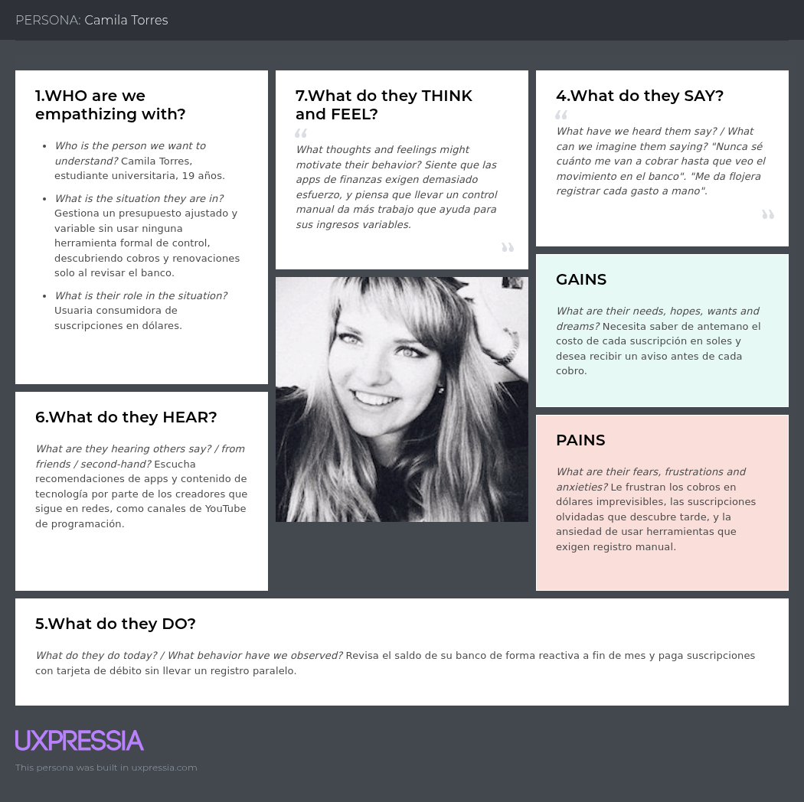

<!-- pdf:omit-start -->

*Figura 6. Empathy Map de Camila Torres.*

<!-- pdf:omit-end -->

*Fuente: elaboración del equipo Gastify.*

***

#### Empathy Map de Renzo Salazar (Segmento 2)

La figura 7 sintetiza lo que Renzo dice, piensa, hace y siente, junto con sus dificultades y expectativas.

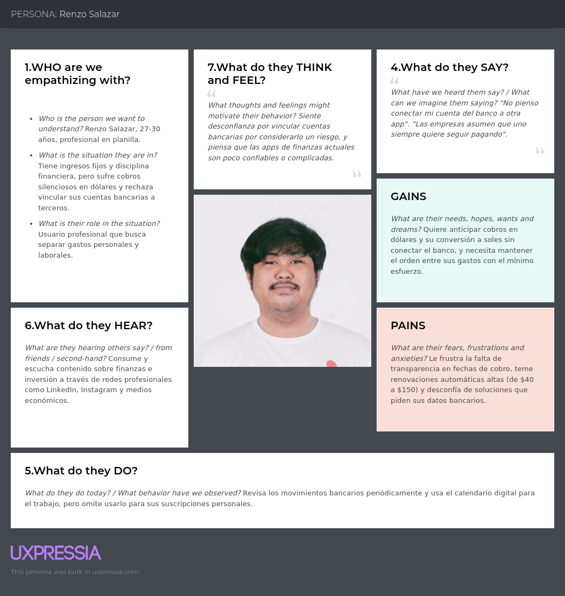

<!-- pdf:omit-start -->

*Figura 7. Empathy Map de Renzo Salazar.*

<!-- pdf:omit-end -->

*Fuente: elaboración del equipo Gastify.*

### 2.3.5. Big Picture EventStorming

Antes de diseñar cualquier pantalla, se reconstruyó en Miro, con la técnica del Big Picture EventStorming, la manera en que un usuario del segmento maneja sus suscripciones, membresías y gastos de delivery sin ayuda de una herramienta dedicada. El tablero sitúa en una línea de tiempo los eventos del proceso actual —desde la contratación de un servicio hasta el descubrimiento del cobro de su renovación—, los actores, los sistemas que intervienen y los puntos donde ese proceso falla. Los hallazgos de 2.2.3 sirvieron como insumo; esta sección describe el problema actual, sin incorporar todavía funciones de CraveWallet.

El tablero representa una **síntesis preliminar del proceso actual (As-Is)** basada en las entrevistas de 2.2.2 y los patrones de 2.2.3. Los pósits naranjas expresan hechos ya ocurridos, escritos en pasado; los amarillos identifican actores, los azules sistemas que intervienen hoy, los rojos fricciones y los verdes oportunidades. El orden y la frecuencia de cada evento deben contrastarse con usuarios antes de tratarlos como un proceso universal.

#### Paso 1: recolectar eventos del dominio

Primero se reunieron, sin imponer un orden, los hechos que aparecen en la contratación y renovación de membresías, el consumo de delivery y la revisión del dinero disponible. El tablero incluye *suscripción contratada*, *fecha de renovación fijada*, *pedido realizado*, *pedido cobrado*, *pedido entregado*, *membresía renovada*, *cargo recurrente procesado*, *saldo consultado*, *estado de cuenta consultado*, *cargo imprevisto detectado*, *gasto mensual estimado*, *pedidos del mes revisados*, *gastos de varias apps revisados*, *presupuesto excedido* y *cancelación solicitada*. Se distinguen los **hechos** de las acciones deseadas: «recibir un recordatorio» sería una solución propuesta, mientras que «cargo imprevisto detectado» describe el proceso presente.

La figura 8 reúne los eventos propuestos para describir el proceso actual, antes de ordenarlos temporalmente.

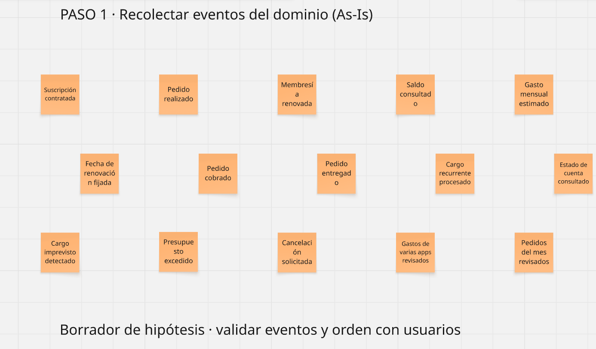

<!-- pdf:omit-start -->

*Figura 8. Paso 1 del Big Picture EventStorming: eventos As-Is recolectados.*

<!-- pdf:omit-end -->

*Fuente: elaboración del equipo Gastify.*

*Nota: recolección inicial de eventos del proceso actual, todavía sin orden temporal. El tablero indica que son hipótesis por validar con usuarios.*

#### Paso 2: ordenar los eventos

La secuencia propuesta comienza con la contratación de una membresía de delivery y la fijación de su fecha de renovación. Después aparecen pedidos de comida realizados y cobrados, la renovación de la membresía y el cargo recurrente. La consulta del estado de cuenta permite detectar el cargo; al estimar el gasto mensual se reconoce el exceso presupuestario y puede solicitarse la cancelación. Los pedidos y la renovación no tienen una dependencia causal: comparten el período de consumo y pueden ocurrir en distinto orden. Las flechas son una hipótesis de lectura del recorrido general, no una regla de negocio según la cual deba existir un pedido para que la membresía se renueve.

La figura 9 ordena los eventos del proceso actual y señala los puntos donde aparecen problemas.

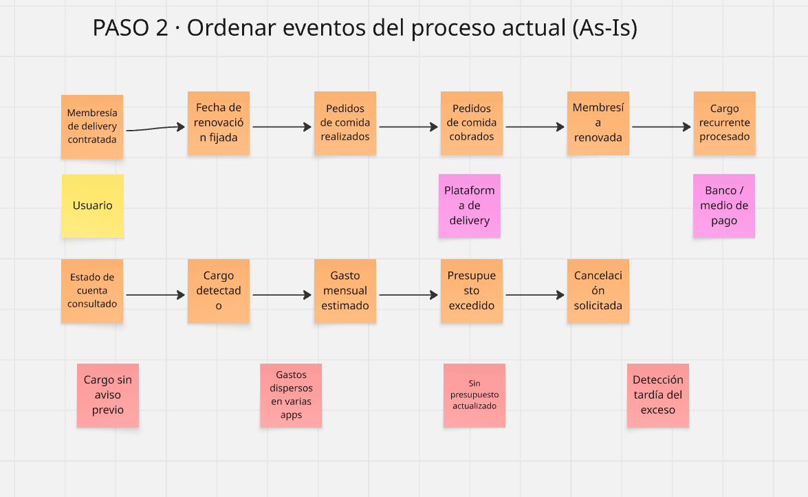

<!-- pdf:omit-start -->

*Figura 9. Paso 2 del Big Picture EventStorming: eventos As-Is ordenados.*

<!-- pdf:omit-end -->

*Fuente: elaboración del equipo Gastify.*

*Nota: orden temporal tentativo; en rojo se señalan los cobros sin aviso, la dispersión del gasto y el descubrimiento tardío del exceso.*

#### Paso 3: añadir actores y sistemas

Se ubicaron sobre los eventos el **usuario** y la **plataforma de delivery**; debajo, la **aplicación de delivery**, el **banco o pasarela**, el **sistema de cobros** y el **estado bancario**. En la muestra de seis eventos clave, el usuario contrata la suscripción, realiza el pedido y consulta el cargo; la plataforma fija la renovación y la ejecuta. La aplicación de delivery y el banco conservan piezas distintas de la información. Esa separación explica por qué el usuario necesita reconstruir el gasto a partir de varias fuentes y por qué el estado de cuenta solo permite una detección posterior.

La figura 10 añade los actores y sistemas que participan en el proceso actual.

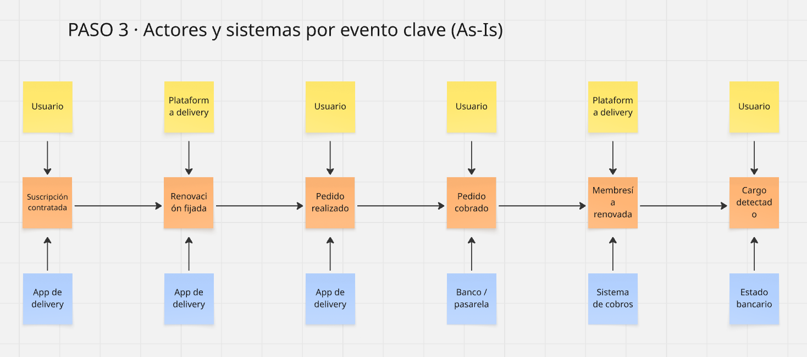

<!-- pdf:omit-start -->

*Figura 10. Paso 3 del Big Picture EventStorming: actores y sistemas.*

<!-- pdf:omit-end -->

*Fuente: elaboración del equipo Gastify.*

*Nota: actores en amarillo, eventos en naranja y sistemas que participan en azul.*

#### Paso 4: identificar problemas y oportunidades

La tabla 24 presenta paso 4: identificar problemas y oportunidades.

*Tabla 24. Paso 4: identificar problemas y oportunidades.*

| Momento del proceso | Problema observado o inferido de las entrevistas | Oportunidad de mejora |
| --- | --- | --- |
| Contratación | La renovación puede olvidarse después de contratar la membresía. | Avisar 24 horas antes de la renovación. |
| Pedidos de delivery | Los cargos quedan dispersos entre distintas aplicaciones. | Unificar el historial de gastos. |
| Renovación | El cargo recurrente se procesa sin aviso oportuno. | Alertar sobre el cargo próximo. |
| Presupuesto | El exceso se detecta tarde al consultar el estado bancario. | Mostrar el límite mensual y el avance del gasto. |

*Fuente: elaboración del equipo Gastify.*

La figura 11 relaciona los momentos del proceso actual con los problemas y oportunidades de mejora identificados.

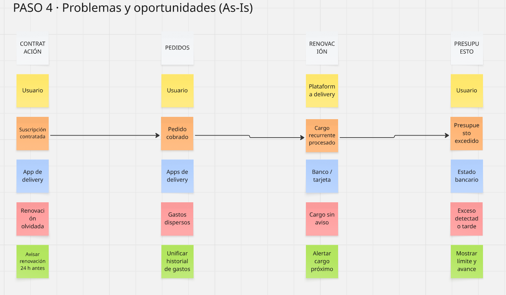

<!-- pdf:omit-start -->

*Figura 11. Paso 4 del Big Picture EventStorming: problemas y oportunidades.*

<!-- pdf:omit-end -->

*Fuente: elaboración del equipo Gastify.*

*Nota: cuatro momentos del proceso As-Is con actor, evento, sistema, problema y oportunidad de mejora.*

El resultado del Big Picture sitúa el mayor punto de dolor **entre la renovación y la revisión bancaria**: el usuario recibe la información útil cuando ya no puede evitar ese cargo. También revela que los pedidos de delivery afectan el mismo presupuesto, aunque cada pedido sea una decisión puntual y no un cobro recurrente. Estas oportunidades orientan el diseño posterior de 2.5.1; no se presentan como funciones que ya existan en el proceso As-Is.

### 2.3.6. Ubiquitous Language

El siguiente glosario recoge los términos del dominio del negocio identificados a partir de las entrevistas (2.2.2), el análisis de patrones (2.2.3) y el Needfinding, de modo que todo el equipo —y cualquier stakeholder que revise este informe— use el mismo vocabulario al describir el problema y la solución. Los términos se registran en inglés, con su equivalente de uso corriente en español entre paréntesis; solo se incluyen términos del dominio del negocio, no términos técnicos de ingeniería de software.

La tabla 25 presenta ubiquitous language.

*Tabla 25. Ubiquitous Language.*

| Término | Definición |
| --- | --- |
| **Subscription** (Suscripción) | Servicio digital o membresía cuyo acceso se paga de forma periódica y automática, sin que el usuario deba autorizar cada cobro individualmente. |
| **Recurring Charge** (Cobro recurrente) | Cargo que una Subscription genera de forma automática en cada Billing Cycle, sin intervención activa del usuario en el momento del cobro. |
| **Billing Cycle** (Ciclo de facturación) | Intervalo de tiempo, típicamente mensual o anual, entre dos Recurring Charges consecutivos de una misma Subscription. |
| **Renewal** (Renovación) | Evento en el que, al finalizar un Billing Cycle, la Subscription continúa vigente y genera un nuevo Recurring Charge sin que el usuario deba confirmarlo. |
| **Subscription Portfolio** (Portafolio de suscripciones) | Conjunto de todas las Subscriptions activas que mantiene un usuario en un momento dado, sin importar en qué moneda se facturen. |
| **Silent Charge** (Cobro silencioso) | Recurring Charge que se procesa sin ningún aviso previo al usuario, de modo que este solo se entera al revisar su cuenta bancaria después de ocurrido. |
| **Exchange Rate** (Tipo de cambio) | Cotización de referencia para expresar un importe en otra moneda. La cotización de la aplicación se distingue del tipo aplicado por el banco al procesar el cargo. |
| **Currency Conversion** (Conversión de divisas) | Cálculo del monto equivalente en soles de un Recurring Charge facturado originalmente en otra moneda, aplicando el Exchange Rate vigente. |
| **Advance Alert** (Alerta anticipada) | Aviso enviado al usuario antes de que se procese un Recurring Charge, con tiempo suficiente para verificar saldo o decidir si cancela la Subscription. |
| **Ghost Expense** (Gasto fantasma) | Recurring Charge de una Subscription que el usuario ya no usa activamente pero que continúa pagando por no haberla cancelado a tiempo. |
| **Cutoff Date** (Fecha de corte) | Día específico del Billing Cycle en el que se procesa el Renewal de una Subscription. |
| **Cancellation** (Cancelación) | En el proceso del proveedor, solicitud de dar de baja un servicio. En CraveWallet, cambio del registro a CANCELLED; no ejecuta la baja externa ni garantiza que no ocurra un cargo. |
| **Budget Mismatch** (Descuadre) | Situación en la que un Recurring Charge no anticipado o un Exchange Rate desfavorable hace que el gasto real del mes supere lo que el usuario había previsto. |
| **Bank Statement Review** (Revisión del estado de cuenta) | Práctica manual y reactiva mediante la cual el usuario identifica sus Recurring Charges revisando los movimientos de su cuenta o tarjeta, en ausencia de una Advance Alert. |
| **Shared Subscription** (Suscripción compartida) | Subscription cuyo costo se divide informalmente entre varias personas que la usan, sin un mecanismo formal de cobro o registro de esa división. |
| **Spending Category** (Categoría de gasto) | Agrupación temática de una Subscription (streaming, educación, fitness, delivery, cloud) que permite consolidar el Subscription Portfolio por rubro. |
| **Delivery Expense** (Gasto de delivery) | Gasto puntual, no recurrente por definición pero de alta frecuencia, generado por un pedido de comida a domicilio; se distingue de un Recurring Charge porque cada pedido requiere una decisión activa del usuario. |
| **Bank Account Linking** (Vinculación de cuentas bancarias) | Mecanismo por el cual una aplicación de terceros accede a los movimientos de la cuenta bancaria de un usuario; el Segmento 2 lo rechaza de forma explícita en el 100 % de las entrevistas. |
| **Free Tier** (Plan gratuito) | Nivel de acceso a CraveWallet sin costo, con un límite en la cantidad de Subscriptions que un usuario puede registrar en su Subscription Portfolio. |
| **Premium Tier** (Plan Premium) | Nivel de acceso de pago que elimina el límite de registro del Free Tier y añade beneficios como analítica avanzada del Subscription Portfolio. |
| **Delivery Budget Limit** (Límite de gasto en delivery) | Monto máximo que un usuario se fija para su Delivery Expense acumulado del mes, usado para generar un aviso cuando el gasto real se acerca a ese límite. |

*Fuente: elaboración del equipo Gastify.*

## 2.4. Requirements specification

La especificación que sigue traduce en requisitos concretos lo que las entrevistas y el Needfinding revelen sobre el comportamiento real de los dos segmentos, leído junto con las Feature Assumptions y los Hypothesis Statements ya declarados en el Capítulo I, y alcanza a la aplicación móvil, al backend propio y al landing page: los tres productos definidos en el alcance del proyecto. El resultado se organiza en tres piezas complementarias. Primero, el catálogo de historias (User Stories agrupadas en Epics, junto con las Technical Stories de infraestructura y las Spike Stories de investigación). Segundo, un Impact Map que conecta cada historia con los Business Outcome Assumptions de la sección 1.2.2.2. Tercero, el Product Backlog, donde esas historias reciben estimación de esfuerzo y prioridad.

### 2.4.1. User Stories

Cada historia adoptará el punto de vista de uno de los dos segmentos objetivo del Capítulo I, agrupados bajo el rol genérico **usuario** cuando la historia les aplique a ambos por igual; se exceptúan las historias del landing page, escritas desde quien todavía no tiene cuenta, y las Technical Stories y Spike Stories, que documentan trabajo interno del equipo de desarrollo. Los criterios de aceptación se expresarán en Gherkin (Dado, Cuando, Entonces) y la prioridad de cada historia se derivará de las Hypothesis Statements de la sección 1.2.2.3: Alta cuando sostiene el Dashboard, la anticipación del cobro o la reducción de la fricción de onboarding; Media cuando completa un ciclo de uso ya cubierto por esas historias de prioridad Alta; Baja para lo que extiende la propuesta sin ser indispensable para validar las hipótesis.

#### Epics

A partir de las Feature Assumptions del Capítulo I y de las tácticas de la sección 2.1.2 se anticipa el siguiente conjunto de Epics. Esta lista es preliminar: se ajustará con lo que arroje el Needfinding de la sección 2.3 antes de redactar las historias individuales, para que cada una tenga sustento directo en las entrevistas y no solo en las hipótesis del Capítulo I.

La tabla 26 presenta epics.

*Tabla 26. Epics.*

| Epic ID | Nombre | Descripción |
| --- | --- | --- |
| EP01 | Autenticación y perfil | Inicio de sesión en CraveWallet y edición de los datos del perfil del usuario. |
| EP02 | Alta de suscripciones | Registro de una suscripción, membresía o gasto recurrente, con plantillas preconfiguradas de los servicios más frecuentes del segmento para reducir la fricción de onboarding. |
| EP03 | Dashboard unificado | Vista consolidada de las suscripciones activas, agrupadas por categoría y ordenadas por próxima fecha de renovación. |
| EP04 | Recordatorios vía calendario nativo | Agendado automático de un recordatorio 24 horas antes de cada cobro, integrado con el calendario del dispositivo. |
| EP05 | Conversión de divisas con cotización fechada | Expresión del portafolio completo en soles, con conversión diaria de los montos facturados en dólares vía ExchangeRate-API. |
| EP06 | Categorización de gastos de delivery | Registro y categorización de pedidos de delivery, con catálogo precargado de comercios limeños frecuentes. |
| EP07 | CraveWallet Premium | Conversión al nivel Premium mediante el SDK de Stripe, con analítica avanzada y registro ilimitado de suscripciones. |
| EP08 | Landing page | Sitio informativo que explica el problema de los cobros recurrentes no anticipados, la propuesta de CraveWallet y el enlace de descarga de la aplicación. |
| EP09 | Servicios RESTful | Technical Stories del backend propio que expone los endpoints consumidos por la aplicación móvil. |
| EP10 | Investigación técnica | Spike Stories orientadas a despejar la incertidumbre técnica de las integraciones con Stripe y ExchangeRate-API antes de comprometerlas en el backlog. |

*Fuente: elaboración del equipo Gastify.*

La lista de Epics organiza el alcance propuesto a partir de los hallazgos de 2.3. Su cobertura debe revisarse mediante la trazabilidad entre necesidades, historias y escenarios, en lugar de asumir que todos los hallazgos están resueltos. A continuación se detallan las 40 User Stories de los ocho Epics orientados a usuario (EP01-EP08), las 6 Technical Stories del backend propio (EP09) y las 6 Spike Stories de investigación técnica (EP10), un total de 52 historias.

#### Historias de usuario

##### EP01 Autenticación y perfil

Los requisitos y criterios de US01 se detallan en la tabla 27.

*Tabla 27. Historia US01: Registrarme con correo y contraseña.*

| Campo | Contenido |
| --- | --- |
| Story ID | US01 |
| User | Usuario |
| Priority | Alta |
| Epic | EP01 |
| **Title** | Registrarme con correo y contraseña |
| **Description** | Como usuario nuevo, deseo crear una cuenta con mi correo y una contraseña, para empezar a registrar mis suscripciones en CraveWallet. |
| Acceptance Criteria | **Escenario 1: Registro exitoso** Dado que el usuario no tiene una cuenta en CraveWallet, Cuando ingresa un correo válido no registrado y una contraseña que cumple la política mínima de seguridad, Entonces el sistema crea la cuenta y da inicio a la sesión. |
| Acceptance Criteria | **Escenario 2: Correo ya registrado** Dado que el correo ingresado ya tiene una cuenta asociada, Cuando el usuario intenta registrarse con ese correo, Entonces el sistema rechaza el registro e indica que el correo ya está en uso. |
| Acceptance Criteria | **Escenario 3: Contraseña insegura** Dado que el usuario está completando el registro, Cuando ingresa una contraseña que no cumple la longitud o complejidad mínima, Entonces el sistema no crea la cuenta e indica el motivo del rechazo. |

*Fuente: elaboración de Gastify; especificación propuesta del producto.*

Los requisitos y criterios de US02 se detallan en la tabla 28.

*Tabla 28. Historia US02: Iniciar sesión.*

| Campo | Contenido |
| --- | --- |
| Story ID | US02 |
| User | Usuario |
| Priority | Alta |
| Epic | EP01 |
| **Title** | Iniciar sesión |
| **Description** | Como usuario registrado, deseo iniciar sesión con mi correo y contraseña, para acceder a mi portafolio de suscripciones. |
| Acceptance Criteria | **Escenario 1: Credenciales correctas** Dado que el usuario tiene una cuenta registrada, Cuando ingresa su correo y contraseña correctos, Entonces el sistema inicia sesión y muestra el Dashboard. |
| Acceptance Criteria | **Escenario 2: Credenciales incorrectas** Dado que el usuario tiene una cuenta registrada, Cuando ingresa una contraseña incorrecta, Entonces el sistema rechaza el ingreso e indica que las credenciales no son válidas, sin especificar cuál de los dos campos falló. |

*Fuente: elaboración de Gastify; especificación propuesta del producto.*

Los requisitos y criterios de US03 se detallan en la tabla 29.

*Tabla 29. Historia US03: Configurar mi moneda de referencia.*

| Campo | Contenido |
| --- | --- |
| Story ID | US03 |
| User | Usuario |
| Priority | Media |
| Epic | EP01 |
| **Title** | Configurar mi moneda de referencia |
| **Description** | Como usuario, deseo confirmar que mi moneda de referencia es el sol peruano al configurar mi perfil, para que el Dashboard y la conversión de divisas usen esa moneda como base. |
| Acceptance Criteria | **Escenario 1: Confirmación por defecto** Dado que el usuario completa su perfil por primera vez, Cuando llega a la sección de moneda de referencia, Entonces el sistema muestra el sol peruano (PEN) preseleccionado y permite confirmarlo. |

*Fuente: elaboración de Gastify; especificación propuesta del producto.*

Los requisitos y criterios de US33 se detallan en la tabla 30.

*Tabla 30. Historia US33: Cerrar sesión.*

| Campo | Contenido |
| --- | --- |
| Story ID | US33 |
| User | Usuario |
| Priority | Media |
| Epic | EP01 |
| **Title** | Cerrar sesión |
| **Description** | Como usuario, deseo cerrar sesión en CraveWallet, para proteger mi cuenta cuando uso un dispositivo compartido o prestado. |
| Acceptance Criteria | **Escenario 1: Cierre exitoso** Dado que el usuario tiene una sesión iniciada, Cuando selecciona cerrar sesión desde su perfil, Entonces el sistema invalida su sesión y lo regresa a la pantalla de inicio de sesión. |

*Fuente: elaboración de Gastify; especificación propuesta del producto.*

##### EP02 Alta de suscripciones

Los requisitos y criterios de US04 se detallan en la tabla 31.

*Tabla 31. Historia US04: Registrar una suscripción desde el catálogo precargado.*

| Campo | Contenido |
| --- | --- |
| Story ID | US04 |
| User | Usuario |
| Priority | Alta |
| Epic | EP02 |
| **Title** | Registrar una suscripción desde el catálogo precargado |
| **Description** | Como usuario, deseo elegir un servicio de un catálogo con los nombres, logos y monedas de facturación de las suscripciones más frecuentes de mi segmento, para no tener que llenar esos datos a mano. |
| Acceptance Criteria | **Escenario 1: Selección desde el catálogo** Dado que el usuario abre el catálogo precargado, Cuando selecciona un servicio (por ejemplo, Spotify o Netflix) e ingresa el monto y la fecha de su próximo cobro, Entonces el sistema registra la suscripción con el nombre, el logo y la moneda de facturación ya definidos por el catálogo. |
| Acceptance Criteria | **Escenario 2: Búsqueda dentro del catálogo** Dado que el catálogo tiene más de veinte servicios, Cuando el usuario escribe parte del nombre en el buscador, Entonces el sistema filtra la lista para mostrar solo las coincidencias. |

*Fuente: elaboración de Gastify; especificación propuesta del producto.*

Los requisitos y criterios de US05 se detallan en la tabla 32.

*Tabla 32. Historia US05: Registrar una suscripción personalizada.*

| Campo | Contenido |
| --- | --- |
| Story ID | US05 |
| User | Usuario |
| Priority | Alta |
| Epic | EP02 |
| **Title** | Registrar una suscripción personalizada |
| **Description** | Como usuario, deseo registrar manualmente una suscripción que no está en el catálogo precargado, para llevar el control de servicios menos comunes (como una membresía física o una herramienta cloud específica). |
| Acceptance Criteria | **Escenario 1: Registro manual completo** Dado que el servicio que el usuario quiere registrar no aparece en el catálogo, Cuando ingresa manualmente el nombre, el monto, la moneda de facturación y la fecha del próximo cobro, Entonces el sistema registra la suscripción como personalizada. |
| Acceptance Criteria | **Escenario 2: Campos obligatorios incompletos** Dado que el usuario está registrando una suscripción personalizada, Cuando intenta guardarla sin completar el monto o la fecha del próximo cobro, Entonces el sistema no la registra e indica qué campos faltan. |

*Fuente: elaboración de Gastify; especificación propuesta del producto.*

Los requisitos y criterios de US06 se detallan en la tabla 33.

*Tabla 33. Historia US06: Editar una suscripción registrada.*

| Campo | Contenido |
| --- | --- |
| Story ID | US06 |
| User | Usuario |
| Priority | Media |
| Epic | EP02 |
| **Title** | Editar una suscripción registrada |
| **Description** | Como usuario, deseo editar el monto, la fecha o la categoría de una suscripción ya registrada, para corregir datos o reflejar un cambio de plan. |
| Acceptance Criteria | **Escenario 1: Edición exitosa** Dado que el usuario tiene una suscripción registrada, Cuando modifica su monto, fecha de cobro o categoría y guarda los cambios, Entonces el sistema actualiza la suscripción con los nuevos valores. |

*Fuente: elaboración de Gastify; especificación propuesta del producto.*

Los requisitos y criterios de US07 se detallan en la tabla 34.

*Tabla 34. Historia US07: Cancelar una suscripción registrada.*

| Campo | Contenido |
| --- | --- |
| Story ID | US07 |
| User | Usuario |
| Priority | Alta |
| Epic | EP02 |
| **Title** | Cancelar una suscripción registrada |
| **Description** | Como usuario, deseo marcar una suscripción registrada como cancelada, para dejar de recibir recordatorios de un servicio que ya no uso, sin perder su historial. |
| Acceptance Criteria | **Escenario 1: Cancelación exitosa** Dado que el usuario tiene una suscripción activa, Cuando la marca como cancelada desde su detalle, Entonces el sistema deja de incluirla en el total del Dashboard y en los próximos recordatorios, pero conserva su historial de cobros pasados. |
| Acceptance Criteria | **Escenario 2: Confirmación antes de cancelar** Dado que el usuario selecciona la opción de cancelar una suscripción, Cuando confirma la acción en el diálogo de verificación, Entonces el sistema aplica la cancelación; si el usuario descarta el diálogo, la suscripción permanece activa. |

*Fuente: elaboración de Gastify; especificación propuesta del producto.*

Los requisitos y criterios de US26 se detallan en la tabla 35.

*Tabla 35. Historia US26: Ver el historial de suscripciones canceladas.*

| Campo | Contenido |
| --- | --- |
| Story ID | US26 |
| User | Usuario |
| Priority | Baja |
| Epic | EP02 |
| **Title** | Ver el historial de suscripciones canceladas |
| **Description** | Como usuario, deseo ver la lista de suscripciones que cancelé en el pasado, para recordar qué servicios usé antes o reactivar una si vuelvo a necesitarla. |
| Acceptance Criteria | **Escenario 1: Consulta del historial** Dado que el usuario tiene al menos una suscripción cancelada, Cuando abre la sección de suscripciones canceladas, Entonces el sistema lista cada una con la fecha en que fue cancelada y su último monto registrado. |

*Fuente: elaboración de Gastify; especificación propuesta del producto.*

Los requisitos y criterios de US34 se detallan en la tabla 36.

*Tabla 36. Historia US34: Previsualizar el monto en soles antes de guardar una suscripción en dólares.*

| Campo | Contenido |
| --- | --- |
| Story ID | US34 |
| User | Usuario |
| Priority | Media |
| Epic | EP02 |
| **Title** | Previsualizar el monto en soles antes de guardar una suscripción en dólares |
| **Description** | Como usuario, deseo ver una previsualización del monto en soles mientras registro una suscripción en dólares, para saber de antemano cuánto representará en mi presupuesto antes de guardarla. |
| Acceptance Criteria | **Escenario 1: Previsualización en tiempo real** Dado que el usuario está registrando una suscripción y elige dólares como moneda de facturación, Cuando ingresa el monto original, Entonces el sistema muestra junto al campo el equivalente estimado en soles con el tipo de cambio del día, antes de que confirme el registro. |

*Fuente: elaboración de Gastify; especificación propuesta del producto.*

##### EP03 Dashboard unificado

Los requisitos y criterios de US08 se detallan en la tabla 37.

*Tabla 37. Historia US08: Ver el total mensual de mis suscripciones activas en soles.*

| Campo | Contenido |
| --- | --- |
| Story ID | US08 |
| User | Usuario |
| Priority | Alta |
| Epic | EP03 |
| **Title** | Ver el total mensual de mis suscripciones activas en soles |
| **Description** | Como usuario, deseo ver en el Dashboard el monto total que gasto al mes en suscripciones activas, ya convertido a soles, para conocer mi compromiso financiero recurrente en una sola cifra. |
| Acceptance Criteria | **Escenario 1: Portafolio mixto de monedas** Dado que el usuario tiene suscripciones activas facturadas en soles y en dólares, Cuando abre el Dashboard, Entonces el sistema muestra el total mensual sumando todas las suscripciones convertidas a soles con el tipo de cambio del día. |
| Acceptance Criteria | **Escenario 2: Sin suscripciones registradas** Dado que el usuario no tiene ninguna suscripción registrada, Cuando abre el Dashboard, Entonces el sistema muestra el total en S/ 0.00 e indica que no hay suscripciones registradas. |

*Fuente: elaboración de Gastify; especificación propuesta del producto.*

Los requisitos y criterios de US09 se detallan en la tabla 38.

*Tabla 38. Historia US09: Ver mis suscripciones agrupadas por categoría.*

| Campo | Contenido |
| --- | --- |
| Story ID | US09 |
| User | Usuario |
| Priority | Alta |
| Epic | EP03 |
| **Title** | Ver mis suscripciones agrupadas por categoría |
| **Description** | Como usuario, deseo ver mis suscripciones activas agrupadas por categoría (streaming, educación, fitness, delivery, cloud), para entender en qué rubros concentro mi gasto recurrente. |
| Acceptance Criteria | **Escenario 1: Agrupación con subtotales** Dado que el usuario tiene suscripciones activas en más de una categoría, Cuando abre la vista de categorías del Dashboard, Entonces el sistema agrupa las suscripciones por categoría y muestra el subtotal mensual en soles de cada grupo. |

*Fuente: elaboración de Gastify; especificación propuesta del producto.*

Los requisitos y criterios de US10 se detallan en la tabla 39.

*Tabla 39. Historia US10: Ver mis suscripciones ordenadas por próxima fecha de renovación.*

| Campo | Contenido |
| --- | --- |
| Story ID | US10 |
| User | Usuario |
| Priority | Alta |
| Epic | EP03 |
| **Title** | Ver mis suscripciones ordenadas por próxima fecha de renovación |
| **Description** | Como usuario, deseo ver mis suscripciones activas ordenadas de la más próxima a la más lejana a cobrarse, para anticipar qué cargo viene primero. |
| Acceptance Criteria | **Escenario 1: Orden ascendente por fecha** Dado que el usuario tiene varias suscripciones activas con distintas fechas de cobro, Cuando abre el Dashboard en la vista de próximos cobros, Entonces el sistema las lista en orden ascendente según la fecha del próximo cobro. |

*Fuente: elaboración de Gastify; especificación propuesta del producto.*

Los requisitos y criterios de US11 se detallan en la tabla 40.

*Tabla 40. Historia US11: Ver el detalle de una suscripción desde el Dashboard.*

| Campo | Contenido |
| --- | --- |
| Story ID | US11 |
| User | Usuario |
| Priority | Media |
| Epic | EP03 |
| **Title** | Ver el detalle de una suscripción desde el Dashboard |
| **Description** | Como usuario, deseo ver el detalle completo de una suscripción desde el Dashboard, para revisar su historial de cobros y su fecha de renovación sin salir del flujo principal. |
| Acceptance Criteria | **Escenario 1: Apertura del detalle** Dado que el usuario está en el Dashboard, Cuando selecciona una suscripción de la lista, Entonces el sistema abre su vista de detalle con el monto original, la moneda, el monto convertido a soles, la categoría y el historial de cobros pasados. |

*Fuente: elaboración de Gastify; especificación propuesta del producto.*

Los requisitos y criterios de US27 se detallan en la tabla 41.

*Tabla 41. Historia US27: Buscar una suscripción por nombre en el Dashboard.*

| Campo | Contenido |
| --- | --- |
| Story ID | US27 |
| User | Usuario |
| Priority | Baja |
| Epic | EP03 |
| **Title** | Buscar una suscripción por nombre en el Dashboard |
| **Description** | Como usuario con muchas suscripciones registradas, deseo buscar una por su nombre en el Dashboard, para encontrarla rápido sin recorrer toda la lista. |
| Acceptance Criteria | **Escenario 1: Coincidencia encontrada** Dado que el usuario tiene varias suscripciones activas, Cuando escribe parte del nombre en el buscador del Dashboard, Entonces el sistema filtra la lista y muestra solo las suscripciones cuyo nombre coincide. |
| Acceptance Criteria | **Escenario 2: Sin coincidencias** Dado que el texto ingresado no coincide con ninguna suscripción, Cuando el usuario busca, Entonces el sistema muestra un mensaje indicando que no se encontraron resultados. |

*Fuente: elaboración de Gastify; especificación propuesta del producto.*

Los requisitos y criterios de US35 se detallan en la tabla 42.

*Tabla 42. Historia US35: Ver el ahorro estimado por cancelar una suscripción antes de su renovación.*

| Campo | Contenido |
| --- | --- |
| Story ID | US35 |
| User | Usuario |
| Priority | Baja |
| Epic | EP03 |
| **Title** | Ver el ahorro estimado por cancelar una suscripción antes de su renovación |
| **Description** | Como usuario, deseo ver una estimación del gasto que podría evitar al cancelar el servicio antes de que se renueve, para evaluar el posible efecto de cancelar el servicio a tiempo con su proveedor. |
| Acceptance Criteria | **Escenario 1: Cancelación antes del cobro** Dado que el usuario cancela una suscripción activa antes de su próxima fecha de cobro, Cuando confirma la cancelación, Entonces el sistema muestra un ahorro potencial estimado para ese ciclo y aclara que marcar el registro como cancelado no cancela el servicio ni confirma un ahorro real. |

*Fuente: elaboración de Gastify; especificación propuesta del producto.*

##### EP04 Recordatorios vía calendario nativo

Los requisitos y criterios de US12 se detallan en la tabla 43.

*Tabla 43. Historia US12: Recibir un recordatorio 24 horas antes de un cobro automático.*

| Campo | Contenido |
| --- | --- |
| Story ID | US12 |
| User | Usuario |
| Priority | Alta |
| Epic | EP04 |
| **Title** | Recibir un recordatorio 24 horas antes de un cobro automático |
| **Description** | Como usuario, deseo que CraveWallet agende un recordatorio en mi calendario nativo 24 horas antes de cada cobro de una suscripción activa, para tener tiempo de verificar mi saldo o cancelarla antes de que se renueve. |
| Acceptance Criteria | **Escenario 1: Recordatorio agendado al registrar** Dado que el usuario registra una suscripción activa con una fecha de próximo cobro, Cuando confirma el registro, Entonces el sistema agenda un evento en el calendario nativo del dispositivo 24 horas antes de esa fecha, con el nombre del servicio y el monto estimado. |
| Acceptance Criteria | **Escenario 2: Reagendado tras editar la fecha de cobro** Dado que una suscripción ya tiene un recordatorio agendado, Cuando el usuario edita su fecha de próximo cobro, Entonces el sistema elimina el evento anterior y agenda uno nuevo 24 horas antes de la fecha actualizada. |

*Fuente: elaboración de Gastify; especificación propuesta del producto.*

Los requisitos y criterios de US13 se detallan en la tabla 44.

*Tabla 44. Historia US13: Que se elimine el recordatorio de una suscripción cancelada.*

| Campo | Contenido |
| --- | --- |
| Story ID | US13 |
| User | Usuario |
| Priority | Alta |
| Epic | EP04 |
| **Title** | Que se elimine el recordatorio de una suscripción cancelada |
| **Description** | Como usuario, deseo que al cancelar una suscripción se elimine también su recordatorio en el calendario, para no recibir avisos de un registro que marqué como cancelado en CraveWallet. |
| Acceptance Criteria | **Escenario 1: Eliminación automática** Dado que una suscripción activa tiene un recordatorio agendado en el calendario, Cuando el usuario la marca como cancelada (US07), Entonces el sistema elimina el evento correspondiente del calendario nativo. |

*Fuente: elaboración de Gastify; especificación propuesta del producto.*

Los requisitos y criterios de US14 se detallan en la tabla 45.

*Tabla 45. Historia US14: Otorgar permiso de acceso al calendario.*

| Campo | Contenido |
| --- | --- |
| Story ID | US14 |
| User | Usuario |
| Priority | Media |
| Epic | EP04 |
| **Title** | Otorgar permiso de acceso al calendario |
| **Description** | Como usuario, deseo que la aplicación me pida permiso para acceder a mi calendario la primera vez que lo necesite, para entender por qué lo solicita y decidir si lo autorizo. |
| Acceptance Criteria | **Escenario 1: Permiso otorgado** Dado que el usuario registra su primera suscripción con fecha de cobro, Cuando el sistema solicita permiso de acceso al calendario y el usuario lo acepta, Entonces el sistema agenda el recordatorio correspondiente. |
| Acceptance Criteria | **Escenario 2: Permiso denegado** Dado que el sistema solicita permiso de acceso al calendario, Cuando el usuario lo deniega, Entonces el sistema registra la suscripción igualmente, sin agendar el recordatorio, e informa que puede habilitar el permiso más tarde desde ajustes. |

*Fuente: elaboración de Gastify; especificación propuesta del producto.*

Los requisitos y criterios de US28 se detallan en la tabla 46.

*Tabla 46. Historia US28: Ver la lista de mis próximos recordatorios agendados.*

| Campo | Contenido |
| --- | --- |
| Story ID | US28 |
| User | Usuario |
| Priority | Media |
| Epic | EP04 |
| **Title** | Ver la lista de mis próximos recordatorios agendados |
| **Description** | Como usuario, deseo ver dentro de CraveWallet la lista de los recordatorios que se agendaron en mi calendario, para confirmar que todas mis suscripciones activas tienen uno programado. |
| Acceptance Criteria | **Escenario 1: Lista con recordatorios agendados** Dado que el usuario tiene suscripciones activas con recordatorio agendado, Cuando abre la sección de recordatorios, Entonces el sistema lista cada suscripción con la fecha y hora en que se enviará su recordatorio. |
| Acceptance Criteria | **Escenario 2: Suscripción sin recordatorio** Dado que una suscripción activa no tiene recordatorio agendado por haber denegado el permiso de calendario, Cuando el usuario abre la sección de recordatorios, Entonces el sistema la marca como "sin recordatorio" y ofrece el acceso directo a los ajustes de permiso. |

*Fuente: elaboración de Gastify; especificación propuesta del producto.*

Los requisitos y criterios de US36 se detallan en la tabla 47.

*Tabla 47. Historia US36: Recibir una notificación push además del recordatorio de calendario.*

| Campo | Contenido |
| --- | --- |
| Story ID | US36 |
| User | Usuario |
| Priority | Alta |
| Epic | EP04 |
| **Title** | Recibir una notificación push además del recordatorio de calendario |
| **Description** | Como usuario, deseo recibir una notificación push de CraveWallet 24 horas antes de un cobro, además del evento agendado en mi calendario, para enterarme del aviso aunque no revise mi calendario ese día. |
| Acceptance Criteria | **Escenario 1: Envío de la notificación** Dado que una suscripción activa tiene un recordatorio agendado, Cuando faltan 24 horas para su próximo cobro, Entonces el sistema envía una notificación push al dispositivo del usuario con el nombre del servicio y el monto estimado en soles. |

*Fuente: elaboración de Gastify; especificación propuesta del producto.*

##### EP05 Conversión de divisas con cotización fechada

Los requisitos y criterios de US15 se detallan en la tabla 48.

*Tabla 48. Historia US15: Ver el monto en soles de una suscripción facturada en dólares.*

| Campo | Contenido |
| --- | --- |
| Story ID | US15 |
| User | Usuario |
| Priority | Alta |
| Epic | EP05 |
| **Title** | Ver el monto en soles de una suscripción facturada en dólares |
| **Description** | Como usuario, deseo ver junto al monto original en dólares de una suscripción su equivalente en soles, calculado con el tipo de cambio del día, para estimar su costo antes del cobro, considerando que el cargo final puede usar otra cotización o incluir comisiones. |
| Acceptance Criteria | **Escenario 1: Conversión disponible** Dado que el usuario tiene una suscripción registrada en dólares, Cuando consulta su detalle, Entonces el sistema muestra el monto original en dólares junto al monto equivalente en soles, calculado con el tipo de cambio consultado ese día a la API externa. |
| Acceptance Criteria | **Escenario 2: API de tipo de cambio no disponible** Dado que el servicio externo de tipo de cambio no responde, Cuando el usuario consulta una suscripción en dólares, Entonces el sistema muestra el último tipo de cambio guardado junto con la fecha en que se obtuvo, indicando que no es el valor del día. |

*Fuente: elaboración de Gastify; especificación propuesta del producto.*

Los requisitos y criterios de US16 se detallan en la tabla 49.

*Tabla 49. Historia US16: Ver el tipo de cambio utilizado y su fecha de actualización.*

| Campo | Contenido |
| --- | --- |
| Story ID | US16 |
| User | Usuario |
| Priority | Media |
| Epic | EP05 |
| **Title** | Ver el tipo de cambio utilizado y su fecha de actualización |
| **Description** | Como usuario, deseo ver qué tipo de cambio usó CraveWallet para convertir mis suscripciones en dólares y cuándo se actualizó, para confiar en que el monto mostrado es razonable. |
| Acceptance Criteria | **Escenario 1: Consulta del tipo de cambio** Dado que el usuario está viendo el detalle de una suscripción en dólares, Cuando abre la información de conversión, Entonces el sistema muestra el valor del tipo de cambio aplicado y la fecha y hora en que se obtuvo de la API externa. |

*Fuente: elaboración de Gastify; especificación propuesta del producto.*

Los requisitos y criterios de US17 se detallan en la tabla 50.

*Tabla 50. Historia US17: Ver mi portafolio completo unificado en soles.*

| Campo | Contenido |
| --- | --- |
| Story ID | US17 |
| User | Usuario |
| Priority | Alta |
| Epic | EP05 |
| **Title** | Ver mi portafolio completo unificado en soles |
| **Description** | Como usuario, deseo que el total del Dashboard sume todas mis suscripciones en una sola moneda, sin importar en qué divisa se facture cada una, para no tener que hacer yo mismo la conversión mental. |
| Acceptance Criteria | **Escenario 1: Suma de monedas mixtas** Dado que el usuario tiene suscripciones registradas en soles y en dólares, Cuando el sistema calcula el total mensual del Dashboard, Entonces convierte cada suscripción en dólares a soles con el tipo de cambio vigente antes de sumarlas al total. |

*Fuente: elaboración de Gastify; especificación propuesta del producto.*

Los requisitos y criterios de US29 se detallan en la tabla 51.

*Tabla 51. Historia US29: Ver el historial del tipo de cambio aplicado a una suscripción.*

| Campo | Contenido |
| --- | --- |
| Story ID | US29 |
| User | Usuario |
| Priority | Baja |
| Epic | EP05 |
| **Title** | Ver el historial del tipo de cambio aplicado a una suscripción |
| **Description** | Como usuario, deseo ver cómo varió mes a mes el tipo de cambio aplicado a una suscripción en dólares, para entender por qué el monto en soles no es siempre el mismo. |
| Acceptance Criteria | **Escenario 1: Historial con varios meses** Dado que una suscripción en dólares lleva más de un mes activa, Cuando el usuario consulta su historial de conversión, Entonces el sistema lista el tipo de cambio y el monto en soles aplicados en cada Billing Cycle anterior. |

*Fuente: elaboración de Gastify; especificación propuesta del producto.*

Los requisitos y criterios de US37 se detallan en la tabla 52.

*Tabla 52. Historia US37: Ver la variación del tipo de cambio respecto al cobro anterior.*

| Campo | Contenido |
| --- | --- |
| Story ID | US37 |
| User | Usuario |
| Priority | Baja |
| Epic | EP05 |
| **Title** | Ver la variación del tipo de cambio respecto al cobro anterior |
| **Description** | Como usuario, deseo ver si el tipo de cambio subió o bajó respecto al cobro anterior de una suscripción en dólares, para entender por qué el monto en soles cambió de un mes a otro. |
| Acceptance Criteria | **Escenario 1: Variación mostrada** Dado que una suscripción en dólares lleva más de un Billing Cycle activa, Cuando el usuario consulta su detalle, Entonces el sistema muestra la variación porcentual del tipo de cambio respecto al cobro anterior. |

*Fuente: elaboración de Gastify; especificación propuesta del producto.*

##### EP06 Categorización de gastos de delivery

Los requisitos y criterios de US18 se detallan en la tabla 53.

*Tabla 53. Historia US18: Registrar un pedido de delivery desde un catálogo de comercios frecuentes.*

| Campo | Contenido |
| --- | --- |
| Story ID | US18 |
| User | Usuario |
| Priority | Media |
| Epic | EP06 |
| **Title** | Registrar un pedido de delivery desde un catálogo de comercios frecuentes |
| **Description** | Como usuario, deseo registrar un pedido de delivery eligiendo el comercio de un catálogo precargado con negocios frecuentes de Lima, para no tener que escribir el nombre cada vez que pido. |
| Acceptance Criteria | **Escenario 1: Registro desde el catálogo** Dado que el usuario abre el registro de un nuevo gasto de delivery, Cuando selecciona un comercio del catálogo precargado e ingresa el monto del pedido, Entonces el sistema registra el gasto con la fecha del día, el comercio y el monto. |
| Acceptance Criteria | **Escenario 2: Comercio no listado** Dado que el comercio no aparece en el catálogo, Cuando el usuario escribe manualmente su nombre y confirma el registro, Entonces el sistema lo guarda como un gasto de delivery personalizado. |

*Fuente: elaboración de Gastify; especificación propuesta del producto.*

Los requisitos y criterios de US19 se detallan en la tabla 54.

*Tabla 54. Historia US19: Ver el total gastado en delivery en el mes.*

| Campo | Contenido |
| --- | --- |
| Story ID | US19 |
| User | Usuario |
| Priority | Media |
| Epic | EP06 |
| **Title** | Ver el total gastado en delivery en el mes |
| **Description** | Como usuario, deseo ver cuánto llevo gastado en delivery en el mes en curso, para tomar conciencia del impacto acumulado de mis pedidos. |
| Acceptance Criteria | **Escenario 1: Total del mes con pedidos registrados** Dado que el usuario tiene al menos un gasto de delivery registrado en el mes en curso, Cuando abre la sección de delivery, Entonces el sistema muestra la suma de todos los pedidos del mes en soles. |
| Acceptance Criteria | **Escenario 2: Sin pedidos registrados** Dado que el usuario no registró ningún pedido en el mes en curso, Cuando abre la sección de delivery, Entonces el sistema muestra el total en S/ 0.00. |

*Fuente: elaboración de Gastify; especificación propuesta del producto.*

Los requisitos y criterios de US20 se detallan en la tabla 55.

*Tabla 55. Historia US20: Ver la tendencia de mi gasto de delivery por semana.*

| Campo | Contenido |
| --- | --- |
| Story ID | US20 |
| User | Usuario |
| Priority | Baja |
| Epic | EP06 |
| **Title** | Ver la tendencia de mi gasto de delivery por semana |
| **Description** | Como usuario, deseo ver un resumen semanal de mi gasto en delivery de las últimas semanas, para notar si aumenta en ciertas épocas (por ejemplo, exámenes o semanas de más carga laboral). |
| Acceptance Criteria | **Escenario 1: Comparación entre semanas** Dado que el usuario tiene gastos de delivery registrados en al menos dos semanas distintas, Cuando abre la tendencia semanal, Entonces el sistema muestra el total gastado en cada una de las últimas cuatro semanas. |

*Fuente: elaboración de Gastify; especificación propuesta del producto.*

Los requisitos y criterios de US30 se detallan en la tabla 56.

*Tabla 56. Historia US30: Editar o eliminar un gasto de delivery registrado por error.*

| Campo | Contenido |
| --- | --- |
| Story ID | US30 |
| User | Usuario |
| Priority | Baja |
| Epic | EP06 |
| **Title** | Editar o eliminar un gasto de delivery registrado por error |
| **Description** | Como usuario, deseo editar o eliminar un gasto de delivery que registré con un monto equivocado o por duplicado, para que el total del mes sea correcto. |
| Acceptance Criteria | **Escenario 1: Edición del monto** Dado que el usuario tiene un gasto de delivery registrado, Cuando corrige su monto y guarda el cambio, Entonces el sistema actualiza el gasto y recalcula el total del mes. |
| Acceptance Criteria | **Escenario 2: Eliminación** Dado que el usuario registró un gasto de delivery por duplicado, Cuando lo elimina, Entonces el sistema lo quita del total del mes. |

*Fuente: elaboración de Gastify; especificación propuesta del producto.*

Los requisitos y criterios de US38 se detallan en la tabla 57.

*Tabla 57. Historia US38: Definir un límite mensual de gasto en delivery y recibir aviso al acercarme.*

| Campo | Contenido |
| --- | --- |
| Story ID | US38 |
| User | Usuario |
| Priority | Media |
| Epic | EP06 |
| **Title** | Definir un límite mensual de gasto en delivery y recibir aviso al acercarme |
| **Description** | Como usuario, deseo definir un límite mensual de gasto en delivery y recibir un aviso cuando esté por alcanzarlo, para controlar mejor ese gasto de alta frecuencia. |
| Acceptance Criteria | **Escenario 1: Definición del límite** Dado que el usuario abre la configuración de delivery, Cuando ingresa un monto límite mensual y lo guarda, Entonces el sistema lo usa como referencia para el mes en curso. |
| Acceptance Criteria | **Escenario 2: Aviso cercano al límite** Dado que el usuario definió un límite mensual, Cuando su gasto acumulado del mes alcanza el 80 % de ese límite, Entonces el sistema le envía un aviso. |

*Fuente: elaboración de Gastify; especificación propuesta del producto.*

##### EP07 CraveWallet Premium

Los requisitos y criterios de US21 se detallan en la tabla 58.

*Tabla 58. Historia US21: Ver la propuesta de valor y el precio de Premium.*

| Campo | Contenido |
| --- | --- |
| Story ID | US21 |
| User | Usuario |
| Priority | Media |
| Epic | EP07 |
| **Title** | Ver la propuesta de valor y el precio de Premium |
| **Description** | Como usuario del plan gratuito, deseo ver qué incluye el plan Premium y su precio mensual, para decidir si me conviene suscribirme. |
| Acceptance Criteria | **Escenario 1: Consulta del plan** Dado que el usuario tiene el plan gratuito, Cuando abre la sección Premium, Entonces el sistema muestra el precio mensual (S/ 9.90), los beneficios incluidos (registro ilimitado de suscripciones, analítica avanzada, recordatorios prioritarios) y las limitaciones actuales del plan gratuito. |

*Fuente: elaboración de Gastify; especificación propuesta del producto.*

Los requisitos y criterios de US22 se detallan en la tabla 59.

*Tabla 59. Historia US22: Suscribirme al plan Premium.*

| Campo | Contenido |
| --- | --- |
| Story ID | US22 |
| User | Usuario |
| Priority | Media |
| Epic | EP07 |
| **Title** | Suscribirme al plan Premium |
| **Description** | Como usuario del plan gratuito, deseo pagar el plan Premium con mi tarjeta a través de un flujo seguro, para acceder de inmediato a sus beneficios. |
| Acceptance Criteria | **Escenario 1: Pago exitoso** Dado que el usuario ingresó los datos de una tarjeta válida en el flujo de pago de Stripe, Cuando confirma la suscripción, Entonces el sistema activa el plan Premium y elimina las restricciones del plan gratuito cuando el backend verifica la confirmación del pago; mientras espera esa confirmación, la interfaz muestra el estado pendiente. |
| Acceptance Criteria | **Escenario 2: Pago rechazado** Dado que el usuario intenta pagar con una tarjeta que Stripe rechaza, Cuando confirma la suscripción, Entonces el sistema no activa el plan Premium e indica que el pago fue rechazado, permitiendo intentar con otra tarjeta. |

*Fuente: elaboración de Gastify; especificación propuesta del producto.*

Los requisitos y criterios de US23 se detallan en la tabla 60.

*Tabla 60. Historia US23: Cancelar mi suscripción Premium.*

| Campo | Contenido |
| --- | --- |
| Story ID | US23 |
| User | Usuario |
| Priority | Baja |
| Epic | EP07 |
| **Title** | Cancelar mi suscripción Premium |
| **Description** | Como usuario Premium, deseo cancelar mi suscripción, para volver al plan gratuito y dejar de pagar el monto mensual. |
| Acceptance Criteria | **Escenario 1: Cancelación efectiva al fin del período pagado** Dado que el usuario tiene el plan Premium activo, Cuando cancela la suscripción desde su perfil, Entonces el sistema mantiene los beneficios Premium hasta el final del período ya pagado y luego lo devuelve automáticamente al plan gratuito. |

*Fuente: elaboración de Gastify; especificación propuesta del producto.*

Los requisitos y criterios de US31 se detallan en la tabla 61.

*Tabla 61. Historia US31: Ver mi historial de pagos Premium.*

| Campo | Contenido |
| --- | --- |
| Story ID | US31 |
| User | Usuario |
| Priority | Baja |
| Epic | EP07 |
| **Title** | Ver mi historial de pagos Premium |
| **Description** | Como usuario Premium, deseo ver el historial de los pagos mensuales que hice por la suscripción, para tener un registro de cuánto he pagado en total. |
| Acceptance Criteria | **Escenario 1: Historial con pagos registrados** Dado que el usuario tiene al menos un pago Premium confirmado, Cuando abre la sección de historial de pagos, Entonces el sistema lista cada pago con su fecha y monto. |

*Fuente: elaboración de Gastify; especificación propuesta del producto.*

Los requisitos y criterios de US39 se detallan en la tabla 62.

*Tabla 62. Historia US39: Ver cuántas suscripciones puedo registrar en el plan gratuito.*

| Campo | Contenido |
| --- | --- |
| Story ID | US39 |
| User | Usuario |
| Priority | Media |
| Epic | EP07 |
| **Title** | Ver cuántas suscripciones puedo registrar en el plan gratuito |
| **Description** | Como usuario del plan gratuito, deseo ver cuántas suscripciones llevo registradas frente al límite del plan gratuito, para saber cuándo me conviene pasar a Premium. |
| Acceptance Criteria | **Escenario 1: Cerca del límite** Dado que el usuario tiene el plan gratuito con un límite propuesto de cinco suscripciones activas (pendiente de confirmación del equipo), Cuando registra una nueva suscripción cercana al límite, Entonces el sistema le muestra cuántas suscripciones lleva registradas del total permitido. |
| Acceptance Criteria | **Escenario 2: Límite alcanzado** Dado que el usuario alcanzó el límite del plan gratuito, Cuando intenta registrar una suscripción adicional, Entonces el sistema le impide continuar y lo invita a pasar a Premium. |

*Fuente: elaboración de Gastify; especificación propuesta del producto.*

##### EP08 Landing page

Los requisitos y criterios de US24 se detallan en la tabla 63.

*Tabla 63. Historia US24: Ver la propuesta de valor de CraveWallet.*

| Campo | Contenido |
| --- | --- |
| Story ID | US24 |
| User | Visitante |
| Priority | Media |
| Epic | EP08 |
| **Title** | Ver la propuesta de valor de CraveWallet |
| **Description** | Como visitante que todavía no tiene cuenta, deseo entender en el landing page qué problema resuelve CraveWallet y cómo funciona, para decidir si quiero descargarla. |
| Acceptance Criteria | **Escenario 1: Primera visita** Dado que un visitante entra al landing page, Cuando la página carga, Entonces el sistema muestra el problema de los cobros automáticos no anticipados, la propuesta de valor de CraveWallet y los enlaces de descarga para Android e iOS. |

*Fuente: elaboración de Gastify; especificación propuesta del producto.*

Los requisitos y criterios de US25 se detallan en la tabla 64.

*Tabla 64. Historia US25: Comparar el plan gratuito y el plan Premium.*

| Campo | Contenido |
| --- | --- |
| Story ID | US25 |
| User | Visitante |
| Priority | Media |
| Epic | EP08 |
| **Title** | Comparar el plan gratuito y el plan Premium |
| **Description** | Como visitante, deseo ver una comparación clara entre el plan gratuito y el plan Premium en el landing page, para saber qué esperar antes de descargar la aplicación. |
| Acceptance Criteria | **Escenario 1: Tabla comparativa** Dado que el visitante llega a la sección de precios del landing page, Cuando la revisa, Entonces ve una tabla comparativa con las funciones del plan gratuito y del plan Premium, incluyendo el precio mensual de este último. |

*Fuente: elaboración de Gastify; especificación propuesta del producto.*

Los requisitos y criterios de US32 se detallan en la tabla 65.

*Tabla 65. Historia US32: Consultar preguntas frecuentes en el landing page.*

| Campo | Contenido |
| --- | --- |
| Story ID | US32 |
| User | Visitante |
| Priority | Baja |
| Epic | EP08 |
| **Title** | Consultar preguntas frecuentes en el landing page |
| **Description** | Como visitante, deseo consultar una sección de preguntas frecuentes en el landing page, para resolver dudas comunes (seguridad, moneda, costo de Premium) antes de descargar la aplicación. |
| Acceptance Criteria | **Escenario 1: Consulta de una pregunta** Dado que el visitante está en la sección de preguntas frecuentes, Cuando selecciona una pregunta, Entonces la página despliega la respuesta correspondiente. |

*Fuente: elaboración de Gastify; especificación propuesta del producto.*

Los requisitos y criterios de US40 se detallan en la tabla 66.

*Tabla 66. Historia US40: Dejar mi correo para recibir novedades del lanzamiento.*

| Campo | Contenido |
| --- | --- |
| Story ID | US40 |
| User | Visitante |
| Priority | Baja |
| Epic | EP08 |
| **Title** | Dejar mi correo para recibir novedades del lanzamiento |
| **Description** | Como visitante, deseo dejar mi correo en el landing page para recibir novedades del lanzamiento de CraveWallet, para enterarme cuando esté disponible o de futuras promociones. |
| Acceptance Criteria | **Escenario 1: Registro exitoso** Dado que el visitante ingresa un correo con formato válido en el formulario de novedades, Cuando lo envía, Entonces el sistema lo registra y muestra un mensaje de confirmación. |
| Acceptance Criteria | **Escenario 2: Correo con formato inválido** Dado que el visitante ingresa un texto que no tiene formato de correo, Cuando intenta enviarlo, Entonces el sistema no lo registra e indica que el formato no es válido. |

*Fuente: elaboración de Gastify; especificación propuesta del producto.*

#### Technical Stories

Las Technical Stories describen los servicios RESTful de desarrollo propio que sostienen la aplicación móvil. Se redactan desde el rol Developer y sus criterios de aceptación son escenarios de solicitud y respuesta.

Los requisitos y criterios de TS01 se detallan en la tabla 67.

*Tabla 67. Historia TS01: Servicio de autenticación y perfil.*

| Campo | Contenido |
| --- | --- |
| Story ID | TS01 |
| User | Developer |
| Priority | Alta |
| Epic | EP09 |
| **Title** | Servicio de autenticación y perfil |
| **Description** | Como desarrollador, deseo contar con endpoints para registrar, autenticar y actualizar el perfil de un usuario, para que la aplicación móvil gestione sesiones sin lógica de negocio propia. |
| Acceptance Criteria | **Escenario 1: Registro** Dado un correo no registrado, Cuando el cliente envía POST /api/v1/auth/register con correo y contraseña, Entonces el servicio responde 201 Created con un token de acceso y un token de renovación. |
| Acceptance Criteria | **Escenario 2: Inicio de sesión** Dado credenciales válidas, Cuando el cliente envía POST /api/v1/auth/login, Entonces el servicio responde 200 OK con un nuevo par de tokens; y con credenciales inválidas responde 401 Unauthorized. |
| Acceptance Criteria | **Escenario 3: Actualización de perfil** Dado un usuario autenticado, Cuando envía PATCH /api/v1/users/me con su moneda de referencia, Entonces el servicio responde 200 OK con el perfil actualizado. |

*Fuente: elaboración de Gastify; especificación propuesta del producto.*

Los requisitos y criterios de TS02 se detallan en la tabla 68.

*Tabla 68. Historia TS02: Servicio de suscripciones.*

| Campo | Contenido |
| --- | --- |
| Story ID | TS02 |
| User | Developer |
| Priority | Alta |
| Epic | EP09 |
| **Title** | Servicio de suscripciones |
| **Description** | Como desarrollador, deseo contar con endpoints para crear, listar, actualizar y cancelar suscripciones, para que la aplicación móvil administre el Subscription Portfolio del usuario. |
| Acceptance Criteria | **Escenario 1: Creación** Dado un usuario autenticado, Cuando envía POST /api/v1/subscriptions con nombre, monto, moneda, categoría y fecha de próximo cobro, Entonces el servicio responde 201 Created con la suscripción en estado ACTIVE. |
| Acceptance Criteria | **Escenario 2: Listado con total convertido** Dado un usuario autenticado con suscripciones registradas, Cuando envía GET /api/v1/subscriptions, Entonces el servicio responde 200 OK con la lista de suscripciones y el total mensual ya convertido a soles. |
| Acceptance Criteria | **Escenario 3: Cancelación** Dado una suscripción ACTIVE del usuario, Cuando envía POST /api/v1/subscriptions/{id}/cancel, Entonces el servicio responde 200 OK con la suscripción en estado CANCELLED, sin eliminar su historial de cobros. |

*Fuente: elaboración de Gastify; especificación propuesta del producto.*

Los requisitos y criterios de TS03 se detallan en la tabla 69.

*Tabla 69. Historia TS03: Servicio de conversión de divisas.*

| Campo | Contenido |
| --- | --- |
| Story ID | TS03 |
| User | Developer |
| Priority | Alta |
| Epic | EP09 |
| **Title** | Servicio de conversión de divisas |
| **Description** | Como desarrollador, deseo contar con un endpoint interno que resuelva el tipo de cambio vigente USD/PEN, consultando y cacheando ExchangeRate-API, para que el resto de servicios no dependan directamente de un proveedor externo. |
| Acceptance Criteria | **Escenario 1: Consulta con caché vigente** Dado que el servicio ya consultó el tipo de cambio en las últimas 24 horas, Cuando el cliente envía GET /api/v1/exchange-rate?from=USD&to=PEN, Entonces el servicio responde 200 OK con el valor cacheado y la fecha en que se obtuvo, sin llamar a la API externa. |
| Acceptance Criteria | **Escenario 2: Caché vencida** Dado que el valor cacheado tiene más de 24 horas, Cuando el cliente hace la misma solicitud, Entonces el servicio consulta ExchangeRate-API, actualiza la caché y responde 200 OK con el nuevo valor. |
| Acceptance Criteria | **Escenario 3: Proveedor externo caído** Dado que ExchangeRate-API no responde, Cuando el servicio necesita actualizar la caché vencida, Entonces responde 200 OK con el último valor cacheado y un indicador de que el dato no es del día. |

*Fuente: elaboración de Gastify; especificación propuesta del producto.*

Los requisitos y criterios de TS04 se detallan en la tabla 70.

*Tabla 70. Historia TS04: Servicio de recordatorios.*

| Campo | Contenido |
| --- | --- |
| Story ID | TS04 |
| User | Developer |
| Priority | Alta |
| Epic | EP09 |
| **Title** | Servicio de recordatorios |
| **Description** | Como desarrollador, deseo contar con un endpoint que genere el payload del evento de calendario para una suscripción, para que la aplicación móvil lo agende en el calendario nativo del dispositivo 24 horas antes del cobro. |
| Acceptance Criteria | **Escenario 1: Generación del evento** Dado una suscripción ACTIVE con fecha de próximo cobro, Cuando el cliente envía GET /api/v1/subscriptions/{id}/reminder, Entonces el servicio responde 200 OK con el título, la fecha (24 horas antes del cobro) y la descripción del evento a agendar. |
| Acceptance Criteria | **Escenario 2: Suscripción cancelada** Dado una suscripción CANCELLED, Cuando el cliente solicita su recordatorio, Entonces el servicio responde 404 Not Found. |

*Fuente: elaboración de Gastify; especificación propuesta del producto.*

Los requisitos y criterios de TS05 se detallan en la tabla 71.

*Tabla 71. Historia TS05: Servicio de gastos de delivery.*

| Campo | Contenido |
| --- | --- |
| Story ID | TS05 |
| User | Developer |
| Priority | Media |
| Epic | EP09 |
| **Title** | Servicio de gastos de delivery |
| **Description** | Como desarrollador, deseo contar con endpoints para registrar, listar y editar gastos de delivery, para que la aplicación móvil calcule el total y la tendencia mensual sin lógica de negocio propia. |
| Acceptance Criteria | **Escenario 1: Registro** Dado un usuario autenticado, Cuando envía POST /api/v1/delivery-expenses con comercio, monto y fecha, Entonces el servicio responde 201 Created con el gasto registrado. |
| Acceptance Criteria | **Escenario 2: Total del mes** Dado un usuario autenticado con gastos registrados, Cuando envía GET /api/v1/delivery-expenses/summary?month=actual, Entonces el servicio responde 200 OK con el total del mes y el desglose por semana. |

*Fuente: elaboración de Gastify; especificación propuesta del producto.*

Los requisitos y criterios de TS06 se detallan en la tabla 72.

*Tabla 72. Historia TS06: Servicio de suscripción Premium y webhooks de Stripe.*

| Campo | Contenido |
| --- | --- |
| Story ID | TS06 |
| User | Developer |
| Priority | Media |
| Epic | EP09 |
| **Title** | Servicio de suscripción Premium y webhooks de Stripe |
| **Description** | Como desarrollador, deseo contar con un endpoint que inicie el flujo de pago recurrente de Stripe y un webhook que reciba sus eventos de confirmación y cancelación, para activar o desactivar el plan Premium del usuario de forma confiable. |
| Acceptance Criteria | **Escenario 1: Inicio del pago** Dado un usuario autenticado en el plan gratuito, Cuando envía POST /api/v1/premium/checkout, Entonces el servicio responde 200 OK con la sesión de pago de Stripe a la que debe redirigirse el cliente. |
| Acceptance Criteria | **Escenario 2: Confirmación por webhook** Dado que Stripe confirma un pago exitoso, Cuando el webhook POST /api/v1/premium/webhook recibe el evento `invoice.paid`, Entonces el servicio activa el plan Premium del usuario correspondiente. |
| Acceptance Criteria | **Escenario 3: Cancelación por webhook** Dado que Stripe notifica el fin del período pagado tras una cancelación, Cuando el webhook recibe el evento `customer.subscription.deleted`, Entonces el servicio devuelve al usuario al plan gratuito. |

*Fuente: elaboración de Gastify; especificación propuesta del producto.*

#### Spike Stories

Las Spike Stories cubren la investigación técnica necesaria antes de comprometer en el backlog las dos integraciones de terceros que el equipo no ha usado en clase: el SDK de Stripe y ExchangeRate-API, declaradas como el feature de aprendizaje autónomo del proyecto en la sección 1.1.1 del Capítulo I. Cada integración se investiga en dos spikes en lugar de uno solo: un spike de documentación y decisión, y un spike de prototipo, de modo que ninguno supere los 5 puntos ni concentre más de una jornada de trabajo continua.

**Definition of Done común a los seis spikes.** El prototipo o el informe de decisión queda registrado en una rama del repositorio; los hallazgos se comparten con el equipo en la sesión de refinamiento del backlog y se usan para crear o refinar las historias de implementación correspondientes; y cada spike se completa dentro del sprint en que se planifica.

Los requisitos y criterios de SP01 se detallan en la tabla 73.

*Tabla 73. Historia SP01: Investigar y documentar la integración con ExchangeRate-API.*

| Campo | Contenido |
| --- | --- |
| Story ID | SP01 |
| User | Developer |
| Priority | Alta |
| Epic | EP10 |
| **Title** | Investigar y documentar la integración con ExchangeRate-API |
| **Description** | Como desarrollador, deseo investigar y documentar cómo consumir ExchangeRate-API dentro de sus límites de uso, para decidir con evidencia el diseño de caché del Servicio de conversión de divisas (TS03) antes de construirlo. |
| Acceptance Criteria | **Escenario 1: Documentación revisada** Dado que el equipo necesita el tipo de cambio USD/PEN actualizado, Cuando el desarrollador revisa el plan gratuito de ExchangeRate-API y sus límites de solicitudes, Entonces documenta la frecuencia máxima de consulta viable y la estrategia de caché necesaria para no exceder el límite. |
| Acceptance Criteria | **Escenario 2: Diseño de caché documentado** Dado que el equipo conoce los límites del proveedor, Cuando el desarrollador define cómo se invalida y renueva el valor cacheado, Entonces el informe queda listo para orientar el prototipo del spike SP02 y la implementación de TS03. |

*Fuente: elaboración de Gastify; especificación propuesta del producto.*

Los requisitos y criterios de SP02 se detallan en la tabla 74.

*Tabla 74. Historia SP02: Prototipar el consumo y caché de ExchangeRate-API.*

| Campo | Contenido |
| --- | --- |
| Story ID | SP02 |
| User | Developer |
| Priority | Alta |
| Epic | EP10 |
| **Title** | Prototipar el consumo y caché de ExchangeRate-API |
| **Description** | Como desarrollador, deseo construir un prototipo del diseño de caché definido en SP01, para confirmar con evidencia que soporta el volumen de consultas antes de implementar TS03. |
| Acceptance Criteria | **Escenario 1: Prototipo bajo carga** Dado el diseño de caché documentado en SP01, Cuando el desarrollador construye un prototipo del backend que consulta y cachea el tipo de cambio, Entonces el prototipo responde correctamente ante al menos diez solicitudes consecutivas sin exceder el límite del proveedor, y queda registrado en una rama del repositorio. |
| Acceptance Criteria | **Escenario 2: Hallazgos y estimación** Dado que el spike está completo, Cuando el desarrollador compila los hallazgos, Entonces el informe incluye el manejo de caídas del proveedor y una estimación en puntos de historia para TS03. |

*Fuente: elaboración de Gastify; especificación propuesta del producto.*

Los requisitos y criterios de SP03 se detallan en la tabla 75.

*Tabla 75. Historia SP03: Investigar las alternativas de integración con el calendario nativo.*

| Campo | Contenido |
| --- | --- |
| Story ID | SP03 |
| User | Developer |
| Priority | Alta |
| Epic | EP10 |
| **Title** | Investigar las alternativas de integración con el calendario nativo |
| **Description** | Como desarrollador, deseo comparar las APIs de calendario nativo de Android e iOS y las bibliotecas multiplataforma disponibles, para elegir con evidencia cuál usar antes de prototipar el recordatorio de 24 horas antes de cada cobro (US12). |
| Acceptance Criteria | **Escenario 1: Alternativas evaluadas** Dado que la aplicación debe agendar eventos en Android e iOS, Cuando el desarrollador evalúa las APIs de calendario nativo de cada plataforma y las bibliotecas multiplataforma disponibles, Entonces documenta para cada alternativa los permisos requeridos, la compatibilidad con el framework elegido y sus limitaciones. |
| Acceptance Criteria | **Escenario 2: Alternativa elegida** Dado el comparativo documentado, Cuando el equipo selecciona la alternativa, Entonces el informe queda listo para orientar el prototipo del spike SP04. |

*Fuente: elaboración de Gastify; especificación propuesta del producto.*

Los requisitos y criterios de SP04 se detallan en la tabla 76.

*Tabla 76. Historia SP04: Prototipar el agendado de eventos en el calendario nativo.*

| Campo | Contenido |
| --- | --- |
| Story ID | SP04 |
| User | Developer |
| Priority | Alta |
| Epic | EP10 |
| **Title** | Prototipar el agendado de eventos en el calendario nativo |
| **Description** | Como desarrollador, deseo construir un prototipo que agende un evento con la alternativa elegida en SP03, para confirmar con evidencia su funcionamiento en un dispositivo físico antes de implementar US12, US13 y US14. |
| Acceptance Criteria | **Escenario 1: Prototipo en dispositivo físico** Dada la alternativa elegida en SP03, Cuando el desarrollador construye un prototipo que agenda un evento de prueba en un dispositivo físico, Entonces el evento aparece correctamente en la aplicación de calendario nativa y el prototipo queda registrado en una rama del repositorio. |
| Acceptance Criteria | **Escenario 2: Hallazgos** Dado que el spike está completo, Cuando el desarrollador documenta los hallazgos, Entonces el informe incluye el manejo del caso en que el usuario deniega el permiso y una estimación en puntos de historia para US12, US13 y US14. |

*Fuente: elaboración de Gastify; especificación propuesta del producto.*

Los requisitos y criterios de SP05 se detallan en la tabla 77.

*Tabla 77. Historia SP05: Investigar el flujo de suscripción recurrente del SDK de Stripe.*

| Campo | Contenido |
| --- | --- |
| Story ID | SP05 |
| User | Developer |
| Priority | Media |
| Epic | EP10 |
| **Title** | Investigar el flujo de suscripción recurrente del SDK de Stripe |
| **Description** | Como desarrollador, deseo revisar la documentación de Stripe Billing y del SDK móvil, para decidir con evidencia el flujo de pago recurrente antes de prototiparlo para el plan Premium (US22). |
| Acceptance Criteria | **Escenario 1: Documentación revisada** Dado que el equipo necesita cobrar una suscripción mensual recurrente, Cuando el desarrollador revisa la documentación de Stripe Billing y del SDK móvil correspondiente, Entonces documenta el flujo de creación del cliente, el método de pago y la suscripción recurrente, junto con el manejo de webhooks para confirmar el cobro. |
| Acceptance Criteria | **Escenario 2: Flujo documentado** Dado el flujo revisado, Cuando el equipo lo valida internamente, Entonces el informe queda listo para orientar el prototipo del spike SP06. |

*Fuente: elaboración de Gastify; especificación propuesta del producto.*

Los requisitos y criterios de SP06 se detallan en la tabla 78.

*Tabla 78. Historia SP06: Prototipar el pago recurrente con el SDK de Stripe.*

| Campo | Contenido |
| --- | --- |
| Story ID | SP06 |
| User | Developer |
| Priority | Media |
| Epic | EP10 |
| **Title** | Prototipar el pago recurrente con el SDK de Stripe |
| **Description** | Como desarrollador, deseo construir un prototipo del flujo documentado en SP05, para confirmar con evidencia que un pago de prueba se completa y confirma antes de implementar US21, US22 y US23. |
| Acceptance Criteria | **Escenario 1: Prototipo con tarjeta de prueba** Dado el flujo documentado en SP05, Cuando el desarrollador construye un prototipo que completa un pago de prueba con una tarjeta de test de Stripe, Entonces el prototipo recibe la confirmación del webhook y queda registrado en una rama del repositorio. |
| Acceptance Criteria | **Escenario 2: Hallazgos y estimación** Dado que el spike está completo, Cuando el desarrollador compila los hallazgos, Entonces el informe incluye el tratamiento de pagos rechazados y cancelaciones, y una estimación en puntos de historia para US21, US22 y US23. |

*Fuente: elaboración de Gastify; especificación propuesta del producto.*

### 2.4.2. Impact Mapping

El Impact Map vincula los objetivos de negocio de CraveWallet con las personas que pueden hacerlos posibles, el cambio de comportamiento que se espera de ellas, lo que el producto entrega para provocar ese cambio y las historias que lo implementan. El equipo lo elabora en UXPressia a partir de las fichas de User Persona de Camila Torres y Renzo Salazar (2.3.1), respondiendo en cada nivel las preguntas del método: quiénes ayudan a lograr la meta, qué tendrían que hacer, qué puede hacer el negocio digital para provocarlo y con qué historias. Se elabora un mapa por cada Business Goal.

Los Business Goals se derivan, con los criterios SMART, de los Business Outcomes del Lean UX Canvas (sección 1.2.2.4 del Capítulo I), que recogen el criterio de éxito del Problem Statement (1.2.2.1) y los Business Outcome Assumptions (1.2.2.2).

La tabla 79 presenta Impact Mapping.

*Tabla 79. Impact Mapping.*

| Business Goal | Enunciado |
| --- | --- |
| BG01 | Reducir los cargos no anticipados por renovación automática en al menos 60 % entre los usuarios activos, dentro de los 90 días desde su primer uso. |
| BG02 | Alcanzar una retención a 30 días superior al 45 % entre los usuarios que han registrado 3 o más suscripciones activas. |
| BG03 | Lograr que al menos el 12 % de los usuarios activos mensuales con 6 o más suscripciones registradas convierta al plan Premium, dentro de los primeros 6 meses de operación. |
| BG04 | Alcanzar un Net Promoter Score superior a 40 puntos al término del primer semestre posterior al lanzamiento. |

*Fuente: elaboración del equipo Gastify.*

Los actores son los dos User Personas del proyecto: **Camila Torres**, del Segmento 1, y **Renzo Salazar**, del Segmento 2. En los mapas, la Persona 1 corresponde a Camila Torres y la Persona 2 a Renzo Salazar. Los deliverables corresponden a las Epics de la especificación, y cada historia aparece con su código. Las Technical Stories y las Spike Stories no aparecen en los mapas porque no modifican el comportamiento de un actor; entran al Product Backlog por la dependencia técnica de las historias que sí lo hacen.

#### Business Goal 01: anticipación del cobro

Este mapa responde a qué tiene que cambiar para que un usuario deje de enterarse de un cobro automático solo al revisar su banco, el hallazgo transversal de la sección 2.2.3. De Camila Torres y de Renzo Salazar se espera el mismo cambio de comportamiento: que revisen el recordatorio que reciben antes del cobro y decidan a tiempo si mantienen o cancelan la suscripción, en lugar de descubrirlo después (recordatorios vía calendario nativo, con las historias de agendar y eliminar el recordatorio, otorgar el permiso de acceso al calendario, ver la lista de recordatorios agendados y recibir la notificación push complementaria).

La figura 12 relaciona el objetivo de anticipar los cobros con los actores, los cambios de comportamiento y las historias propuestas.

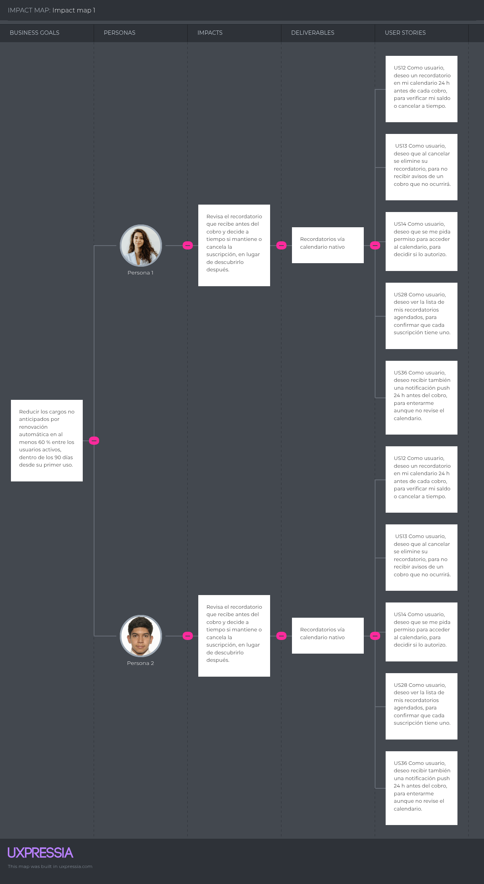

<!-- pdf:omit-start -->

*Figura 12. Impact Map del Business Goal 01.*

<!-- pdf:omit-end -->

*Fuente: elaboración del equipo Gastify.*

La tabla 80 presenta Business Goal 01: anticipación del cobro.

*Tabla 80. Business Goal 01: anticipación del cobro.*

| User Story | Enunciado |
|:----------:|:----------|
| US12 | Como usuario, deseo que CraveWallet agende un recordatorio en mi calendario nativo 24 horas antes de cada cobro de una suscripción activa, para tener tiempo de verificar mi saldo o cancelarla antes de que se renueve. |
| US13 | Como usuario, deseo que al cancelar una suscripción se elimine también su recordatorio en el calendario, para no recibir avisos de un cobro que ya no va a ocurrir. |
| US14 | Como usuario, deseo que la aplicación me pida permiso para acceder a mi calendario la primera vez que lo necesite, para entender por qué lo solicita y decidir si lo autorizo. |
| US28 | Como usuario, deseo ver dentro de CraveWallet la lista de los recordatorios que se agendaron en mi calendario, para confirmar que todas mis suscripciones activas tienen uno programado. |
| US36 | Como usuario, deseo recibir una notificación push de CraveWallet 24 horas antes de un cobro, además del evento agendado en mi calendario, para enterarme del aviso aunque no revise mi calendario ese día. |

*Fuente: elaboración del equipo Gastify.*

#### Business Goal 02: retención por uso del Dashboard

El segundo mapa sostiene la hipótesis de que un usuario vuelve a la aplicación si el Dashboard le ahorra el trabajo mental de sumar su portafolio de suscripciones. De ambas personas se espera que consulten el Dashboard con regularidad en lugar de llevar la cuenta mentalmente o revisando el banco (Dashboard unificado, con las historias de ver el total en soles, agrupar por categoría, ordenar por próxima renovación, buscar y ver el ahorro de una cancelación a tiempo); y que registren cada suscripción nueva apenas la contratan, en lugar de dejarla fuera del control (alta de suscripciones, con el catálogo precargado, el registro personalizado y la previsualización del monto en soles).

La figura 13 relaciona el objetivo de retención con los actores, los cambios de comportamiento y las historias propuestas.

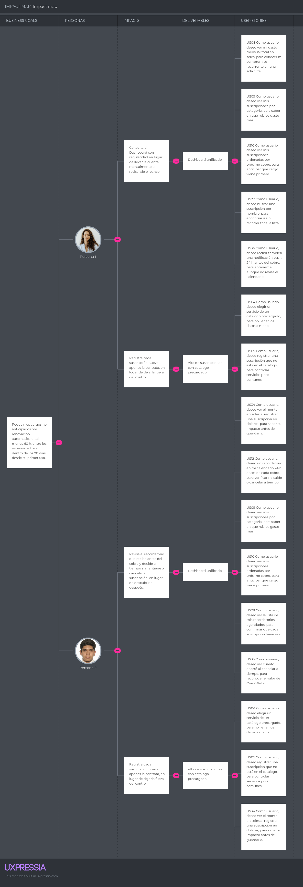

<!-- pdf:omit-start -->

*Figura 13. Impact Map del Business Goal 02.*

<!-- pdf:omit-end -->

*Fuente: elaboración del equipo Gastify.*

La tabla 81 presenta Business Goal 02: retención por uso del Dashboard.

*Tabla 81. Business Goal 02: retención por uso del Dashboard.*

| User Story | Enunciado |
|:----------:|:----------|
| US08 | Como usuario, deseo ver en el Dashboard el monto total que gasto al mes en suscripciones activas, ya convertido a soles, para conocer mi compromiso financiero recurrente en una sola cifra. |
| US09 | Como usuario, deseo ver mis suscripciones activas agrupadas por categoría (streaming, educación, fitness, delivery, cloud), para entender en qué rubros concentro mi gasto recurrente. |
| US10 | Como usuario, deseo ver mis suscripciones activas ordenadas de la más próxima a la más lejana a cobrarse, para anticipar qué cargo viene primero. |
| US27 | Como usuario con muchas suscripciones registradas, deseo buscar una por su nombre en el Dashboard, para encontrarla rápido sin recorrer toda la lista. |
| US35 | Como usuario, deseo ver cuánto me ahorré al cancelar una suscripción antes de que se renovara, para reconocer el valor de usar CraveWallet a tiempo. |
| US04 | Como usuario, deseo elegir un servicio de un catálogo con los nombres, logos y monedas de facturación de las suscripciones más frecuentes de mi segmento, para no tener que llenar esos datos a mano. |
| US05 | Como usuario, deseo registrar manualmente una suscripción que no está en el catálogo precargado, para llevar el control de servicios menos comunes (como una membresía física o una herramienta cloud específica). |
| US34 | Como usuario, deseo ver una previsualización del monto en soles mientras registro una suscripción en dólares, para saber de antemano cuánto representará en mi presupuesto antes de guardarla. |

*Fuente: elaboración del equipo Gastify.*

#### Business Goal 03: conversión a Premium

El tercer mapa se concentra en los usuarios de mayor compromiso, con 6 o más suscripciones registradas. De ambas personas se espera que perciban el límite del plan gratuito y decidan pagar por eliminarlo, en vez de abandonar el registro de sus suscripciones adicionales (plan Premium, con las historias de conocer el precio, suscribirse vía Stripe, ver el historial de pagos y ver cuánto falta para el límite gratuito).

La figura 14 relaciona el objetivo de conversión a Premium con los actores, los cambios de comportamiento y las historias propuestas.

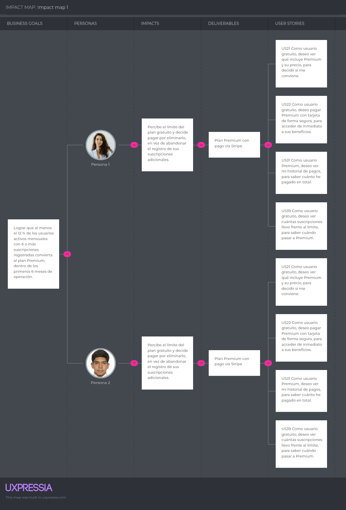

<!-- pdf:omit-start -->

*Figura 14. Impact Map del Business Goal 03.*

<!-- pdf:omit-end -->

*Fuente: elaboración del equipo Gastify.*

La tabla 82 presenta Business Goal 03: conversión a Premium.

*Tabla 82. Business Goal 03: conversión a Premium.*

| User Story | Enunciado |
|:----------:|:----------|
| US21 | Como usuario del plan gratuito, deseo ver qué incluye el plan Premium y su precio mensual, para decidir si me conviene suscribirme. |
| US22 | Como usuario del plan gratuito, deseo pagar el plan Premium con mi tarjeta a través de un flujo seguro, para acceder de inmediato a sus beneficios. |
| US31 | Como usuario Premium, deseo ver el historial de los pagos mensuales que hice por la suscripción, para tener un registro de cuánto he pagado en total. |
| US39 | Como usuario del plan gratuito, deseo ver cuántas suscripciones llevo registradas frente al límite del plan gratuito, para saber cuándo me conviene pasar a Premium. |

*Fuente: elaboración del equipo Gastify.*

#### Business Goal 04: recomendación del producto

El cuarto mapa depende de que ambas personas perciban que CraveWallet resuelve mejor que la competencia (2.1) su problema principal. Se espera que un visitante entienda la propuesta de valor antes de descargar la aplicación (landing page, con las historias de ver la propuesta de valor, comparar planes y consultar preguntas frecuentes), y que un usuario activo experimente en conjunto el Dashboard, la conversión de divisas y los recordatorios como una solución coherente que lo lleve a recomendarla.

La figura 15 relaciona el objetivo de recomendación del producto con los actores, los cambios de comportamiento y las historias propuestas.

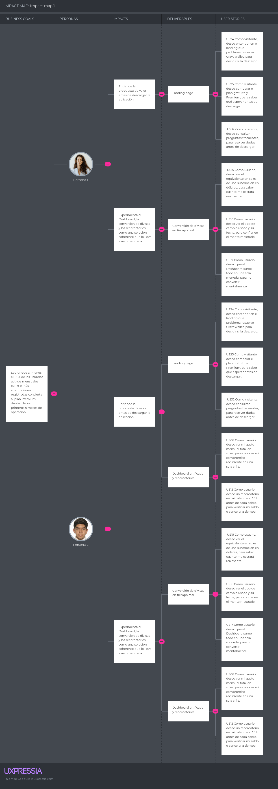

<!-- pdf:omit-start -->

*Figura 15. Impact Map del Business Goal 04.*

<!-- pdf:omit-end -->

*Fuente: elaboración del equipo Gastify.*

La tabla 83 presenta Business Goal 04: recomendación del producto.

*Tabla 83. Business Goal 04: recomendación del producto.*

| User Story | Enunciado |
|:----------:|:----------|
| US24 | Como visitante que todavía no tiene cuenta, deseo entender en el landing page qué problema resuelve CraveWallet y cómo funciona, para decidir si quiero descargarla. |
| US25 | Como visitante, deseo ver una comparación clara entre el plan gratuito y el plan Premium en el landing page, para saber qué esperar antes de descargar la aplicación. |
| US32 | Como visitante, deseo consultar una sección de preguntas frecuentes en el landing page, para resolver dudas comunes (seguridad, moneda, costo de Premium) antes de descargar la aplicación. |
| US15 | Como usuario, deseo ver junto al monto original en dólares de una suscripción su equivalente en soles, calculado con el tipo de cambio del día, para saber cuánto me costará realmente antes de que se cobre. |
| US16 | Como usuario, deseo ver qué tipo de cambio usó CraveWallet para convertir mis suscripciones en dólares y cuándo se actualizó, para confiar en que el monto mostrado es razonable. |
| US17 | Como usuario, deseo que el total del Dashboard sume todas mis suscripciones en una sola moneda, sin importar en qué divisa se facture cada una, para no tener que hacer yo mismo la conversión mental. |
| US08 | Como usuario, deseo ver en el Dashboard el monto total que gasto al mes en suscripciones activas, ya convertido a soles, para conocer mi compromiso financiero recurrente en una sola cifra. |
| US12 | Como usuario, deseo que CraveWallet agende un recordatorio en mi calendario nativo 24 horas antes de cada cobro de una suscripción activa, para tener tiempo de verificar mi saldo o cancelarla antes de que se renueve. |

*Fuente: elaboración del equipo Gastify.*

### 2.4.3. Product Backlog

El backlog consolida las 40 User Stories, las 6 Technical Stories y las 6 Spike Stories de la especificación, estimadas en Story Points con la escala 1, 2, 3 y 5 (ninguna historia supera los 5 puntos: los spikes que hubieran pesado 8 se dividieron en un spike de investigación y uno de prototipo) y ordenadas por el valor que aportan al negocio, no por tipo de historia. El orden sigue el Impact Map: primero lo que un visitante necesita para decidir descargar la aplicación (landing page, que el enunciado exige desde el primer sprint) junto con los tres spikes de investigación, que no dependen de ningún sprint de construcción y por eso se adelantan; luego la autenticación, junto con el alta de suscripciones y el Dashboard que dependen de ella, porque sin cuenta no hay portafolio que mostrar; después los spikes de prototipo y las historias de conversión de divisas y recordatorios, que sostienen la hipótesis principal de anticipar el cobro; y al final el spike de Stripe, el delivery y el plan Premium, que extienden la propuesta sin ser indispensables para las primeras hipótesis. La autenticación no encabeza el backlog por sí sola: entra en el Sprint 2 como habilitadora del alta de suscripciones y el Dashboard, no como prioridad de seguridad aislada.

Los sprints corresponden a las entregas del curso: el Sprint 1 a TB1, el Sprint 2 a AV2 y los Sprints 3 y 4 a TB2. El Product Backlog se administra en Trello y mantiene una lista por sprint, con las historias ordenadas según la prioridad de esta tabla.

**Enlace al Product Backlog:** [CraveWallet – Product Backlog en Trello](https://trello.com/b/W0MvIjVH/cravewallet-product-backlog)

La captura del tablero y la distribución de las historias por sprint se presentan en el Anexo A.

La tabla 84 presenta product backlog.

*Tabla 84. Product Backlog.*

| # Orden | User Story Id | Título | Story Points (1 / 2 / 3 / 5) | Sprint |
| --- | --- | --- | --- | --- |
| 1 | SP01 | Investigar y documentar la integración con ExchangeRate-API | 3 | 1 |
| 2 | SP03 | Investigar las alternativas de integración con el calendario nativo | 3 | 1 |
| 3 | SP05 | Investigar el flujo de suscripción recurrente del SDK de Stripe | 3 | 1 |
| 4 | US24 | Ver la propuesta de valor de CraveWallet | 2 | 1 |
| 5 | US25 | Comparar el plan gratuito y el plan Premium | 2 | 1 |
| 6 | US32 | Consultar preguntas frecuentes en el landing page | 2 | 1 |
| 7 | US40 | Dejar mi correo para recibir novedades del lanzamiento | 1 | 1 |
| 8 | TS01 | Servicio de autenticación y perfil | 5 | 2 |
| 9 | US01 | Registrarme con correo y contraseña | 3 | 2 |
| 10 | US02 | Iniciar sesión | 2 | 2 |
| 11 | US03 | Configurar mi moneda de referencia | 1 | 2 |
| 12 | US33 | Cerrar sesión | 1 | 2 |
| 13 | TS02 | Servicio de suscripciones | 5 | 2 |
| 14 | US04 | Registrar una suscripción desde el catálogo precargado | 3 | 2 |
| 15 | US05 | Registrar una suscripción personalizada | 3 | 2 |
| 16 | US06 | Editar una suscripción registrada | 2 | 2 |
| 17 | US07 | Cancelar una suscripción registrada | 2 | 2 |
| 18 | US26 | Ver el historial de suscripciones canceladas | 1 | 2 |
| 19 | US34 | Previsualizar el monto en soles antes de guardar una suscripción en dólares | 2 | 2 |
| 20 | US08 | Ver el total mensual de mis suscripciones activas en soles | 5 | 2 |
| 21 | US09 | Ver mis suscripciones agrupadas por categoría | 3 | 2 |
| 22 | US10 | Ver mis suscripciones ordenadas por próxima fecha de renovación | 2 | 2 |
| 23 | US11 | Ver el detalle de una suscripción desde el Dashboard | 2 | 2 |
| 24 | US27 | Buscar una suscripción por nombre en el Dashboard | 2 | 2 |
| 25 | US35 | Ver el ahorro estimado por cancelar una suscripción antes de su renovación | 3 | 2 |
| 26 | SP02 | Prototipar el consumo y caché de ExchangeRate-API | 5 | 3 |
| 27 | TS03 | Servicio de conversión de divisas | 5 | 3 |
| 28 | US15 | Ver el monto en soles de una suscripción facturada en dólares | 5 | 3 |
| 29 | US16 | Ver el tipo de cambio utilizado y su fecha de actualización | 2 | 3 |
| 30 | US17 | Ver mi portafolio completo unificado en soles | 3 | 3 |
| 31 | US29 | Ver el historial del tipo de cambio aplicado a una suscripción | 2 | 3 |
| 32 | US37 | Ver la variación del tipo de cambio respecto al cobro anterior | 2 | 3 |
| 33 | SP04 | Prototipar el agendado de eventos en el calendario nativo | 5 | 3 |
| 34 | TS04 | Servicio de recordatorios | 3 | 3 |
| 35 | US12 | Recibir un recordatorio 24 horas antes de un cobro automático | 5 | 3 |
| 36 | US13 | Que se elimine el recordatorio de una suscripción cancelada | 2 | 3 |
| 37 | US14 | Otorgar permiso de acceso al calendario | 3 | 3 |
| 38 | US28 | Ver la lista de mis próximos recordatorios agendados | 2 | 3 |
| 39 | US36 | Recibir una notificación push además del recordatorio de calendario | 3 | 3 |
| 40 | SP06 | Prototipar el pago recurrente con el SDK de Stripe | 5 | 4 |
| 41 | TS05 | Servicio de gastos de delivery | 3 | 4 |
| 42 | US18 | Registrar un pedido de delivery desde un catálogo de comercios frecuentes | 3 | 4 |
| 43 | US19 | Ver el total gastado en delivery en el mes | 2 | 4 |
| 44 | US20 | Ver la tendencia de mi gasto de delivery por semana | 3 | 4 |
| 45 | US30 | Editar o eliminar un gasto de delivery registrado por error | 2 | 4 |
| 46 | US38 | Definir un límite mensual de gasto en delivery y recibir aviso al acercarme | 3 | 4 |
| 47 | TS06 | Servicio de suscripción Premium y webhooks de Stripe | 5 | 4 |
| 48 | US21 | Ver la propuesta de valor y el precio de Premium | 2 | 4 |
| 49 | US22 | Suscribirme al plan Premium | 5 | 4 |
| 50 | US23 | Cancelar mi suscripción Premium | 2 | 4 |
| 51 | US31 | Ver mi historial de pagos Premium | 1 | 4 |
| 52 | US39 | Ver cuántas suscripciones puedo registrar en el plan gratuito | 2 | 4 |

*Fuente: elaboración del equipo Gastify.*

El total es de 148 Story Points: 16 en el Sprint 1, 47 en el Sprint 2, 47 en el Sprint 3 y 38 en el Sprint 4. Los spikes de investigación (SP01, SP03, SP05) abren el Sprint 1 junto al landing page porque no dependen de ningún sprint de construcción; sus spikes de prototipo correspondientes (SP02, SP04, SP06) se ubican al inicio del sprint donde se implementa la funcionalidad que investigan, para que sus hallazgos lleguen frescos a esa construcción. El Sprint 2 y el Sprint 3 concentran la mayor carga porque en ellos se construye, respectivamente, el núcleo de valor (autenticación, alta de suscripciones y Dashboard) y la hipótesis principal del producto (conversión de divisas y recordatorios anticipados).

El backlog se administra en la herramienta que indique el docente, donde cada historia se registra como tarjeta con su código, título, puntos y sprint, en el mismo orden de esta tabla.

## 2.5. Strategic-Level Domain-Driven Design

El diseño estratégico de Domain-Driven Design [@evans2003ddd] organiza las responsabilidades de CraveWallet a partir de las reglas del negocio. La gestión de las suscripciones que el usuario paga a terceros y la facturación del plan Premium de CraveWallet representan compromisos distintos. Por ello, se proponen fronteras separadas para conservar sus reglas y estados sin mezclar ambos ciclos de vida. El análisis competitivo de la sección 2.1.1 compara funciones públicas de los productos; no permite determinar cómo están modelados internamente.

El trabajo parte del Big Picture EventStorming y del Ubiquitous Language del Needfinding (secciones 2.3.5 y 2.3.6), que describen cómo un usuario administra sus compromisos recurrentes hoy, sin CraveWallet. El segundo ejercicio de EventStorming cambia de propósito: diseña el proceso de la solución e incorpora los comandos, las políticas, los agregados y las vistas de lectura necesarios para registrar una suscripción, verla en el Dashboard, recibir un recordatorio con 24 horas de anticipación y, si corresponde, pasar a Premium. Las historias individuales de la sección 2.4 aún deben contrastarse con este modelo.

De ese segundo EventStorming surgen Bounded Contexts candidatos mediante dos técnicas complementarias: *start-with-value*, que delimita el subconjunto del dominio del que depende la ventaja competitiva de CraveWallet (anticipar el cobro y mantener el portafolio expresado en soles), y *look-for-pivotal-events*, que toma los cambios de estado significativos del ciclo —una suscripción queda registrada, se programa una alerta, una cuenta pasa a Premium— como señales de frontera. El contexto core se separa de los subdominios de apoyo y genéricos; las relaciones y patrones de Context Mapping se detallarán en 2.5.2. Las respuestas de Stripe y ExchangeRate-API deberán pasar por una capa de traducción, conforme a la Estrategia 4 de 2.1.2.

La arquitectura de software que cierra la sección se representará con el C4 Model, en sus niveles de contexto, contenedores y despliegue.

<!-- pdf:omit-start -->

Los [diagramas editables y las instrucciones de edición](diagrams/chapter_2/README.md) acompañan a las imágenes del informe. Las vistas C4 cuentan además con un [modelo de Structurizr DSL](diagrams/chapter_2/workspace.dsl).

<!-- pdf:omit-end -->

### 2.5.1. EventStorming

La leyenda empleada en los flujos To-Be distingue actor (amarillo), comando (celeste), evento confirmado (naranja), política (violeta), vista (verde), sistema externo o de infraestructura (rosado), problema (rojo) y contexto (blanco). En el Big Picture As-Is el azul se reservó para los sistemas actuales; al pasar al diseño de la solución se utiliza esta leyenda específica para no mezclar ambas lecturas.

La figura 16 define la convención de colores utilizada para interpretar el EventStorming de la solución.

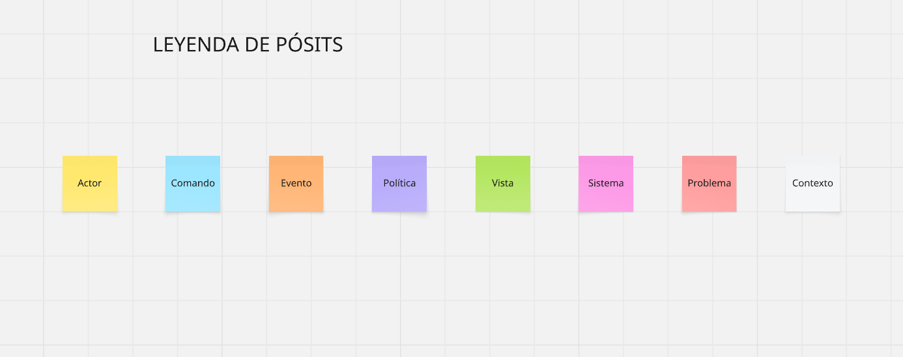

<!-- pdf:omit-start -->

*Figura 16. Leyenda de pósits del EventStorming To-Be.*

<!-- pdf:omit-end -->

*Fuente: elaboración del equipo Gastify.*

*Nota: convención de colores utilizada en los flujos y canvases de la solución.*

#### 2.5.1.1. Candidate Context Discovery

El segundo EventStorming modela el proceso **To-Be**: las acciones que el usuario iniciaría en CraveWallet y los cambios de estado que la aplicación tendría que conservar. Se partió del valor que distingue al producto —anticipar una renovación y comprender su efecto en el presupuesto— y se localizaron eventos que cambian el significado de la información: *suscripción registrada*, *alarma local programada*, *gasto registrado*, *límite mensual superado* y *plan Premium activado*. Estos eventos ayudan a proponer fronteras sin confundir las pantallas con los límites del dominio. En el tablero, los dos recorridos principales aparecen bajo los rótulos «suscripciones y avisos» y «gastos y presupuesto».

La figura 17 representa los recorridos propuestos para registrar suscripciones y gastos.

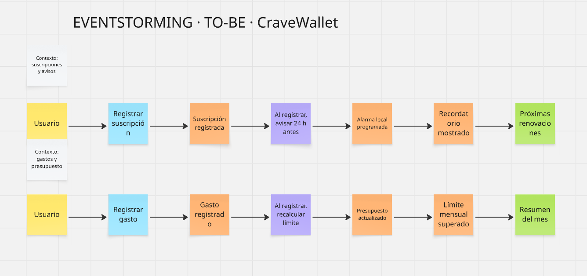

<!-- pdf:omit-start -->

*Figura 17. EventStorming To-Be: flujos principales de suscripciones y gastos.*

<!-- pdf:omit-end -->

*Fuente: elaboración del equipo Gastify.*

*Nota: dos recorridos de valor que permiten descubrir los contextos candidatos Suscripciones y Gastos.*

La tabla 85 presenta candidate context discovery.

*Tabla 85. Candidate Context Discovery.*

| Contexto candidato | Responsabilidad y eventos propios | Tipo de subdominio |
| --- | --- | --- |
| **Suscripciones** | Mantener el ciclo de vida, la fecha de renovación, el importe y la moneda de cada suscripción; emitir *Suscripción registrada* y coordinar *Alarma local programada*. | Core: concentra la anticipación del cobro. |
| **Gastos** | Registrar pedidos de delivery, clasificarlos y contrastar el acumulado del mes con un límite; emitir *Gasto registrado* y *Límite mensual superado*. | Apoyo: conecta el consumo cotidiano con el presupuesto. |
| **Premium** | Conservar el nivel de acceso y aplicar los límites del plan gratuito tras el resultado de una operación de prueba; emitir *Plan Premium activado* solo cuando el pago de prueba haya sido aprobado. | Genérico: habilita funciones, pero no define el ciclo de una suscripción externa. |

*Fuente: elaboración del equipo Gastify.*

La autenticación por el backend RESTful, las notificaciones locales, el calendario del dispositivo y el almacenamiento local son capacidades que colaboran con estos contextos; no se representan como si fueran eventos de negocio. ExchangeRate-API, Google Places API y Stripe permanecen como dependencias externas. Su integración debe traducir las respuestas técnicas a conceptos propios del dominio antes de afectar una suscripción, un gasto o un nivel de acceso. Las fronteras propuestas son candidatas y se revisarán cuando el equipo detalle las historias de usuario y sus reglas.

#### 2.5.1.2. Domain Message Flows Modeling

Se modelan escenarios de CraveWallet indicando quién envía cada mensaje, quién lo recibe, su orden y sus datos relevantes. La notación adapta Domain Message Flow Modelling de DDD Crew [@dddcrewMessageFlows] mediante secuencias por escenario. Cada flecha indica orden, tipo, nombre y datos del mensaje. Las respuestas se dibujan de manera explícita; los subpasos a/b/c separan los intercambios de una misma operación. **C** identifica una orden que puede rechazarse; **Q**, una consulta; **R**, su respuesta; **E**, un hecho confirmado. Un evento interno no implica que exista un bus de mensajes: los contextos pueden implementarse como módulos del mismo backend.

##### Escenario A. Registrar una suscripción y preparar el recordatorio

La tabla 86 ordena los mensajes del alta, la comprobación del plan y la preparación del recordatorio en el dispositivo.

*Tabla 86. Escenario A. Registrar una suscripción y preparar el recordatorio.*

| Orden y tipo | Emisor → receptor | Mensaje y datos relevantes |
| --- | --- | --- |
| 1 — C | Aplicación móvil → Subscription Management | `RegisterSubscription`: identidad del usuario obtenida de la autenticación, nombre, importe, moneda, categoría, periodicidad y próxima fecha de renovación. |
| 2 — Q | Subscription Management → Premium & Billing | `GetPlanAccess(userId)`: consultar nivel de acceso y límite vigente. |
| 3 — R | Premium & Billing → Subscription Management | `PlanAccess`: nivel Free/Premium, límite y vigencia. El caso de uso compara ese límite con el número de registros activos; si lo alcanza, rechaza el alta según US39. |
| 4 — E | Subscription → manejadores del mismo contexto | `SubscriptionRegistered(subscriptionId, userId, nextBillingDate)`, después de persistir el registro válido. |
| 5 — R | Subscription Management → aplicación móvil | Registro confirmado y datos para preparar el aviso. Esto no significa que el calendario haya aceptado el recordatorio. |
| 6 — C | Aplicación móvil → calendario del dispositivo | Crear recordatorio con identificador del registro, título y fecha/hora calculada 24 horas antes, previa autorización del usuario. |
| 7 — R | Calendario del dispositivo → aplicación móvil | Identificador del evento creado o error/permiso denegado. La interfaz muestra el resultado real. |

*Fuente: modelado propuesto de Gastify, adaptado de DDD Crew [@dddcrewMessageFlows].*

La conversión se solicita al consultar el portafolio o previsualizar un importe según US34: Subscription Management pide USD/PEN al adaptador, recibe la cotización y su fecha, y devuelve una estimación en soles. El registro conserva la moneda original; el tipo de cambio del banco no se conoce por esta consulta. Si falla el proveedor, se indica la antigüedad de la última cotización válida o que la estimación no está disponible. La hora, zona horaria y reprogramación se deben concretar en SP03–SP04. La figura 18 representa el alta y la preparación del aviso.

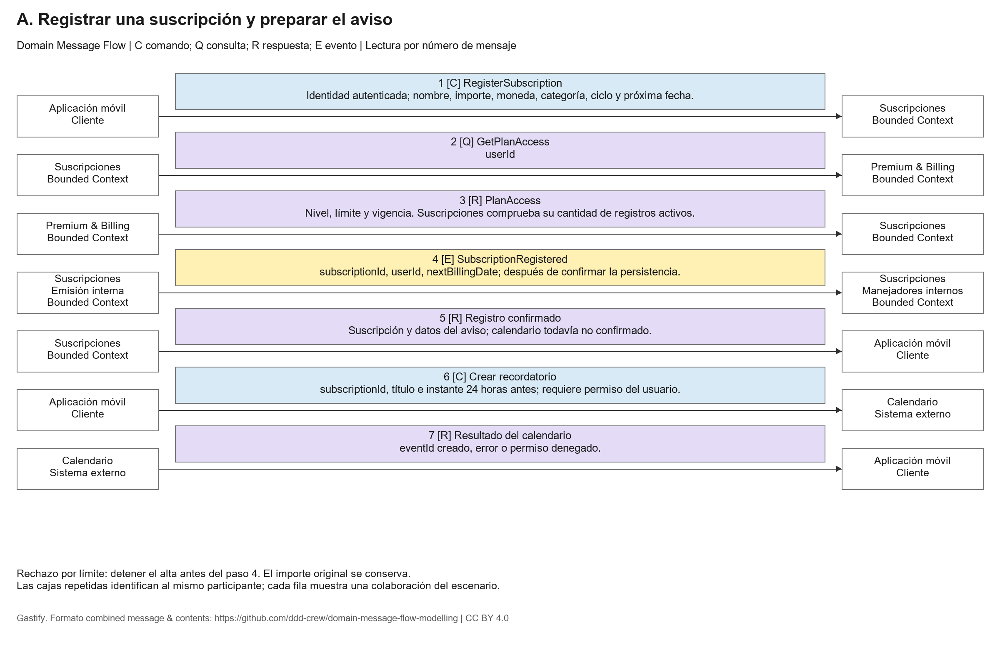

<!-- pdf:omit-start -->

*Figura 18. Registro de suscripción y preparación del recordatorio.*

<!-- pdf:omit-end -->

*Fuente: elaboración de Gastify; notación adaptada de DDD Crew, Domain Message Flow Modelling (s. f.), CC BY 4.0.*

##### Escenario B. Registrar un gasto y comparar el presupuesto

La tabla 87 describe cómo se registra un gasto, se actualiza el presupuesto de su período y se consulta el resultado.

*Tabla 87. Escenario B. Registrar un gasto y comparar el presupuesto.*

| Orden y tipo | Emisor → receptor | Mensaje y datos relevantes |
| --- | --- | --- |
| 1 — C | Aplicación móvil → Delivery Expense Management | `RegisterExpense`: identidad autenticada, identificador de solicitud, comercio, importe en PEN, categoría y fecha. El identificador permite reconocer un reintento del mismo registro. |
| 2 — E | DeliveryExpense → manejadores del mismo contexto | `DeliveryExpenseRegistered(expenseId, userId, amount, expenseDate)`, tras confirmar el gasto. |
| 3 — C interno | Caso de uso → MonthlyBudget | Aplicar el gasto al período de su fecha, una sola vez. La implementación debe elegir una actualización transaccional o un consumidor idempotente; no ejecutar ambas para sumar el mismo gasto. |
| 4 — E condicional | MonthlyBudget → manejadores del mismo contexto | `MonthlyLimitExceeded(budgetId, userId, period, limit, accumulated)` únicamente cuando el acumulado supera el límite definido. |
| 5 — Q | Aplicación móvil → Delivery Expense Management | Consultar resumen del usuario y período. |
| 6 — R | Delivery Expense Management → aplicación móvil | Total, límite, saldo disponible y condición de exceso. Sin límite configurado, mostrar total sin afirmar que se excedió un presupuesto. |

*Fuente: modelado propuesto de Gastify, adaptado de DDD Crew [@dddcrewMessageFlows].*

La búsqueda de comercios es una consulta auxiliar: el adaptador de Google Places devuelve sugerencias, y el usuario elige una o escribe un nombre (US18). No se emite «dirección validada» como prueba de que el pedido ocurrió. La figura 19 representa el registro del gasto y la consulta del resumen. `MonthlyBudget` es un agregado de Delivery Expense Management; su presencia en la secuencia no lo convierte en otro Bounded Context.

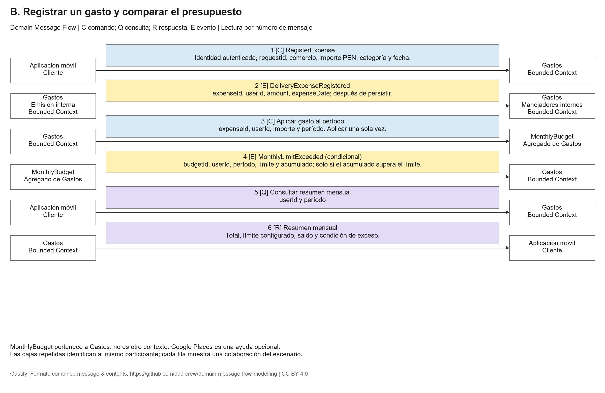

<!-- pdf:omit-start -->

*Figura 19. Registro de gasto de delivery y comparación del presupuesto.*

<!-- pdf:omit-end -->

*Fuente: elaboración de Gastify; notación adaptada de DDD Crew, Domain Message Flow Modelling (s. f.), CC BY 4.0.*

##### Escenario C. Activar o renovar Premium a partir de un pago confirmado

La tabla 88 distingue el inicio del checkout de la confirmación que habilita o renueva el acceso Premium.

*Tabla 88. Escenario C. Activar o renovar Premium a partir de un pago confirmado.*

| Orden y tipo | Emisor → receptor | Mensaje y datos relevantes |
| --- | --- | --- |
| 1 — C | Aplicación móvil → Premium & Billing | Iniciar checkout con identidad autenticada. El servidor selecciona el precio de su catálogo; el cliente no define el importe a cobrar. |
| 2 — C | Premium & Billing → Stripe | Crear sesión de suscripción y conservar la correlación entre usuario, cliente y operación. |
| 3a — R | Stripe → Premium & Billing | Sesión creada: `sessionId` y enlace de checkout. |
| 3b — R | Premium & Billing → aplicación móvil | Enlace de la sesión. El usuario completa el pago con Stripe; esta respuesta todavía no activa Premium. |
| 4 — E externo | Stripe → adaptador de Premium & Billing | `invoice.paid`: identificadores de evento, factura, cliente y suscripción. Verificar firma, correlación, entorno de prueba y estado vigente de la suscripción antes de actualizar acceso. |
| 5 — E interno | SubscriptionPlan → manejadores del mismo contexto | `PlanUpgradedToPremium(planId, userId, billingPeriod)` cuando Free pasa a Premium. Una renovación actualiza la vigencia sin repetir esa transición. |
| 6a — Q | Aplicación móvil → Premium & Billing | Consultar acceso del usuario autenticado. |
| 6b — R | Premium & Billing → aplicación móvil | `PlanAccess`: nivel y vigencia confirmados. Mostrar pendiente mientras no exista confirmación válida. |

*Fuente: modelado propuesto de Gastify, adaptado de DDD Crew [@dddcrewMessageFlows].*

Stripe documenta la confirmación por webhook y el control del estado de la suscripción [@stripeSubscriptionWebhooks]. La recepción debe admitir reintentos y notificaciones fuera de orden [@stripeWebhooks]. El registro único del identificador externo impide aplicar dos veces el mismo evento. SP05–SP06 deben validar el flujo; el informe no acredita pagos ni integración ejecutados. La figura 20 separa la respuesta de Stripe al backend de la respuesta del backend al cliente.

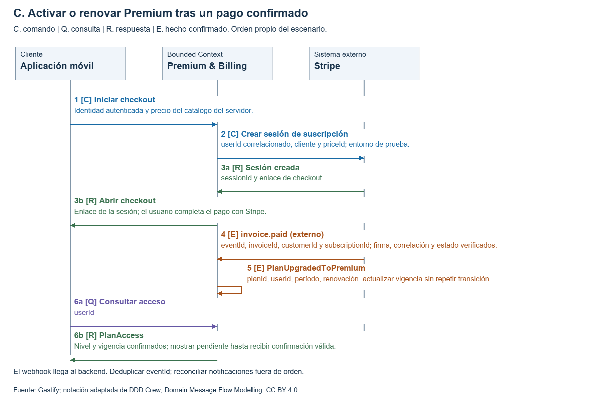

<!-- pdf:omit-start -->

*Figura 20. Activación o renovación del plan Premium.*

<!-- pdf:omit-end -->

*Fuente: elaboración de Gastify; notación adaptada de DDD Crew, Domain Message Flow Modelling (s. f.), CC BY 4.0.*

##### Escenario D. Cancelar la renovación del plan de CraveWallet

La tabla 89 separa la solicitud de cancelación del fin efectivo del acceso pagado a CraveWallet.

*Tabla 89. Escenario D. Cancelar la renovación del plan de CraveWallet.*

| Orden y tipo | Emisor → receptor | Mensaje y datos relevantes |
| --- | --- | --- |
| 1 — C | Aplicación móvil → Premium & Billing | Solicitar cancelación de la renovación del plan propio. |
| 2a — C | Premium & Billing → Stripe | Solicitar cancelación al fin del período de la suscripción correlacionada (`cancel_at_period_end`). |
| 2b — R | Stripe → Premium & Billing | Confirmación y fecha de fin del período pagado. Premium sigue vigente hasta esa fecha. |
| 2c — R | Premium & Billing → aplicación móvil | Renovación cancelada y vigencia restante. Si el proveedor rechaza la solicitud, informar el error sin confirmar cancelación. |
| 3 — E externo | Stripe → adaptador de Premium & Billing | `customer.subscription.deleted` al finalizar la suscripción. Verificar firma y correlación, y reconciliar la vigencia. |
| 4 — E interno | SubscriptionPlan → manejadores del mismo contexto | `PlanDowngradedToFree(planId, userId)` tras finalizar el acceso Premium. |
| 5a — Q | Aplicación móvil → Premium & Billing | Consultar acceso del usuario autenticado. |
| 5b — R | Premium & Billing → aplicación móvil | `PlanAccess`: nivel Free y límite vigente. El tratamiento de registros que excedan el límite gratuito debe acordarse con el equipo. |

*Fuente: modelado propuesto de Gastify, adaptado de DDD Crew [@dddcrewMessageFlows].*

La figura 21 representa la cancelación. Entre la confirmación de la solicitud (2c) y la finalización (3) transcurre el período restante; el usuario conserva Premium durante ese intervalo. La cancelación del plan propio no altera las suscripciones que el usuario paga a terceros.

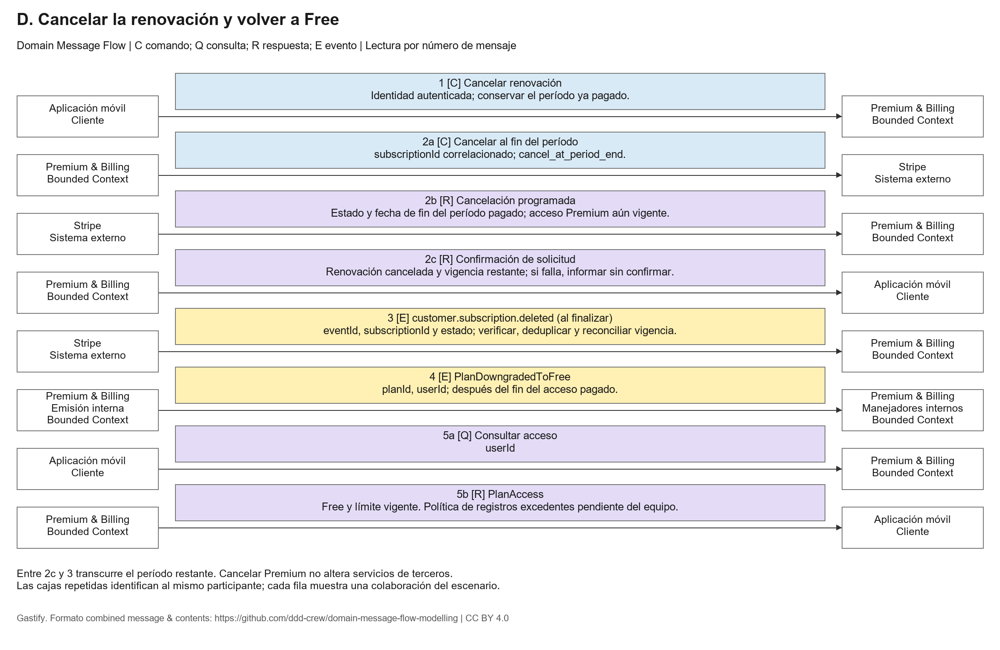

<!-- pdf:omit-start -->

*Figura 21. Cancelación de la renovación y retorno al plan Free.*

<!-- pdf:omit-end -->

*Fuente: elaboración de Gastify; notación adaptada de DDD Crew, Domain Message Flow Modelling (s. f.), CC BY 4.0.*

**Marcar una suscripción externa como cancelada:** la aplicación envía el comando a Subscription Management; `Subscription` confirma `SubscriptionCancelled`; el backend conserva el historial y devuelve el estado; el cliente solicita retirar el evento del calendario y verifica el resultado (US07, US13). Esto no comunica una cancelación a Netflix, un gimnasio u otro proveedor.

La autenticación es una capacidad técnica previa a los comandos del usuario. La lectura de caché local y la persistencia son operaciones de infraestructura, no contextos adicionales ni eventos de negocio. Los escenarios anteriores se trazan a US04–US07, US12–US13, US18–US20, US21–US23, US39 y TS05–TS06.

#### 2.5.1.3. Bounded Context Canvases

Cada canvas documenta el propósito y los límites de un contexto, sus colaboradores, mensajes, lenguaje y decisiones de negocio. Se adapta la estructura de DDD Crew [@dddcrewBoundedCanvas] a los tres contextos propuestos para CraveWallet. Las figuras 22–24 presentan un canvas individual por contexto y las tablas 90–92 desarrollan su contenido. Se conservan los campos del canvas v5: propósito, clasificación estratégica, roles, comunicación entrante y saliente, lenguaje, decisiones, supuestos, métricas y preguntas abiertas. La comunicación entrante agrupa colaboraciones iniciadas por otro participante; la saliente agrupa las iniciadas por el contexto. Cada consulta incluye su respuesta dentro de la misma colaboración. Los eventos internos se documentan en las decisiones de negocio. Son propuestas de diseño basadas en las historias de la sección 2.4 y en el diseño táctico de la sección 2.6, no resultados de una implementación validada.

##### Canvas 1. Subscription Management

La figura 22 reúne el propósito, los contratos y las decisiones del contexto que administra los registros de suscripciones y sus próximas renovaciones.

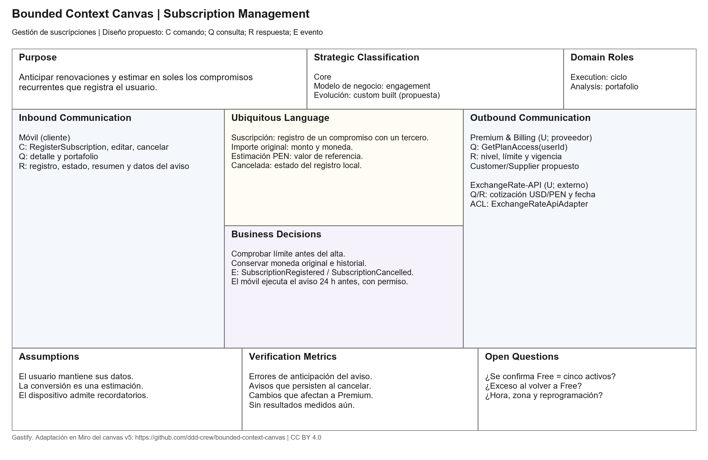

<!-- pdf:omit-start -->

*Figura 22. Bounded Context Canvas de Subscription Management.*

<!-- pdf:omit-end -->

*Fuente: elaboración de Gastify; adaptación del Bounded Context Canvas v5 de DDD Crew (s. f.), CC BY 4.0.*

La tabla 90 desarrolla el canvas de Subscription Management y su trazabilidad a las historias de suscripciones y recordatorios.

*Tabla 90. Canvas 1. Subscription Management.*

| Campo | Contenido |
| --- | --- |
| Nombre | **Subscription Management — Gestión de suscripciones.** |
| Propósito | Ayudar al usuario a conocer sus compromisos recurrentes, estimar su importe en soles y anticipar la próxima renovación. Administra los registros que el usuario crea en CraveWallet; marcar uno como cancelado no cancela el contrato con el proveedor. |
| Clasificación estratégica | **Core**, porque concentra la anticipación de renovaciones y el portafolio de suscripciones. Modelo de negocio: **engagement creator**. Evolución propuesta: **custom built**, solución propia adaptada al portafolio y anticipación de renovaciones del producto. Esta clasificación no equivale a afirmar que el dominio sea nuevo. |
| Roles del dominio | **Execution context:** gestionar el ciclo del registro. **Analysis context:** proporcionar el portafolio y estimaciones para planificar gastos. La ejecución del cobro externo queda fuera de su responsabilidad. |
| Comunicación entrante | **Aplicación móvil (cliente):** inicia comandos de registrar, editar y marcar una suscripción como cancelada, y consultas del portafolio y detalle. El contexto responde con registro confirmado, estado, resumen y datos del aviso. No hay otro contexto que envíe un evento de negocio a Suscripciones en los escenarios modelados. |
| Comunicación saliente | **Premium & Billing [U]:** Suscripciones inicia `GetPlanAccess(userId)` y recibe `PlanAccess` con nivel, límite y vigencia (Customer/Supplier propuesto). **ExchangeRate-API [U]:** inicia la consulta USD/PEN y recibe cotización y fecha traducidas mediante ACL. Las respuestas al móvil pertenecen a la colaboración entrante. `SubscriptionRegistered` y `SubscriptionCancelled` son eventos internos. |
| Colaboradores y relaciones | Premium & Billing suministra las reglas de acceso; ExchangeRate-API suministra cotizaciones mediante una capa anticorrupción; el cliente móvil utiliza el contrato de la aplicación para gestionar el calendario del dispositivo. La relación Customer/Supplier propuesta y sus contratos se detallan en 2.5.2. |
| Lenguaje ubicuo | **Suscripción:** registro de un compromiso recurrente con un tercero. **Importe original:** monto y moneda introducidos por el usuario. **Estimación en PEN:** conversión de referencia. **Próxima renovación:** fecha declarada del siguiente cargo. **Cancelada:** estado del registro dentro de CraveWallet. |
| Decisiones y reglas | El agregado `Subscription` conserva importe, moneda, periodicidad y fecha de renovación de un registro activo. El registro pertenece a un usuario. Una suscripción cancelada se excluye del portafolio activo y deja de generar recordatorios, conservando el historial. La anticipación propuesta es de 24 horas (US12); la programación efectiva depende del permiso del dispositivo. El límite gratuito se aplica según US39, con cinco registros activos como propuesta inicial de 2.1.1, pendiente de confirmación del equipo. |
| Supuestos | El usuario registra y actualiza los datos de sus servicios. La conversión ayuda a planificar, pero no determina el cargo del banco. El dispositivo permite programar el recordatorio cuando el usuario autoriza el acceso. Estos supuestos requieren pruebas de uso y de integración. |
| Métricas de verificación propuestas | Medir registros rechazados por datos inválidos, diferencias entre la fecha de renovación y el recordatorio programado, y recordatorios que quedan activos después de marcar una suscripción como cancelada. Revisar cuántos cambios en este contexto obligan a modificar Premium & Billing. No hay mediciones disponibles aún. |
| Preguntas abiertas | ¿Se confirma la propuesta inicial de cinco registros activos en Free? ¿Qué pasa con registros que exceden ese límite al volver de Premium a Free? ¿Qué hora y zona horaria se usarán si el usuario solo introduce una fecha? ¿Cómo se reprograma un recordatorio cuando cambia la fecha de renovación? |
| Trazabilidad | Historias US04–US07, US08–US13 y US39; diseño táctico 2.6.1. |

*Fuente: diseño propuesto de Gastify, adaptado de DDD Crew [@dddcrewBoundedCanvas].*

##### Canvas 2. Delivery Expense Management

La figura 23 delimita el registro de gastos y el presupuesto mensual; distingue la consulta opcional de comercios de los eventos internos del contexto.

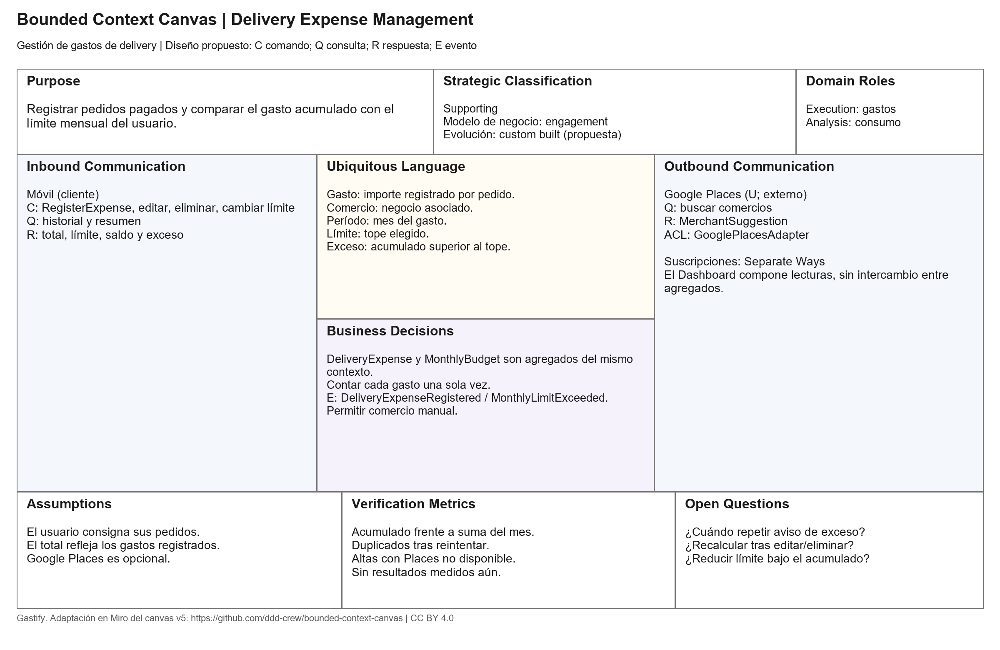

<!-- pdf:omit-start -->

*Figura 23. Bounded Context Canvas de Delivery Expense Management.*

<!-- pdf:omit-end -->

*Fuente: elaboración de Gastify; adaptación del Bounded Context Canvas v5 de DDD Crew (s. f.), CC BY 4.0.*

La tabla 91 desarrolla el canvas de Delivery Expense Management, incluidos el presupuesto mensual y la búsqueda opcional de comercios.

*Tabla 91. Canvas 2. Delivery Expense Management.*

| Campo | Contenido |
| --- | --- |
| Nombre | **Delivery Expense Management — Gestión de gastos de delivery.** |
| Propósito | Permitir al usuario registrar lo que gasta en pedidos de comida, consultar el total de un período y compararlo con su límite mensual. No toma pedidos, procesa pagos ni confirma entregas de los comercios. |
| Clasificación estratégica | **Supporting**, porque complementa la planificación de gastos sin definir el ciclo de vida de las suscripciones. Modelo de negocio: **engagement creator**. Evolución propuesta: **custom built**, solución propia para el seguimiento de delivery. |
| Roles del dominio | **Execution context:** registrar gastos y mantener el presupuesto mensual. **Analysis context:** producir resúmenes de consumo por período. |
| Comunicación entrante | **Aplicación móvil (cliente):** inicia comandos de registrar, editar o eliminar un gasto y actualizar el límite; consultas del historial y resumen mensual. El contexto responde con el resultado, el total, el límite y la condición de exceso. El importe y la fecha proceden del registro del usuario. |
| Comunicación saliente | **Google Places [U]:** Gastos inicia una búsqueda y recibe `MerchantSuggestion` traducida por su ACL; la integración es opcional. No se envían mensajes a los agregados de Suscripciones (Separate Ways). `DeliveryExpenseRegistered` y `MonthlyLimitExceeded` son eventos internos; las respuestas al móvil pertenecen a la colaboración entrante. |
| Colaboradores y relaciones | El cliente móvil introduce y consulta gastos. Google Places proporciona información auxiliar sobre comercios. El Dashboard combina los resúmenes de gastos y suscripciones, pero esto no exige compartir sus agregados. La ACL de Google Places y la separación de modelos entre Gastos y Suscripciones se detallan en 2.5.2. |
| Lenguaje ubicuo | **Gasto de delivery:** importe que el usuario registra por un pedido. **Comercio:** negocio asociado al gasto. **Período mensual:** mes al que se atribuye el gasto. **Límite mensual:** tope elegido por el usuario. **Acumulado:** suma de los gastos del período. **Exceso:** acumulado superior al límite. |
| Decisiones y reglas | `DeliveryExpense` conserva un gasto individual y `MonthlyBudget` mantiene el límite y acumulado de un usuario y período. El gasto se atribuye al mes de su fecha. Superar el límite produce una advertencia; no bloquea pedidos en servicios externos. US18 permite elegir un comercio del catálogo o escribirlo manualmente, de modo que Google Places no debe ser obligatorio para registrar el gasto. |
| Supuestos | El usuario consigna los gastos; no se cuenta con una importación automática de sus pedidos. El resumen corresponde a lo registrado, no necesariamente a todo el consumo real. La lectura local sin conexión es una propuesta técnica que requiere comprobar la sincronización. |
| Métricas de verificación propuestas | Comparar el acumulado mensual con la suma de gastos del mismo usuario y período; contar registros duplicados después de sincronizar y gastos que no se pueden registrar cuando falla la búsqueda de comercios. No hay mediciones disponibles aún. |
| Preguntas abiertas | ¿Qué actualización transaccional o consumidor idempotente recalcula el acumulado al corregir o eliminar un gasto según US30? ¿Cómo se evita duplicar un registro al recuperar la conexión? ¿Se advierte una sola vez al superar el límite o después de cada nuevo gasto? ¿Qué ocurre si se reduce el límite por debajo del acumulado? |
| Trazabilidad | Epic EP06, US18–US20, US30, US38 y TS05; diseño táctico 2.6.2. |

*Fuente: diseño propuesto de Gastify, adaptado de DDD Crew [@dddcrewBoundedCanvas].*

##### Canvas 3. Premium & Billing

La figura 24 concentra las reglas del plan propio de CraveWallet, las colaboraciones con Stripe y el contrato de acceso que consume Subscription Management.

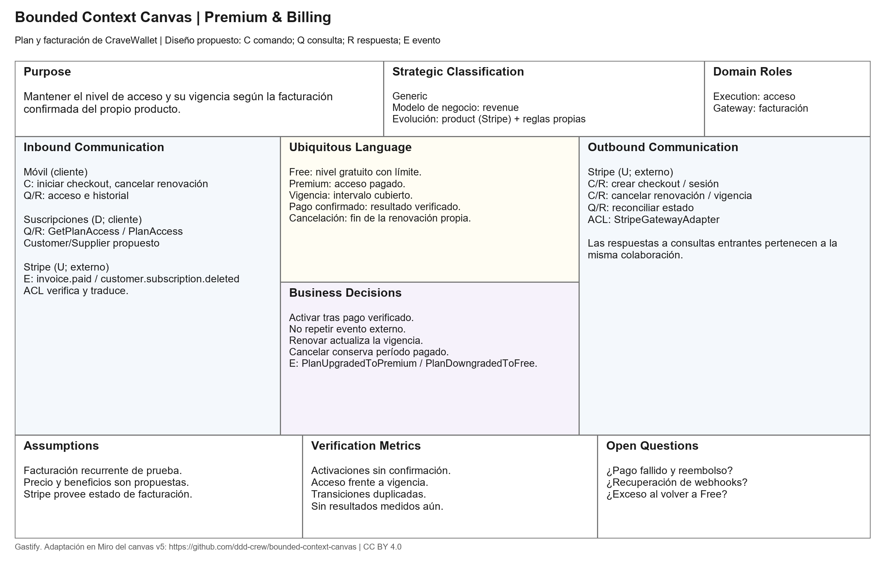

<!-- pdf:omit-start -->

*Figura 24. Bounded Context Canvas de Premium & Billing.*

<!-- pdf:omit-end -->

*Fuente: elaboración de Gastify; adaptación del Bounded Context Canvas v5 de DDD Crew (s. f.), CC BY 4.0.*

La tabla 92 desarrolla el canvas de Premium & Billing y las reglas de vigencia del plan propio de CraveWallet.

*Tabla 92. Canvas 3. Premium & Billing.*

| Campo | Contenido |
| --- | --- |
| Nombre | **Premium & Billing — Plan Premium y facturación de CraveWallet.** |
| Propósito | Mantener el nivel de acceso a CraveWallet y su vigencia a partir del resultado confirmado de la facturación del propio producto. El plan de CraveWallet es distinto de las suscripciones a servicios externos que registra Subscription Management. |
| Clasificación estratégica | **Generic**, porque la facturación y los niveles de acceso son capacidades comunes. Modelo de negocio: **revenue generator**. Evolución propuesta: **product** para el proveedor Stripe, integrado con las reglas propias de acceso; el módulo permanece en etapa de diseño. |
| Roles del dominio | **Execution context:** gestionar vigencia y nivel de acceso. **Gateway context:** interpretar y traducir el resultado externo de facturación al plan local. |
| Comunicación entrante | **Aplicación móvil (cliente):** inicia checkout, consultas de plan e historial y cancelación; recibe sesión, estado y confirmación de la solicitud. **Stripe [U]:** inicia notificaciones `invoice.paid` y `customer.subscription.deleted`, verificadas y traducidas por ACL. **Subscription Management [D/C]:** inicia `GetPlanAccess` y recibe `PlanAccess` (Customer/Supplier propuesto). |
| Comunicación saliente | **Stripe [U]:** Premium inicia creación de checkout, cancelación al fin del período y consultas para reconciliar estado; recibe sesión, vigencia y estado a través de `StripeGatewayAdapter`. Las respuestas al móvil y a Suscripciones pertenecen a colaboraciones entrantes. `PlanUpgradedToPremium` y `PlanDowngradedToFree` son eventos internos, conforme a 2.6.3. |
| Colaboradores y relaciones | Stripe suministra el resultado de facturación; una capa anticorrupción lo convierte al lenguaje del plan de CraveWallet. Subscription Management consume la información de acceso. El cliente móvil presenta el flujo de pago, pero su retorno a una pantalla no prueba que el pago esté confirmado. |
| Lenguaje ubicuo | **Plan Free:** nivel gratuito sujeto a un límite. **Plan Premium:** nivel con beneficios definidos. **Período de vigencia:** intervalo de acceso pagado. **Pago confirmado:** resultado verificado del proveedor. **Cancelación del plan:** fin de la renovación de CraveWallet; no cancela los servicios externos del usuario. |
| Decisiones y reglas | El agregado `SubscriptionPlan` mantiene el nivel Free/Premium y la vigencia. La confirmación verificada activa Premium; abrir checkout no lo activa. Procesar dos veces una misma confirmación no debe duplicar la transición. TS06 propone conservar el acceso hasta el fin del período pagado y volver a Free tras la notificación correspondiente. Las pruebas con Stripe deben identificarse como operaciones de prueba y no como ingresos reales. |
| Supuestos | El modelo propuesto utiliza facturación recurrente. El precio S/ 9.90 y los beneficios son propuestas comerciales pendientes de validación. SP05 investiga el flujo y SP06 debe comprobarlo mediante un prototipo; no se dispone aquí de resultados que acrediten su ejecución. |
| Métricas de verificación propuestas | Contar activaciones sin pago confirmado, discrepancias entre vigencia y acceso, y transiciones duplicadas al repetir una notificación de prueba. Registrar el tiempo entre confirmación y actualización del plan. No hay mediciones disponibles aún. |
| Preguntas abiertas | ¿Qué acceso se mantiene ante un pago fallido? ¿Cómo se recuperan notificaciones que no llegaron? ¿Cómo se administran reembolsos? ¿Qué ocurre con los registros existentes al volver a Free? ¿Cuál es la política comercial definitiva de precio y beneficios? |
| Trazabilidad | Epic EP07, US21–US23, US31, US39, TS06 y SP05–SP06; diseño táctico 2.6.3. |

*Fuente: diseño propuesto de Gastify, adaptado de DDD Crew [@dddcrewBoundedCanvas].*

Los límites permiten distinguir tres conceptos: un compromiso recurrente con un tercero, un gasto puntual de delivery y el acceso pagado a CraveWallet. Compartir el identificador del usuario o mostrar datos en el mismo Dashboard no basta para concluir que los contextos deban compartir el modelo. Las preguntas abiertas deben resolverse con el equipo y reflejarse después en las historias, los flujos y el Context Map.

### 2.5.2. Context Mapping

El Context Map propuesto identifica quién proporciona un modelo o contrato (**upstream, U**) y quién depende de él (**downstream, D**). Sus flechas representan influencia del modelo, no el sentido de cada petición HTTP. La selección se basa en las responsabilidades y mensajes de 2.5.1, siguiendo el material de DDD Crew [@dddcrewContextMapping]. Los tres contextos se proponen como módulos de un backend; no se presupone que existan tres equipos independientes.

La tabla 93 justifica cada relación del Context Map e identifica el contrato o adaptador que conserva la frontera entre modelos.

*Tabla 93. Context Mapping.*

| Relación propuesta | Patrón y justificación | Contrato o frontera |
| --- | --- | --- |
| Premium & Billing [U] → Subscription Management [D] | **Customer/Supplier** como acuerdo de diseño: las necesidades de registro y límites de Suscripciones deben formar parte de la planificación de Premium. Consumir un modelo sin posibilidad de negociación no basta para justificar este patrón. | `GetPlanAccess(userId)` devuelve nivel, límite y vigencia. En la relación, Premium ocupa U/S (proveedor) y Suscripciones D/C (cliente). Suscripciones cuenta sus registros activos y decide si admite el nuevo registro. |
| Subscription Management / Delivery Expense Management | **Separate Ways** para sus modelos de dominio: no se propone un flujo directo entre sus agregados. El cliente compone sus resúmenes en el Dashboard. | Cada módulo conserva su lenguaje y almacenamiento. El identificador del usuario sirve para correlacionar datos; no implica código o esquema compartido como Shared Kernel. |
| ExchangeRate-API [U] → Subscription Management [D] | **Anti-Corruption Layer (ACL):** `ExchangeRateApiAdapter` traduce la respuesta del proveedor a cotización, monedas y fecha de consulta del modelo local. | `ExchangeRatePort`; el precio en moneda original permanece intacto. La frecuencia y caché de TS03 son propuestas a comprobar en SP01–SP02. |
| Stripe [U] → Premium & Billing [D] | **ACL:** el adaptador verifica y traduce las notificaciones a cambios del plan local. Los eventos técnicos de Stripe se conservan en la frontera de integración. | `PaymentGatewayPort`, correlación de facturación y deduplicación del identificador externo. Eventos internos: `PlanUpgradedToPremium` y `PlanDowngradedToFree`. |
| Google Places [U] → Delivery Expense Management [D] | **ACL:** `GooglePlacesAdapter` convierte la respuesta en `MerchantSuggestion`. Se protege el vocabulario de gastos y se mantiene la opción manual. | Consulta auxiliar de comercio. El importe pagado procede del usuario, no de Places. La API elegida y su versión deben probarse antes de fijar el adaptador [@googlePlacesTextSearch]. |

*Fuente: elaboración del equipo Gastify.*

La figura 25 representa estas relaciones. Se eliminó la relación simultánea Partnership/Shared Kernel entre Suscripciones y Gastos porque compartir una pantalla o identificador no demuestra un modelo compartido ni entregas mutuamente dependientes. Si la implementación introduce esa dependencia, el equipo deberá justificar y actualizar el mapa.

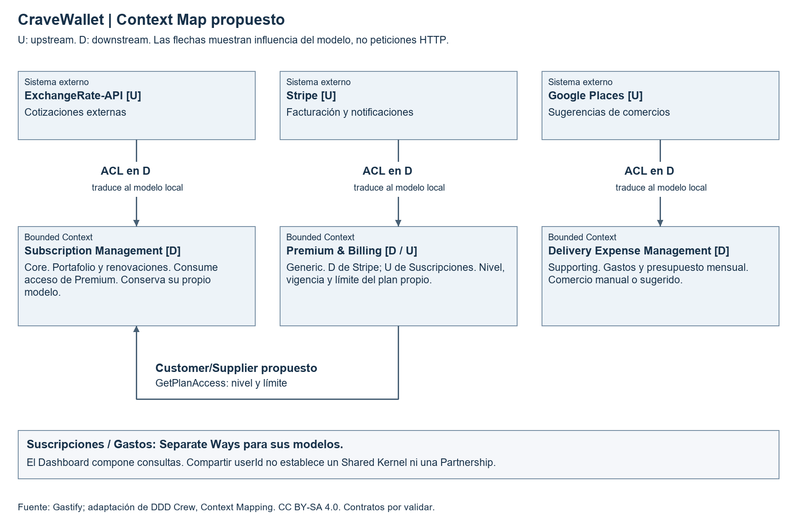

<!-- pdf:omit-start -->

*Figura 25. Context Map propuesto de CraveWallet.*

<!-- pdf:omit-end -->

*Fuente: elaboración de Gastify; notación adaptada de DDD Crew, Context Mapping (s. f.), CC BY 4.0.*

El calendario del dispositivo y la autenticación colaboran con los casos de uso, pero no se clasifican como nuevos Bounded Contexts de negocio en este avance. Las relaciones se comprobarán mediante cambios en los contratos y las pruebas de integración. La política de retorno a Free sigue pendiente de decisión del equipo.

### 2.5.3. Software Architecture

Se usa C4 para distinguir el sistema completo, sus contenedores y los componentes internos del backend [@c4ModelDiagrams]. Los diagramas representan una propuesta para implementar CraveWallet; no acreditan que el backend o su despliegue estén operativos.

#### 2.5.3.1. Software Architecture Context Level Diagrams

CraveWallet se representa como un sistema completo: incluye la experiencia móvil y el backend. Los usuarios pertenecen a los segmentos de estudiantes y profesionales jóvenes definidos en 1.3. El sistema consulta cotizaciones, prepara recordatorios en el calendario del dispositivo, recibe sugerencias de comercios y gestiona su plan propio con Stripe. Los pagos y cancelaciones de los servicios externos registrados por el usuario quedan fuera del alcance.

La figura 26 muestra una persona, CraveWallet como un único sistema y sus cuatro colaboradores externos. La solicitud a Stripe y las notificaciones de Stripe tienen flechas separadas. La vista omite tecnologías, almacenes y módulos internos para conservar el nivel de contexto.

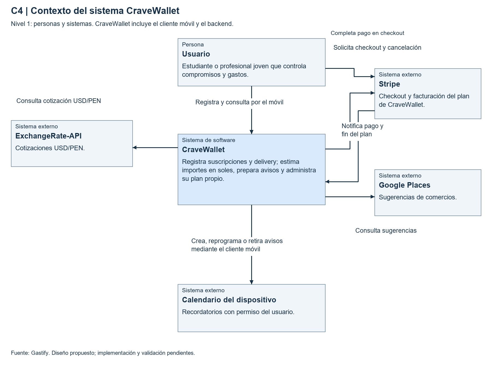

<!-- pdf:omit-start -->

*Figura 26. Diagrama de contexto del sistema CraveWallet.*

<!-- pdf:omit-end -->

*Fuente: elaboración del equipo Gastify. Propuesta de diseño.*

#### 2.5.3.2. Software Architecture Container Level Diagrams

La tabla 94 define los cuatro contenedores de la propuesta. Una frontera del sistema agrupa aplicaciones y almacenes; los tres contextos son módulos del backend y no se representan como microservicios independientes.

*Tabla 94. Software Architecture Container Level Diagrams.*

| Contenedor propuesto | Responsabilidad y colaboración |
| --- | --- |
| Mobile App — Flutter/Dart | Presentar los formularios y resúmenes, llamar al backend y solicitar permisos para gestionar el calendario. Compone el Dashboard a partir de consultas de Suscripciones y Gastos. |
| REST API Backend — Java 21/Spring Boot | Alojar los tres módulos de negocio, los casos de uso y sus adaptadores. La autenticación es una capacidad técnica compartida; no se convierte automáticamente en un cuarto contexto de negocio. |
| Local Database — SQLite | Caché de lectura en el dispositivo. La lectura sin red debe indicar la fecha de actualización. La escritura sin conexión y su sincronización requieren una decisión y pruebas; no se presentan como realizadas. |
| Remote Database — PostgreSQL | Persistir el estado canónico con tablas cuya responsabilidad pertenece a cada módulo. Compartir un motor no autoriza acceder directamente a los agregados de otro contexto. |

*Fuente: elaboración del equipo Gastify.*

ExchangeRate-API, Stripe y Google Places son sistemas externos al backend. Sus adaptadores traducen respuestas al modelo local. El calendario lo administra el cliente móvil; el backend solo entrega los datos necesarios. No se presupone infraestructura de notificaciones push adicional para explicar los avisos del calendario.

La figura 27 indica el propósito y la tecnología de cada relación: HTTPS/JSON entre móvil y backend, JPA/JDBC hacia PostgreSQL, API local hacia SQLite, APIs externas por HTTPS y webhook firmado de Stripe hacia el backend. El calendario recibe operaciones únicamente desde el móvil. Los datos de tarjeta se ingresan en el flujo de Stripe; el retorno al cliente no confirma el acceso Premium.

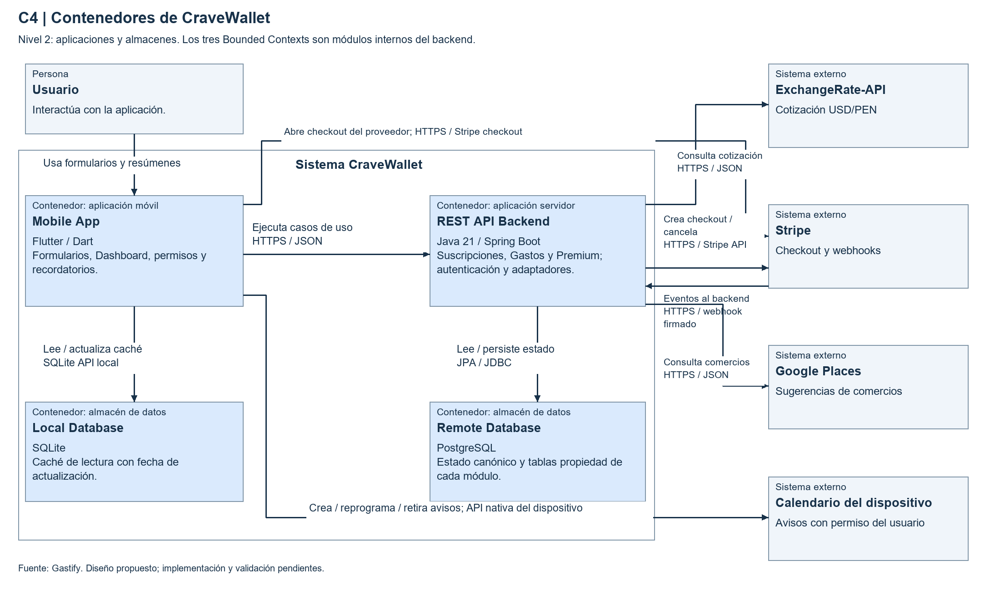

<!-- pdf:omit-start -->

*Figura 27. Diagrama de contenedores de CraveWallet.*

<!-- pdf:omit-end -->

*Fuente: elaboración del equipo Gastify. Propuesta de diseño.*

#### 2.5.3.3. Software Architecture Deployment Diagrams

El despliegue de la figura 28 es una opción de infraestructura: contenedor del backend en ECS/Fargate, base de datos PostgreSQL en RDS, entrada HTTPS y gestión de secretos. Su contratación, región, costos, cuotas y pipeline deberán decidirse y verificarse antes de implementar. No hay evidencia en este avance de un backend desplegado con esa configuración. La aplicación móvil se ejecutaría en el dispositivo y accedería al calendario mediante sus permisos.

La figura 28 presenta propuesta de despliegue de cravewallet.

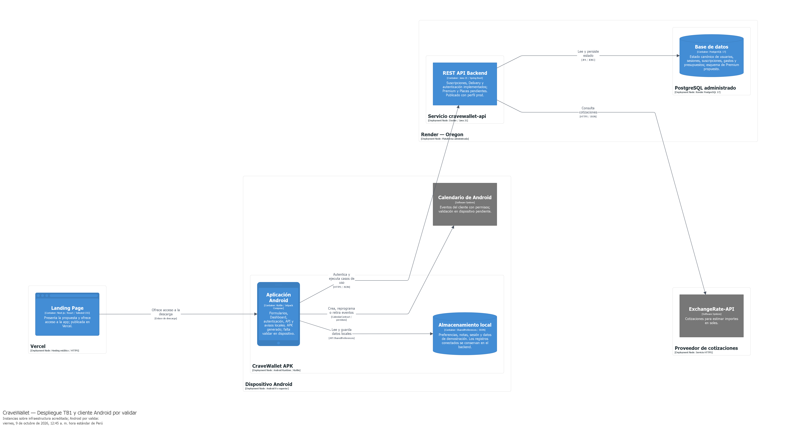

<!-- pdf:omit-start -->

*Figura 28. Propuesta de despliegue de CraveWallet.*

<!-- pdf:omit-end -->

*Fuente: elaboración del equipo Gastify. Propuesta de diseño.*

## 2.6. Tactical-Level Domain-Driven Design

Se detallan los tres contextos del mapa de 2.5.2. Cada módulo distingue Domain Layer, Interface Layer, Application Layer e Infrastructure Layer. Las reglas se expresan en lenguaje del proyecto y en contratos propuestos; los diagramas y nombres de clases orientan la implementación, pero no demuestran que exista código ejecutable. El dominio conserva sus invariantes y la aplicación coordina repositorios, transacciones e integraciones.

### 2.6.1. Bounded Context: Subscription Management

#### 2.6.1.1. Domain Layer

El agregado **`Subscription`** representa un registro del usuario, con identificador, nombre, importe original, moneda, categoría, estado y ciclo. `register`, `edit` y `cancel` deben comprobar propiedad y reglas antes de guardar. Un registro activo tiene una fecha de renovación válida e importe con moneda; el estado cancelado preserva el historial y excluye el registro del portafolio activo. La reactivación debe definirse explícitamente; no se interpreta como la contratación de un servicio externo.

La tabla 95 presenta domain layer.

*Tabla 95. Domain Layer.*

| Elemento | Responsabilidad o regla |
| --- | --- |
| `Money` | Importe no negativo y moneda PEN/USD. La conversión devuelve una estimación sin sobrescribir el importe original. |
| `SubscriptionName` | Nombre no vacío, con longitud máxima propuesta de 100 caracteres. |
| `BillingCycle` | Próxima fecha y periodicidad mensual/anual. La hora y zona horaria del aviso requieren definición; una fecha por sí sola no determina un instante 24 horas antes. |
| `ExchangeRate` | Cotización positiva, par de monedas y fecha de consulta. Indicar antigüedad cuando se use un valor previo por falla del proveedor. |
| `SubscriptionStatus` | ACTIVE / CANCELLED. Cancelled describe el registro local, no la cancelación del contrato con el proveedor. |
| `SubscriptionRegistered` | Hecho confirmado tras registrar y persistir la suscripción; datos: identificador, usuario y próxima renovación. |
| `SubscriptionCancelled` | Hecho confirmado tras cambiar el estado local; habilita la retirada del recordatorio. |
| `SubscriptionRepository` | Contrato de persistencia y consultas por identificador y propietario. |
| `ExchangeRatePort` / `PremiumStatusPort` | Contratos para consultar cotización y acceso al plan sin importar los SDK externos al modelo. |

*Fuente: elaboración del equipo Gastify.*

#### 2.6.1.2. Interface Layer

`SubscriptionController` traduce solicitudes autenticadas a comandos/consultas. La identidad se obtiene de la autenticación; enviar otro `userId` en el cuerpo no autoriza operar sobre otro usuario. La base propuesta es `/api/v1/subscriptions`.

La tabla 96 presenta interface layer.

*Tabla 96. Interface Layer.*

| Método y ruta relativa | Caso de uso | Historia |
| --- | --- | --- |
| POST `/` | Registrar una suscripción | US04, US05 |
| GET `/` | Consultar portafolio y resumen | US08–US10 |
| GET `/{id}` | Consultar detalle del propietario | US11 |
| PATCH `/{id}` | Editar importe, fecha o categoría | US06 |
| POST `/{id}/cancel` | Marcar el registro como cancelado | US07 |
| GET `/{id}/reminder` | Obtener datos para preparar el recordatorio | TS04, US12 |

*Fuente: elaboración del equipo Gastify.*

El request de alta contiene nombre, importe, moneda, categoría, fecha y periodicidad. La respuesta distingue importe original, estimación PEN, fecha de actualización y estado. Los identificadores de evento del calendario pertenecen al cliente y no son prueba de pago.

#### 2.6.1.3. Application Layer

`SubscriptionApplicationService` consulta el acceso mediante `PremiumStatusPort`, cuenta los registros activos del usuario y admite o rechaza el alta conforme a US39. Coordina la construcción y persistencia del agregado, y publica eventos después de confirmar la transacción. Las consultas de portafolio solicitan la cotización a través del puerto y componen el resumen sin modificar el registro original. Al editar una fecha o cancelar un registro, la respuesta permite al cliente reprogramar o retirar su recordatorio y mostrar cualquier falla de permisos.

#### 2.6.1.4. Infrastructure Layer

`JpaSubscriptionRepository` traduce entre el agregado y las tablas. `ExchangeRateApiAdapter` consume el proveedor a través de `ExchangeRatePort` y traduce su respuesta [@exchangeRatePair]. La caché de 24 horas de TS03 es una propuesta a comprobar con SP01–SP02. Si no hay cotización válida ni valor previo, se muestra el importe original y la conversión como no disponible; no se inventa un valor. El manejador de `SubscriptionRegistered` prepara datos de aviso; el calendario se ejecuta en el dispositivo, previa autorización.

#### 2.6.1.5. Bounded Context Software Architecture Component Level Diagrams

La figura 29 presenta componentes de subscription management.

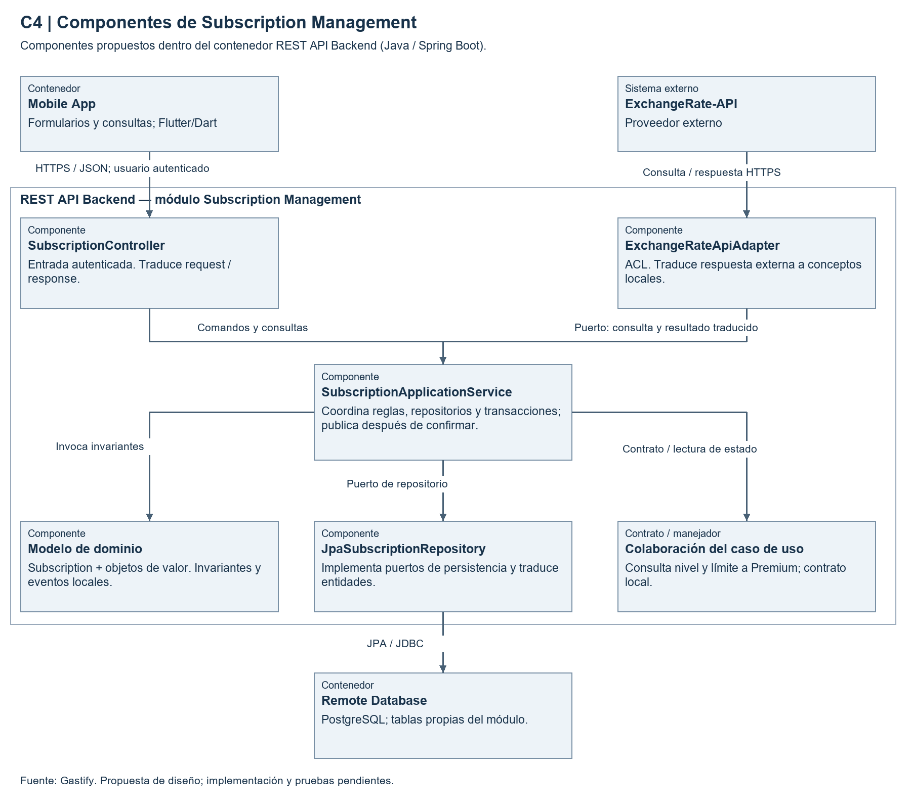

<!-- pdf:omit-start -->

*Figura 29. Componentes de Subscription Management.*

<!-- pdf:omit-end -->

*Fuente: elaboración del equipo Gastify. Propuesta de diseño.*

#### 2.6.1.6. Bounded Context Software Architecture Code Level Diagrams

##### 2.6.1.6.1. Bounded Context Domain Layer Class Diagrams

El diagrama conserva el agregado, sus objetos de valor, eventos y puertos. Las dependencias del dominio no incluyen HTTP, JPA ni clases del SDK externo. `PremiumStatusPort` es un contrato adicional de consulta de la aplicación; no convierte `UserId` en un Shared Kernel.

La figura 30 presenta clases de dominio de subscription management.

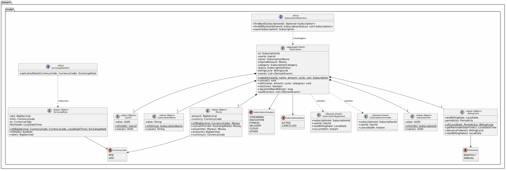

<!-- pdf:omit-start -->

*Figura 30. Clases de dominio de Subscription Management.*

<!-- pdf:omit-end -->

*Fuente: elaboración del equipo Gastify. Propuesta de diseño.*

##### 2.6.1.6.2. Bounded Context Database Design Diagram

La persistencia propuesta separa registros, historial declarado y caché de cotizaciones. El historial solo almacena cobros que el usuario consigna o confirma; una fecha programada no acredita un pago. `user_id` identifica al propietario, pero no representa una relación entre agregados de Suscripciones, Gastos y Premium. Las restricciones físicas y el esquema de autenticación se concretarán al implementar.

La figura 31 presenta persistencia propuesta de subscription management.

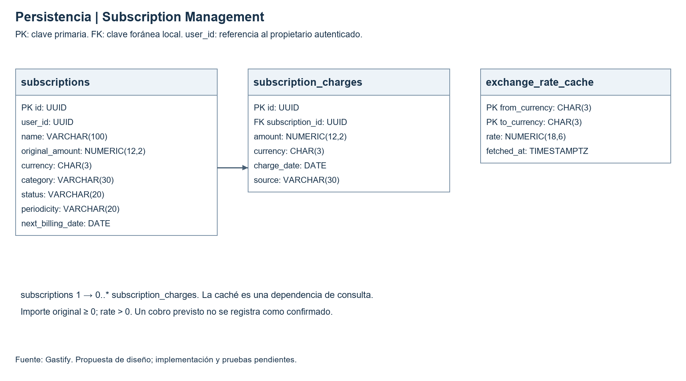

<!-- pdf:omit-start -->

*Figura 31. Persistencia propuesta de Subscription Management.*

<!-- pdf:omit-end -->

*Fuente: elaboración del equipo Gastify. Propuesta de diseño.*

### 2.6.2. Bounded Context: Delivery Expense Management

#### 2.6.2.1. Domain Layer

**`DeliveryExpense`** representa un gasto puntual con propietario, importe, comercio, categoría y fecha. **`MonthlyBudget`** mantiene el límite y acumulado del mismo usuario para un período mensual. Son agregados distintos dentro del contexto. Los registros de gastos y las suscripciones no comparten estos agregados ni sus tablas; el cliente combina consultas para mostrar el Dashboard.

La tabla 97 presenta domain layer.

*Tabla 97. Domain Layer.*

| Elemento | Responsabilidad o regla |
| --- | --- |
| `DeliveryAmount` | Importe positivo del gasto registrado en PEN. |
| `MerchantName` | Nombre de comercio no vacío; puede ingresarse manualmente. |
| `SpendingPeriod` | Año y mes válidos, calculados a partir de la fecha del gasto. |
| `MonthlyLimit` | Tope positivo cuando el usuario configura un presupuesto. Sin límite, se informa el total sin advertencia de exceso. |
| `SpendingCategory` | Categoría local para agrupar el consumo. No equivale al tipo de establecimiento del proveedor. |
| `DeliveryExpenseRegistered` | Gasto confirmado: identificador, usuario, importe y fecha. |
| `MonthlyLimitExceeded` | Hecho condicionado a un acumulado mayor que el límite del período. La repetición de avisos debe definirse con el equipo. |
| `DeliveryExpenseRepository` / `MonthlyBudgetRepository` | Contratos de persistencia separados y consultas por usuario/período. |

*Fuente: elaboración del equipo Gastify.*

#### 2.6.2.2. Interface Layer

`DeliveryExpenseController` expone las siguientes rutas relativas a `/api/v1/delivery-expenses`. Requieren autenticación y comprobación de propiedad.

La tabla 98 presenta interface layer.

*Tabla 98. Interface Layer.*

| Método y ruta | Datos y resultado |
| --- | --- |
| POST `/` | Comercio, importe, categoría, fecha e identificador de solicitud; devuelve gasto confirmado. |
| GET `/summary?year=&month=` | Devuelve total, límite opcional, saldo y categorías del período del usuario. |
| PUT `/budget` | Año, mes y límite elegido; devuelve presupuesto actualizado. |
| GET `/merchants/suggestions?query=` | Devuelve `MerchantSuggestion` o informa que no se obtuvieron sugerencias; el registro manual permanece disponible. |

*Fuente: elaboración del equipo Gastify.*

`MerchantSuggestion` tiene identificador externo opcional, nombre y dirección informativa. El DTO pertenece a CraveWallet; no se expone como si fuera el objeto del SDK de Google.

#### 2.6.2.3. Application Layer

`DeliveryExpenseApplicationService` valida la solicitud, obtiene el período y coordina el gasto y presupuesto. Como propuesta inicial para el backend modular, el guardado del gasto y la actualización del acumulado se realizan en una transacción; un reintento reconocido por su identificador devuelve el registro previo. Se publican los eventos tras confirmar. No se agrega un segundo consumidor que sume otra vez el mismo gasto. El control de concurrencia debe impedir perder una actualización simultánea del presupuesto.

Al consultar el resumen, el servicio contrasta el acumulado con los gastos del usuario/período. Ajustar el límite no cambia los hechos históricos. La edición/eliminación de gastos y los conflictos de escritura offline requieren reglas adicionales antes de comprometer su implementación.

#### 2.6.2.4. Infrastructure Layer

Los repositorios JPA implementan los puertos de gastos y presupuestos. `GooglePlacesAdapter` traduce la respuesta externa a `MerchantSuggestion`: esta frontera se modela como ACL, coherente con 2.5.2. La elección de Text Search (New), los campos y permisos se comprobarán contra la documentación vigente [@googlePlacesTextSearch]; no se conserva como código ejecutable un ejemplo de endpoint antiguo.

Los manejadores internos pueden preparar el estado de exceso que consume la aplicación. Un publisher en memoria no garantiza entrega a un teléfono; no se declara Firebase Cloud Messaging como integración ya desarrollada. La caché local permite leer datos previos, indicando su antigüedad.

#### 2.6.2.5. Component Level Diagrams

La figura 32 presenta componentes de delivery expense management.

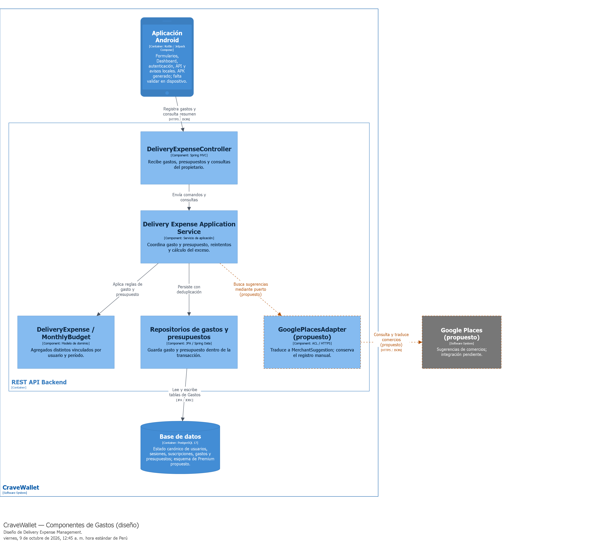

<!-- pdf:omit-start -->

*Figura 32. Componentes de Delivery Expense Management.*

<!-- pdf:omit-end -->

*Fuente: elaboración del equipo Gastify. Propuesta de diseño.*

#### 2.6.2.6. Code Level Diagrams

##### 2.6.2.6.1. Domain Layer Class Diagrams

El diagrama muestra los dos agregados, sus objetos de valor y eventos. La asociación por usuario/período no fusiona el gasto y el presupuesto en un solo agregado.

La figura 33 presenta clases de dominio de delivery expense management.

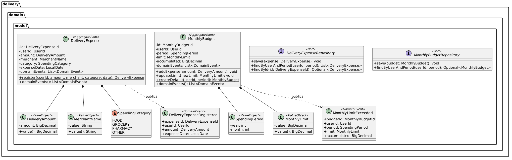

<!-- pdf:omit-start -->

*Figura 33. Clases de dominio de Delivery Expense Management.*

<!-- pdf:omit-end -->

*Fuente: elaboración del equipo Gastify. Propuesta de diseño.*

##### 2.6.2.6.2. Database Design Diagram

`delivery_expenses` conserva los gastos y el identificador de solicitud para reconocer reintentos. `monthly_budgets` tiene una restricción única por usuario/año/mes. La línea entre tablas indica agrupación lógica por propietario y mes, no una clave foránea inventada hacia un presupuesto. La estrategia de concurrencia debe proteger el acumulado.

La figura 34 presenta persistencia propuesta de delivery expense management.

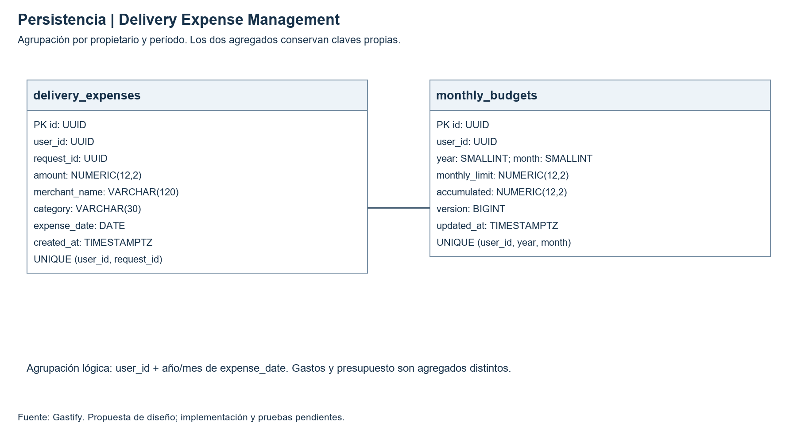

<!-- pdf:omit-start -->

*Figura 34. Persistencia propuesta de Delivery Expense Management.*

<!-- pdf:omit-end -->

*Fuente: elaboración del equipo Gastify. Propuesta de diseño.*

### 2.6.3. Bounded Context: Premium & Billing

#### 2.6.3.1. Domain Layer

**`SubscriptionPlan`** representa el nivel de acceso a CraveWallet. Mantiene propietario, Free/Premium, período de vigencia y referencias para correlacionar facturación. La cancelación del plan propio no cambia los registros externos del usuario.

La tabla 99 presenta domain layer.

*Tabla 99. Domain Layer.*

| Elemento | Responsabilidad o regla |
| --- | --- |
| `PlanType` | FREE / PREMIUM. El nivel cambia tras una decisión sustentada en una notificación verificada. |
| `BillingPeriod` | Inicio y fin del acceso pagado, con fin posterior al inicio. Una renovación actualiza la vigencia sin volver a emitir una transición Free → Premium. |
| `StripeCustomerId` / `StripeSubscriptionId` | Referencias de correlación encapsuladas. Los payloads completos del proveedor no entran al agregado. |
| `PlanUpgradedToPremium` | Transición confirmada de Free a Premium. |
| `PlanDowngradedToFree` | Fin confirmado del acceso Premium y retorno a Free. |
| `PlanRepository` | Persistencia y consultas por usuario y referencias de facturación. |
| `PaymentGatewayPort` | Contrato para checkout y cancelación de renovación; la verificación entrante del webhook es una responsabilidad distinta. |

*Fuente: elaboración del equipo Gastify.*

`upgradeToPremium` debe conservar o ampliar el período confirmado, incluso si el plan ya es Premium. No basta con retornar temprano por el nivel para llamar a eso idempotencia. La deduplicación se basa en el evento externo y la factura; una notificación antigua no debe reducir la vigencia actual. `downgradeToFree` requiere comprobar el fin del acceso. Las referencias de facturación se conservan para trazabilidad, en lugar de borrarlas al cancelar.

#### 2.6.3.2. Interface Layer

`PremiumController` atiende al usuario autenticado. `StripeWebhookController` recibe notificaciones del proveedor; no requiere el JWT del usuario, pero sí la verificación de firma y correlación antes de afectar un plan.

La tabla 100 presenta interface layer.

*Tabla 100. Interface Layer.*

| Método y ruta base `/api/v1/premium` | Contrato propuesto |
| --- | --- |
| POST `/checkout` | Inicia sesión de pago y devuelve enlace; no confirma Premium. |
| GET `/status` | Devuelve nivel y vigencia confirmados. |
| POST `/cancel` | Solicita cancelar la renovación al fin del período pagado. |
| GET `/payments` | Historial de operaciones confirmadas del usuario. |
| POST `/webhook` | Entrada de Stripe verificada; no acepta una declaración de pago desde el móvil. |

*Fuente: elaboración del equipo Gastify.*

#### 2.6.3.3. Application Layer

`PremiumApplicationService` crea o recupera el plan y conserva la correlación usuario/cliente/suscripción antes de procesar una confirmación. `handlePaymentConfirmed` comprueba evento/factura no procesados y estado vigente, actualiza el período y registra el resultado en una transacción. `handleSubscriptionCancelled` reconcilia la vigencia antes de volver a Free. Las respuestas a `GetPlanAccess` publican un contrato local de nivel y límite para Suscripciones; no exponen el objeto Stripe.

#### 2.6.3.4. Infrastructure Layer

**`StripeGatewayAdapter`** implementa el puerto de salida para checkout/cancelación. **`StripeWebhookAdapter`** verifica firma, registra el identificador del evento y traduce la notificación para la aplicación. Separar ambos evita que el servicio de aplicación dependa de un adaptador que a su vez llama al mismo servicio. La correlación y actualización deben soportar reintentos y mensajes fuera de orden [@stripeWebhooks].

Para una factura pagada, se consulta y valida la suscripción vinculada antes de actualizar el acceso. `customer.subscription.deleted` permite reconciliar el fin; los pagos fallidos y reembolsos requieren una política de negocio pendiente [@stripeSubscriptionWebhooks]. Un evento no relevante y verificado puede reconocerse sin cambiar el plan; una firma inválida o una falla de procesamiento no se trata como éxito por defecto.

`JpaPlanRepository` persiste los planes y sus referencias. El registro `billing_events` impone unicidad al identificador externo y conserva estado de procesamiento. Las pruebas de SP05–SP06 deben demostrar correlación, duplicados, renovación y cancelación; no hay resultados documentados en este avance. El precio y beneficios siguen siendo propuestas comerciales.

#### 2.6.3.5. Component Level Diagrams

La figura 35 presenta componentes de premium & billing.

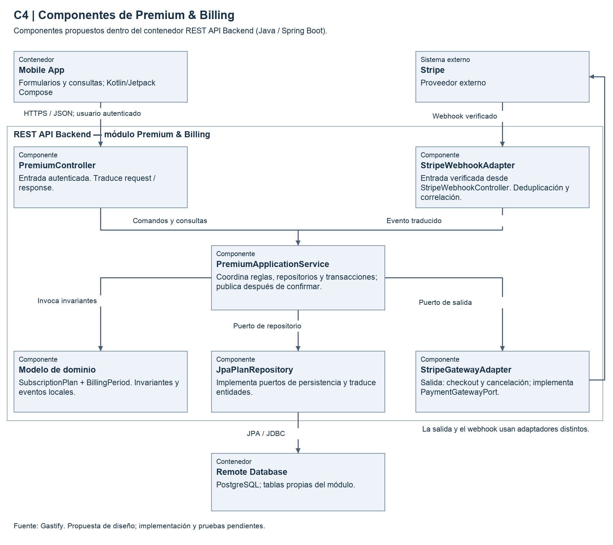

<!-- pdf:omit-start -->

*Figura 35. Componentes de Premium & Billing.*

<!-- pdf:omit-end -->

*Fuente: elaboración del equipo Gastify. Propuesta de diseño.*

#### 2.6.3.6. Code Level Diagrams

##### 2.6.3.6.1. Domain Layer Class Diagrams

El diagrama conserva el agregado y los eventos locales. La operación de renovación debe respetar la actualización de vigencia descrita arriba. Los puertos se completarán con el contrato de cancelación al implementar; el diagrama representa el núcleo del modelo.

La figura 36 presenta clases de dominio de premium & billing.

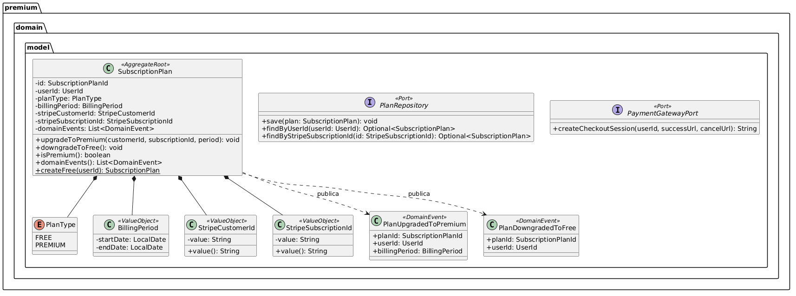

<!-- pdf:omit-start -->

*Figura 36. Clases de dominio de Premium & Billing.*

<!-- pdf:omit-end -->

*Fuente: elaboración del equipo Gastify. Propuesta de diseño.*

##### 2.6.3.6.2. Database Design Diagram

`user_plans` tiene un único registro por usuario. `billing_events` conserva identificador externo único, plan correlacionado, tipo, fecha y estado de procesamiento. La correlación se verifica antes de cambiar el plan; un índice no demuestra por sí solo procesamiento en tiempo constante ni consistencia con Stripe.

La figura 37 presenta persistencia propuesta de premium & billing.

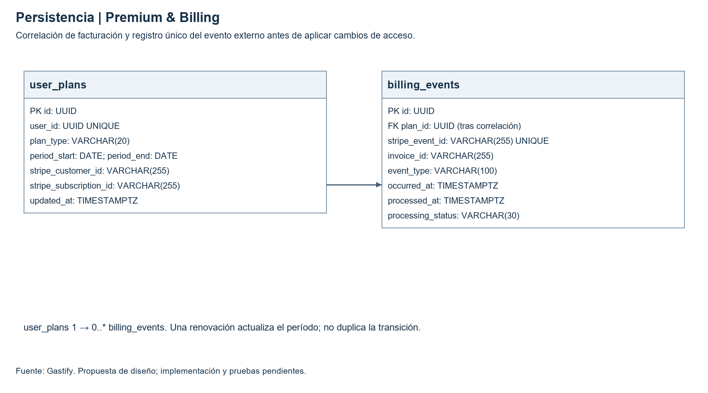

<!-- pdf:omit-start -->

*Figura 37. Persistencia propuesta de Premium & Billing.*

<!-- pdf:omit-end -->

*Fuente: elaboración del equipo Gastify. Propuesta de diseño.*
