# Capítulo III: Solution UI/UX Design

## 3.1. Product design

### 3.1.1. Style Guidelines

#### 3.1.1.1. General Style Guidelines

CraveWallet se posiciona como una herramienta de empoderamiento financiero para nativos digitales peruanos. Las decisiones de diseño de esta sección establecen el sistema visual que debe aplicarse de forma coherente en la aplicación móvil y en el landing page.

***

##### Branding

El nombre "CraveWallet" combina dos conceptos: *crave* (deseo, apetito de control) y *wallet* (billetera). La identidad visual traduce esa tensión en un sistema que se siente dinámico pero ordenado: el usuario desea tener el control de sus gastos y CraveWallet le da la claridad para lograrlo. El logotipo principal combina un isotipo abstracto formado por un ícono de billetera con una línea ascendente que evoca tanto una gráfica de ahorros como una llama contenida (referencia a la energía del "crave") y el wordmark "CraveWallet" en tipografía semibold. El isologo se utilizará siempre sobre fondo primario oscuro o sobre fondo blanco; nunca sobre fondos de color saturado ni sobre fotografías sin capa de opacidad.

***

##### Typography

El sistema tipográfico usa dos familias de Google Fonts seleccionadas por su legibilidad en pantallas de densidad media-alta y su adecuación al contexto financiero digital:

**Familia principal — Poppins (headings y etiquetas de UI)**
Poppins es una tipografía geométrica de alto contraste visual que transmite modernidad y accesibilidad. Sus trazos redondeados suavizan la percepción de "aplicación bancaria seria" y la acercan al tono conversacional que el segmento objetivo espera. Se utiliza en pesos 600 (SemiBold) para títulos de pantalla y tarjetas, y 700 (Bold) para cifras de resumen y totales del Dashboard.

**Familia secundaria — Inter (body y datos numéricos)**
Inter fue diseñada específicamente para interfaces digitales de alta densidad de información. Su sistema de espaciado interno optimizado para pantallas pequeñas la hace ideal para tablas de suscripciones, fechas de renovación y montos en soles/dólares. Se utiliza en pesos 400 (Regular) para cuerpo de texto y descripciones, y 500 (Medium) para etiquetas de categoría y estados de suscripción.

La tabla 101 presenta la escala tipográfica con sus familias, pesos y tamaños base.

*Tabla 101. Escala tipográfica de CraveWallet.*

| Uso | Familia | Peso | Tamaño base (móvil) | Tamaño base (web) |
| --- | --- | --- | --- | --- |
| Display / Hero | Poppins | 700 Bold | 28sp | 40px |
| Heading 1 (pantalla) | Poppins | 600 SemiBold | 22sp | 32px |
| Heading 2 (sección) | Poppins | 600 SemiBold | 18sp | 24px |
| Body regular | Inter | 400 Regular | 14sp | 16px |
| Body enfatizado | Inter | 500 Medium | 14sp | 16px |
| Caption / etiqueta | Inter | 400 Regular | 12sp | 12px |
| Monto principal | Poppins | 700 Bold | 32sp | 48px |
| Código de moneda | Inter | 500 Medium | 12sp | 14px |

*Fuente: elaboración del equipo Gastify.*

***

##### Colors

La paleta aplica la regla 60-30-10: el 60 % del espacio visual lo ocupa el color base neutro (fondo y superficies), el 30 % corresponde al color primario de marca y el 10 % al color de acento para llamadas a la acción y alertas críticas.

**Color base — 60 % (fondos y superficies)**

La tabla 102 presenta los colores base de fondos y superficies.

*Tabla 102. Colores base (60 %).*

| Token | HEX | Visual | Uso |
| --- | --- | --- | --- |
| `color-background` | `#F8FAFC` |  | Fondo general de pantallas |
| `color-surface` | `#FFFFFF` |  | Tarjetas, modales, Bottom Sheet |
| `color-surface-variant` | `#EEF2F7` |  | Fondos de secciones colapsadas, chips |
| `color-on-surface` | `#0F172A` |  | Texto principal sobre fondos claros |
| `color-on-surface-variant` | `#64748B` |  | Texto secundario, subtítulos, fechas |

*Fuente: elaboración del equipo Gastify.*

**Color primario — 30 % (marca y estructura)**

La tabla 103 presenta los colores primarios de marca y estructura.

*Tabla 103. Colores primarios (30 %).*

| Token | HEX | Visual | Uso |
| --- | --- | --- | --- |
| `color-primary` | `#3B4FD8` |  | Botones primarios, barra de navegación activa, encabezados |
| `color-primary-container` | `#E0E4FF` |  | Fondo de chips seleccionados, estado activo de tarjeta |
| `color-on-primary` | `#FFFFFF` |  | Texto e íconos sobre fondo primario |
| `color-on-primary-container` | `#0A1172` |  | Texto sobre contenedores primarios |
| `color-primary-dark` | `#2537B0` |  | Estado pressed de botones primarios |

*Fuente: elaboración del equipo Gastify.*

**Color de acento — 10 % (alertas, CTAs y conversión)**

La tabla 104 presenta los colores de acento para alertas y llamadas a la acción.

*Tabla 104. Colores de acento (10 %).*

| Token | HEX | Visual | Uso |
| --- | --- | --- | --- |
| `color-accent` | `#F97316` |  | FAB, badges de alerta, etiqueta "Cobro mañana" |
| `color-accent-container` | `#FFF0E0` |  | Fondo de tarjetas con Billing Alert activo |
| `color-on-accent` | `#FFFFFF` |  | Íconos y texto sobre fondo acento |

*Fuente: elaboración del equipo Gastify.*

**Colores semánticos (estados del sistema)**

La tabla 105 presenta los colores semánticos de los estados del sistema.

*Tabla 105. Colores semánticos.*

| Token | HEX | Visual | Uso |
| --- | --- | --- | --- |
| `color-success` | `#22C55E` |  | Suscripción activa, pago confirmado, conversión exitosa |
| `color-warning` | `#FBBF24` |  | Renovación en 3-7 días |
| `color-error` | `#EF4444` |  | Pago fallido, presupuesto excedido, suscripción vencida |
| `color-info` | `#38BDF8` |  | Tipo de cambio actualizado, información neutral |

*Fuente: elaboración del equipo Gastify.*

**Nota de accesibilidad:** los pares de texto principales cumplen el contraste mínimo de 4.5:1 de WCAG 2.1 nivel AA [@w3c2018wcag21]: `#0F172A` sobre `#F8FAFC` alcanza 17.1:1 y `#FFFFFF` sobre `#3B4FD8`, 6.4:1. Dos pares no lo cumplen como texto: el blanco sobre `#F97316` (2.8:1) y `#EF4444` sobre blanco (3.8:1). Por eso, el contenido sobre naranja y los mensajes de error se escriben en `#0F172A`, como se detalla en la sección 3.1.4.3.

***

##### Spacing — Sistema de 8px

Todo el espaciado interno y externo de componentes se deriva del módulo base de 8px. Esto garantiza alineación en grids de 8 puntos y elimina decisiones de espaciado ad hoc dentro del equipo.

La tabla 106 presenta los tokens de espaciado derivados del módulo de 8px.

*Tabla 106. Escala de espaciado de 8px.*

| Token | Valor | Uso típico |
| --- | --- | --- |
| `space-1` | 4px | Separación interna mínima (ícono–texto en chip) |
| `space-2` | 8px | Padding interno de chips, separación entre ícono y label |
| `space-3` | 12px | Padding vertical de list items |
| `space-4` | 16px | Padding horizontal estándar de pantalla (móvil) |
| `space-5` | 24px | Separación entre secciones de una tarjeta |
| `space-6` | 32px | Margen superior de pantallas internas |
| `space-8` | 48px | Separación entre bloques de contenido del landing |
| `space-10` | 64px | Margen de secciones hero del landing |

*Fuente: elaboración del equipo Gastify.*

El radio de borde (border-radius) también sigue el sistema: `4px` para chips y badges, `8px` para inputs y botones compactos, `16px` para tarjetas de suscripción y `24px` para Bottom Sheets y modales.

***

##### Tono de Comunicación

El tono define cómo CraveWallet "habla" al usuario en notificaciones, mensajes de error, textos de onboarding, etiquetas vacías y microcopy de botones. Se posiciona en las cuatro dimensiones como muestra la tabla 107.

*Tabla 107. Dimensiones del tono de comunicación.*

| Dimensión | Posición | Justificación |
| --- | --- | --- |
| **Divertido / Serio** | 35 % Divertido — 65 % Serio | El dinero es un tema sensible para el segmento objetivo; la seriedad genera confianza. Sin embargo, la comunicación excesivamente formal aleja a los universitarios y profesionales jóvenes que son el público principal. La combinación permite mensajes directos y claros sin resultar fríos. |
| **Formal / Casual** | 25 % Formal — 75 % Casual | CraveWallet usa tuteo ("Tu próximo cobro es mañana", no "Su próximo cobro"). Los mensajes evitan jerga financiera compleja. El tono casual reduce la fricción de adopción en usuarios sin educación financiera formal. |
| **Respetuoso / Irreverente** | 85 % Respetuoso — 15 % Irreverente | El manejo del dinero personal es emocionalmente cargado; el irrespeto en mensajes de error o alertas generaría rechazo. El 15 % de irreverencia se reserva para microcopy de estados vacíos y celebraciones de logros ("¡Cancelaste Smart Fit! Tu bolsillo lo agradece."). |
| **Entusiasta / Sereno** | 60 % Entusiasta — 40 % Sereno | Las alertas y el onboarding se comunican con energía positiva para motivar al usuario a tomar control de sus finanzas. Las pantallas de datos y análisis adoptan un tono más sereno para no generar ansiedad frente a cifras negativas. |

*Fuente: elaboración del equipo Gastify.*

**Ejemplos de aplicación del tono:**

La tabla 108 presenta ejemplos de textos corregidos según el tono de CraveWallet.

*Tabla 108. Ejemplos de aplicación del tono.*

| Contexto | Texto incorrecto | Texto CraveWallet |
| --- | --- | --- |
| Alerta de renovación | "Aviso: su suscripción se renovará." | "Mañana te cobran Spotify — S/ 15. ¿Lo dejamos pasar?" |
| Estado vacío (sin suscripciones) | "No existen registros en el sistema." | "Aún no tienes gastos registrados. Agrega tu primera suscripción y toma el control." |
| Error de conexión | "Error 503. Intente más tarde." | "Sin conexión. Revisamos el tipo de cambio en cuanto vuelvas a estar en línea." |
| Celebración de ahorro | "Operación completada." | "¡Cancelaste Dropbox! Eso son USD 9.99 que vuelven a tu bolsillo cada mes." |

*Fuente: elaboración del equipo Gastify.*

#### 3.1.1.2. Web Style Guidelines

Las Web Style Guidelines aplican al landing page de CraveWallet, un sitio informativo construido con Next.js 16, React 19 y Tailwind CSS 4. El landing comparte el sistema de tokens de la sección 3.1.1.1 y añade especificaciones propias para el contexto de escritorio y navegador.

***

##### Grid y breakpoints

El layout web usa un sistema de 12 columnas con gutters de 24px en desktop y 16px en tablet. El ancho máximo del contenedor de contenido es de 1280px, centrado en pantalla en resoluciones superiores.

La tabla 109 presenta los breakpoints del grid web y su comportamiento.

*Tabla 109. Grid y breakpoints web.*

| Breakpoint | Rango | Columnas | Gutter | Comportamiento |
| --- | --- | --- | --- | --- |
| Mobile | < 600px | 4 | 16px | Single-column, navegación colapsada en hamburger |
| Tablet | 600px – 959px | 8 | 16px | Dos columnas para tarjetas, nav visible |
| Desktop | 960px – 1279px | 12 | 24px | Layout completo con barra de navegación superior |
| Wide | ≥ 1280px | 12 | 24px | Contenedor fijo a 1280px, márgenes laterales automáticos |

*Fuente: elaboración del equipo Gastify.*

***

##### Elevación y sombras

El sistema de sombras sigue los niveles de elevación de Material Design 3. Las tarjetas de suscripción usan elevación 1 (`box-shadow: 0 1px 3px rgba(0,0,0,0.12)`); los modales y Bottom Sheets usan elevación 3 (`box-shadow: 0 4px 8px rgba(0,0,0,0.16)`). El FAB usa elevación 6 en estado reposo.

***

##### Iconografía web

Se usa la biblioteca **Material Symbols** (variable font, peso 400, grado 0, tamaño óptico 24) para todos los íconos de la interfaz web. Los íconos de categoría de suscripción se complementan con íconos de marca cuando están disponibles en formato SVG (Netflix, Spotify, Adobe, Smart Fit). Los íconos de marca se muestran en escala de grises (filtro `grayscale(100%)`) en estado inactivo y a color completo en estado activo.

#### 3.1.1.3. Mobile Style Guidelines

Las Mobile Style Guidelines aplican a la aplicación nativa Android de CraveWallet, implementada siguiendo las pautas de Material Design 3 (Material You) [@googleMaterial3]. El diseño adapta el sistema de tokens global a las restricciones y convenciones propias del entorno móvil.

***

##### Tamaños de pantalla objetivo

La tabla 110 presenta los tamaños de pantalla objetivo y los dispositivos de prueba.

*Tabla 110. Tamaños de pantalla objetivo.*

| Categoría | Resolución de referencia | Densidad | Dispositivo de prueba |
| --- | --- | --- | --- |
| Compacta (principal) | 360 × 800dp | xhdpi (320dpi) | Samsung Galaxy A54 |
| Media | 390 × 844dp | xxhdpi (440dpi) | Xiaomi Redmi Note 12 |
| Expandida | 600 × 960dp | xhdpi | Tablet Lenovo M10 |

*Fuente: elaboración del equipo Gastify.*

El diseño se valida primero en un ancho de 360dp (categoría compacta).

***

##### Touch targets y accesibilidad

Todos los elementos interactivos tienen un área de toque mínima de 48 × 48dp, conforme a las pautas de Material Design 3 y WCAG 2.5.5 (Target Size). Los botones de acción crítica (cancelar suscripción, confirmar pago Premium) tienen un área mínima de 56dp de altura. El contraste de texto cumple WCAG 2.1 AA en todos los estados (normal, pressed, disabled).

***

##### Tipografía en Android

Los tamaños tipográficos siguen la escala de Material Design 3 expresada en `sp` (scale-independent pixels), lo que respeta la configuración de tamaño de fuente del sistema operativo del usuario (tabla 111).

*Tabla 111. Escala tipográfica en Android.*

| Rol Material 3 | Familia | Peso | Tamaño |
| --- | --- | --- | --- |
| Display Large | Poppins | Bold 700 | 57sp |
| Headline Medium | Poppins | SemiBold 600 | 28sp |
| Title Large | Poppins | SemiBold 600 | 22sp |
| Body Large | Inter | Regular 400 | 16sp |
| Body Medium | Inter | Regular 400 | 14sp |
| Label Large | Inter | Medium 500 | 14sp |
| Label Small | Inter | Regular 400 | 11sp |

*Fuente: elaboración del equipo Gastify.*

***

##### Iconografía móvil

Se usa **Material Symbols** en su variante *Rounded* (óptica 24, peso 400) para mantener coherencia visual con las formas redondeadas de la paleta. Los íconos se renderizan a 24dp en componentes de navegación y lista, y a 20dp en chips y etiquetas secundarias. Para las categorías de gasto se define el siguiente mapeo de íconos (tabla 112).

*Tabla 112. Iconografía móvil.*

| Categoría | Ícono Material Symbol |
| --- | --- |
| Streaming | `play_circle` |
| Música | `headphones` |
| Educación | `school` |
| Fitness / Gimnasio | `fitness_center` |
| Cloud / Almacenamiento | `cloud` |
| Delivery | `delivery_dining` |
| Criptomonedas | `currency_bitcoin` |
| Productividad | `work` |
| Otros | `category` |

*Fuente: elaboración del equipo Gastify.*

***

##### Gestos y animaciones

Las animaciones siguen el sistema de motion de Material Design 3 con curvas de easing estándar (`FastOutSlowIn` para elementos que entran/salen de pantalla, `LinearOutSlowIn` para elementos que aparecen desde abajo). La duración base es 300ms para transiciones de pantalla y 150ms para cambios de estado de componentes (pressed, focused). El swipe horizontal hacia la izquierda sobre una tarjeta de suscripción activa la acción de "marcar como no usada"; el swipe hacia la derecha activa "editar".

### 3.1.2. Information Architecture

#### 3.1.2.1. Organization Systems

La arquitectura de información de CraveWallet organiza el contenido a través de tres esquemas complementarios, seleccionados según el tipo de tarea que el usuario realiza en cada pantalla.

***

##### Esquema jerárquico (pantallas principales)

El esquema de organización predominante es la **jerarquía visual top-down**, que parte desde el resumen más agregado (el total mensual del Expense Portfolio en soles) hasta el detalle de un cargo individual. Este esquema responde a la necesidad identificada en el Empathy Map de Valentina Ríos: el usuario necesita entender primero cuánto gasta en total antes de poder decidir qué cancelar.

```
Nivel 0 — Dashboard
  Total mensual consolidado (S/ XXX.XX)
  ├── Nivel 1 — Categoría (Streaming, Educación, Fitness…)
  │     ├── Nivel 2 — Suscripción individual
  │     │     ├── Nivel 3 — Detalle: monto, ciclo, próximo cobro, historial
  │     │     └── Nivel 3 — Acciones: editar, pausar, cancelar
  │     └── Nivel 2 — (siguiente suscripción de la categoría)
  └── (siguiente categoría)
```

La categorización del nivel 1 es **por tópico** (tipo de servicio), no cronológica, porque el usuario asocia mentalmente sus gastos con el tipo de consumo ("mi gasto en streaming", "lo del gimnasio") antes que con fechas. Dentro de cada categoría, los ítems se ordenan **cronológicamente por Renewal Date ascendente**: el próximo cobro aparece primero.

***

##### Esquema secuencial (flujos de tarea)

Los flujos de tarea multi-paso utilizan un esquema **secuencial lineal** que guía al usuario de un estado inicial a un estado final sin bifurcaciones ambiguas. La tabla 113 resume los flujos en los que se aplica.

*Tabla 113. Flujos de tarea secuenciales.*

| Flujo | Pasos | Pantalla guía |
| --- | --- | --- |
| Alta de suscripción | 3 pasos: (1) Seleccionar servicio o ingresar manual → (2) Configurar monto, ciclo y fecha → (3) Confirmar y activar recordatorio | Indicador de 3 pasos en un bottom sheet |
| Activación Premium | 4 pasos: (1) Ver plan → (2) Elegir ciclo (mensual/anual) → (3) Ingresar datos de pago Stripe → (4) Confirmación | Pantalla a pantalla con barra de progreso |
| Onboarding inicial | 3 pasos: (1) Segmento de usuario → (2) Agregar primera suscripción sugerida → (3) Activar recordatorios de calendario | Carrusel con ilustraciones |

*Fuente: elaboración del equipo Gastify.*

***

##### Esquema matricial (comparación y análisis)

La sección de **Análisis** (funcionalidad Premium) usa un esquema **matricial** que permite al usuario comparar sus gastos en dos dimensiones simultáneas: categoría de gasto vs. período de tiempo. Este esquema responde al objetivo de Valentina de identificar qué servicios no usa y cuánto representan en el total mensual. La visualización es una tabla de calor donde el eje X es el mes y el eje Y es la categoría, con celdas coloreadas según el gasto relativo.

***

##### Categorización del contenido

El sistema de categorías es el único vocabulario controlado que el usuario ve explícitamente. La tabla 114 lo define para evitar ambigüedad.

*Tabla 114. Categorización del contenido.*

| Categoría | Definición operativa | Ejemplos |
| --- | --- | --- |
| Streaming | Servicios de video o audio bajo demanda con cobro recurrente | Netflix, Disney+, Max, Crunchyroll |
| Música | Plataformas de streaming musical | Spotify, Apple Music, YouTube Music |
| Educación | Plataformas de aprendizaje digital o institutos con cobro mensual | Netzun, Coursera, Platzi, Británico |
| Fitness | Membresías físicas o digitales de ejercicio | Smart Fit, Fitpass, Nike Training Club |
| Cloud | Almacenamiento, productividad y herramientas profesionales | Adobe CC, Figma, Dropbox, Google One |
| Delivery | Membresías de plataformas de reparto a domicilio | PedidosYa Plus, Rappi Prime |
| Criptomonedas | Plataformas con cobros automáticos por custodia, trading o suscripción | Binance, Lemon Cash |
| Productividad | Herramientas de trabajo con cobro recurrente no clasificadas en Cloud | Notion, Linear, Slack |
| Otros | Cualquier gasto recurrente que no encaje en las categorías anteriores | — |

*Fuente: elaboración del equipo Gastify.*

#### 3.1.2.2. Labelling Systems

El sistema de etiquetado define el vocabulario que el usuario verá en la interfaz: nombres de pantallas, etiquetas de navegación, acciones, estados y campos de formulario. El criterio de selección prioriza **brevedad** (máximo 2 palabras), **consistencia** con el Ubiquitous Language de la sección 2.3.6 y **reconocimiento inmediato** sin necesidad de explicación.

***

##### Etiquetas de navegación principal

La tabla 115 presenta las etiquetas de navegación principal.

*Tabla 115. Etiquetas de navegación principal.*

| Destino | Etiqueta en navegación | Ícono |
| --- | --- | --- |
| Dashboard / Resumen | **Inicio** | `home` |
| Lista de suscripciones | **Gastos** | `receipt_long` |
| Análisis y gráficos | **Análisis** | `bar_chart` |
| Perfil y ajustes | **Perfil** | `person` |

*Fuente: elaboración del equipo Gastify.*

***

##### Etiquetas de estados de suscripción

La tabla 116 presenta las etiquetas de estados de suscripción y su color.

*Tabla 116. Etiquetas de estados de suscripción.*

| Estado del sistema | Etiqueta visible | Color asociado |
| --- | --- | --- |
| Suscripción activa y al día | **Activa** | `color-success` (#22C55E) |
| Renovación en ≤ 24 horas | **Cobro hoy** | `color-accent` (#F97316) |
| Renovación en 2–7 días | **Pronto** | `color-warning` (#FBBF24) |
| Sin usar en los últimos 30 días | **Sin usar** | `color-on-surface-variant` (#64748B) |
| Cancelada por el usuario | **Cancelada** | `color-error` (#EF4444) |
| Pendiente de confirmación | **Pendiente** | `color-info` (#38BDF8) |

*Fuente: elaboración del equipo Gastify.*

***

##### Etiquetas de acciones primarias

La tabla 117 presenta las etiquetas de las acciones primarias.

*Tabla 117. Etiquetas de acciones primarias.*

| Acción | Etiqueta en botón / menú | Contexto |
| --- | --- | --- |
| Registrar nuevo gasto recurrente | **Agregar** | FAB y botón en estado vacío |
| Guardar cambios de un registro | **Guardar** | Formulario de edición |
| Confirmar cancelación de suscripción | **Sí, cancelar** | Modal de confirmación |
| Descartar cambios | **Descartar** | Botón secundario en formularios |
| Activar recordatorio de calendario | **Activar recordatorio** | Paso 3 del flujo de alta |
| Pasar a Premium | **Ver Premium** | Banner en Dashboard y pantalla de Perfil |
| Convertir a Premium (CTA final) | **Suscribirme** | Pantalla de checkout Stripe |

*Fuente: elaboración del equipo Gastify.*

***

##### Etiquetas de campos de formulario

La tabla 118 presenta las etiquetas de los campos de formulario.

*Tabla 118. Etiquetas de campos de formulario.*

| Campo | Etiqueta (placeholder) | Nota |
| --- | --- | --- |
| Nombre del servicio | "Nombre del servicio (ej. Smart Fit)" | Prellenado si se elige del catálogo |
| Monto | "Monto (ej. 79.90)" | Separado del selector de moneda |
| Moneda | "Moneda" | Dropdown: PEN / USD / EUR |
| Ciclo de cobro | "Frecuencia" | Opciones: Mensual / Anual / Semanal / Personalizado |
| Fecha de próxima renovación | "Próximo cobro" | DatePicker nativo |
| Categoría | "Categoría" | Dropdown con 9 opciones del sistema |
| Notas | "Notas (opcional)" | Texto libre, máx. 120 caracteres |

*Fuente: elaboración del equipo Gastify.*

***

##### Etiquetas de mensajes de estado vacío

La tabla 119 presenta los mensajes de estado vacío por pantalla.

*Tabla 119. Mensajes de estado vacío.*

| Pantalla | Mensaje de estado vacío | Llamada a la acción |
| --- | --- | --- |
| Dashboard sin gastos | "Aún no tienes gastos registrados." | "Agregar mi primera suscripción" |
| Búsqueda sin resultados | "No encontramos gastos con ese nombre." | "Limpiar filtros" |
| Análisis sin datos | "Registra al menos un mes de gastos para ver tu análisis." | "Ir a Gastos" |
| Notificaciones sin alertas | "Todo en orden. Tu próximo cobro está a más de 7 días." | — |

*Fuente: elaboración del equipo Gastify.*

#### 3.1.2.3. SEO Tags and Meta Tags

Esta sección define las etiquetas de metadatos para el landing page de CraveWallet y los elementos de optimización para tiendas de aplicaciones móviles (ASO — App Store Optimization).

***

##### Metadatos HTML del Landing Page

```html
<!-- Metadatos esenciales -->
<meta charset="UTF-8">
<meta name="viewport" content="width=device-width, initial-scale=1.0">

<!-- SEO On-Page -->
<title>CraveWallet — Controla tus suscripciones y gastos en soles | Gastify</title>
<meta name="description" content="CraveWallet reúne todas tus suscripciones, membresías y gastos de delivery en un solo lugar. Recibe alertas 24 horas antes de cada cobro y conoce cuánto gastas realmente en soles. Gratis para Android.">
<meta name="keywords" content="gestor de suscripciones, control de gastos, suscripciones Peru, Smart Fit, Netflix, Spotify, PedidosYa, gastos recurrentes, membresías, presupuesto universitarios, finanzas personales Peru, tipo de cambio dolar soles">
<meta name="author" content="Gastify — Ingeniería de Software UPC">
<meta name="robots" content="index, follow">
<link rel="canonical" href="https://cravewallet.gastify.pe/">

<!-- Open Graph (Facebook, LinkedIn, WhatsApp) -->
<meta property="og:type" content="website">
<meta property="og:url" content="https://cravewallet.gastify.pe/">
<meta property="og:title" content="CraveWallet — Deja de pagar por lo que no usas">
<meta property="og:description" content="Centraliza tus suscripciones, recibe alertas de cobro y convierte todo a soles automáticamente. Diseñado para universitarios y profesionales jóvenes en Lima.">
<meta property="og:image" content="https://cravewallet.gastify.pe/assets/og-image-1200x630.png">
<meta property="og:locale" content="es_PE">
<meta property="og:site_name" content="CraveWallet by Gastify">

<!-- Twitter Card -->
<meta name="twitter:card" content="summary_large_image">
<meta name="twitter:site" content="@gastifyapp">
<meta name="twitter:title" content="CraveWallet — Controla tus suscripciones en soles">
<meta name="twitter:description" content="¿Cuántas suscripciones pagas sin darte cuenta? CraveWallet te lo dice y te avisa antes de cada cobro.">
<meta name="twitter:image" content="https://cravewallet.gastify.pe/assets/twitter-card-1200x600.png">

<!-- Structured Data (Schema.org — SoftwareApplication) -->
<script type="application/ld+json">
{
  "@context": "https://schema.org",
  "@type": "SoftwareApplication",
  "name": "CraveWallet",
  "operatingSystem": "Android",
  "applicationCategory": "FinanceApplication",
  "offers": {
    "@type": "Offer",
    "price": "0",
    "priceCurrency": "PEN"
  },
  "description": "Gestor de suscripciones y gastos recurrentes para universitarios y profesionales jóvenes en Perú.",
  "author": {
    "@type": "Organization",
    "name": "Gastify"
  }
}
</script>
```

**Justificación de palabras clave:** se priorizan términos de búsqueda con intención transaccional alta en el mercado peruano ("suscripciones Peru", "tipo de cambio dolar soles") y términos de marca de servicios frecuentes en el segmento objetivo ("Smart Fit", "PedidosYa", "Netflix") para capturar tráfico de usuarios que ya sienten el problema y buscan soluciones relacionadas con esos servicios específicos.

***

##### ASO — App Store Optimization (Google Play Store)

La tabla 120 presenta los campos de la ficha ASO en Google Play Store.

*Tabla 120. Ficha ASO en Google Play Store.*

| Campo | Contenido |
| --- | --- |
| **App Title** (máx. 30 caracteres) | `CraveWallet: Gastos y Suscripc.` |
| **App Subtitle / Short Description** (máx. 80 caracteres) | `Controla tus suscripciones. Recibe alertas. Todo en soles.` |
| **App Keywords** (máx. 100 caracteres, separados por coma) | `suscripciones, gastos, presupuesto, finanzas, netflix, spotify, smart fit, delivery, membresías` |
| **App Description (primeras 3 líneas — el fold)** | `¿Cuánto gastas realmente en suscripciones este mes? CraveWallet reúne todas tus suscripciones, membresías y gastos de delivery en una sola pantalla y te avisa 24 horas antes de cada cobro automático.` |
| **Categoría principal** | Finanzas |
| **Categoría secundaria** | Productividad |
| **Content Rating** | Apto para todos (PEGI 3 / ESRB Everyone) |
| **Permisos requeridos** | `READ_CALENDAR`, `WRITE_CALENDAR` (recordatorios), `INTERNET` (ExchangeRate-API, Stripe) |

*Fuente: elaboración del equipo Gastify.*

#### 3.1.2.4. Searching Systems

CraveWallet implementa un sistema de búsqueda y filtrado diseñado para el patrón de uso identificado en el User Journey Map (sección 2.3.3): el usuario busca un gasto específico después de ver un cargo no reconocido en su estado de cuenta bancario. El sistema debe permitir localizar cualquier suscripción en menos de 3 segundos sin requerir que el usuario recuerde el nombre exacto del servicio.

***

##### Búsqueda por texto libre

La barra de búsqueda se ubica en la pantalla "Gastos" (nivel 1 de la jerarquía), fijada en la parte superior bajo la AppBar. La búsqueda es **incremental en tiempo real** (se activa a partir del primer carácter) y aplica sobre los siguientes campos de cada registro:

- Nombre del servicio
- Nombre de la categoría
- Notas del usuario

El algoritmo de coincidencia es **tolerante a errores tipográficos menores** (distancia de Levenshtein ≤ 1) para cubrir casos como "Ntflix" → Netflix o "smarthfit" → Smart Fit. Los resultados se ordenan por relevancia (coincidencia exacta primero, luego parcial).

***

##### Sistema de filtros

Los filtros se presentan como **chips horizontales deslizables** bajo la barra de búsqueda. Se pueden combinar múltiples filtros simultáneamente (AND lógico). El usuario ve el número de resultados activos mientras filtra.

La tabla 121 presenta los filtros disponibles y sus valores.

*Tabla 121. Sistema de filtros.*

| Filtro | Tipo | Valores posibles |
| --- | --- | --- |
| **Categoría** | Multi-select chip | Streaming, Música, Educación, Fitness, Cloud, Delivery, Cripto, Productividad, Otros |
| **Estado** | Multi-select chip | Activa, Cobro hoy, Pronto, Sin usar, Cancelada |
| **Moneda** | Single-select | Todas, Solo PEN, Solo USD |
| **Rango de monto** | Slider de rango | S/ 0 – S/ 500+ (en soles equivalentes) |
| **Próximo cobro** | Date range picker | Selección libre de fecha inicio y fin |

*Fuente: elaboración del equipo Gastify.*

Un botón "Limpiar filtros" aparece en la barra de chips únicamente cuando hay al menos un filtro activo, evitando que ocupe espacio visual en el estado por defecto.

***

##### Ordenamiento de resultados

El usuario puede cambiar el criterio de orden mediante un menú contextual (ícono `sort` en la AppBar de la pantalla Gastos). La tabla 122 resume los criterios disponibles.

*Tabla 122. Criterios de ordenamiento de resultados.*

| Criterio | Dirección por defecto | Justificación |
| --- | --- | --- |
| Próximo cobro | Ascendente | Criterio por defecto: el cobro más cercano es el más urgente |
| Monto en soles | Descendente | Identifica de un vistazo el gasto más alto |
| Nombre | Ascendente (A→Z) | Búsqueda directa por nombre conocido |
| Categoría | Ascendente (A→Z) | Agrupación visual por tipo de servicio |
| Fecha de registro | Descendente | Último gasto registrado primero |

*Fuente: elaboración del equipo Gastify.*

***

##### Búsqueda en el landing page

El landing page es un sitio de una sola página construido con Next.js y generado de forma estática; no implementa búsqueda interna.

#### 3.1.2.5. Navigation Systems

El sistema de navegación de CraveWallet sigue patrones distintos según el producto: la aplicación móvil usa los patrones nativos de Android con Material Design 3 y el landing page usa una navegación web estándar.

***

##### Aplicación móvil — Bottom Navigation Bar

El patrón principal de navegación es la **barra de navegación inferior** (`NavigationBar` de Material Design 3), que permanece visible en todas las pantallas de primer nivel. Se definen 4 destinos, el número máximo recomendado por las pautas de Material Design para este componente (tabla 123).

*Tabla 123. Bottom Navigation Bar de la aplicación móvil.*

| Posición | Destino | Ícono | Badge |
| --- | --- | --- | --- |
| 1 | **Inicio** (Dashboard) | `home` | Número de alertas activas (cobros en ≤ 24h) |
| 2 | **Gastos** (lista completa) | `receipt_long` | — |
| 3 | **Análisis** (solo Premium) | `bar_chart` | Candado si el usuario es freemium |
| 4 | **Perfil** | `person` | — |

*Fuente: elaboración del equipo Gastify.*

La navegación entre pantallas de segundo nivel (detalle de suscripción, formulario de alta, configuración) usa el patrón **push-and-pop** sobre el stack de navegación de la pestaña activa, con un botón de regreso (`←`) en la AppBar. No se rompe la barra inferior al entrar a pantallas de detalle.

**Flujo de navegación completo (app móvil):**

```
NavigationBar
├── Inicio (Dashboard)
│   ├── → Detalle de suscripción [push]
│   │     └── → Editar suscripción [push]
│   └── → FAB: Agregar gasto [modal bottom sheet]
│         └── → Flujo de alta (3 pasos) [stepper en bottom sheet]
├── Gastos
│   ├── Barra de búsqueda + filtros
│   └── → Detalle de suscripción [push]
├── Análisis (Premium)
│   └── → Vista de categoría detallada [push]
└── Perfil
    ├── → Configuración de recordatorios [push]
    ├── → Gestión de cuenta [push]
    └── → Ver plan Premium / Cancelar Premium [push]
```

***

##### Landing page — Top Navigation Bar

El landing page usa una **barra de navegación superior fija** (`position: sticky`) que contiene el logotipo de CraveWallet a la izquierda y los enlaces de sección a la derecha. En breakpoints inferiores a 600px, los enlaces se colapsan en un menú hamburger (ícono `menu`) que despliega un drawer lateral.

La tabla 124 presenta los enlaces de la Top Navigation Bar del landing page.

*Tabla 124. Top Navigation Bar del landing page.*

| Enlace | Destino (ancla) | Comportamiento |
| --- | --- | --- |
| Inicio | `#hero` | Scroll suave al inicio de página |
| El problema | `#problem` | Scroll suave |
| Solución | `#solution` | Scroll suave |
| Descarga | `#download` | Scroll suave + foco en botón de descarga |
| Premium | `#premium` | Scroll suave |

*Fuente: elaboración del equipo Gastify.*

El CTA principal de la navbar es un botón de color primario (`#3B4FD8`) con etiqueta **"Descargar gratis"** que lleva directamente al enlace de Google Play Store. Este botón es visible en todas las posiciones de scroll para maximizar la conversión.

***

### 3.1.3. Landing Page UI Design

#### 3.1.3.1. Landing Page Wireframe

Los wireframes del landing page de CraveWallet representan la estructura de contenido y jerarquía de información de cada sección antes de la aplicación del sistema visual. En esta etapa se definen la disposición espacial de los bloques de contenido, la prioridad relativa de los elementos, los puntos de interacción y el flujo de lectura, sin considerar color, tipografía específica ni elementos gráficos finales. Los wireframes presentados corresponden a la versión Desktop Web Browser (viewport ≥ 960px, contenedor de 1280px máximo) y se elaboraron en herramienta de diseño vectorial siguiendo el grid de 12 columnas con gutters de 24px establecido en la sección 3.1.1.2.

##### Desktop Web Browser

***

**Barra de navegación**

La figura 39 muestra el wireframe de la barra de navegación del landing page de CraveWallet (Desktop).


<!-- pdf:omit-start -->

*Figura 39. Wireframe de la barra de navegación del landing page de CraveWallet (Desktop).*

<!-- pdf:omit-end -->

*Fuente: elaboración del equipo Gastify.*

La barra de navegación muestra tres zonas diferenciadas en una sola fila: zona de marca (logo + wordmark) anclada a la izquierda, zona de enlaces de sección centrada con cinco ítems de igual peso visual, y zona de acción (CTA primario) anclada a la derecha. La posición sticky de la barra se indica mediante la ausencia de separación entre el borde superior del frame y el componente, señalando que permanece fija durante el scroll.

***

**Sección Hero**

La figura 40 muestra el wireframe de la sección Hero del landing page de CraveWallet (Desktop).

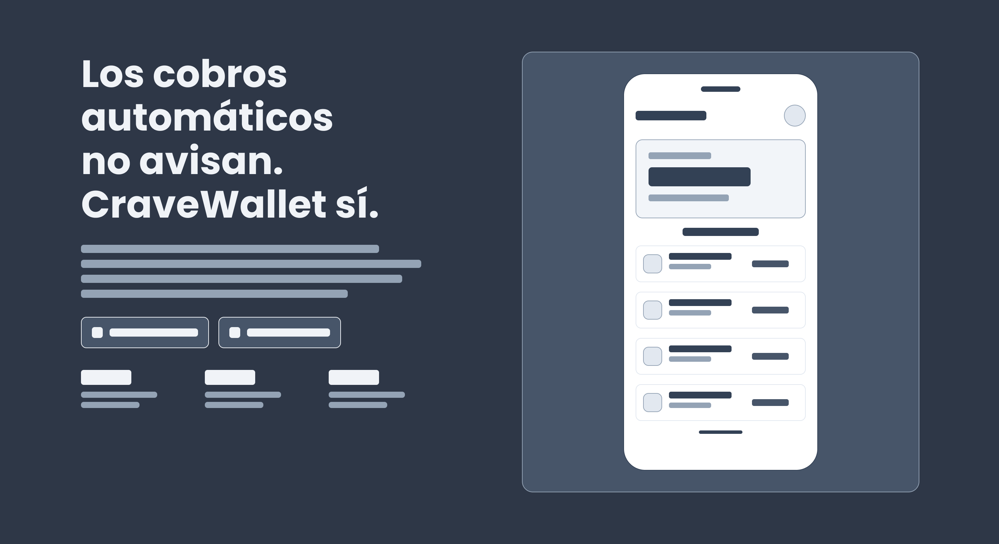

<!-- pdf:omit-start -->

*Figura 40. Wireframe de la sección Hero del landing page de CraveWallet (Desktop).*

<!-- pdf:omit-end -->

*Fuente: elaboración del equipo Gastify.*

El Hero ocupa el viewport completo y se divide en dos columnas de igual peso. La columna izquierda jerarquiza el contenido en cuatro niveles verticales: (1) eyebrow pill de disponibilidad, (2) bloque de titular de tres líneas con énfasis en la segunda, (3) párrafo de descripción, y (4) par de CTAs en fila horizontal. Al pie de la columna izquierda, una línea divisoria separa una fila de tres métricas estadísticas, cada una con valor prominente y etiqueta. La columna derecha contiene el placeholder del mockup de teléfono, representado como un rectángulo proporcional al dispositivo Android objetivo. La jerarquía de lectura sigue el patrón en F establecido por la investigación de eye-tracking para layouts de dos columnas.

***

**Sección El Problema**

La figura 41 muestra el wireframe de la sección "El Problema" del landing page de CraveWallet (Desktop).

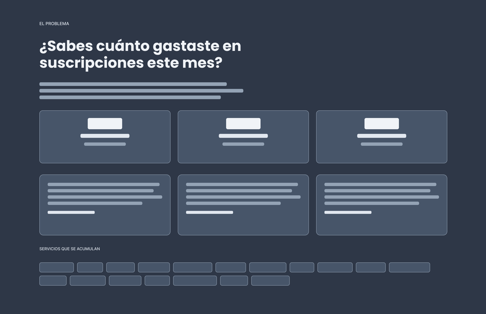

<!-- pdf:omit-start -->

*Figura 41. Wireframe de la sección "El Problema" del landing page de CraveWallet (Desktop).*

<!-- pdf:omit-end -->

*Fuente: elaboración del equipo Gastify.*

La sección se estructura en tres bloques verticales. El primero contiene el eyebrow label, el titular de dos líneas y el párrafo de contexto, ocupando el ancho completo. El segundo bloque dispone tres columnas de igual ancho con una cifra estadística de gran escala y su descripción de fuente cada una. El tercer bloque muestra tres tarjetas de testimonio en fila, cada una con un bloque de cita, identificador de usuario y segmento. Al pie, una fila de logos de servicios representa el reconocimiento de marcas conocidas por el segmento objetivo. Las tres tarjetas de testimonio tienen la misma altura fija para que la fila quede alineada sin importar la extensión del texto.

***

**Sección Solución**

La figura 42 muestra el wireframe de la sección "Solución" del landing page de CraveWallet (Desktop).

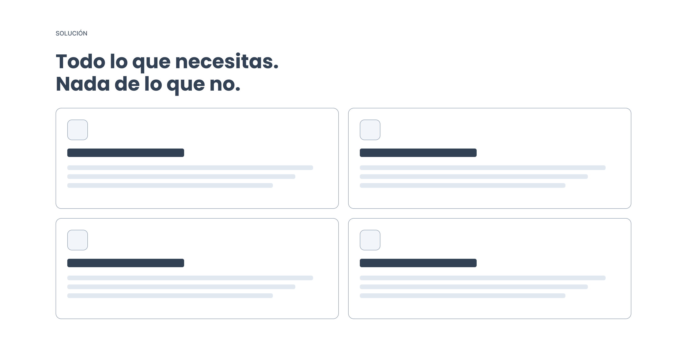

<!-- pdf:omit-start -->

*Figura 42. Wireframe de la sección "Solución" del landing page de CraveWallet (Desktop).*

<!-- pdf:omit-end -->

*Fuente: elaboración del equipo Gastify.*

El bloque de encabezado ocupa el ancho completo con eyebrow label y titular de dos líneas. Debajo, un grid de 2×2 organiza cuatro tarjetas de feature, cada una con: placeholder de ícono en la esquina superior izquierda, título de feature y descripción corta. Las tarjetas tienen altura uniforme. El grid de dos columnas establece la relación matricial del contenido: las cuatro funcionalidades son comparables en relevancia y ninguna tiene prioridad visual sobre las demás.

***

**Sección App Preview**

La figura 43 muestra el wireframe de la sección "App Preview" del landing page de CraveWallet (Desktop).

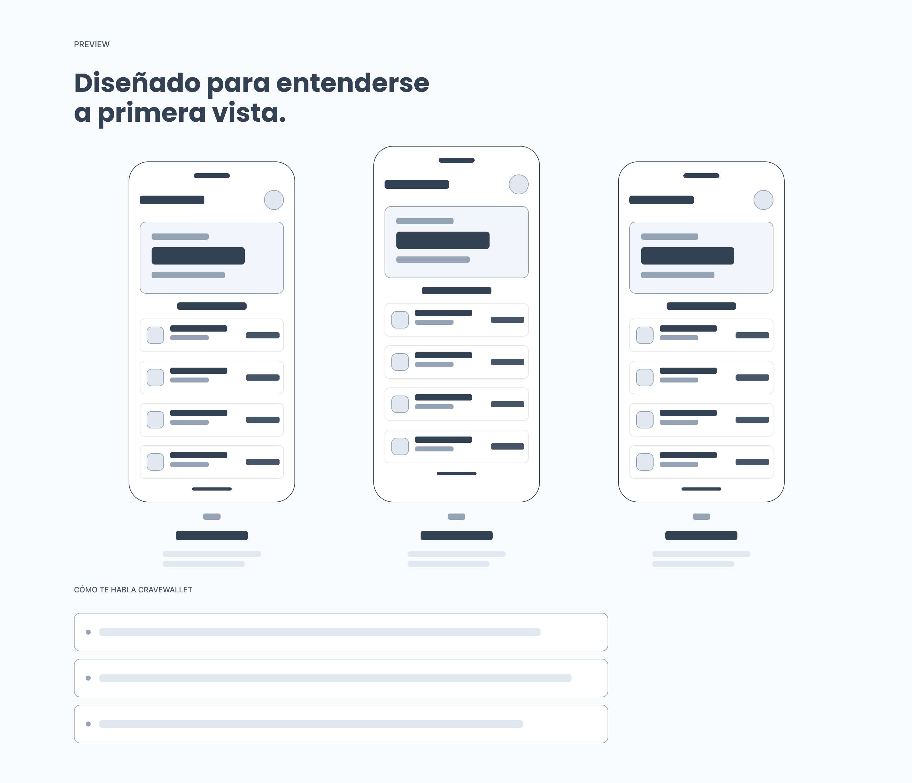

<!-- pdf:omit-start -->

*Figura 43. Wireframe de la sección "App Preview" del landing page de CraveWallet (Desktop).*

<!-- pdf:omit-end -->

*Fuente: elaboración del equipo Gastify.*

La sección se divide verticalmente en dos bloques. El bloque superior muestra el encabezado a la izquierda y tres placeholders de mockup de teléfono en fila, cada uno con su número de secuencia y etiqueta de nombre de pantalla debajo. El bloque inferior presenta una fila de tres tarjetas de microcopy, cada una con un indicador de tipo (representado como barra de color codificado por estado: alerta, éxito, neutro) y el texto de ejemplo. Las tarjetas de microcopy vinculan visualmente el tono de comunicación del producto con las pantallas de la app mostradas arriba.

***

**Sección Prueba Social**

La figura 44 muestra el wireframe de la sección "Prueba Social" del landing page de CraveWallet (Desktop).

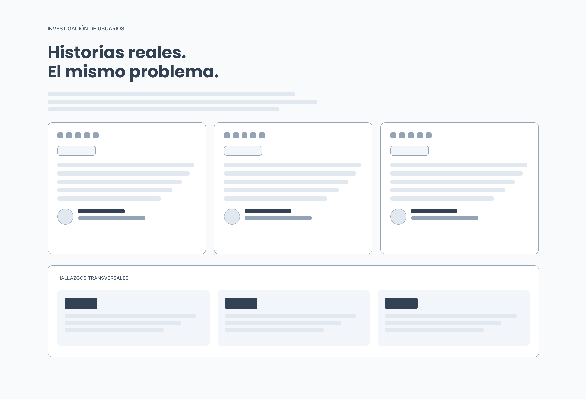

<!-- pdf:omit-start -->

*Figura 44. Wireframe de la sección "Prueba Social" del landing page de CraveWallet (Desktop).*

<!-- pdf:omit-end -->

*Fuente: elaboración del equipo Gastify.*

El encabezado ocupa el ancho completo con eyebrow de metodología, titular y bajada de contexto. Debajo, tres tarjetas de testimonio en fila, cada una con: cuerpo de cita, avatar circular de inicial, nombre, edad y etiqueta de segmento. El bloque de hallazgos transversales bajo las tarjetas muestra tres cifras de impacto en fila con sus descripciones, usando el mismo patrón de columnas de estadística que la sección de problema para crear consistencia de patrón entre secciones.

***

**Sección Planes**

La figura 45 muestra el wireframe de la sección "Planes" del landing page de CraveWallet (Desktop).

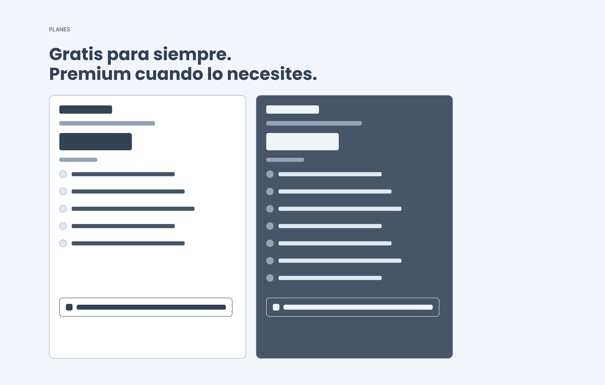

<!-- pdf:omit-start -->

*Figura 45. Wireframe de la sección "Planes" del landing page de CraveWallet (Desktop).*

<!-- pdf:omit-end -->

*Fuente: elaboración del equipo Gastify.*

Encabezado de ancho completo con titular de dos líneas. Dos tarjetas de plan en columnas paralelas de igual ancho: la tarjeta izquierda (Básico) con nombre, precio en escala grande, lista de cinco features con marcadores de verificación y CTA; la tarjeta derecha (Premium) con el mismo esquema más un badge de estado y siete features. Ambas tarjetas tienen la misma altura, estableciendo la comparación directa. El borde reforzado en la tarjeta Premium es el único diferenciador estructural entre ambas, señalando el plan destacado sin romper la simetría del layout.

***

**Sección Descarga**

La figura 46 muestra el wireframe de la sección "Descarga" del landing page de CraveWallet (Desktop).

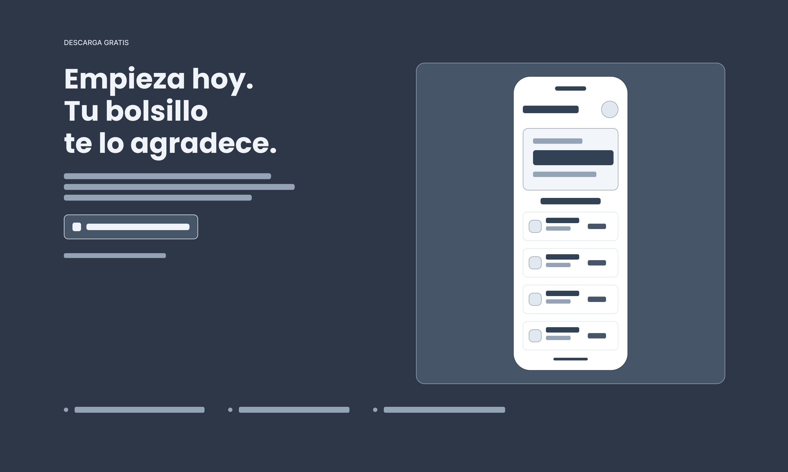

<!-- pdf:omit-start -->

*Figura 46. Wireframe de la sección "Descarga" del landing page de CraveWallet (Desktop).*

<!-- pdf:omit-end -->

*Fuente: elaboración del equipo Gastify.*

Sección de columna única centrada con tres elementos verticales: titular de tres líneas en escala máxima, CTA primario y nota de requisito técnico. Al pie, una fila de tres trust badges con separadores. La ausencia de elementos secundarios o secundarios de navegación en esta sección es una decisión estructural deliberada: el único punto de interacción disponible es el CTA de descarga, concentrando la decisión del usuario.

***

**Footer**

La figura 47 muestra el wireframe del footer del landing page de CraveWallet (Desktop).

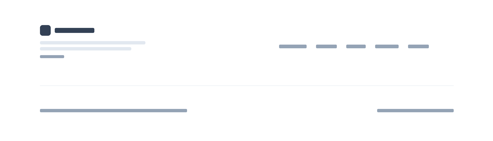

<!-- pdf:omit-start -->

*Figura 47. Wireframe del footer del landing page de CraveWallet (Desktop).*

<!-- pdf:omit-end -->

*Fuente: elaboración del equipo Gastify.*

El footer se divide en dos zonas en una sola fila: zona de marca a la izquierda (logo, tagline, atribución) y zona de navegación secundaria a la derecha (cinco enlaces de sección). Una línea divisoria horizontal separa esta fila del bloque de copyright centrado al pie. La estructura replica en espejo la distribución de la barra de navegación superior, cerrando el sitio con coherencia estructural.

***

##### Mobile Web Browser

Los wireframes mobile corresponden al breakpoint inferior a 600px (grid de 4 columnas, gutters 16px). Todos los layouts multi-columna del desktop colapsan a columna única. Las descripciones a continuación documentan únicamente los cambios estructurales respecto al wireframe desktop; los principios de jerarquía y arquitectura de información son los mismos.

La figura 48 muestra el wireframe del landing page dentro del navegador móvil (Mobile).

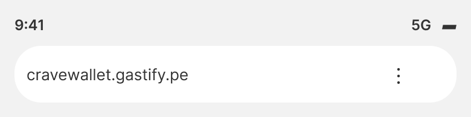

<!-- pdf:omit-start -->

*Figura 48. Wireframe del landing page dentro del navegador móvil (Mobile).*

<!-- pdf:omit-end -->

*Fuente: elaboración del equipo Gastify.*

***

**Barra de navegación — Mobile**

La figura 49 muestra el wireframe de la barra de navegación del landing page de CraveWallet (Mobile).

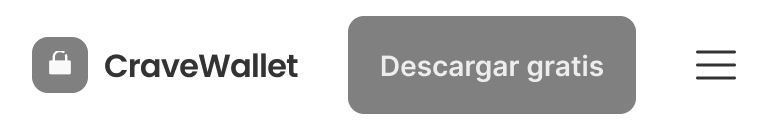

<!-- pdf:omit-start -->

*Figura 49. Wireframe de la barra de navegación del landing page de CraveWallet (Mobile).*

<!-- pdf:omit-end -->

*Fuente: elaboración del equipo Gastify.*

Logo a la izquierda, CTA primario al centro-derecha, ícono de hamburger en el extremo derecho. Los cinco enlaces de sección quedan colapsados detrás del hamburger.

***

**Sección Hero — Mobile**

La figura 50 muestra el wireframe de la sección Hero del landing page de CraveWallet (Mobile).

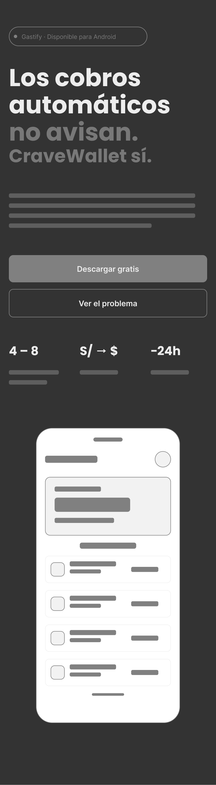

<!-- pdf:omit-start -->

*Figura 50. Wireframe de la sección Hero del landing page de CraveWallet (Mobile).*

<!-- pdf:omit-end -->

*Fuente: elaboración del equipo Gastify.*

Columna única. Secuencia vertical: eyebrow pill → titular de tres líneas → párrafo de descripción → dos CTAs apilados a ancho completo → fila de tres métricas → placeholder de mockup de teléfono al pie. El mockup baja de la columna derecha al final del stack para no interrumpir el flujo de lectura del copy.

***

**Sección El Problema — Mobile**

La figura 51 muestra el wireframe de la sección "El Problema" del landing page de CraveWallet (Mobile).

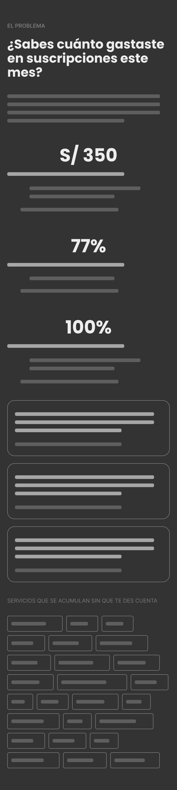

<!-- pdf:omit-start -->

*Figura 51. Wireframe de la sección "El Problema" del landing page de CraveWallet (Mobile).*

<!-- pdf:omit-end -->

*Fuente: elaboración del equipo Gastify.*

Las tres estadísticas pasan de tres columnas paralelas a stack vertical, cada cifra con su descripción inmediatamente debajo. Los tres testimonios se apilan como tarjetas de ancho completo. La fila de logos adapta su número de columnas mediante wrap.

***

**Sección Solución — Mobile**

La figura 52 muestra el wireframe de la sección "Solución" del landing page de CraveWallet (Mobile).

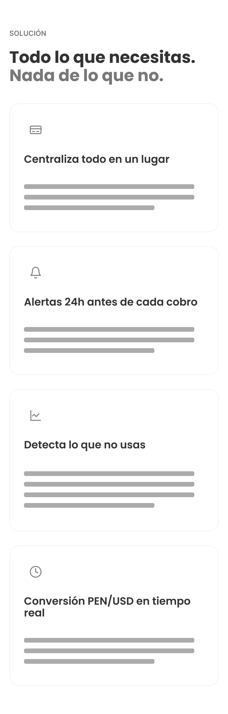

<!-- pdf:omit-start -->

*Figura 52. Wireframe de la sección "Solución" del landing page de CraveWallet (Mobile).*

<!-- pdf:omit-end -->

*Fuente: elaboración del equipo Gastify.*

Grid 2×2 → stack 1×4. Cada tarjeta ocupa el ancho completo con placeholder de ícono, título y descripción. El orden vertical replica la secuencia de uso: centralizar → alertar → detectar → convertir.

***

**Sección App Preview — Mobile**

La figura 53 muestra el wireframe de la sección "App Preview" del landing page de CraveWallet (Mobile).

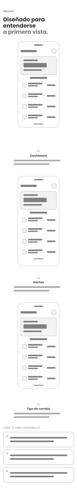

<!-- pdf:omit-start -->

*Figura 53. Wireframe de la sección "App Preview" del landing page de CraveWallet (Mobile).*

<!-- pdf:omit-end -->

*Fuente: elaboración del equipo Gastify.*

Los tres placeholders de mockup de teléfono pasan de fila horizontal a stack vertical, cada uno con su número de secuencia y etiqueta debajo. Las tres tarjetas de microcopy se apilan bajo los mockups.

***

**Sección Prueba Social — Mobile**

La figura 54 muestra el wireframe de la sección "Prueba Social" del landing page de CraveWallet (Mobile).

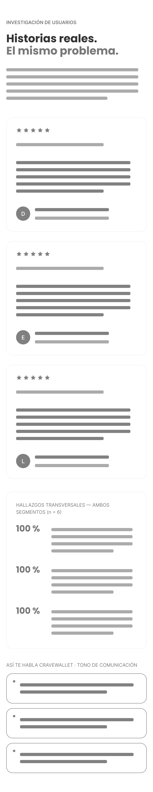

<!-- pdf:omit-start -->

*Figura 54. Wireframe de la sección "Prueba Social" del landing page de CraveWallet (Mobile).*

<!-- pdf:omit-end -->

*Fuente: elaboración del equipo Gastify.*

Tres tarjetas de testimonio en stack vertical a ancho completo. Bloque de hallazgos transversales con tres cifras en fila mediante wrap. Microcopy al pie en columna única.

***

**Sección Planes — Mobile**

La figura 55 muestra el wireframe de la sección "Planes" del landing page de CraveWallet (Mobile).

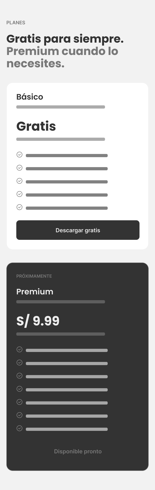

<!-- pdf:omit-start -->

*Figura 55. Wireframe de la sección "Planes" del landing page de CraveWallet (Mobile).*

<!-- pdf:omit-end -->

*Fuente: elaboración del equipo Gastify.*

Las dos tarjetas de plan se apilan verticalmente, plan Básico primero. Cada tarjeta ocupa el ancho completo con su lista de features y CTA a ancho completo.

***

**Sección Descarga — Mobile**

La figura 56 muestra el wireframe de la sección "Descarga" del landing page de CraveWallet (Mobile).

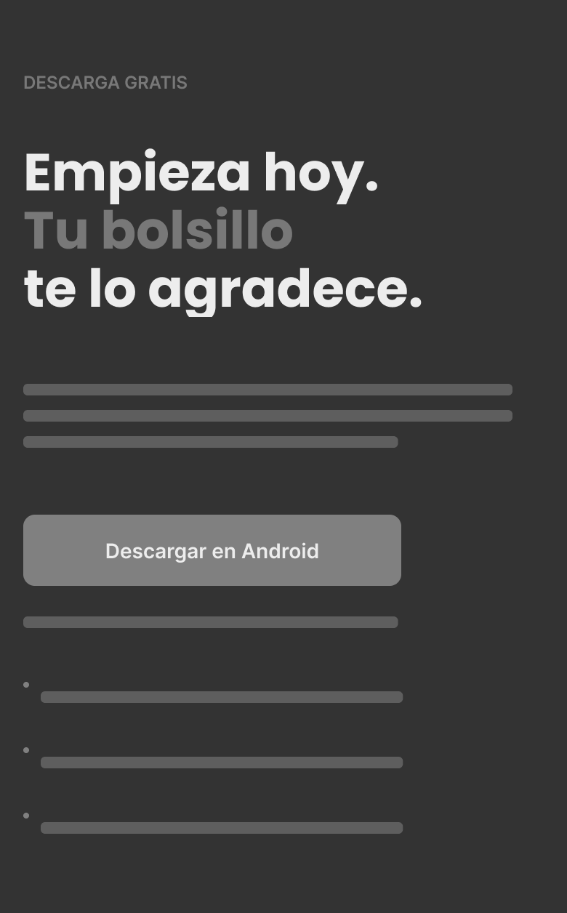

<!-- pdf:omit-start -->

*Figura 56. Wireframe de la sección "Descarga" del landing page de CraveWallet (Mobile).*

<!-- pdf:omit-end -->

*Fuente: elaboración del equipo Gastify.*

Columna única centrada: titular → CTA a ancho completo → nota de requisito. Trust badges en fila de dos o stack según ancho disponible.

***

**Footer — Mobile**

La figura 57 muestra el wireframe del footer del landing page de CraveWallet (Mobile).

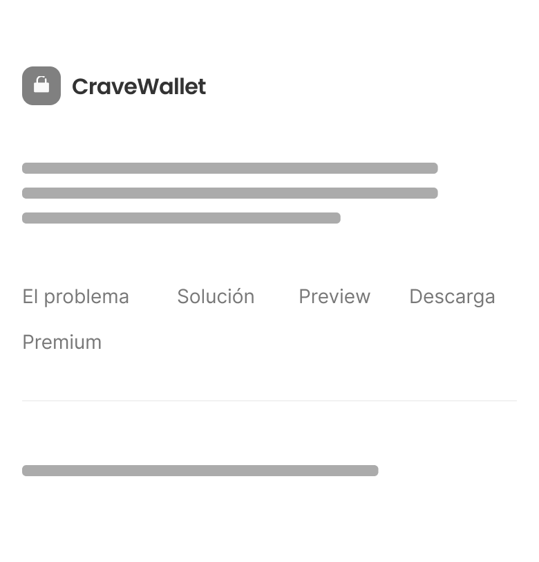

<!-- pdf:omit-start -->

*Figura 57. Wireframe del footer del landing page de CraveWallet (Mobile).*

<!-- pdf:omit-end -->

*Fuente: elaboración del equipo Gastify.*

Logo y tagline en la parte superior, enlaces de sección apilados o en dos columnas, copyright al pie. El espacio vertical entre elementos garantiza touch targets de 44×44px mínimo.

#### 3.1.3.2. Landing Page Mock-up

Los mock-ups del landing page de CraveWallet materializan las decisiones de diseño establecidas en el Design System (sección 3.1.1) y la Arquitectura de Información (sección 3.1.2) en una representación visual de alta fidelidad, lista para ser implementada. El landing page está diseñado como una experiencia de una sola página (SPA estático) cuya estructura narrativa sigue un flujo secuencial de persuasión: problema → solución → evidencia → planes → descarga. Esta secuencia responde al modelo AIDA (Atención, Interés, Deseo, Acción) y garantiza que el usuario construya comprensión progresiva del producto antes de encontrar el llamado a la acción final.

En todos los mock-ups se aplican los siguientes principios transversales:

- **Jerarquía visual:** la escala tipográfica de Poppins Bold (display) a Inter Regular (body) guía la mirada del usuario de mayor a menor importancia sin necesidad de elementos decorativos adicionales.
- **Ritmo de secciones:** se alternan fondos oscuros (`#0F172A`, token `color-on-surface`) y fondos claros (`#F8FAFC`/`#FFFFFF`, tokens `color-background`/`color-surface`) para delimitar visualmente cada bloque de contenido y mantener la atención durante el scroll.
- **Sistema de espaciado de 8px:** todos los márgenes internos, separaciones entre elementos y paddings de sección siguen los tokens de espaciado definidos (`space-4` a `space-10`) para mantener la alineación y la consistencia en todo el layout.
- **Grid de 12 columnas:** el contenido se contiene en un ancho máximo de 1280px centrado en pantalla, con gutters de 24px, aplicando el grid web definido en la sección 3.1.1.2.
- **Diseño inclusivo (WCAG 2.1 AA):** todos los pares texto/fondo mantienen una relación de contraste mínima de 4.5:1. Los botones CTA tienen un padding vertical mínimo de 14px para garantizar un área de toque suficiente. La estructura semántica HTML (encabezados jerarquizados, roles ARIA, etiquetas `alt`) facilita la navegación con lectores de pantalla.

##### Desktop Web Browser — Vista completa

La versión desktop opera sobre el breakpoint de 960px o superior, desplegando el layout completo de 12 columnas con la barra de navegación superior visible y todos los elementos en su disposición horizontal óptima.

***

**Barra de navegación superior**

La figura 58 muestra la barra de navegación superior del landing page de CraveWallet (Desktop).

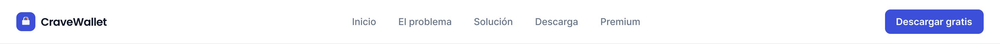

<!-- pdf:omit-start -->

*Figura 58. Barra de navegación superior del landing page de CraveWallet (Desktop).*

<!-- pdf:omit-end -->

*Fuente: elaboración del equipo Gastify.*

La barra de navegación es el primer elemento que el usuario percibe y el componente de arquitectura de información más crítico del sitio. Se implementa con posición `sticky`, de modo que permanece visible en todo momento durante el scroll, tal como se especificó en el sistema de navegación del landing page (sección 3.1.2.5).

El isologotipo "CraveWallet" se ubica en el extremo izquierdo sobre fondo blanco (`color-surface`), respetando la regla de uso de marca definida en el Design System. Los enlaces de sección ("Inicio", "El problema", "Solución", "Descarga" y "Premium") se disponen centrados con tipografía Inter Medium 14px en `color-on-surface-variant` (`#64748B`), adoptando el sistema de etiquetas de navegación definido en la sección 3.1.2.2. El CTA "Descargar gratis" ocupa el extremo derecho como botón primario con relleno `color-primary` (`#3B4FD8`) y texto blanco (`color-on-primary`), lo que mantiene visible y accesible la acción principal independientemente de la posición en el scroll. El contraste del par `#FFFFFF`/`#3B4FD8` es de 5.2:1, cumpliendo WCAG 2.1 AA.

***

**Sección Hero — Propuesta de valor**

La figura 59 muestra la sección Hero del landing page de CraveWallet (Desktop).

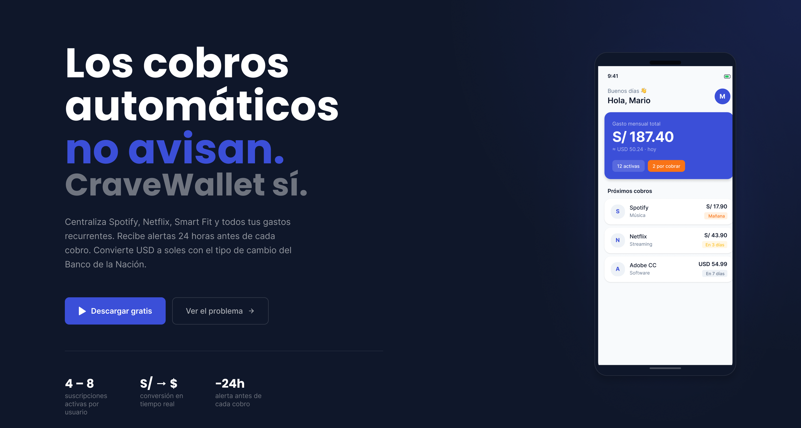

<!-- pdf:omit-start -->

*Figura 59. Sección Hero del landing page de CraveWallet (Desktop).*

<!-- pdf:omit-end -->

*Fuente: elaboración del equipo Gastify.*

La sección Hero ocupa el viewport completo (`min-h-screen`) con fondo oscuro `color-on-surface` (`#0F172A`), estableciendo el contraste visual necesario para capturar la atención inmediata del usuario. Se aplica un layout de dos columnas: la columna izquierda contiene el copy y los CTAs; la columna derecha contiene el mockup de teléfono que muestra la interfaz real de la aplicación, reduciendo la abstracción y generando credibilidad inmediata.

El titular "Los cobros automáticos no avisan. CraveWallet sí." utiliza Poppins Bold en tamaño fluido (`clamp(44px, 6.5vw, 76px)`), con el fragmento "no avisan." en `color-primary` (`#3B4FD8`) para resaltar el problema y el nombre de la solución en texto blanco con opacidad reducida, creando una jerarquía de lectura de tres niveles. El principio de contraste de Gestalt se aplica deliberadamente: el texto más importante (la afirmación del problema) lleva el color más saturado.

El cuerpo de texto utiliza Inter Regular 16px en `rgba(255,255,255,0.55)` para mantener legibilidad sin competir con el titular. Los dos CTAs ("Descargar gratis" (botón primario `#3B4FD8`) y "Ver el problema" (botón fantasma con borde `rgba(255,255,255,0.15)`)) siguen la jerarquía de acciones definida en el sistema de etiquetas (sección 3.1.2.2), donde la acción primaria siempre tiene mayor peso visual. Un indicador de estado `Disponible para Android` con punto verde pulsante (`color-success` `#22C55E`) añade contexto de disponibilidad sin ocupar espacio prominente.

La fila de estadísticas en la base ("4–8 suscripciones activas", "S/ → $", "−24h") aplica el principio de prueba social cuantificada, separada del cuerpo por una línea divisoria `rgba(255,255,255,0.08)` que respeta el sistema de elevación sin añadir peso visual. Desde la perspectiva de arquitectura de información, esta sección cumple el esquema de organización jerárquico: propuesta de valor → descripción → acción → evidencia, de mayor a menor generalidad.

***

**Sección El Problema**

La figura 60 muestra la sección "El Problema" del landing page de CraveWallet (Desktop).

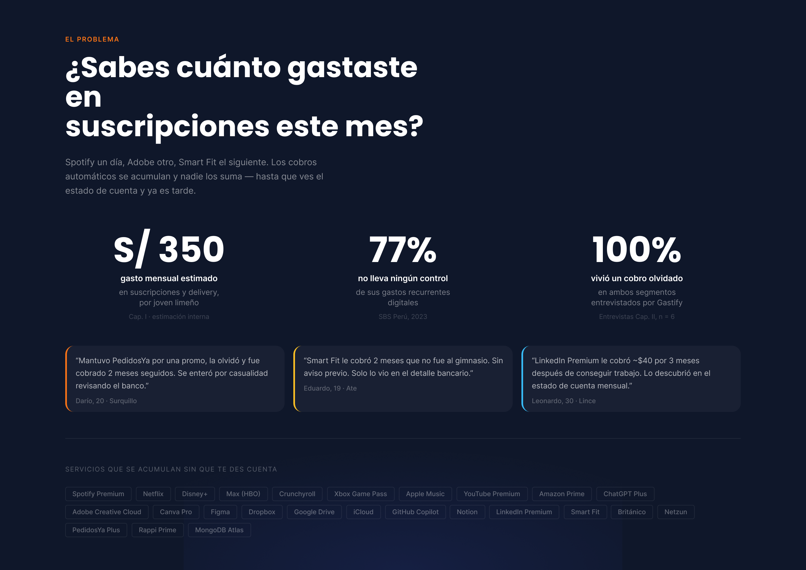

<!-- pdf:omit-start -->

*Figura 60. Sección "El Problema" del landing page de CraveWallet (Desktop).*

<!-- pdf:omit-end -->

*Fuente: elaboración del equipo Gastify.*

La sección de problema mantiene el fondo oscuro `color-on-surface` para crear continuidad narrativa con el Hero, reforzando la tensión emocional antes de presentar la solución. El eyebrow "EL PROBLEMA" en `color-accent` (`#F97316`) y mayúsculas actúa como etiqueta de sección, siguiendo el sistema de etiquetado jerárquico definido en la arquitectura de información (sección 3.1.2.1).

El titular "¿Sabes cuánto gastaste en suscripciones este mes?" utiliza Poppins SemiBold 32px en blanco, formulado como pregunta retórica para activar la identificación del usuario con el problema. Le sigue una bajada en Inter Regular 16px que nombra marcas específicas (Spotify, Adobe, Smart Fit) para anclar el problema en la experiencia cotidiana del segmento objetivo.

Las tres estadísticas cuantitativas emplean Poppins Bold 48px (el tamaño de monto principal del sistema tipográfico) para maximizar el impacto de los datos. Cada una tiene sustento en el informe: hasta 2 meses tardaron los entrevistados en descubrir un cobro olvidado y el 100 % vivió uno (sección 2.2.3), y el 41 % de los adultos peruanos está por debajo del nivel mínimo de educación financiera [@sbs2022capacidades, p. 10]. Bajo cada cifra, una fuente de dato en Inter Regular 12px (`color-on-surface-variant`) mantiene la trazabilidad académica sin interrumpir el flujo visual. Los tres testimonios de usuario se presentan en tarjetas con borde izquierdo de acento (`color-primary`) y tipografía en cursiva, aplicando el principio de proximidad de Gestalt para agrupar la evidencia cualitativa. La fila de logos de servicios en la parte inferior (Spotify, Netflix, Disney+, Adobe, entre otros) refuerza el reconocimiento de marca y la relevancia del problema mediante el principio de similitud: todos los logos tienen el mismo tamaño y tratamiento visual monocromático.

Desde el ángulo del diseño inclusivo, los testimonios incluyen identificación de segmento (edad, ciudad, ocupación) que incrementa la representatividad y facilita la empatía en usuarios de diferentes perfiles dentro del segmento objetivo.

***

**Sección Solución — Features**

La figura 61 muestra la sección "Solución" del landing page de CraveWallet (Desktop).

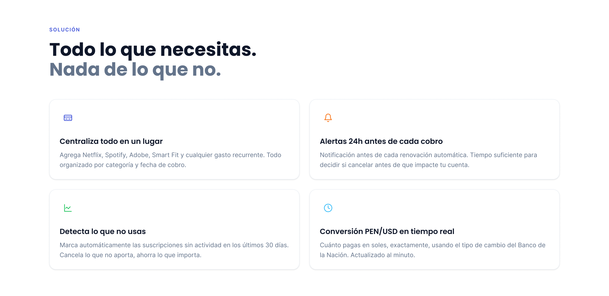

<!-- pdf:omit-start -->

*Figura 61. Sección "Solución" del landing page de CraveWallet (Desktop).*

<!-- pdf:omit-end -->

*Fuente: elaboración del equipo Gastify.*

La sección de solución introduce el primer fondo claro (`color-surface`, `#FFFFFF`), creando una ruptura visual deliberada que señala el cambio de tono: del problema a la respuesta. Este alternado oscuro/claro es un recurso de ritmo visual que facilita la segmentación cognitiva del contenido durante el scroll.

El eyebrow "SOLUCIÓN" en `color-primary` y el titular "Todo lo que necesitas. / Nada de lo que no." en Poppins SemiBold combinan la promesa de completitud con la de simplicidad, valores centrales del tono de comunicación definido (casual 75%, sereno 40%). Las cuatro feature cards se organizan en un grid de 2×2 columnas, cada una con un ícono Material Symbols de 24px en `color-primary`, un título Inter SemiBold 16px y un cuerpo Inter Regular 14px en `color-on-surface-variant`. Las tarjetas tienen bordes `color-surface-variant` (`#EEF2F7`) y esquinas redondeadas con `border-radius: 16px` (token `radius-lg`), coherentes con el sistema de elevación nivel 1.

Las cuatro funcionalidades presentadas (centralización, alertas 24h, detección de inactividad y conversión PEN/USD) responden directamente a los hallazgos de investigación de usuario del Capítulo I, estableciendo un puente explícito entre necesidad detectada y feature implementada. Desde la perspectiva de arquitectura de información, este bloque aplica el esquema matricial (sección 3.1.2.1): cuatro funcionalidades comparables en el mismo nivel de jerarquía, organizadas espacialmente para facilitar la comparación visual.

El diseño inclusivo se manifiesta en el uso de íconos siempre acompañados de etiqueta de texto (no icono solo) para facilitar la comprensión con independencia del nivel de alfabetización visual del usuario.

***

**Sección App Preview**

La figura 62 muestra la sección "App Preview" del landing page de CraveWallet (Desktop).

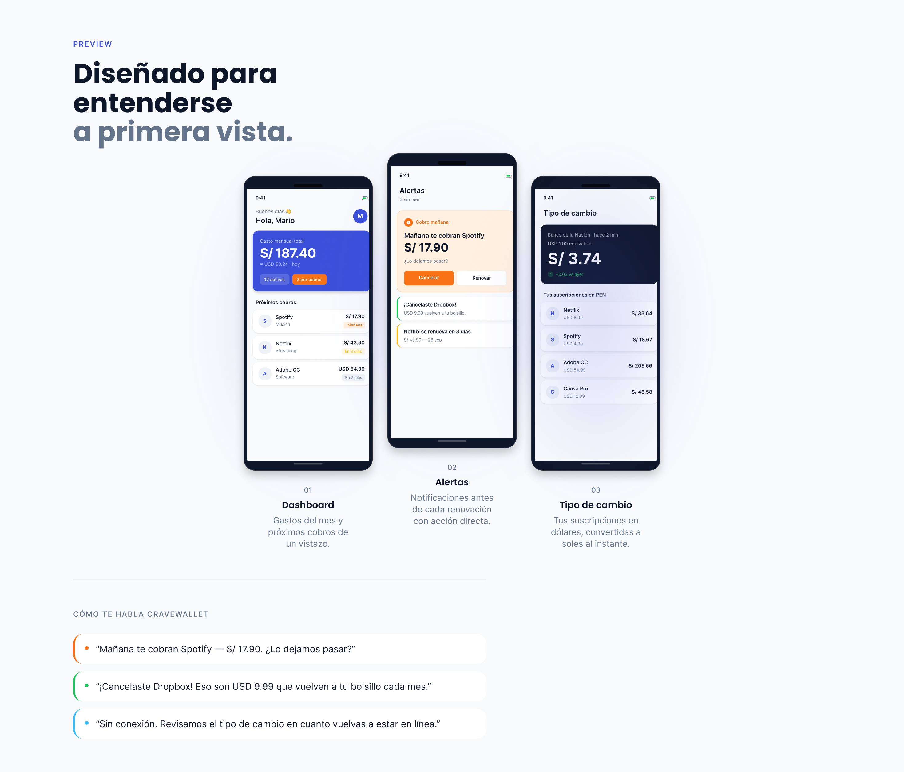

<!-- pdf:omit-start -->

*Figura 62. Sección "App Preview" del landing page de CraveWallet (Desktop).*

<!-- pdf:omit-end -->

*Fuente: elaboración del equipo Gastify.*

La sección de preview vuelve al fondo claro `color-background` (`#F8FAFC`) y presenta tres capturas reales de la interfaz de la aplicación móvil (Dashboard, Alertas y Tipo de cambio) dentro de marcos de teléfono, reduciendo la brecha entre la promesa del landing y la realidad del producto. Este elemento de "prueba de producto" responde al principio de transparencia del diseño de confianza: mostrar la interfaz real en lugar de ilustraciones genéricas aumenta la credibilidad percibida.

El titular "Diseñado para entenderse a primera vista." con el segmento complementario en `color-primary` refuerza el posicionamiento de usabilidad. Cada mockup de teléfono tiene su propia etiqueta (nombre de pantalla + descripción de una línea) con tipografía Inter Regular 12px en `color-on-surface-variant`, siguiendo el sistema de etiquetado de la sección 3.1.2.2.

La parte inferior presenta tres ejemplos de microcopy de la aplicación en tarjetas de color codificadas (naranja para alerta, verde para celebración, azul para estado neutral), aplicando el sistema de colores semánticos del Design System (`color-accent`, `color-success`, `color-info`). Esta elección permite al usuario anticipar cómo le hablará la aplicación antes de descargarla, reduciendo la incertidumbre de adopción.

***

**Sección Prueba Social**

La figura 63 muestra la sección "Prueba Social" del landing page de CraveWallet (Desktop).

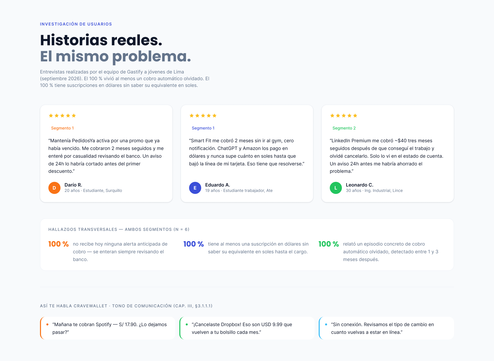

<!-- pdf:omit-start -->

*Figura 63. Sección "Prueba Social" del landing page de CraveWallet (Desktop).*

<!-- pdf:omit-end -->

*Fuente: elaboración del equipo Gastify.*

La sección de prueba social refuerza la credibilidad mediante evidencia de investigación de usuarios primaria. El eyebrow "INVESTIGACIÓN DE USUARIOS" establece el origen metodológico de los datos, diferenciando los testimonios de opiniones espontáneas. El titular "Historias reales. / El mismo problema." aplica el principio de universalidad: el problema no es individual, es estructural.

Las tres tarjetas de testimonio presentan citas verbatim de usuarios reales entrevistados durante la fase de needfinding, identificados por segmento (Segmento 1, Segmento 2, Segmento 3) con avatar inicial, nombre, edad e identificador de segmento. Las citas están en cursiva Inter Regular 14px para distinguirlas visualmente del texto explicativo, siguiendo la convención tipográfica de cita directa.

La fila de hallazgos transversales ("100% no recibe hoy ninguna alerta anticipada de cobro", "100% tiene al menos una suscripción en dólares sin saber su equivalente en soles", "100% relató un episodio concreto de cobro automático olvidado") utiliza el mismo tratamiento tipográfico de estadística que la sección de problema, creando consistencia de patrón y facilitando el reconocimiento del tipo de dato. Los porcentajes en `color-accent` (`#F97316`) anclan visualmente los hallazgos más críticos. El microcopy de cierre vuelve a presentar los tres ejemplos de tono de comunicación, cerrando la sección con la voz del producto en lugar de la voz del investigador.

Desde el diseño inclusivo, los testimonios incluyen diversidad de perfil socioeconómico y ocupacional (estudiante/trabajador, Lima/provincias), reflejando la amplitud real del segmento objetivo y evitando la representación homogénea.

***

**Sección Planes**

La figura 64 muestra la sección "Planes" del landing page de CraveWallet (Desktop).

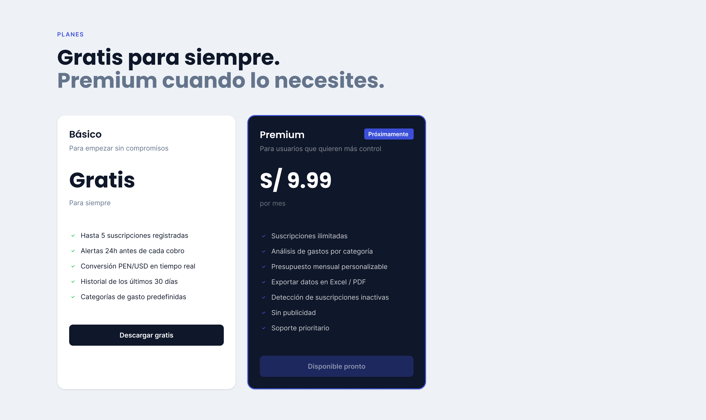

<!-- pdf:omit-start -->

*Figura 64. Sección "Planes" del landing page de CraveWallet (Desktop).*

<!-- pdf:omit-end -->

*Fuente: elaboración del equipo Gastify.*

La sección de planes vuelve al fondo claro `color-surface-variant` (`#EEF2F7`) para diferenciarse visualmente de las secciones adyacentes. El titular "Gratis para siempre. / Premium cuando lo necesites." gestiona la expectativa del usuario desde la primera lectura: la gratuidad es permanente, no temporal. Esta elección de copy responde a la estrategia freemium del modelo de negocio documentado en el Capítulo I.

Las dos tarjetas de plan (Básico y Premium) se disponen en un layout de dos columnas con jerarquía visual clara: la tarjeta Básico tiene fondo blanco `color-surface` con borde `color-surface-variant`; la tarjeta Premium tiene fondo oscuro `color-on-surface` con borde `color-primary` de 2px de grosor, siguiendo el principio de contraste de Gestalt para señalar el plan recomendado sin necesidad de una etiqueta explícita de "popular". La badge "Próximamente" en `color-primary` sobre la tarjeta Premium cumple función informativa y de expectativa.

Los listados de features utilizan íconos de verificación `✓` en `color-success` para el plan Básico y el mismo ícono en azul para Premium, creando consistencia semántica. La diferencia de densidad de features (5 vs 7) es visualmente evidente sin requerir comparación línea a línea. El precio "S/ 9.99 por mes" en Poppins Bold 48px aplica el token de tamaño de monto principal, coherente con la tipografía de datos numéricos del sistema. El botón "Descargar gratis" del plan Básico es el CTA principal de la sección; el botón "Disponible pronto" del plan Premium tiene opacidad reducida, señalando el estado deshabilitado sin necesidad de texto adicional.

El diseño inclusivo se manifiesta en la presentación clara de las diferencias entre planes sin oscurecer el plan gratuito: el orden visual no penaliza al usuario que no puede o no quiere pagar el plan Premium.

***

**Sección Descarga — CTA Final**

La figura 65 muestra la sección "Descarga" del landing page de CraveWallet (Desktop).

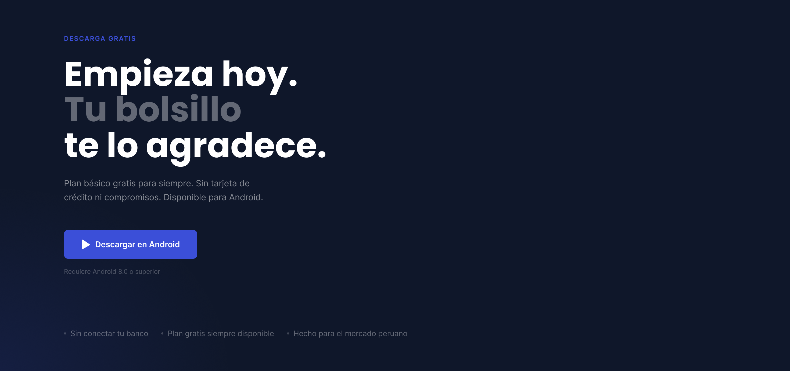

<!-- pdf:omit-start -->

*Figura 65. Sección "Descarga" del landing page de CraveWallet (Desktop).*

<!-- pdf:omit-end -->

*Fuente: elaboración del equipo Gastify.*

La sección de descarga retorna al fondo oscuro `color-on-surface` para el cierre narrativo, creando simetría visual con la sección Hero y señalando el remate del flujo de persuasión. El titular "Empieza hoy. / Tu bolsillo / te lo agradece." en Poppins Bold a máximo tamaño rompe con el formato de dos columnas de las secciones anteriores, centrando toda la atención en el mensaje y el CTA único.

El botón "Descargar en Android" es el único elemento interactivo de la sección, lo que elimina la competencia de atención y maximiza la tasa de conversión. Lleva el ícono de Play (Google Play Store) en blanco sobre `color-primary`, reproduciendo el patrón visual establecido desde el CTA del Hero. La nota "Requiere Android 8.0 o superior" en Inter Regular 12px `rgba(255,255,255,0.4)` gestiona expectativas técnicas sin ocupar espacio prominente.

La fila de garantías al pie ("Sin conectar tu banco", "Plan gratis siempre disponible", "Hecho para el mercado peruano") aplica el patrón de "trust badges" que reduce la fricción de la última milla antes de la descarga. El uso del separador "→" entre badges crea un ritmo de lectura izquierda-derecha coherente con el patrón de lectura occidental en pantallas amplias. Desde la arquitectura de información, esta sección cierra el esquema secuencial establecido en la sección 3.1.2.1: el usuario que llega aquí ha completado el flujo problema → solución → evidencia → planes → acción.

***

**Footer**

La figura 66 muestra el footer del landing page de CraveWallet (Desktop).

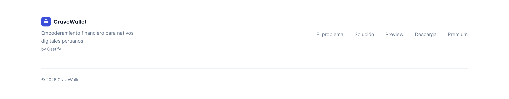

<!-- pdf:omit-start -->

*Figura 66. Footer del landing page de CraveWallet (Desktop).*

<!-- pdf:omit-end -->

*Fuente: elaboración del equipo Gastify.*

El footer retorna al fondo blanco `color-surface` y cumple una doble función: reafirmar la identidad de marca y ofrecer acceso secundario a las secciones del sitio para usuarios que llegan al final sin haber convertido. El isologotipo CraveWallet en el extremo izquierdo va acompañado del tagline "Empoderamiento financiero para nativos digitales peruanos." en Inter Regular 14px y la atribución "by Gastify", manteniendo la trazabilidad corporativa establecida en el branding del Design System.

Los cinco enlaces de sección ("El problema", "Solución", "Preview", "Descarga", "Premium") se ubican en el extremo derecho con tipografía Inter Regular 14px `color-on-surface-variant`, siguiendo el mismo sistema de etiquetas de la barra de navegación y reforzando la consistencia del sistema de etiquetado (sección 3.1.2.2). La línea divisoria superior y el copyright "© 2026 CraveWallet" en Inter Regular 12px cierran el footer con los elementos mínimos de cumplimiento legal y temporal.

La simplicidad del footer es deliberada: en el contexto de un landing page de producto en etapa de lanzamiento, añadir columnas de links, formularios de newsletter o redes sociales generaría ruido visual sin aportar valor a los objetivos de conversión del sitio.

***

##### Síntesis de principios de diseño aplicados — Desktop

La tabla 125 resume la correspondencia entre las secciones del mock-up desktop y los principios, elementos de diseño, diseño inclusivo y arquitectura de información documentados en el Design System:

*Tabla 125. Síntesis de principios de diseño del mock-up desktop.*

| Sección | Principio de diseño | Elemento del Design System | Diseño inclusivo | Arquitectura de Información |
| --- | --- | --- | --- | --- |
| Navbar | Visibilidad constante (sticky) | Tokens `color-primary`, `color-surface`, Inter Medium 14px | Contraste 6.4:1 en CTA, acceso siempre disponible | Navegación top con anclas de sección (sección 3.1.2.5) |
| Hero | Jerarquía visual, contraste Gestalt | `color-on-surface`, Poppins Bold `clamp(44–76px)`, `color-primary` acento | Contraste `#FFFFFF`/`#0F172A` > 16:1, ícono + texto en CTAs | Esquema jerárquico: propuesta → descripción → acción |
| El Problema | Proximidad Gestalt, ritmo oscuro/claro | `color-accent` eyebrow, Poppins Bold 48px para datos, `color-primary` borde tarjetas | Identificación de segmento en testimonios, diversidad de perfiles | Datos cuantitativos + cualitativos, logos de reconocimiento |
| Solución | Esquema matricial, consistencia ícono+texto | `radius-lg` tarjetas, `color-surface-variant` bordes, `color-primary` íconos | Ícono siempre con etiqueta de texto | Grid 2×2 columnas, etiquetas descriptivas (sección 3.1.2.2) |
| Preview | Transparencia, prueba de producto | Mockups reales, `color-success`/`color-accent`/`color-info` microcopy | Pantallas reales reducen incertidumbre de adopción | Etiquetas por pantalla, microcopy clasificado por tipo |
| Prueba Social | Credibilidad, universalidad | `color-accent` para datos clave, Inter cursiva para citas | Diversidad de perfil (edad, ciudad, ocupación) en testimonios | Evidencia primaria de investigación de usuarios |
| Planes | Contraste Gestalt, jerarquía freemium | `color-on-surface` tarjeta premium, borde `color-primary` 2px, `color-success` checks | Plan gratuito no penalizado visualmente | Comparación de features, gestión de expectativa Premium |
| Descarga | Foco único, trust badges | `color-primary` CTA único, Poppins Bold máximo tamaño | CTA único elimina ambigüedad de acción | Cierre del esquema secuencial (sección 3.1.2.1) |
| Footer | Consistencia, mínimos legales | `color-surface`, Inter Regular 14px, mismo sistema de etiquetas que navbar | Acceso alternativo a secciones para usuarios no convertidos | Reafirmación del sistema de etiquetado de sección 3.1.2.2 |

*Fuente: elaboración del equipo Gastify.*

***

##### Mobile Web Browser — Vista completa

En breakpoints inferiores a 600px, el landing page adapta su layout al grid de 4 columnas con gutters de 16px definido en la sección 3.1.1.2. Todos los elementos en disposición horizontal o multi-columna colapsan a una única columna de lectura vertical. Los principios de diseño, tokens y arquitectura de información son los mismos que en la versión desktop; lo que varía es exclusivamente la disposición espacial de los componentes para adecuarse al viewport reducido. El Chrome del navegador móvil (barra de dirección con dominio `cravewallet.gastify.pe`) forma parte del contexto de uso antes del primer pixel del sitio.

La figura 67 muestra el landing page de CraveWallet dentro del navegador móvil.

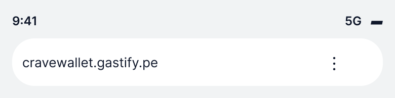

<!-- pdf:omit-start -->

*Figura 67. Landing page de CraveWallet dentro del navegador móvil.*

<!-- pdf:omit-end -->

*Fuente: elaboración del equipo Gastify.*

***

**Barra de navegación superior — Mobile**

La figura 68 muestra la barra de navegación superior del landing page de CraveWallet (Mobile).

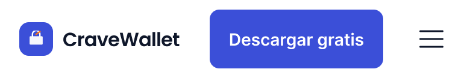

<!-- pdf:omit-start -->

*Figura 68. Barra de navegación superior del landing page de CraveWallet (Mobile).*

<!-- pdf:omit-end -->

*Fuente: elaboración del equipo Gastify.*

Los cinco enlaces colapsan a un hamburger (`≡`). El CTA "Descargar gratis" permanece visible en la barra para mantener acceso directo a la acción principal sin requerir apertura del menú.

***

**Sección Hero — Mobile**

La figura 69 muestra la sección Hero del landing page de CraveWallet (Mobile).

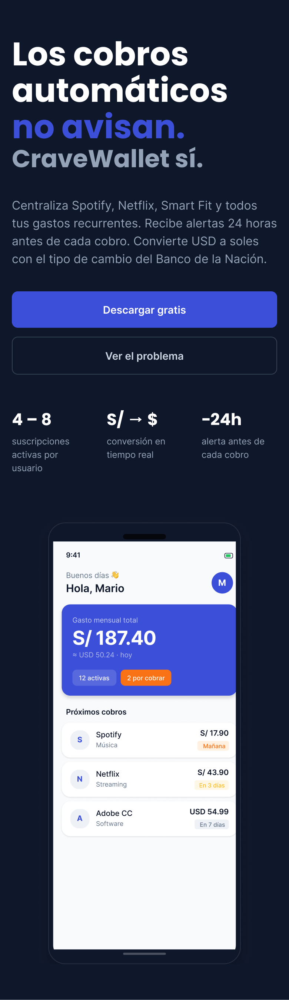

<!-- pdf:omit-start -->

*Figura 69. Sección Hero del landing page de CraveWallet (Mobile).*

<!-- pdf:omit-end -->

*Fuente: elaboración del equipo Gastify.*

El layout de dos columnas colapsa a una sola. Los CTAs pasan a disposición vertical de ancho completo, ampliando el área de toque. El mockup de teléfono se reposiciona debajo del copy para evitar competencia visual entre texto e imagen en el viewport estrecho.

***

**Sección El Problema — Mobile**

La figura 70 muestra la sección "El Problema" del landing page de CraveWallet (Mobile).

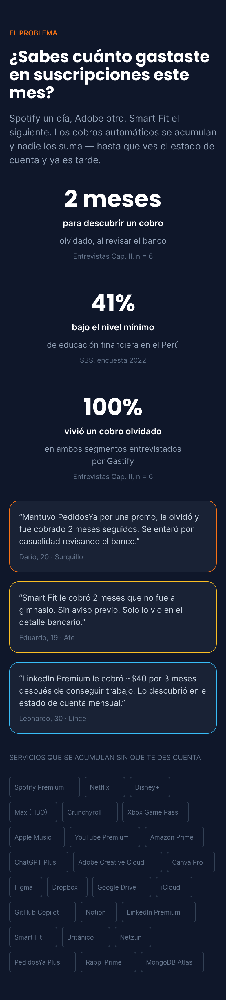

<!-- pdf:omit-start -->

*Figura 70. Sección "El Problema" del landing page de CraveWallet (Mobile).*

<!-- pdf:omit-end -->

*Fuente: elaboración del equipo Gastify.*

Las tres estadísticas pasan de tres columnas a stack vertical. Los testimonios y la cuadrícula de logos adaptan su número de columnas mediante `flex-wrap` según el ancho disponible.

***

**Sección Solución — Mobile**

La figura 71 muestra la sección "Solución" del landing page de CraveWallet (Mobile).

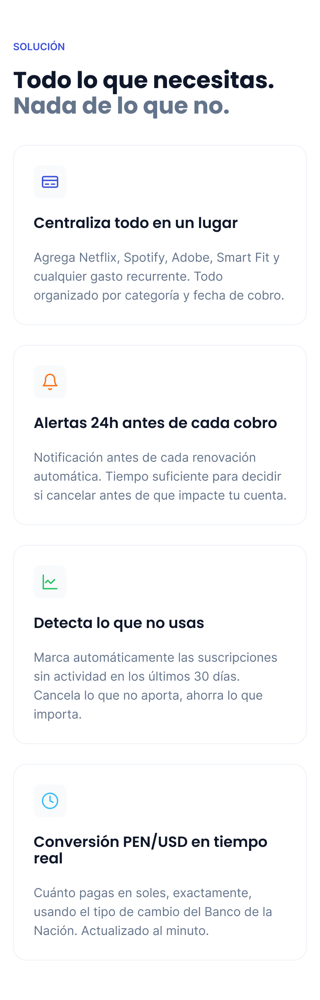

<!-- pdf:omit-start -->

*Figura 71. Sección "Solución" del landing page de CraveWallet (Mobile).*

<!-- pdf:omit-end -->

*Fuente: elaboración del equipo Gastify.*

El grid 2×2 colapsa a un stack 1×4. La secuencia vertical (Centraliza → Alertas → Detecta → Convierte) refleja el orden lógico de uso de la aplicación, haciendo la arquitectura secuencial más explícita que en el grid desktop.

***

**Sección App Preview — Mobile**

La figura 72 muestra la sección "App Preview" del landing page de CraveWallet (Mobile).

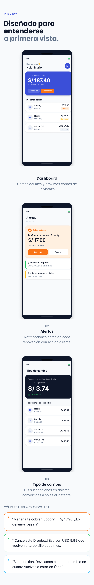

<!-- pdf:omit-start -->

*Figura 72. Sección "App Preview" del landing page de CraveWallet (Mobile).*

<!-- pdf:omit-end -->

*Fuente: elaboración del equipo Gastify.*

Los tres mockups de teléfono pasan de fila horizontal a stack vertical. El contexto es especialmente efectivo: el usuario ve las pantallas de la app en el mismo tipo de dispositivo desde el que eventualmente la descargará.

***

**Sección Prueba Social — Mobile**

La figura 73 muestra la sección "Prueba Social" del landing page de CraveWallet (Mobile).

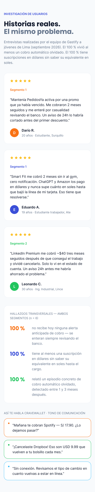

<!-- pdf:omit-start -->

*Figura 73. Sección "Prueba Social" del landing page de CraveWallet (Mobile).*

<!-- pdf:omit-end -->

*Fuente: elaboración del equipo Gastify.*

Las tres tarjetas de testimonio y los hallazgos transversales se apilan en columna única a ancho completo, permitiendo lectura íntegra de las citas sin truncamiento.

***

**Sección Planes — Mobile**

La figura 74 muestra la sección "Planes" del landing page de CraveWallet (Mobile).

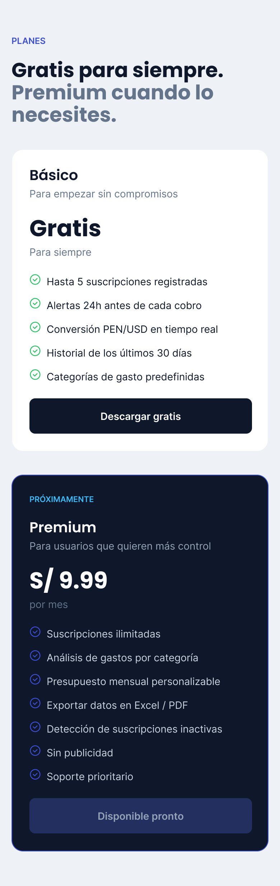

<!-- pdf:omit-start -->

*Figura 74. Sección "Planes" del landing page de CraveWallet (Mobile).*

<!-- pdf:omit-end -->

*Fuente: elaboración del equipo Gastify.*

Las dos tarjetas de plan pasan de columnas paralelas a stack vertical, con el plan Básico primero. Ambos botones de acción quedan a ancho completo, maximizando el área de toque.

***

**Sección Descarga — Mobile**

La figura 75 muestra la sección "Descarga" del landing page de CraveWallet (Mobile).

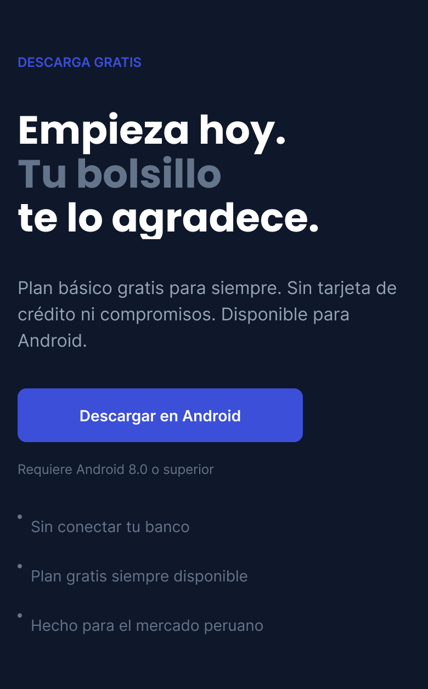

<!-- pdf:omit-start -->

*Figura 75. Sección "Descarga" del landing page de CraveWallet (Mobile).*

<!-- pdf:omit-end -->

*Fuente: elaboración del equipo Gastify.*

El CTA "Descargar en Android" pasa a ancho completo. Los trust badges se distribuyen en dos columnas o stack según el ancho disponible.

***

**Footer — Mobile**

La figura 76 muestra el footer del landing page de CraveWallet (Mobile).

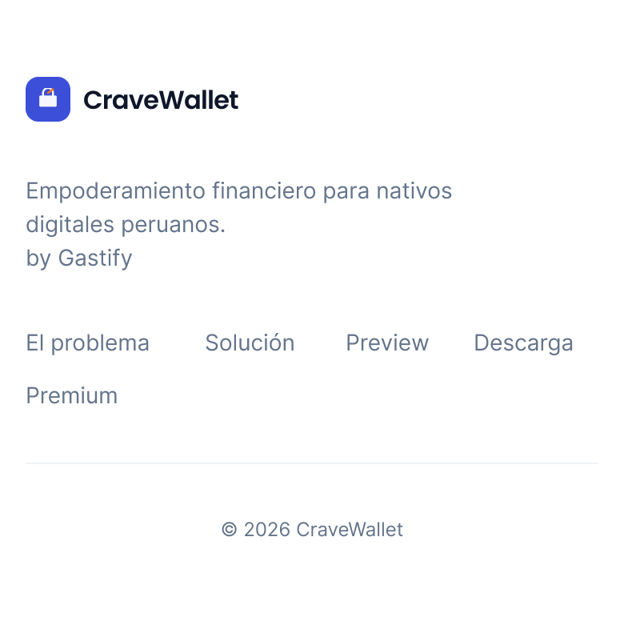

<!-- pdf:omit-start -->

*Figura 76. Footer del landing page de CraveWallet (Mobile).*

<!-- pdf:omit-end -->

*Fuente: elaboración del equipo Gastify.*

El isologotipo, tagline y enlaces de sección se apilan verticalmente. El espaciado entre elementos garantiza touch targets mínimos de 44×44px según las guías de accesibilidad de Android.

***

##### Síntesis de adaptaciones Mobile

La tabla 126 documenta las adaptaciones específicas de cada sección al breakpoint mobile (< 600px) y su justificación desde los principios de diseño y diseño inclusivo:

*Tabla 126. Síntesis de adaptaciones del mock-up mobile.*

| Sección | Cambio desktop → mobile | Principio aplicado | Impacto en accesibilidad |
| --- | --- | --- | --- |
| Navbar | Links → hamburger; CTA visible en barra | Convención mobile nativa | CTA siempre accesible sin abrir menú |
| Hero | 2 columnas → 1 columna; CTAs apilados a ancho completo | Legibilidad en viewport estrecho | Touch target 100% ancho, sin precisión de puntero |
| El Problema | Stats 3 columnas → stack vertical; testimonios apilados | Jerarquía de lectura vertical | Tipografía grande legible sin zoom |
| Solución | Grid 2×2 → stack 1×4 | Secuencia lógica de uso explícita | Sin scrolling horizontal, sin truncamiento |
| Preview | Mockups en fila → apilados | Correspondencia dispositivo-contenido | Etiquetas a ancho completo, sin truncamiento |
| Prueba Social | Tarjetas 3 columnas → stack | Densidad de información controlada | Citas completas sin truncamiento |
| Planes | Tarjetas paralelas → apiladas; plan gratuito primero | Accesibilidad del plan gratuito como primer elemento | Botones a ancho completo, sin precisión de puntero |
| Descarga | Botón centrado → botón a ancho completo | Maximizar conversión en último paso | Área de toque máxima en acción crítica |
| Footer | Links en fila → apilados/2 columnas | Touch targets mínimos 44×44px | Navegación secundaria accesible |

*Fuente: elaboración del equipo Gastify.*

### 3.1.4. Mobile Applications UX/UI Design

La aplicación móvil muestra en una sola cifra, en soles, cuánto cuestan las suscripciones del usuario y le avisa antes de cada cobro. Su interfaz se diseñó en cinco artefactos: los wireframes fijan la estructura de cada pantalla (3.1.4.1), los wireflows las unen en recorridos (3.1.4.2), los mock-ups aplican el Design System de la sección 3.1.1 (3.1.4.3), los user flows muestran las decisiones, alternativas y errores detrás de cada recorrido (3.1.4.4) y el prototipo permite recorrer los tres objetivos de usuario con el dedo (3.1.4.5).

Son 31 pantallas de 360 x 800 dp, la clase compacta de las Mobile Style Guidelines (sección 3.1.1.3), para Android con Material Design 3. Cada pantalla lleva un código formado por la letra de su área y un número, que se mantiene en todos los artefactos. Las áreas corresponden a los cuatro destinos de la barra de navegación inferior definidos en la sección 3.1.2.5, más el flujo de alta, que se abre como hoja modal desde el botón Agregar (tabla 127).

*Tabla 127. Áreas de la aplicación móvil.*

| Letra | Área | Destino en la navegación | Pantallas |
| --- | --- | --- | --- |
| **I** | Inicio | Inicio (`home`) | I1 a I4 |
| **G** | Gastos | Gastos (`receipt_long`) | G1 a G3 |
| **A** | Agregar suscripción | Bottom sheet desde el FAB Agregar | A1 a A9 |
| **N** | Análisis | Análisis (`bar_chart`, Premium) | N1 a N6 |
| **P** | Perfil y recordatorios | Perfil (`person`) | P1 a P9 |

*Fuente: elaboración del equipo Gastify.*

Los tres objetivos de usuario (User Goals) que ordenan el diseño salen de los hallazgos del Needfinding: el registro sin fricción, la conversión a soles y el aviso anticipado son las tres motivaciones que comparten Camila Torres y Renzo Salazar (sección 2.3.1).

La tabla 128 presenta los User Goals, su persona y sus User Stories principales.

*Tabla 128. User Goals de la aplicación móvil.*

| User Goal | Objetivo | Persona | User Stories principales |
| --- | --- | --- | --- |
| **UG1** | Añadir una nueva suscripción recurrente de forma manual | Renzo Salazar | US05, US12, US14, US15, US34, US39 |
| **UG2** | Revisar el gráfico detallado de gastos mensuales | Renzo Salazar | US08, US09, US16, US17, US21, US37 |
| **UG3** | Configurar una alerta o notificación de pago próximo | Renzo Salazar | US12, US28, US36 |

*Fuente: elaboración del equipo Gastify.*

Todas las pantallas comparten los mismos datos de ejemplo, tomados de lo que Renzo contó en su entrevista (sección 2.2.2): Spotify, Max, YouTube Premium, Smart Fit y PedidosYa Plus se cobran en soles; LinkedIn Premium (USD 39.99) y Amazon Prime (USD 14.99) se cobran en dólares y se muestran convertidos con el tipo de cambio del día (S/ 3.76). LinkedIn Premium es la suscripción que Renzo olvidó cancelar después de conseguir trabajo, y por eso es el ejemplo del detalle (G3) y del hallazgo del análisis (N1). Camila Torres aparece en los estados de usuario nuevo (I2) y del plan gratuito (A9, N5), que son los que vive una estudiante con un presupuesto ajustado.

El archivo de Figma se organiza en nueve páginas: **00 Portada**, **01 Design System** (variables de color, estilos de texto, componentes e íconos), **02 Wireframes**, **03 Wireflows**, **04 Mock-ups**, **05 User Flows**, **06 Prototype**, **07 Modo oscuro** y **08 Prototype · Modo oscuro**.

**Enlace al archivo de Figma:** [CraveWallet – Mobile Applications UX/UI Design](https://www.figma.com/design/lIN0zLBZ4E0PmQudY5JOip/Mobile-UX-UI?node-id=1-32&t=o4MJV6YoUPiTIhVj-1)

#### 3.1.4.1. Mobile Applications Wireframes

Los wireframes fijan qué hay en cada pantalla y en qué orden, sin color de marca ni imágenes, para discutir la estructura antes que la apariencia. Están en escala de grises con un solo tono oscuro para la acción principal y para la cifra que más pesa (el total mensual), y con el contenido real de cada pantalla. Cada lámina lleva su título y cada pantalla un pie con su código, su nombre y las User Stories que cubre.

La estructura responde a la Arquitectura de la Información de la sección 3.1.2:

- **Sistema de navegación.** Las pantallas de primer nivel (I1, G1, N1, P1) tienen la `NavigationBar` de cuatro destinos con las etiquetas de la sección 3.1.2.2 (Inicio, Gastos, Análisis, Perfil); el destino activo se marca con el indicador relleno, el ícono relleno y la etiqueta en negrita. Las pantallas de segundo nivel (G3, N3, P2) usan el patrón push-and-pop con la flecha de retroceso en la AppBar y conservan la barra inferior. El alta se abre como bottom sheet desde el FAB Agregar, con un botón Cerrar (X) y un indicador de tres pasos (Servicio, Detalles, Recordatorio), que es el esquema secuencial definido para ese flujo.
- **Sistema de organización.** El Inicio sigue la jerarquía top-down: primero el total mensual en soles, después el cobro más próximo, los próximos cobros en un carrusel horizontal y el gasto por categoría. La lista de Gastos se ordena por próximo cobro ascendente, con búsqueda y chips de filtro deslizables (sección 3.1.2.4). El Análisis usa el esquema matricial: gráfico por mes, dona por categoría y mapa de calor categoría x mes.
- **Sistema de etiquetado.** Los estados de suscripción (Activa, Cobro hoy, Pronto, Sin usar, Cancelada, Pendiente), las acciones (Agregar, Guardar, Descartar, Activar recordatorio, Ver Premium) y los mensajes de estado vacío son los de la sección 3.1.2.2.

El diseño aplica los principios de diseño inclusivo desde esta etapa (tabla 129).

*Tabla 129. Principios de diseño inclusivo en los wireframes.*

| Principio | Cómo se resuelve en los wireframes |
| --- | --- |
| Objetivos táctiles suficientes | Todo elemento interactivo mide al menos 48 x 48 dp (sobre el mínimo de 44 x 44 pt): botones de ícono de 48 dp, filas de lista de 64 a 72 dp, campos de 56 dp y botones principales de 56 dp de alto a todo el ancho. Los chips de 32 dp se ubican en una franja de 48 dp de alto. |
| Jerarquía que no depende del color | Cada estado combina ícono y texto (por ejemplo, Pronto lleva un reloj y Sin usar un ojo tachado); los campos con error llevan borde grueso, ícono de alerta y mensaje escrito; el paso actual del indicador va en negrita; los enlaces van subrayados. En escala de grises toda la información se sigue leyendo. |
| Texto legible y escalable | Cuerpo de 14 a 16 sp, nunca menor a 11 sp, en `sp` para respetar el tamaño de fuente del sistema. |
| Lenguaje claro | Mensajes con tuteo y sin jerga financiera, según el tono de comunicación de la sección 3.1.1.1 ("Mañana te cobran Spotify. ¿Lo dejamos pasar?"). |
| Salidas en todas las pantallas | Toda pantalla tiene un camino de vuelta: flecha Atrás, Cerrar (X), Cancelar, Ahora no o un destino de la barra inferior. |

*Fuente: elaboración del equipo Gastify.*

Las 31 pantallas se agrupan en diez láminas (tabla 130).

*Tabla 130. Láminas de wireframes de la aplicación móvil.*

| Lámina | Pantallas | User Stories |
| --- | --- | --- |
| 1. Inicio y Gastos | I1 Inicio, I2 Inicio sin gastos, G1 Gastos, G2 Deslizar una tarjeta | US04, US05, US08, US09, US10, US15, US17, US27, US35 |
| 2. Detalle y alta (paso 1) | G3 Detalle de la suscripción, A1 Elegir el servicio, A2 Ingresar los datos | US04, US05, US11, US15, US16, US29, US37 |
| 3. Alta: validación, moneda y vista previa | A3 Campos obligatorios vacíos, A4 Elegir la moneda, A5 Vista previa en soles | US05, US15, US16, US34 |
| 4. Alta: recordatorio y resultado | A6 Activar el recordatorio, A7 Permiso de calendario, I3 Inicio con la nueva suscripción, I4 Guardado sin calendario | US05, US12, US14, US17, US36 |
| 5. Alta: salidas alternas | A8 Descartar el alta, A9 Límite del plan gratuito | US05, US21, US39 |
| 6. Análisis (1 de 2) | N1 Análisis mensual, N2 Mes seleccionado, N3 Detalle de una categoría | US08, US09, US15, US17, US37 |
| 7. Análisis (2 de 2) | N4 Análisis sin datos, N5 Análisis solo para Premium, N6 Análisis sin conexión | US16, US21, US39 |
| 8. Perfil y recordatorios (1 de 3) | P1 Perfil, P2 Recordatorios, P3 Permiso de notificaciones, P4 Notificaciones activadas | US03, US12, US28, US33, US36 |
| 9. Perfil y recordatorios (2 de 3) | P5 Elegir la anticipación, P6 Anticipación elegida, P7 Cambios por guardar | US12, US28 |
| 10. Perfil y recordatorios (3 de 3) | P8 Recordatorios guardados, P9 Notificaciones bloqueadas | US28, US36 |

*Fuente: elaboración del equipo Gastify.*

La figura 77 muestra los wireframes de la aplicación móvil: Inicio y Gastos (I1, I2, G1, G2).

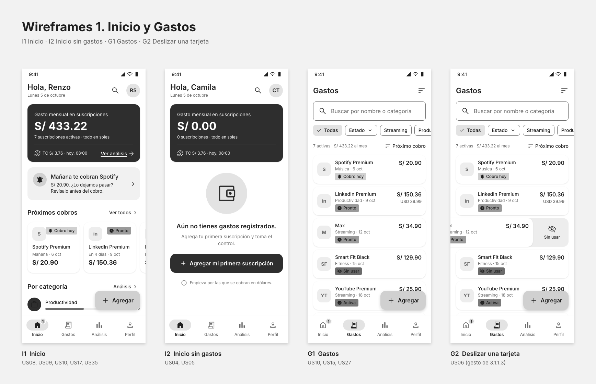

<!-- pdf:omit-start -->

*Figura 77. Wireframes de la aplicación móvil: Inicio y Gastos (I1, I2, G1, G2).*

<!-- pdf:omit-end -->

*Fuente: elaboración del equipo Gastify.*

La figura 78 muestra los wireframes de la aplicación móvil: detalle y alta, paso 1 (G3, A1, A2).

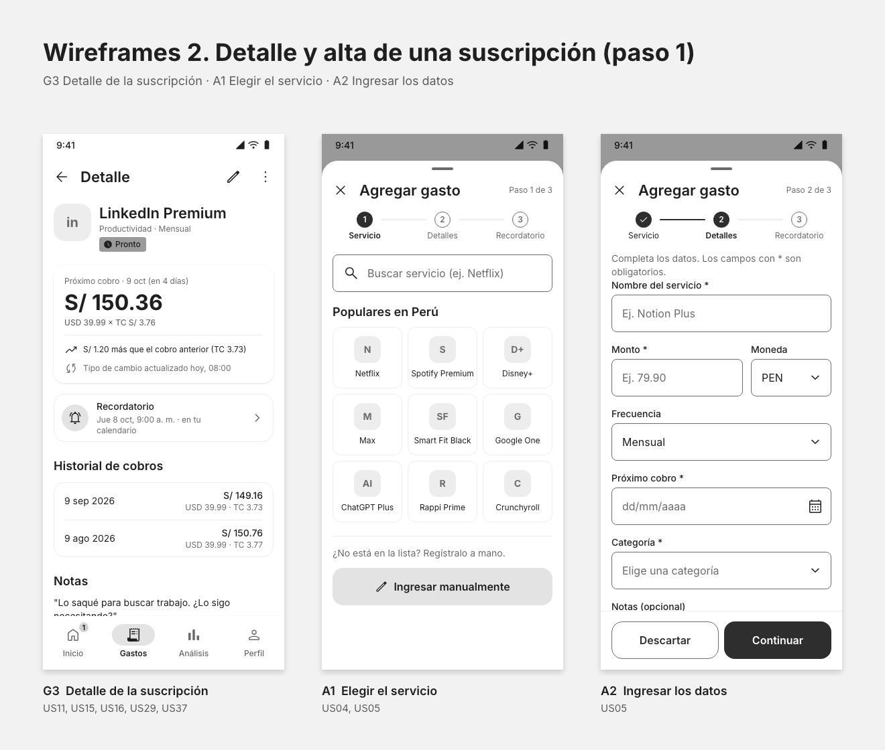

<!-- pdf:omit-start -->

*Figura 78. Wireframes de la aplicación móvil: detalle y alta, paso 1 (G3, A1, A2).*

<!-- pdf:omit-end -->

*Fuente: elaboración del equipo Gastify.*

La figura 79 muestra los wireframes de la aplicación móvil: validación, moneda y vista previa en soles (A3, A4, A5).

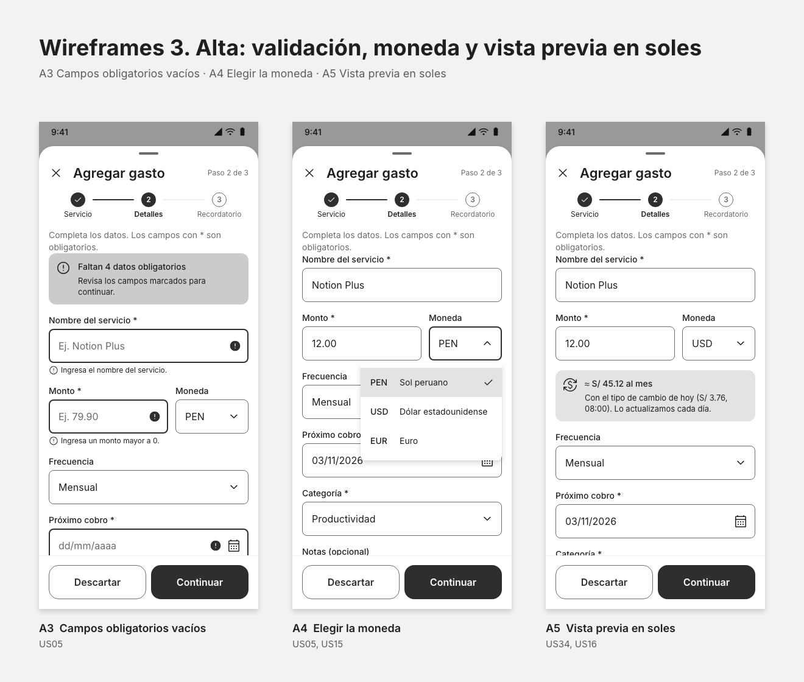

<!-- pdf:omit-start -->

*Figura 79. Wireframes de la aplicación móvil: validación, moneda y vista previa en soles (A3, A4, A5).*

<!-- pdf:omit-end -->

*Fuente: elaboración del equipo Gastify.*

La figura 80 muestra los wireframes de la aplicación móvil: recordatorio, permiso y resultado del alta (A6, A7, I3, I4).

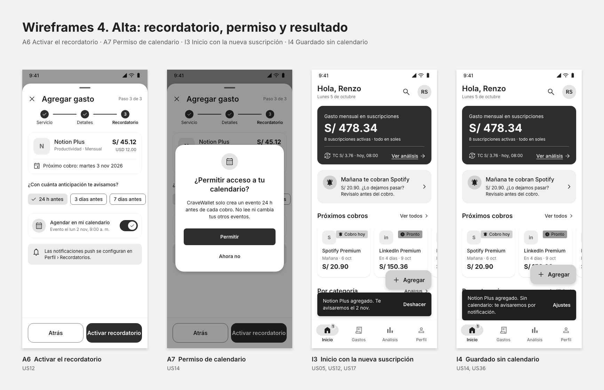

<!-- pdf:omit-start -->

*Figura 80. Wireframes de la aplicación móvil: recordatorio, permiso y resultado del alta (A6, A7, I3, I4).*

<!-- pdf:omit-end -->

*Fuente: elaboración del equipo Gastify.*

La figura 81 muestra los wireframes de la aplicación móvil: salidas alternas del alta (A8, A9).

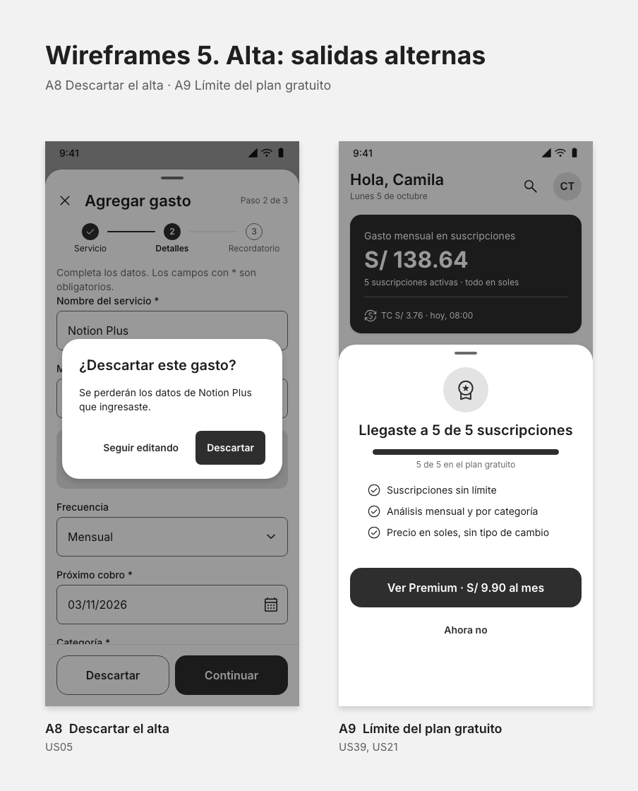

<!-- pdf:omit-start -->

*Figura 81. Wireframes de la aplicación móvil: salidas alternas del alta (A8, A9).*

<!-- pdf:omit-end -->

*Fuente: elaboración del equipo Gastify.*

La figura 82 muestra los wireframes de la aplicación móvil: Análisis, 1 de 2 (N1, N2, N3).

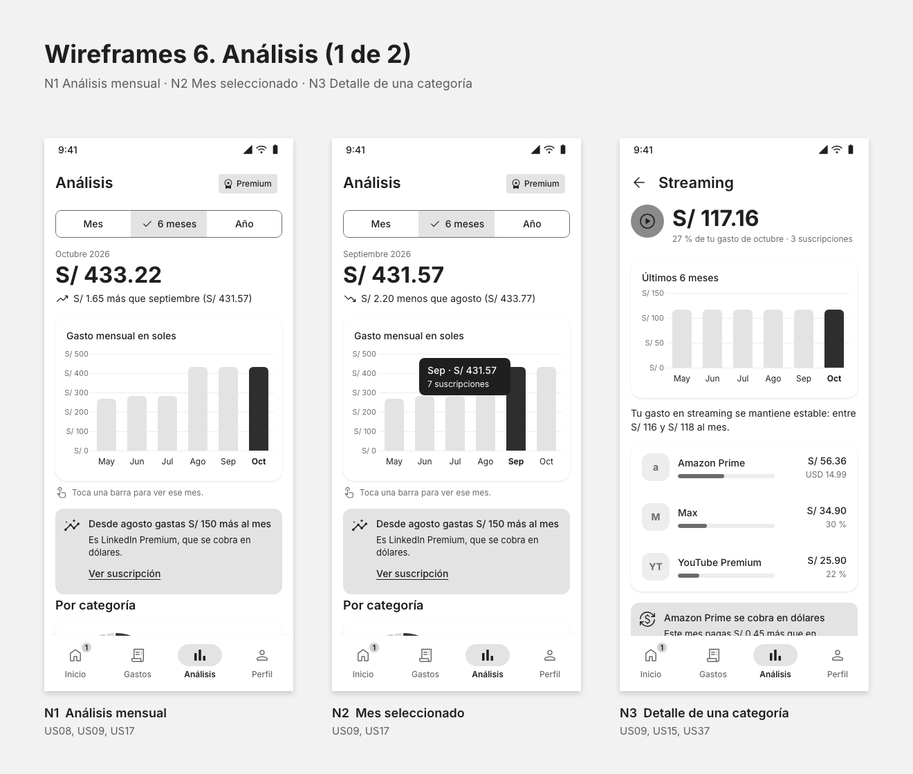

<!-- pdf:omit-start -->

*Figura 82. Wireframes de la aplicación móvil: Análisis, 1 de 2 (N1, N2, N3).*

<!-- pdf:omit-end -->

*Fuente: elaboración del equipo Gastify.*

La figura 83 muestra los wireframes de la aplicación móvil: estados alternos del Análisis (N4, N5, N6).

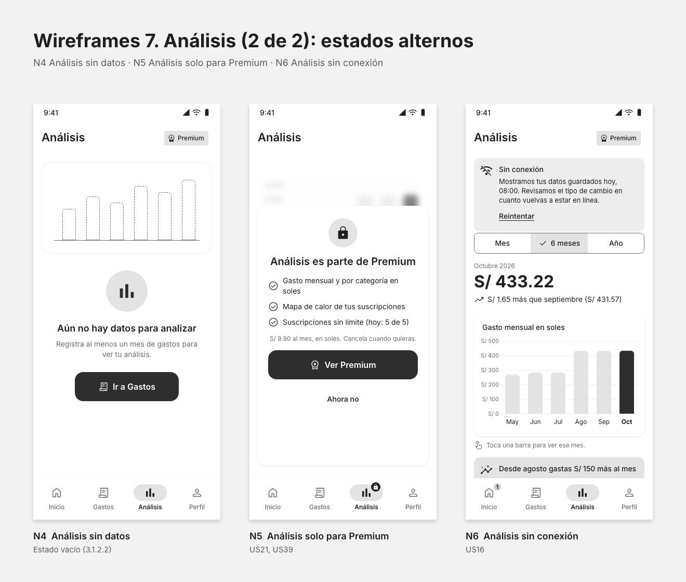

<!-- pdf:omit-start -->

*Figura 83. Wireframes de la aplicación móvil: estados alternos del Análisis (N4, N5, N6).*

<!-- pdf:omit-end -->

*Fuente: elaboración del equipo Gastify.*

La figura 84 muestra los wireframes de la aplicación móvil: Perfil y recordatorios, 1 de 3 (P1, P2, P3, P4).

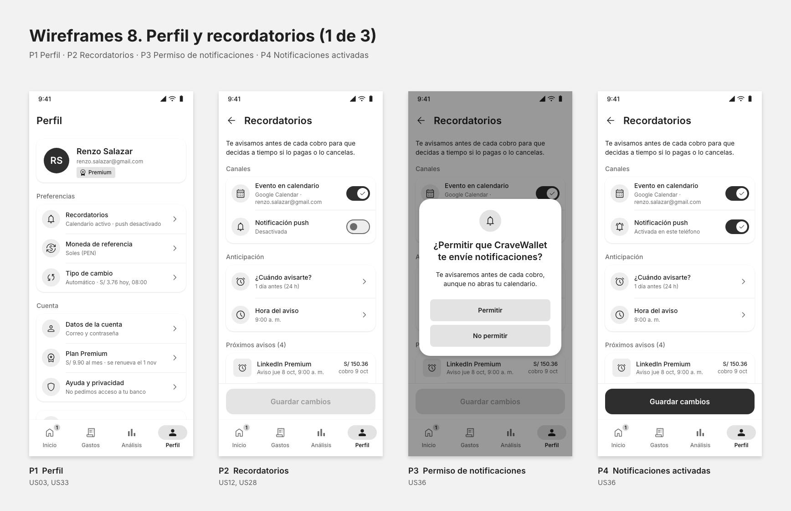

<!-- pdf:omit-start -->

*Figura 84. Wireframes de la aplicación móvil: Perfil y recordatorios, 1 de 3 (P1, P2, P3, P4).*

<!-- pdf:omit-end -->

*Fuente: elaboración del equipo Gastify.*

La figura 85 muestra los wireframes de la aplicación móvil: Perfil y recordatorios, 2 de 3 (P5, P6, P7).

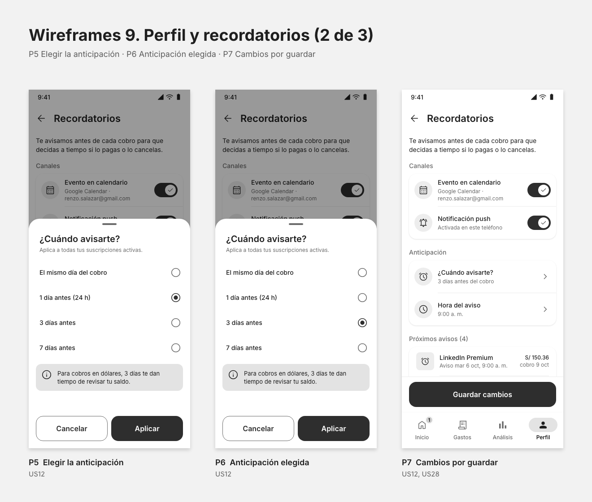

<!-- pdf:omit-start -->

*Figura 85. Wireframes de la aplicación móvil: Perfil y recordatorios, 2 de 3 (P5, P6, P7).*

<!-- pdf:omit-end -->

*Fuente: elaboración del equipo Gastify.*

La figura 86 muestra los wireframes de la aplicación móvil: Perfil y recordatorios, 3 de 3 (P8, P9).

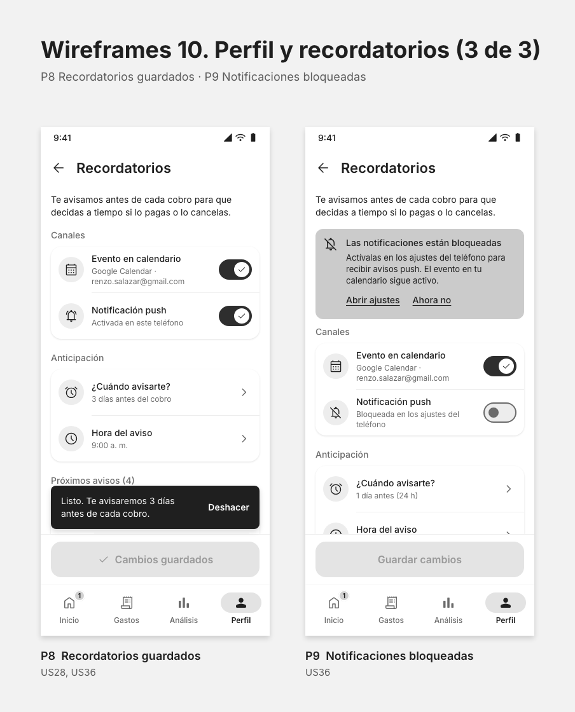

<!-- pdf:omit-start -->

*Figura 86. Wireframes de la aplicación móvil: Perfil y recordatorios, 3 de 3 (P8, P9).*

<!-- pdf:omit-end -->

*Fuente: elaboración del equipo Gastify.*

La tabla 131 resume la decisión de estructura de cada área.

*Tabla 131. Decisiones de estructura por área.*

| Área | Decisión de estructura |
| --- | --- |
| **I. Inicio** | Arriba va la cifra que el usuario necesita primero (el total mensual en soles, con el tipo de cambio y su hora de actualización) y, debajo, lo que requiere acción: el cobro de las próximas 24 horas. El carrusel horizontal de próximos cobros permite ver cuatro cargos sin bajar en la pantalla, y la última tarjeta lleva a la lista completa. Al final, un hallazgo de ahorro ("Smart Fit: sin uso hace 34 días") cubre US35. Sin gastos (I2), la pantalla ofrece una sola salida: agregar la primera suscripción. |
| **G. Gastos** | La búsqueda y los chips de filtro están fijos sobre la lista; la lista se desplaza sola. Cada tarjeta muestra el monto en soles y, si se factura en otra moneda, el monto original debajo (US15). El gesto de deslizar a la izquierda revela "Sin usar" (G2), como define la sección 3.1.1.3. El detalle (G3) explica el tipo de cambio usado, la variación frente al cobro anterior y el historial de cobros con su tipo de cambio (US16, US29, US37). |
| **A. Alta** | Un asistente de tres pasos en una hoja modal, con una decisión principal por pantalla y el botón de avance fijo al pie. El catálogo (A1) resuelve los servicios frecuentes y "Ingresar manualmente" lleva al formulario (A2). Los campos obligatorios se marcan con asterisco desde el inicio, y la vista previa en soles aparece en cuanto se elige una moneda extranjera (A5, US34). El paso 3 confirma lo que se va a guardar antes de pedir el permiso del calendario (A6, A7). |
| **N. Análisis** | El selector de periodo, la cifra del periodo con su variación y el gráfico de barras ocupan la primera vista; tocar una barra cambia el mes resumido (N2). Debajo, el hallazgo del mes explica el salto de agosto (LinkedIn Premium), la dona y la lista de categorías llevan al detalle de cada una (N3) y el mapa de calor cruza categoría y mes. |
| **P. Perfil y recordatorios** | Los recordatorios se separan en canales (calendario y push), anticipación y la lista de próximos avisos (US28), para que el usuario vea el efecto de cada cambio antes de guardarlo. El botón Guardar cambios solo se habilita cuando hay algo que guardar (P7). |

*Fuente: elaboración del equipo Gastify.*

#### 3.1.4.2. Mobile Applications Wireflow Diagrams

Un wireflow combina wireframes con un diagrama de flujo: miniaturas de baja fidelidad unidas por flechas que indican qué hace la persona para pasar de una pantalla a la siguiente [@laubheimer2016wireflows].

Los tres wireflows corresponden a los User Goals UG1, UG2 y UG3. Usan los wireframes reducidos al 50 %. Cada uno lleva en su encabezado la persona, el objetivo y las historias que cubre, y debajo de cada miniatura el código, el nombre y las historias de la pantalla. Cada flecha lleva una etiqueta con el componente que dispara el cambio (por ejemplo, "Toca Ingresar manualmente" o "Elige USD" en el menú desplegable de Moneda). La línea continua es el camino principal y la línea punteada es una alternativa, un error o un retorno; las píldoras punteadas indican a qué pantalla se vuelve y las píldoras sólidas marcan el objetivo cumplido.

La tabla 132 presenta los wireflows con su recorrido principal y alternativas.

*Tabla 132. Wireflows de la aplicación móvil.*

| Wireflow | Persona | Recorrido principal | Alternativas y retornos |
| --- | --- | --- | --- |
| **1. Agregar una suscripción manualmente** | Renzo Salazar | I1, A1, A2, A4, A5, A6, A7, I3 | Plan gratuito con 5 de 5 (A9); Continuar con campos vacíos (A3); calendario no permitido (I4); Cerrar o Descartar (A8). |
| **2. Revisar el gráfico de gastos mensuales** | Renzo Salazar | I1, N1, N2, N3 | Plan gratuito (N5); sin un mes de datos (N4); sin conexión (N6). |
| **3. Configurar una alerta de pago próximo** | Renzo Salazar | I1, P1, P2, P3, P4, P5, P6, P7, P8 | No permitir notificaciones (P9) y volver con Abrir ajustes; Cancelar la hoja de anticipación. |

*Fuente: elaboración del equipo Gastify.*

La figura 87 muestra el wireflow del User Goal 1: añadir una nueva suscripción recurrente de forma manual.

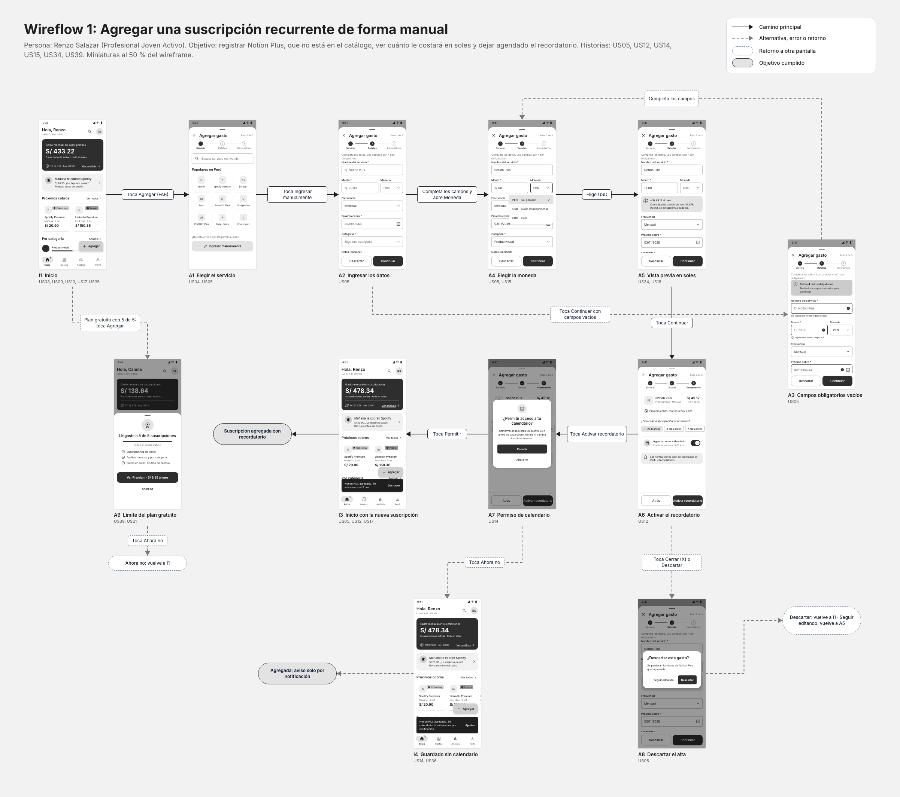

<!-- pdf:omit-start -->

*Figura 87. Wireflow del User Goal 1: añadir una nueva suscripción recurrente de forma manual.*

<!-- pdf:omit-end -->

*Fuente: elaboración del equipo Gastify.*

La figura 88 muestra el wireflow del User Goal 2: revisar el gráfico detallado de gastos mensuales.

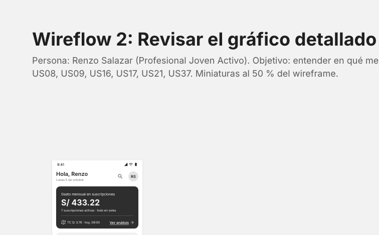

<!-- pdf:omit-start -->

*Figura 88. Wireflow del User Goal 2: revisar el gráfico detallado de gastos mensuales.*

<!-- pdf:omit-end -->

*Fuente: elaboración del equipo Gastify.*

La figura 89 muestra el wireflow del User Goal 3: configurar una alerta o notificación de pago próximo.

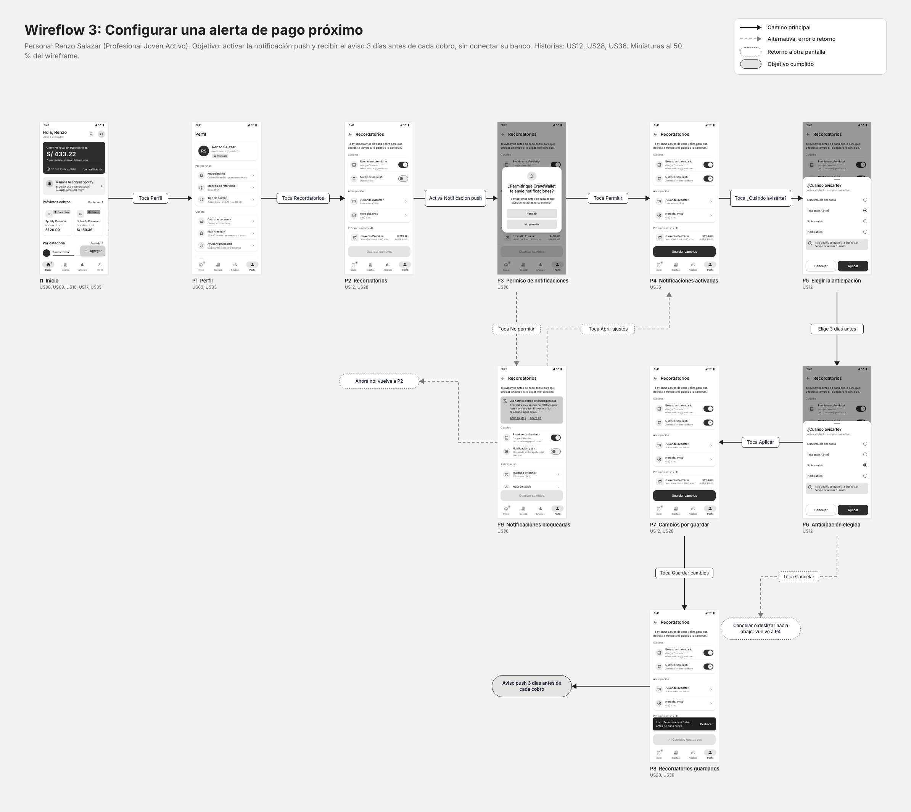

<!-- pdf:omit-start -->

*Figura 89. Wireflow del User Goal 3: configurar una alerta o notificación de pago próximo.*

<!-- pdf:omit-end -->

*Fuente: elaboración del equipo Gastify.*

#### 3.1.4.3. Mobile Applications Mock-ups

Los mock-ups son los wireframes con el Design System de la sección 3.1.1 aplicado: la paleta 60-30-10 (fondos neutros, azul primario `#3B4FD8` para la estructura y naranja `#F97316` reservado para el FAB y las alertas de cobro), Poppins para títulos y montos, Inter para cuerpo y datos, la retícula de 8 dp, los radios de 4 dp (chips y etiquetas), 8 dp (campos y botones compactos), 16 dp (tarjetas) y 24 dp (hojas modales y diálogos), los íconos Material Symbols Rounded y las elevaciones 1 y 3. Los componentes siguen Material Design 3: `NavigationBar`, top app bar, FAB extendido, bottom sheet, diálogo, campos outlined, chips de filtro, segmented button, switch y snackbar.

La figura 90 muestra los tokens de color, escala tipográfica y componentes del Design System aplicados a la aplicación móvil.

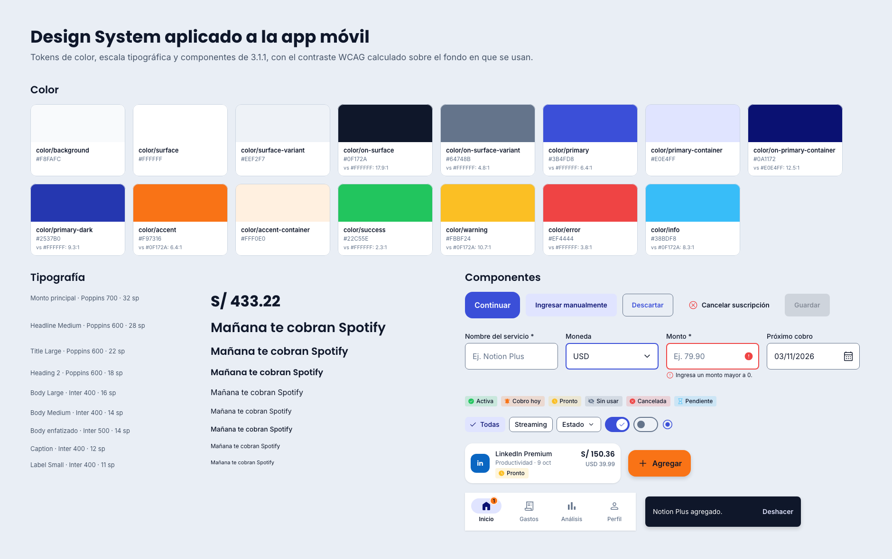

<!-- pdf:omit-start -->

*Figura 90. Tokens de color, escala tipográfica y componentes del Design System aplicados a la aplicación móvil.*

<!-- pdf:omit-end -->

*Fuente: elaboración del equipo Gastify.*

El contraste se verificó con la fórmula de WCAG 2.1 para cada par de color que aparece en las pantallas. Dos decisiones se tomaron para cumplir el nivel AA sin salir de la paleta (tabla 133).

*Tabla 133. Contraste de los pares de color de los mock-ups.*

| Par de colores | Contraste | Uso | Decisión |
| --- | --- | --- | --- |
| `#0F172A` sobre `#F8FAFC` | 17.1:1 (AAA) | Texto principal | Se usa en todo texto sobre fondos claros y contenedores tenues. |
| `#FFFFFF` sobre `#3B4FD8` | 6.4:1 (AA) | Botones primarios, tarjeta del total | Se mantiene. |
| `#64748B` sobre `#FFFFFF` | 4.8:1 (AA) | Texto secundario, placeholders | Solo sobre blanco o `#F8FAFC`; sobre `#EEF2F7` baja a 4.2:1, por eso ahí se usa `#0F172A`. |
| `#FFFFFF` sobre `#F97316` | 2.8:1 (no cumple) | FAB Agregar | El ícono y la etiqueta del FAB van en `#0F172A` (6.4:1, AA). |
| `#EF4444` sobre `#FFFFFF` | 3.8:1 (solo no textual) | Errores de formulario | El rojo se usa en bordes e íconos (contraste no textual ≥ 3:1) y el mensaje de error se escribe en `#0F172A`. Lo mismo se aplica a `success`, `warning` e `info` en las etiquetas de estado. |

*Fuente: elaboración del equipo Gastify.*

Las mismas diez láminas de los wireframes se presentan en alta fidelidad:

La figura 91 muestra los mock-ups de la aplicación móvil: Inicio y Gastos (I1, I2, G1, G2).

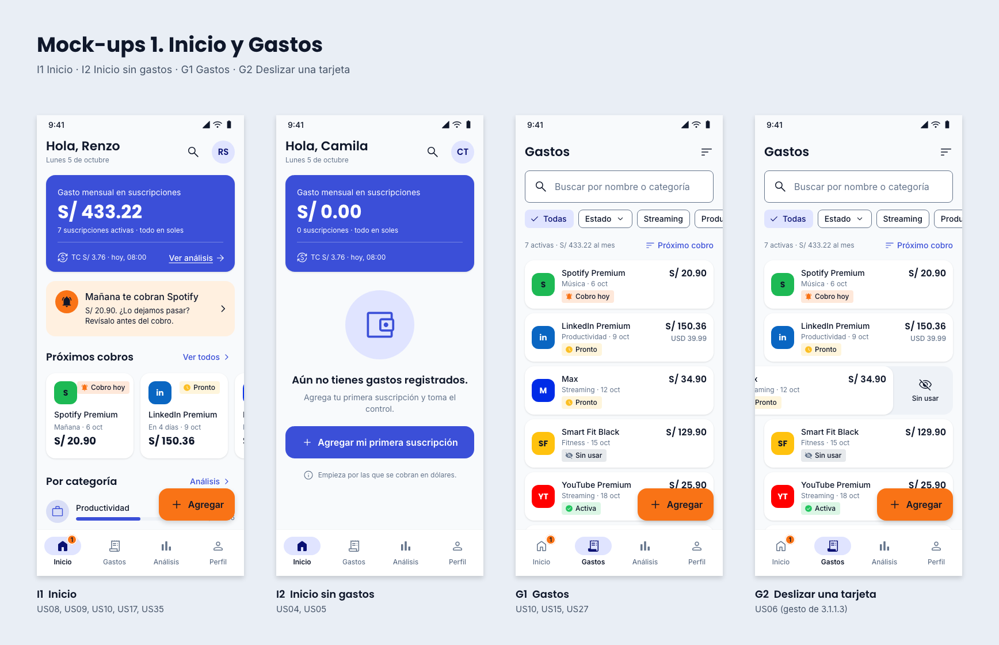

<!-- pdf:omit-start -->

*Figura 91. Mock-ups de la aplicación móvil: Inicio y Gastos (I1, I2, G1, G2).*

<!-- pdf:omit-end -->

*Fuente: elaboración del equipo Gastify.*

La figura 92 muestra los mock-ups de la aplicación móvil: detalle y alta, paso 1 (G3, A1, A2).

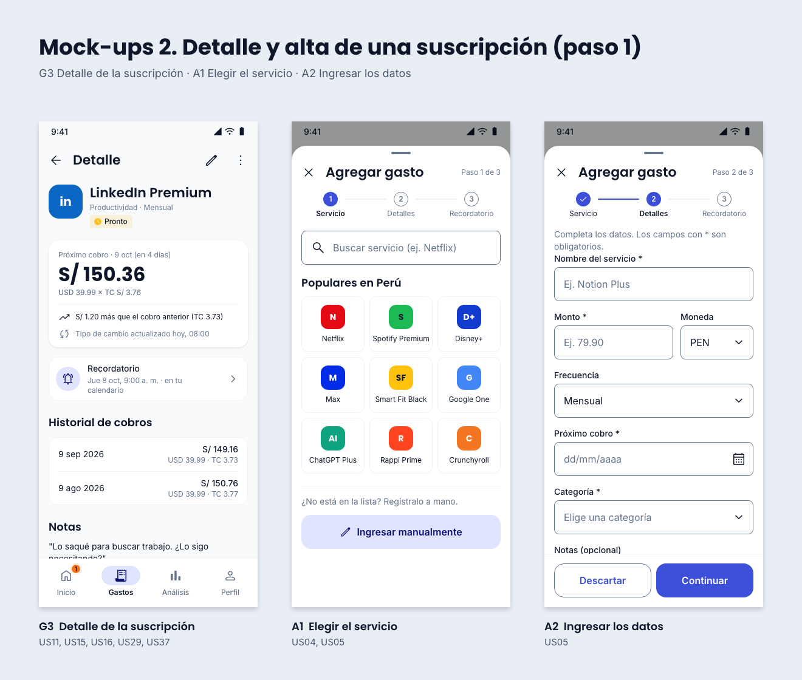

<!-- pdf:omit-start -->

*Figura 92. Mock-ups de la aplicación móvil: detalle y alta, paso 1 (G3, A1, A2).*

<!-- pdf:omit-end -->

*Fuente: elaboración del equipo Gastify.*

La figura 93 muestra los mock-ups de la aplicación móvil: validación, moneda y vista previa en soles (A3, A4, A5).

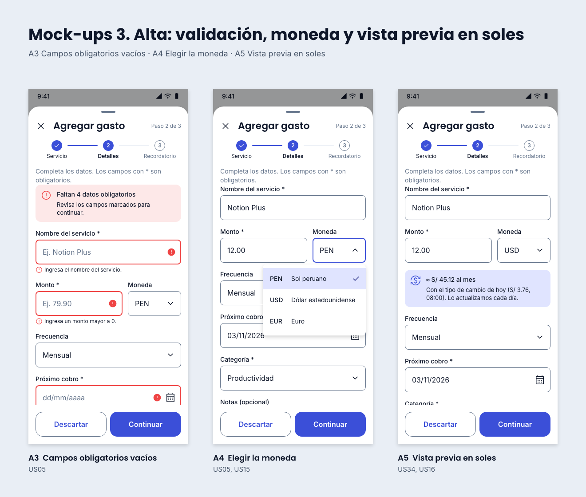

<!-- pdf:omit-start -->

*Figura 93. Mock-ups de la aplicación móvil: validación, moneda y vista previa en soles (A3, A4, A5).*

<!-- pdf:omit-end -->

*Fuente: elaboración del equipo Gastify.*

La figura 94 muestra los mock-ups de la aplicación móvil: recordatorio, permiso y resultado del alta (A6, A7, I3, I4).

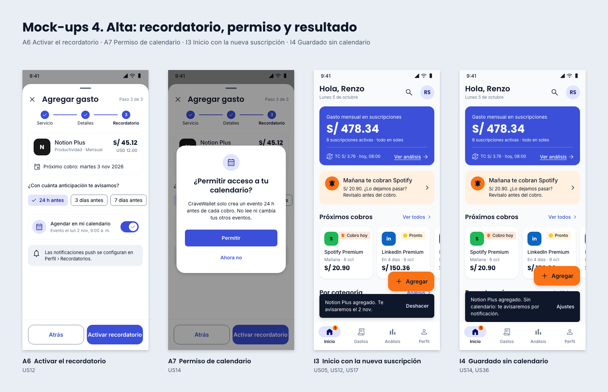

<!-- pdf:omit-start -->

*Figura 94. Mock-ups de la aplicación móvil: recordatorio, permiso y resultado del alta (A6, A7, I3, I4).*

<!-- pdf:omit-end -->

*Fuente: elaboración del equipo Gastify.*

La figura 95 muestra los mock-ups de la aplicación móvil: salidas alternas del alta (A8, A9).

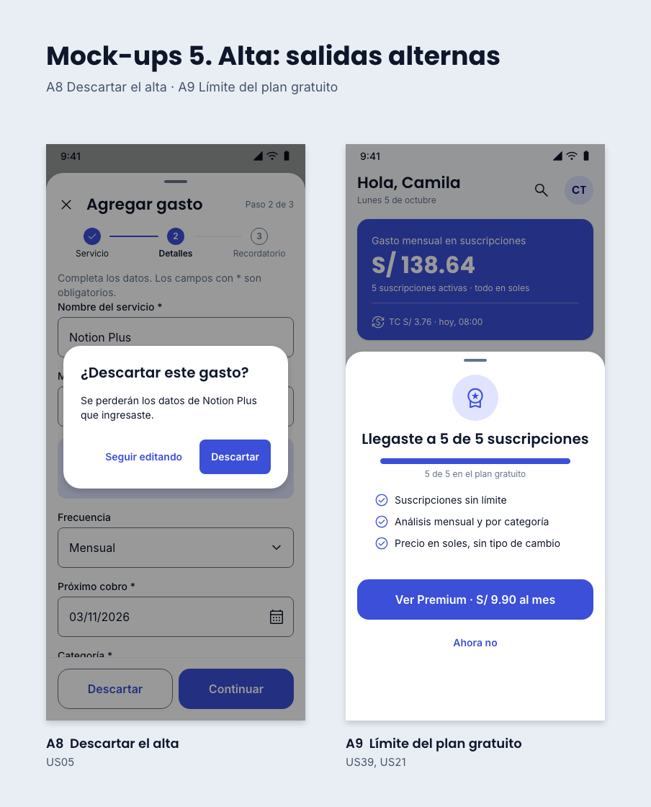

<!-- pdf:omit-start -->

*Figura 95. Mock-ups de la aplicación móvil: salidas alternas del alta (A8, A9).*

<!-- pdf:omit-end -->

*Fuente: elaboración del equipo Gastify.*

La figura 96 muestra los mock-ups de la aplicación móvil: Análisis, 1 de 2 (N1, N2, N3).

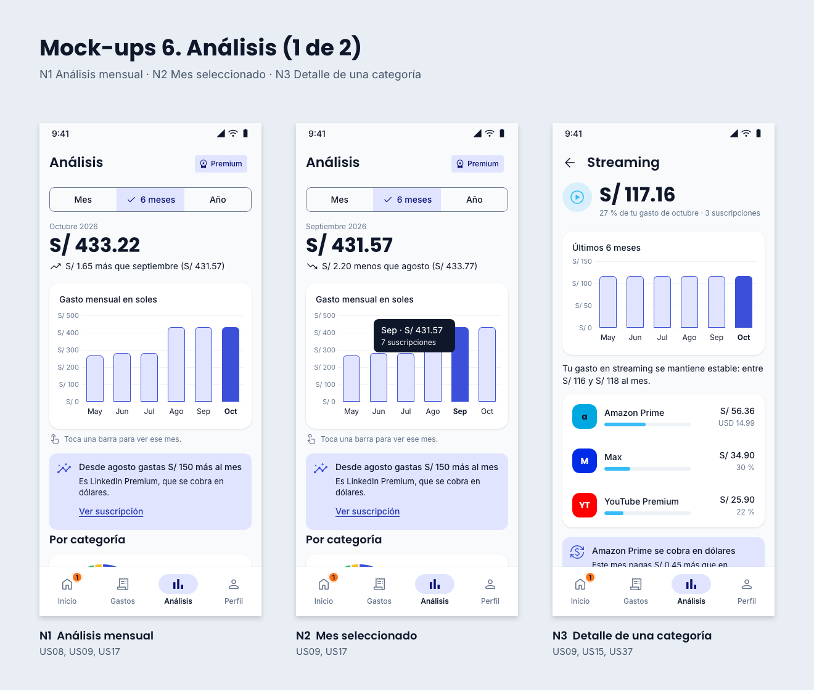

<!-- pdf:omit-start -->

*Figura 96. Mock-ups de la aplicación móvil: Análisis, 1 de 2 (N1, N2, N3).*

<!-- pdf:omit-end -->

*Fuente: elaboración del equipo Gastify.*

La figura 97 muestra los mock-ups de la aplicación móvil: estados alternos del Análisis (N4, N5, N6).

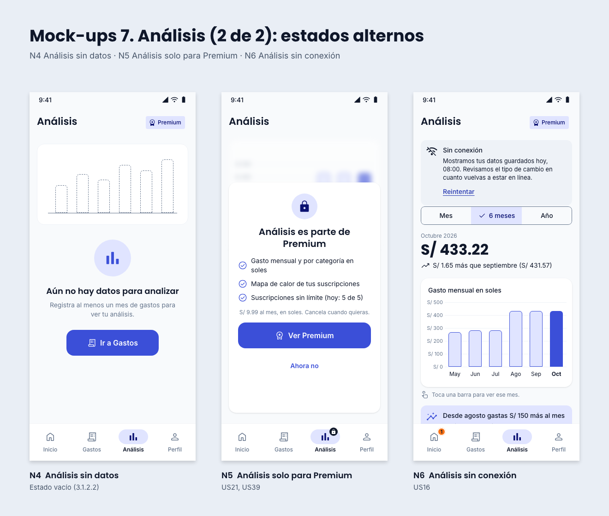

<!-- pdf:omit-start -->

*Figura 97. Mock-ups de la aplicación móvil: estados alternos del Análisis (N4, N5, N6).*

<!-- pdf:omit-end -->

*Fuente: elaboración del equipo Gastify.*

La figura 98 muestra los mock-ups de la aplicación móvil: Perfil y recordatorios, 1 de 3 (P1, P2, P3, P4).

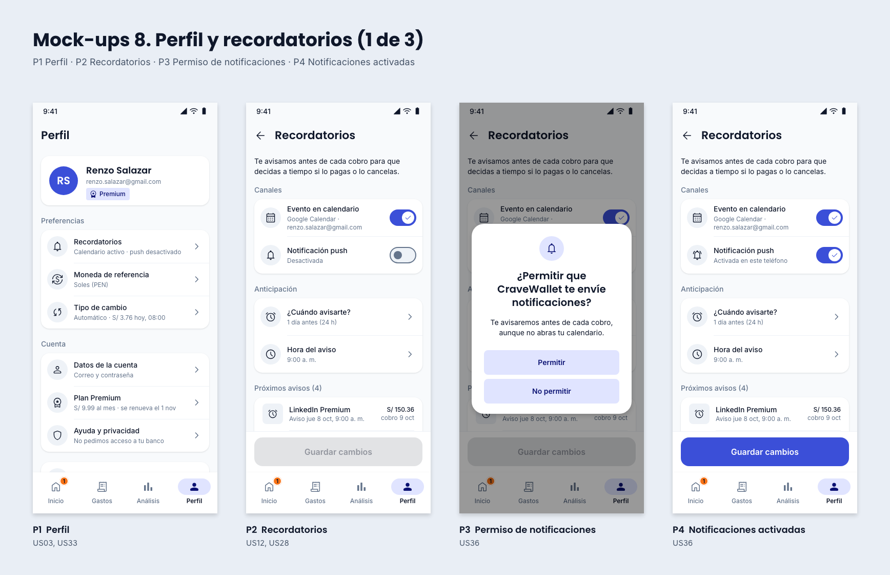

<!-- pdf:omit-start -->

*Figura 98. Mock-ups de la aplicación móvil: Perfil y recordatorios, 1 de 3 (P1, P2, P3, P4).*

<!-- pdf:omit-end -->

*Fuente: elaboración del equipo Gastify.*

La figura 99 muestra los mock-ups de la aplicación móvil: Perfil y recordatorios, 2 de 3 (P5, P6, P7).

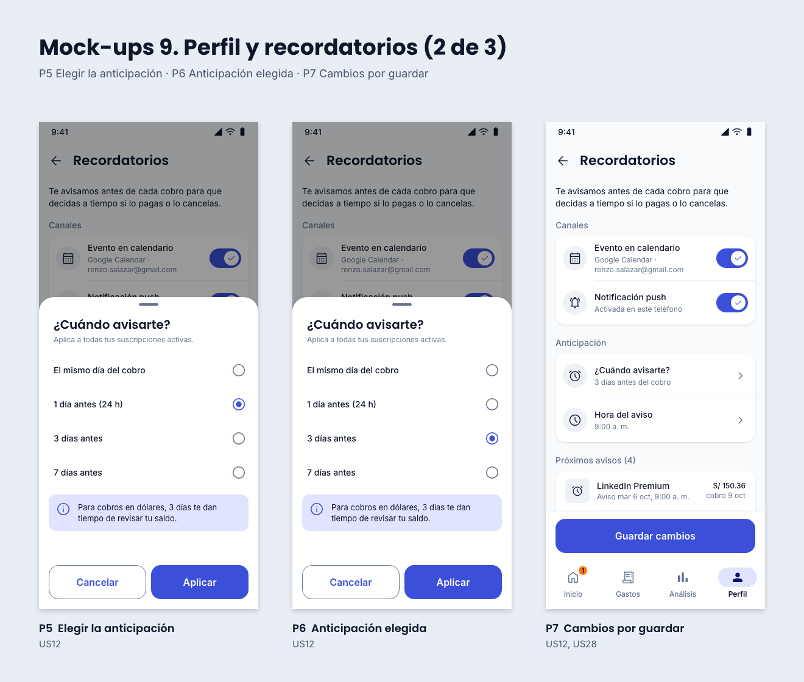

<!-- pdf:omit-start -->

*Figura 99. Mock-ups de la aplicación móvil: Perfil y recordatorios, 2 de 3 (P5, P6, P7).*

<!-- pdf:omit-end -->

*Fuente: elaboración del equipo Gastify.*

La figura 100 muestra los mock-ups de la aplicación móvil: Perfil y recordatorios, 3 de 3 (P8, P9).

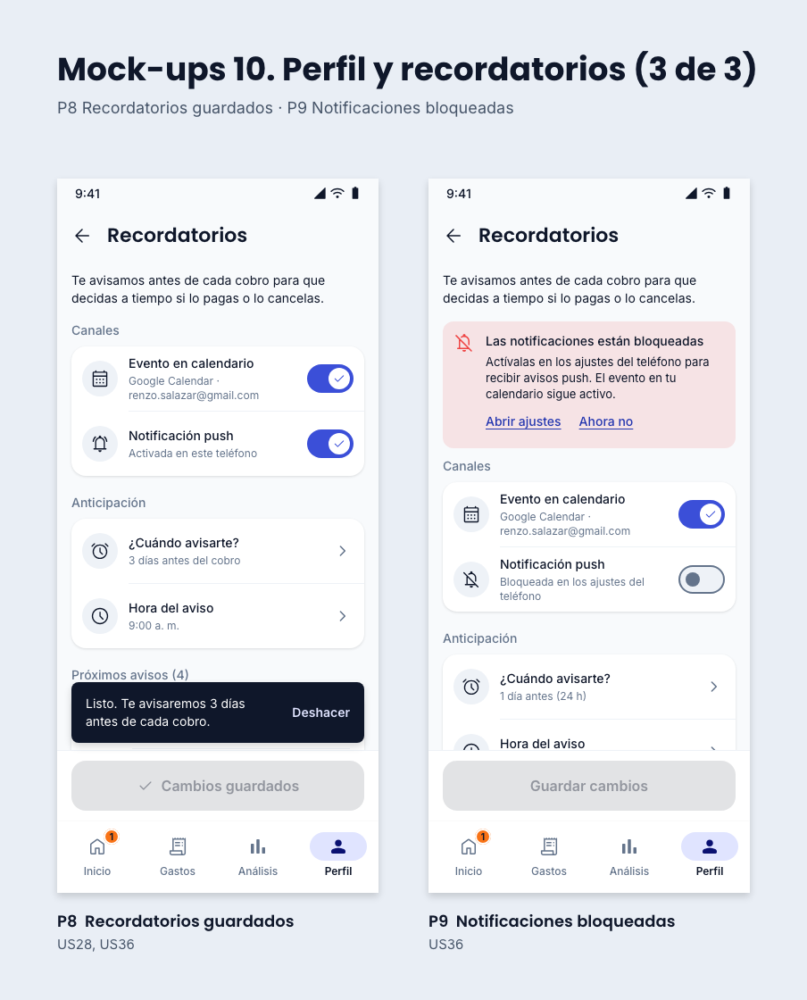

<!-- pdf:omit-start -->

*Figura 100. Mock-ups de la aplicación móvil: Perfil y recordatorios, 3 de 3 (P8, P9).*

<!-- pdf:omit-end -->

*Fuente: elaboración del equipo Gastify.*

##### Modo oscuro

La aplicación también se diseñó en modo oscuro, que Android aplica según el tema del sistema. El modo oscuro usa los mismos tokens del Design System, con estas reglas:

- **Mismo nombre, otro valor.** Cada token `color/*` tiene un valor para el modo *Light* y otro para el modo *Dark* de la colección de variables de Figma. Las pantallas oscuras son las mismas pantallas con el modo *Dark* aplicado, sin colores escritos a mano.
- **Se conserva el matiz y se ajusta la luminosidad.** Los fondos pasan a la gama azul pizarra del texto principal (`#0B1120`, `#151E31`, `#1E293B`). Los colores que funcionan como texto o como acción se aclaran: el primario pasa a `#AAB4FF` con texto `#0A1172` encima, y el naranja de acento a `#FB923C`. Así los botones primarios y el FAB siguen siendo los elementos más visibles de la pantalla, como en Material Design 3.
- **Elevación por tono.** Las tarjetas se separan del fondo por un tono más claro de superficie y no solo por la sombra, que casi no se ve sobre fondos oscuros. El scrim de diálogos y hojas modales sube al 60 % de opacidad.
- **Contraste verificado.** Todos los pares de texto y fondo cumplen WCAG AA, con un mínimo de 5.7:1. A diferencia del modo claro, los colores semánticos (`success`, `warning`, `error`, `info`) también alcanzan 6:1 o más como texto sobre `#151E31`.

La tabla 134 presenta los tokens de color en modo claro y oscuro.

*Tabla 134. Tokens de color en modo oscuro.*

| Token | Claro | Oscuro | Par verificado en oscuro |
| --- | --- | --- | --- |
| `color/background` | `#F8FAFC` | `#0B1120` | `#F1F5F9` sobre `#0B1120`: 17.2:1 |
| `color/surface` | `#FFFFFF` | `#151E31` | `#F1F5F9` sobre `#151E31`: 15.2:1 |
| `color/on-surface-variant` | `#64748B` | `#94A3B8` | Sobre `#151E31`: 6.5:1 |
| `color/primary` | `#3B4FD8` | `#AAB4FF` | Sobre `#151E31`: 8.5:1; `#0A1172` sobre `#AAB4FF`: 8.0:1 |
| `color/primary-container` | `#E0E4FF` | `#2A3AA8` | `#E0E4FF` sobre `#2A3AA8`: 7.4:1 |
| `color/accent` | `#F97316` | `#FB923C` | `#0F172A` sobre `#FB923C`: 7.9:1 |
| `color/error` | `#EF4444` | `#F87171` | Sobre `#151E31`: 6.0:1 |

*Fuente: elaboración del equipo Gastify.*

La figura 101 muestra los tokens de color en modo oscuro con su contraste WCAG, escala tipográfica y componentes.

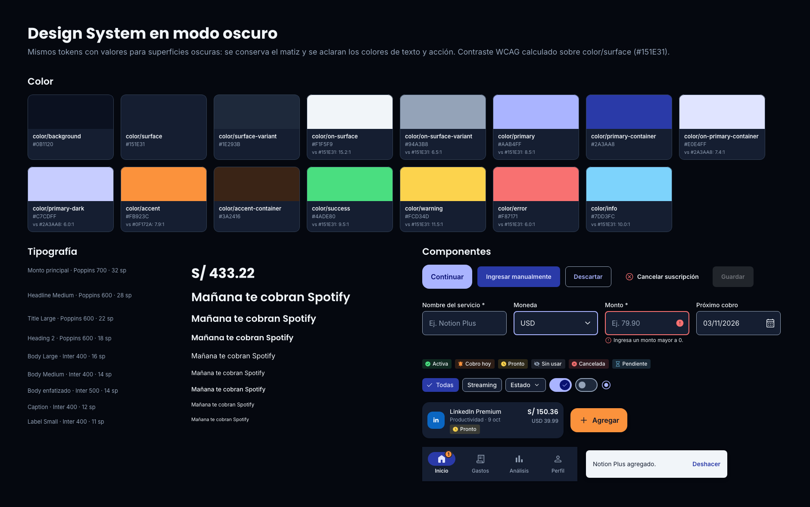

<!-- pdf:omit-start -->

*Figura 101. Tokens de color en modo oscuro con su contraste WCAG, escala tipográfica y componentes.*

<!-- pdf:omit-end -->

*Fuente: elaboración del equipo Gastify.*

La figura 102 muestra los mock-ups en modo oscuro de una pantalla por área: Inicio, Gastos, alta con vista previa en soles, Análisis y Recordatorios (I1, G1, A5, N1, P4).

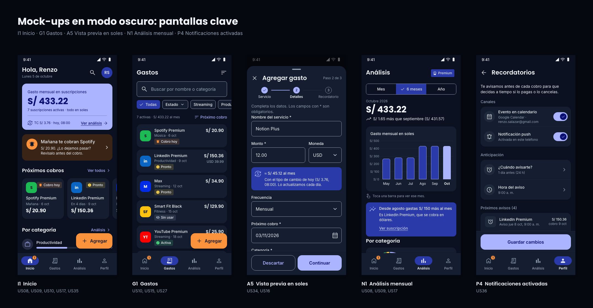

<!-- pdf:omit-start -->

*Figura 102. Mock-ups en modo oscuro de una pantalla por área: Inicio, Gastos, alta con vista previa en soles, Análisis y Recordatorios (I1, G1, A5, N1, P4).*

<!-- pdf:omit-end -->

*Fuente: elaboración del equipo Gastify.*

Las 31 pantallas, en las mismas diez láminas, están en modo oscuro en la página **07 Modo oscuro** del archivo de Figma.

#### 3.1.4.4. Mobile Applications User Flow Diagrams

Los user flows recrean los recorridos de los wireflows con las pantallas de alta fidelidad y hacen explícitas las decisiones que los desvían. Cada decisión se dibuja como un rombo con su pregunta; de él salen dos flechas etiquetadas (Sí y No). La notación es la misma en los tres diagramas: el camino feliz va con flecha continua verde, los caminos alternos con flecha punteada ámbar y los errores con flecha punteada roja; las píldoras punteadas indican a qué pantalla se vuelve y las píldoras verdes marcan el objetivo cumplido. El camino feliz se distingue también por el trazo continuo, de modo que el diagrama no depende solo del color.

La tabla 135 presenta las decisiones y caminos alternos de cada user flow.

*Tabla 135. Decisiones y caminos alternos de los user flows.*

| User flow | Decisiones | Caminos alternos (unhappy paths) |
| --- | --- | --- |
| **1. Agregar una suscripción manualmente** | ¿Plan gratuito con 5 de 5? · ¿Campos obligatorios completos? · ¿Permite el calendario? | **Error de validación:** si el usuario toca Continuar con campos vacíos, A3 marca los cuatro campos obligatorios con borde rojo, ícono y mensaje ("Ingresa un monto mayor a 0") y un aviso resume cuántos faltan. **Límite del plan gratuito:** A9 explica el límite de 5 suscripciones y ofrece Premium o volver. **Permiso denegado:** la suscripción se guarda igual y se avisa que llegará solo por notificación (I4). **Descartar:** A8 pide confirmación antes de perder los datos. |
| **2. Revisar el gráfico de gastos mensuales** | ¿Es Premium? · ¿Tiene un mes de datos? · ¿Hay conexión? | **Empty state:** sin datos suficientes, N4 muestra un gráfico fantasma con el mensaje "Registra al menos un mes de gastos para ver tu análisis" y el botón Ir a Gastos. **Plan gratuito:** N5 deja ver el gráfico desenfocado y explica qué incluye Premium por S/ 9.90 al mes. **Sin conexión:** N6 muestra los datos guardados con un aviso y el botón Reintentar. |
| **3. Configurar una alerta de pago próximo** | ¿Permite las notificaciones? · ¿Aplica el cambio? | **Permiso bloqueado:** si el usuario no permite las notificaciones, P9 lo explica, mantiene activo el evento de calendario y ofrece Abrir ajustes. **Cancelar:** la hoja de anticipación se cierra con Cancelar o deslizando hacia abajo sin cambiar nada. |

*Fuente: elaboración del equipo Gastify.*

La figura 103 muestra el user flow del User Goal 1 con su camino feliz, caminos alternos y error de validación.

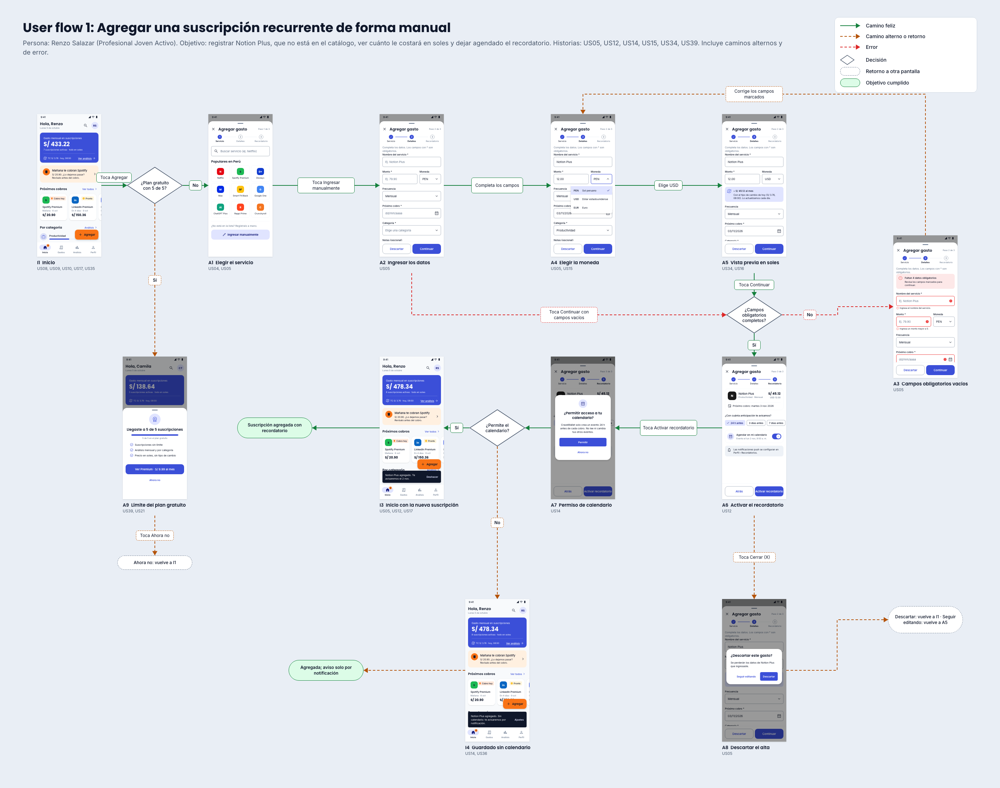

<!-- pdf:omit-start -->

*Figura 103. User flow del User Goal 1 con su camino feliz, caminos alternos y error de validación.*

<!-- pdf:omit-end -->

*Fuente: elaboración del equipo Gastify.*

La figura 104 muestra el user flow del User Goal 2 con sus estados alternos: plan gratuito, sin datos (empty state) y sin conexión.

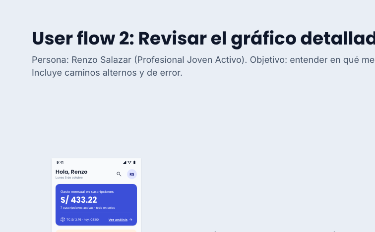

<!-- pdf:omit-start -->

*Figura 104. User flow del User Goal 2 con sus estados alternos: plan gratuito, sin datos (empty state) y sin conexión.*

<!-- pdf:omit-end -->

*Fuente: elaboración del equipo Gastify.*

La figura 105 muestra el user flow del User Goal 3 con el permiso de notificaciones denegado y la cancelación del cambio.

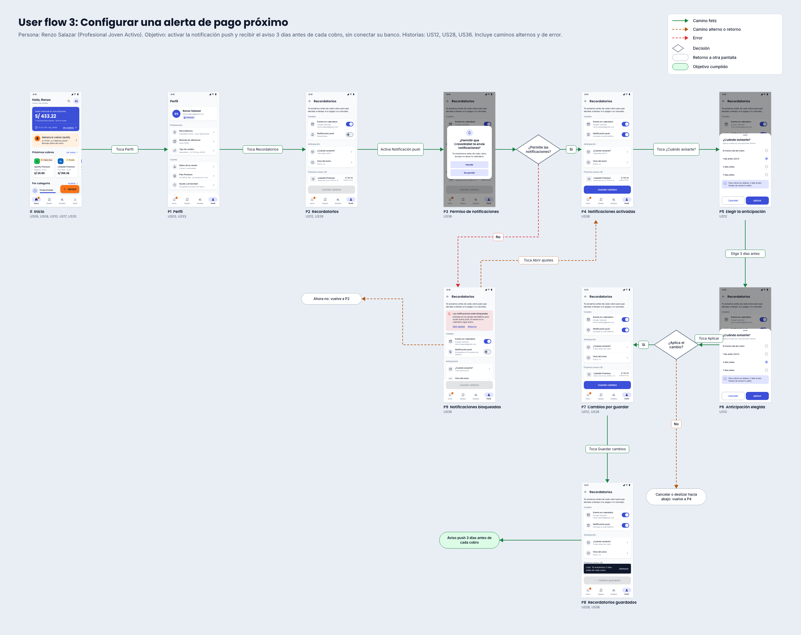

<!-- pdf:omit-start -->

*Figura 105. User flow del User Goal 3 con el permiso de notificaciones denegado y la cancelación del cambio.*

<!-- pdf:omit-end -->

*Fuente: elaboración del equipo Gastify.*

#### 3.1.4.5. Mobile Applications Prototyping

El prototipo se armó en la página **06 Prototype** del archivo de Figma con los 31 mock-ups como frames de 360 x 800 dp y 186 interacciones configuradas en la pestaña Prototype. Es completamente navegable: una persona de prueba puede completar los tres User Goals desde el Inicio sin quedar en un callejón sin salida, porque cada pantalla tiene al menos una salida (Atrás, Cerrar, Cancelar, Ahora no o la barra inferior) y cada pantalla es alcanzable desde un punto de inicio.

Las transiciones siguen la arquitectura de navegación espacial de la sección 3.1.2.5 y el sistema de motion de Material 3 (300 ms para pantallas, curvas ease). La tabla 136 detalla las interacciones configuradas.

*Tabla 136. Interacciones del prototipo.*

| Interacción | Disparador | Transición | Dónde se usa |
| --- | --- | --- | --- |
| Entrar a un segundo nivel | On tap | Push desde la derecha | Tarjeta de LinkedIn Premium → G3; Streaming → N3; Recordatorios → P2 |
| Volver a un nivel superior | On tap | Back o Push hacia la derecha | Flecha Atrás de G3, N3 y P2 a P9 |
| Cambiar de destino en la barra inferior | On tap | Dissolve (200 ms) | Inicio, Gastos, Análisis y Perfil |
| Abrir una hoja modal | On tap | Move in desde abajo | FAB Agregar → A1; ¿Cuándo avisarte? → P5 |
| Cerrar una hoja modal | On tap / On drag | Move out hacia abajo | Permitir → I3; Cancelar y arrastrar el tirador de P5 y P6 → P4; arrastrar el tirador de A1 → I1 |
| Cambiar el estado de un componente | On tap | Smart animate | Continuar con campos vacíos → A3 (aparecen los errores); menú de Moneda (A4 → A5); barra de septiembre (N1 → N2); switch de notificaciones (P4 ↔ P2); opción de anticipación (P5 → P6) |
| Deslizar una tarjeta | On drag | Smart animate | Tarjeta de Max en Gastos (G1 ↔ G2) |
| Mostrar un diálogo | On tap | Dissolve | Activar recordatorio → A7; Descartar → A8; Notificación push → P3 |

*Fuente: elaboración del equipo Gastify.*

El desplazamiento se configuró por contenedor: el contenido de Inicio, Gastos, Análisis, Perfil y Recordatorios hace scroll vertical mientras la barra superior, la barra inferior y el FAB quedan fijos, y el carrusel de próximos cobros (I1) y los chips de filtro (G1) hacen scroll horizontal.

El prototipo tiene ocho puntos de inicio. El primero recorre los tres User Goals desde el Inicio; los demás permiten saltar directamente a un objetivo o a un estado alterno que no ocurre con la cuenta de Renzo (usuario nuevo, plan gratuito, análisis sin datos o sin conexión). La tabla 137 detalla cada punto de inicio.

*Tabla 137. Puntos de inicio del prototipo.*

| Punto de inicio | Pantalla | Recorrido para la prueba |
| --- | --- | --- |
| CraveWallet · Prototipo completo (UG1, UG2 y UG3) | I1 | **UG1:** Agregar → Ingresar manualmente → Continuar (errores) → tocar un campo → USD → Continuar → Activar recordatorio → Permitir. **UG2:** Análisis → barra Sep → Streaming. **UG3:** Perfil → Recordatorios → Notificación push → Permitir → ¿Cuándo avisarte? → 3 días antes → Aplicar → Guardar cambios. |
| UG2 · Revisar el gráfico de gastos | N1 | Recorrido del UG2. |
| UG3 · Configurar una alerta de pago | P1 | Recorrido del UG3. |
| Alterno · Inicio sin gastos (usuaria nueva) | I2 | Agregar mi primera suscripción. |
| Alterno · Límite del plan gratuito | A9 | Ver Premium o Ahora no. |
| Alterno · Análisis sin datos | N4 | Ir a Gastos. |
| Alterno · Análisis solo para Premium | N5 | Ver Premium o Ahora no. |
| Alterno · Análisis sin conexión | N6 | Reintentar. |

*Fuente: elaboración del equipo Gastify.*

El mapa resume el prototipo: las zonas con interacción tienen borde rojo punteado y las pantallas que son punto de inicio tienen borde verde.

La figura 106 muestra el mapa del prototipo de la aplicación móvil con las zonas interactivas y los puntos de inicio.

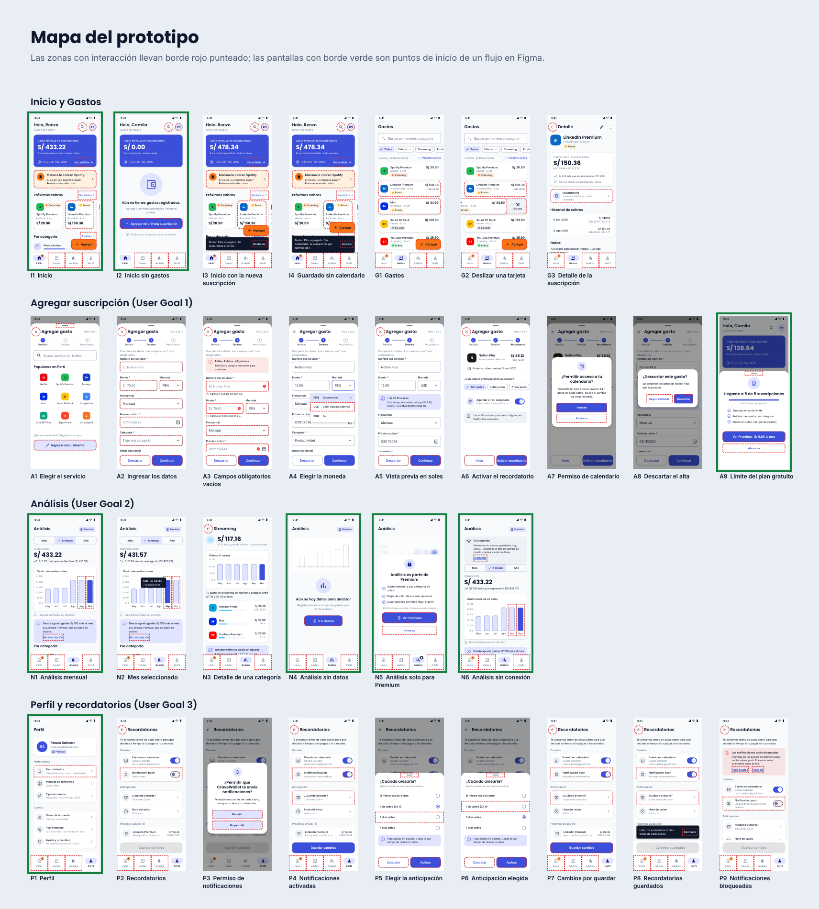

<!-- pdf:omit-start -->

*Figura 106. Mapa del prototipo de la aplicación móvil con las zonas interactivas y los puntos de inicio.*

<!-- pdf:omit-end -->

*Fuente: elaboración del equipo Gastify.*

La página **08 Prototype · Modo oscuro** repite el prototipo completo con el modo *Dark* aplicado: las mismas pantallas, las mismas interacciones y los mismos ocho puntos de inicio, con el prefijo "Modo oscuro". Así, una persona de prueba puede recorrer los tres User Goals en cualquiera de los dos temas.

##### Alcance y límites del prototipo

Los campos de texto no aceptan escritura: al tocar un campo del formulario de alta, el prototipo completa los datos de ejemplo (Notion Plus, USD 12.00) para continuar el recorrido. Las filas que no forman parte de un User Goal (por ejemplo, Moneda de referencia o Datos de la cuenta) existen como mock-up, pero no están enlazadas. Para revisar el prototipo en el tamaño real conviene elegir el dispositivo *Android Large* (360 x 800) en la configuración de Prototype de Figma.

**Enlace al prototipo:** [CraveWallet – Prototipo móvil](https://www.figma.com/design/lIN0zLBZ4E0PmQudY5JOip/Mobile-UX-UI?node-id=1-32&t=o4MJV6YoUPiTIhVj-1)

**Video del prototipo:** *(agregar el enlace al video del recorrido de los tres User Goals)*
