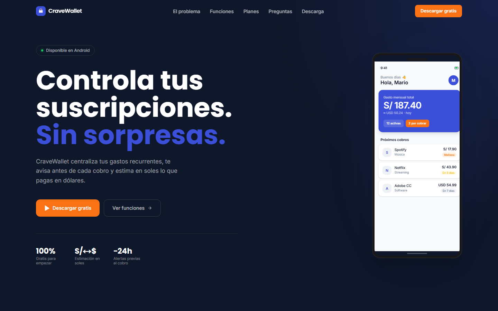
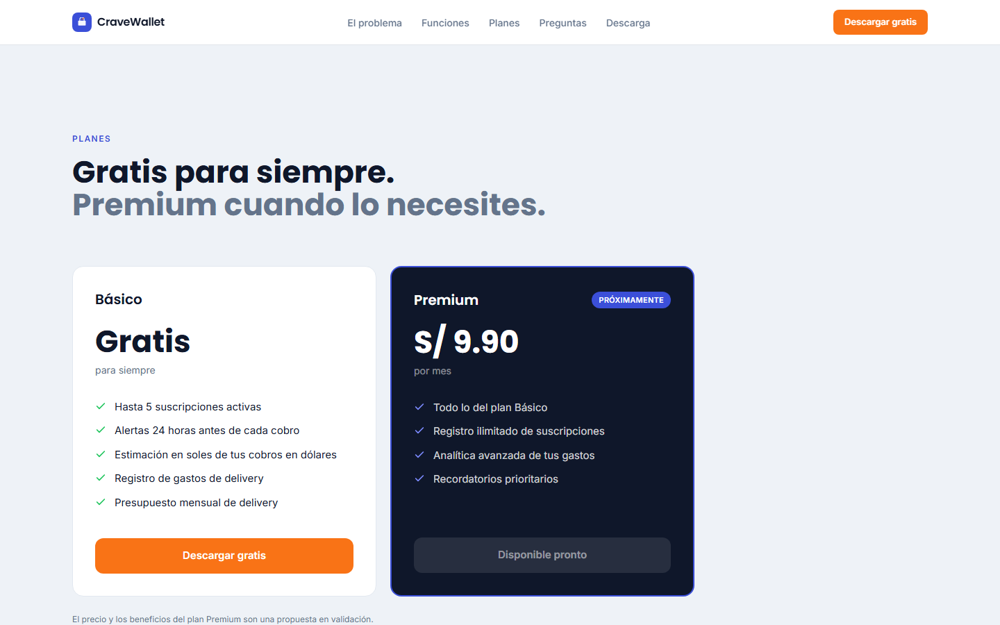

# Capítulo IV: Product Implementation & Validation

## 4.1. Software Configuration Management

### 4.1.1. Software Development Environment Configuration

El equipo usa las siguientes herramientas para gestionar, diseñar, desarrollar y probar CraveWallet, agrupadas en cuatro actividades.

#### Project Management

La tabla 138 describe las herramientas usadas.

*Tabla 138. Herramientas de gestión del proyecto.*

| Herramienta | Uso en CraveWallet | Sitio |
| --- | --- | --- |
| GitHub Projects | Backlog del producto, planificación de sprints y seguimiento de issues en tableros Kanban. | <https://github.com/features/project-management> |
| Trello | Tablero del Product Backlog con una lista por sprint y columnas *To Do*, *In Progress* y *Done* (sección 2.4.3). | <https://trello.com/> |

*Fuente: elaboración del equipo Gastify.*

#### Product UX/UI Design

La tabla 139 detalla las herramientas para investigar a los usuarios, modelar el dominio y construir los prototipos.

*Tabla 139. Herramientas de investigación, diseño y modelado.*

| Herramienta | Uso en CraveWallet | Sitio |
| --- | --- | --- |
| Figma | Wireframes, mock-ups, Design System y prototipos del landing page y de la aplicación móvil (sección 3.1). | <https://www.figma.com/> |
| UXPressia | User Personas, Empathy Maps, Journey Maps e Impact Maps (secciones 2.3 y 2.4.2). | <https://uxpressia.com/> |
| Miro | EventStorming, Domain Message Flows, Bounded Context Canvases y Context Map (sección 2.5). | <https://miro.com/> |
| Structurizr | Diagramas C4 de contexto, contenedores y componentes, versionados como DSL (sección 2.5.3). | <https://structurizr.com/> |

*Fuente: elaboración del equipo Gastify.*

#### Software Development

El landing page se construye con Next.js, React y TypeScript; el backend, con Java 21 y Spring Boot; y la aplicación móvil implementada hasta el corte del Sprint 1, con Kotlin y Jetpack Compose. Esta última elección difiere del diagrama de contenedores de la sección 2.5.3.2, que requiere actualización. La tabla 140 agrupa las herramientas por producto.

*Tabla 140. Herramientas y tecnologías de desarrollo.*

| Producto | Herramienta | Uso en CraveWallet | Sitio |
| --- | --- | --- | --- |
| Todos | GitHub | Repositorios, control de versiones con Git y revisión de pull requests. | <https://github.com/> |
| Landing page | Visual Studio Code | Editor principal, con soporte para TypeScript, React y Tailwind CSS. | <https://code.visualstudio.com/> |
| Landing page | WebStorm | IDE alternativo de JetBrains para JavaScript y TypeScript. | <https://www.jetbrains.com/webstorm/> |
| Landing page | TypeScript 5 | Lenguaje del landing page, con verificación estática de tipos. | <https://www.typescriptlang.org/> |
| Landing page | React 19 | Componentes de la interfaz del landing page. | <https://react.dev/> |
| Landing page | Next.js 16 | Framework de React para el enrutamiento, la generación estática y el build. | <https://nextjs.org/> |
| Landing page | Tailwind CSS 4 | Estilos con clases de utilidad sobre los tokens del Design System. | <https://tailwindcss.com/> |
| Landing page | Vercel | Plataforma prevista para el despliegue automático desde `main` (sección 4.1.4). | <https://vercel.com/> |
| Backend | IntelliJ IDEA | IDE del backend, con soporte para Maven, Spring Boot, pruebas y depuración. | <https://www.jetbrains.com/idea/> |
| Backend | Java 21 | Lenguaje del REST API y de los tres Bounded Contexts. | <https://openjdk.org/projects/jdk/21/> |
| Backend | Spring Boot 3 | Framework del REST API: controladores web, configuración y publicación de Domain Events. | <https://spring.io/projects/spring-boot> |
| Backend | Spring Data JPA | Repositorios de la Infrastructure Layer de cada Bounded Context. | <https://spring.io/projects/spring-data-jpa> |
| Backend | Maven | Dependencias, compilación, pruebas y empaquetado del backend. | <https://maven.apache.org/> |
| Backend | PostgreSQL | Base de datos prevista para el entorno remoto; el corte verificado utiliza H2 local. | <https://www.postgresql.org/> |
| Backend | Docker | Imagen del REST API para su despliegue (sección 2.5.3.3). | <https://www.docker.com/> |
| Aplicación móvil | Kotlin y Jetpack Compose | Interfaz y lógica de presentación Android implementadas en el repositorio móvil. | <https://developer.android.com/compose> |
| Aplicación móvil | Android Studio | Emulador de Android y herramientas del SDK para probar la aplicación. | <https://developer.android.com/studio> |

*Fuente: elaboración del equipo Gastify.*

#### Software Testing

Los criterios de aceptación de las User Stories se escriben en Gherkin, como indica la tabla 141.

*Tabla 141. Herramientas de prueba.*

| Herramienta | Uso en CraveWallet | Sitio |
| --- | --- | --- |
| Gherkin | Escenarios *Given / When / Then* de los criterios de aceptación (sección 2.4.1), base de las pruebas de aceptación. | <https://cucumber.io/docs/gherkin/reference/> |

*Fuente: elaboración del equipo Gastify.*

### 4.1.2. Source Code Management

El código fuente se gestiona en **GitHub**, bajo la organización [`1ACC0238-2620-4950-Gastify-CraveWallet`](https://github.com/1ACC0238-2620-4950-Gastify-CraveWallet).

Los repositorios del proyecto se listan en la tabla 142.

*Tabla 142. Repositorios del proyecto.*

| Repositorio | Descripción | URL |
| :--- | :--- | :--- |
| `CraveWallet-Report` | Informe del proyecto en formato Markdown | https://github.com/1ACC0238-2620-4950-Gastify-CraveWallet/CraveWallet-Report |
| `cravewallet-landing` | Landing page (Next.js 16, React 19, TypeScript y Tailwind CSS 4) | https://github.com/1ACC0238-2620-4950-Gastify-CraveWallet/cravewallet-landing |
| `CraveWallet-Backend` | REST API del producto (Java 21 y Spring Boot 3) | https://github.com/1ACC0238-2620-4950-Gastify-CraveWallet/CraveWallet-Backend |

*Fuente: elaboración del equipo Gastify.*

***

**GitFlow**

El equipo usa **GitFlow** como estrategia de ramas: dos ramas permanentes y ramas de soporte de corta duración.

**Main Branches (ramas principales):**

* **`main`:** Rama principal del repositorio. Contiene únicamente código estable que ha sido verificado y aprobado para producción. Cada merge a esta rama representa una versión entregable del producto.
* **`develop`:** Rama de integración continua. Todos los features y fixes aprobados se fusionan aquí antes de ser promovidos a `main`. Es la rama base desde la que se crean las ramas de soporte.

**Support Branches (ramas de soporte):**

* **`feature/<nombre>`:** Creada a partir de `develop`. Se utiliza para desarrollar nuevas funcionalidades o secciones del reporte. Al finalizar el trabajo, se fusiona de vuelta en `develop` mediante un pull request.
* **`fix/<nombre>`:** Creada a partir de `develop`. Se utiliza para corregir errores encontrados en funcionalidades ya integradas en `develop`.
* **`docs/<nombre>`:** Creada a partir de `develop`. Se utiliza para agregar o actualizar documentación del informe sin impacto en el código de producción.
* **`hotfix/<nombre>`:** Creada directamente a partir de `main`. Se utiliza para corregir errores críticos en producción de forma urgente; se fusiona tanto en `main` como en `develop`.

***

**Conventional Commits**

Los mensajes de commit siguen el estándar **Conventional Commits**, con este formato:

```
<tipo>(<alcance>): <descripción breve>
```

La tabla 143 describe los tipos de commit utilizados en el proyecto.

*Tabla 143. Tipos de commit.*

| Tipo | Descripción |
| :--- | :--- |
| `feat` | Se añade una nueva funcionalidad al producto. |
| `fix` | Se corrige un error en el código o en el contenido del reporte. |
| `docs` | Cambios exclusivos en documentación, sin impacto en la lógica del sistema. |
| `style` | Cambios de formato o estilo que no afectan el comportamiento (espacios, indentación). |
| `refactor` | Mejoras internas del código que no añaden funcionalidad ni corrigen errores. |
| `chore` | Tareas de mantenimiento sin impacto en el código de producción (dependencias, configuración). |

*Fuente: elaboración del equipo Gastify.*

Ejemplo de commit real del proyecto:

```
feat(landing): build CraveWallet landing page
```

La figura 107 muestra el network graph de ramas del repositorio CraveWallet-Report en GitHub.


<!-- pdf:omit-start -->

*Figura 107. Network graph de ramas del repositorio CraveWallet-Report en GitHub.*

<!-- pdf:omit-end -->

*Fuente: captura del repositorio en GitHub.*

***

### 4.1.3. Source Code Style Guide & Conventions

Todos los repositorios siguen las mismas convenciones de estilo y nomenclatura. Toda la nomenclatura del código se escribe en **inglés**.

***

#### Convenciones generales de nomenclatura

Cada tipo de elemento usa una convención de capitalización:

* **PascalCase:** Nombres de componentes React, interfaces TypeScript, tipos y clases Java (`UserProfile`, `SubscriptionCard`, `SubscriptionController`).
* **camelCase:** Variables locales, parámetros, métodos Java, hooks y props (`userId`, `isLoading`, `handleSubmit`, `registerSubscription`).
* **lowercase con puntos:** Paquetes Java (`pe.gastify.cravewallet.subscriptions.domain.model`).
* **kebab-case:** Nombres de archivos, rutas de URL, selectores CSS/Tailwind personalizados y nombres de ramas Git (`user-profile.tsx`, `feature/subscription-list`).
* **SCREAMING_SNAKE_CASE:** Constantes globales, constantes `static final` de Java e identificadores de entorno (`API_BASE_URL`, `MAX_SUBSCRIPTIONS`).
* **snake_case:** Tablas y columnas de PostgreSQL (`subscriptions`, `renewal_date`).

***

#### HTML & CSS Style Guide

Basado en la *Google HTML/CSS Style Guide* y las directrices de la W3C:

* **HTML:** Uso obligatorio de etiquetas semánticas (`<header>`, `<main>`, `<section>`, `<footer>`) para mejorar el SEO y la accesibilidad. Indentación de 2 espacios. Uso de comillas dobles para todos los atributos. Los atributos `alt` en imágenes son obligatorios.
* **CSS / Tailwind CSS:** Se prioriza el uso de clases de utilidad de Tailwind CSS sobre hojas de estilo personalizadas. Cuando se requieran estilos globales adicionales, se definen en `globals.css` utilizando variables CSS (`--color-primary`). Se prohíbe el uso de estilos en línea (`style=""`).

***

#### TypeScript & React Style Guide

Siguiendo la *Google JavaScript Style Guide*, las directrices de MDN y la guía oficial de React:

* **TypeScript:** Tipado estricto habilitado (`strict: true` en `tsconfig.json`). Se prefiere `interface` sobre `type` para definir la forma de objetos. Los tipos de retorno de funciones se declaran explícitamente cuando no son evidentes.
* **Sintaxis:** Uso exclusivo de ES6+ (`arrow functions`, `destructuring`, `template literals`, `optional chaining`). Se prefiere `const` para todas las declaraciones; `let` se usa solo cuando la reasignación es estrictamente necesaria. Se prohíbe `var`.
* **React:** Los componentes se escriben exclusivamente como funciones (componentes funcionales). Los nombres de componentes siguen **PascalCase** y multi-word para evitar conflictos con elementos HTML estándar (correcto: `FeatureCard`; incorrecto: `Card`). Los efectos secundarios se gestionan con `useEffect`; el estado local con `useState` o `useReducer`.

***

#### Java & Spring Boot Style Guide

Basado en la *Google Java Style Guide* y las guías de referencia de Spring:

* **Formato:** Indentación de 4 espacios, una clase pública por archivo y llaves en la misma línea de la declaración. Los `import` se declaran de forma explícita, sin comodines (`*`).
* **Capas:** Cada Bounded Context se organiza en los paquetes `domain`, `application`, `interfaces` e `infrastructure`, como se describe en la sección 2.6. La capa `domain` no depende de Spring ni de JPA.
* **Spring:** Inyección de dependencias por constructor (sin `@Autowired` en atributos). Los controladores REST solo traducen peticiones a comandos o consultas y delegan en los servicios de aplicación. Los endpoints usan sustantivos en plural y kebab-case (`/api/v1/subscriptions`, `/api/v1/delivery-expenses`).
* **Modelado:** Los Value Objects y los DTO se declaran como `record` inmutables. Las entidades JPA se mantienen separadas de las entidades de dominio y se convierten mediante mappers.

***

#### Gherkin Conventions

Para la redacción de criterios de aceptación de las User Stories:

* **Formato:** Estructura estricta `Given / When / Then / And`.
* **Lenguaje:** Las especificaciones se redactan desde la perspectiva del negocio y del usuario, evitando detalles técnicos de implementación en los pasos de Gherkin.
* **Idioma:** El contenido de los escenarios se redacta en español para facilitar la validación con stakeholders no técnicos.

***

#### Referencias de estándares adoptados

La tabla 144 relaciona cada tecnología con la guía de estilo de referencia adoptada.

*Tabla 144. Referencias de estándares adoptados.*

| Tecnología | Referencia |
| :--- | :--- |
| HTML / CSS | Google HTML/CSS Style Guide / W3C |
| TypeScript | TypeScript Deep Dive / Microsoft TSConfig Reference |
| JavaScript | Google JS Style Guide / MDN Web Docs |
| React | React Docs — Thinking in React |
| Tailwind CSS | Tailwind CSS Docs — Utility-First Fundamentals |
| Java | Google Java Style Guide |
| Spring Boot | Spring Boot Reference Documentation |
| Gherkin | Gherkin Conventions for Readable Specifications |

*Fuente: elaboración del equipo Gastify.*

***

### 4.1.4. Software Deployment Configuration

El landing page tiene previsto desplegarse en **Vercel** desde la rama `main` del repositorio `cravewallet-landing`. No se verificó una publicación en el corte descrito en la sección 4.2.1.8.

***

**Herramientas y tecnologías desplegadas en el landing page:**

* **Next.js 16:** Framework utilizado como base del landing page, que provee el sistema de build y las optimizaciones de rendimiento en producción.
* **TypeScript:** Lenguaje compilado a JavaScript en tiempo de build; Vercel ejecuta `tsc` y `next build` como parte del pipeline de despliegue.
* **Tailwind CSS 4:** Procesado mediante PostCSS durante el build; los estilos no utilizados son eliminados automáticamente (purge) para reducir el tamaño del bundle.

***

**Pasos para el despliegue del Landing Page en Vercel:**

1. Conectar el repositorio `cravewallet-landing` a un proyecto en Vercel desde el dashboard de la plataforma.
2. Seleccionar la rama `main` como rama de producción y configurar el framework preset como **Next.js**.
3. Definir las variables de entorno necesarias en la sección *Environment Variables* del proyecto en Vercel.
4. Vercel ejecuta automáticamente `npm run build` (`next build`) al detectar un nuevo push o merge en `main`.
5. Una vez completado el build, el sitio queda publicado en la URL asignada por Vercel y disponible de forma global mediante su CDN.

La URL de producción y la configuración del proyecto en Vercel deberán documentarse cuando exista un despliegue verificable.

## 4.2. Landing Page & Mobile Application Implementation

Para el hito TB1, el enunciado requiere un landing desplegado, el backend al 70 % y las pantallas core de la aplicación. Esta sección presenta el Sprint 1 con los nueve apartados exigidos y evidencia disponible al 8 de octubre de 2026. El tablero asigna 16 Story Points al landing y tres spikes; el avance móvil y backend se informa sin alterar esa estimación.

### 4.2.1. Sprint 1

#### 4.2.1.1. Sprint Planning 1

El Sprint 1 se planificó del 16 de septiembre al 9 de octubre de 2026. La tabla 145 resume la planificación consignada por el equipo. Como es el primer sprint, no existen un Review ni una Retrospectiva anteriores.

*Tabla 145. Sprint Planning 1.*

| Campo | Contenido |
| --- | --- |
| Sprint # | Sprint 1 |
| Date | 2026-09-16 |
| Time | 08:00 PM |
| Location | Reunión virtual del equipo |
| Prepared By | Sejuro Medina, Mario Gabriel |
| Attendees (to planning meeting) | Sejuro Medina, Mario Gabriel / Faustino Hurtado, Anghelo Edwin / Roman Zeballos, Sebastian Jared / Carpio Peña, Josué Francisco / Aliaga, Alexander |
| Sprint 0 Review Summary | No aplica: el Sprint 1 es el primer sprint del proyecto. |
| Sprint 0 Retrospective Summary | No aplica: el Sprint 1 es el primer sprint del proyecto. |
| Sprint 1 Goal | Presentar la propuesta de valor y los planes en un landing público, mostrar las pantallas principales de la app y disponer de servicios de backend documentados y probados. Se confirmará con el sitio publicado, la navegación móvil y la ejecución de las operaciones principales del servicio. |
| Sprint 1 Velocity | 16 Story Points, según la planificación del Product Backlog (sección 2.4.3). |
| Sum of Story Points | 16 Story Points: SP01 (3), SP03 (3), SP05 (3), US24 (2), US25 (2), US32 (2) y US40 (1). |

*Fuente: elaboración del equipo Gastify.*

#### 4.2.1.2. Aspect Leaders and Collaborators

La tabla 146 identifica responsables de landing, móvil, backend y spikes. «L» indica liderazgo y «C» colaboración planificada en el landing; «—» significa que no consta una asignación verificable para ese producto. La participación efectiva se comprueba con los commits de la tabla 148.

*Tabla 146. Leadership-and-Collaboration Matrix del Sprint 1.*

| Team Member | GitHub Username | Landing | Mobile | Backend | Spike / informe |
| --- | --- | --- | --- | --- | --- |
| Sejuro Medina, Mario Gabriel | maghetthi | L | — | — | C |
| Faustino Hurtado, Anghelo Edwin | Limos05 | C | — | L | L: SP01 |
| Roman Zeballos, Sebastian Jared | Chebas19 | C | L | — | L: informe |
| Carpio Peña, Josué Francisco | josf17 | C | — | — | L: SP03 |
| Aliaga, Alexander | AlexanderAliaga19 | C | — | — | L: SP05 |

*Fuente: elaboración del equipo Gastify.*


#### 4.2.1.3. Sprint Backlog 1

La figura 108 muestra la lista «Sprint 1 (TB1) – 16 SP» del [tablero público](https://trello.com/b/W0MvIjVH/cravewallet-product-backlog). La tabla 147 presenta sus tareas y el avance móvil y backend requerido para TB1. Las horas de estas dos últimas tareas no figuran en el tablero y no se estiman retrospectivamente.


<!-- pdf:omit-start -->

*Figura 108. Lista Sprint 1 del Product Backlog en Trello.*

<!-- pdf:omit-end -->

*Fuente: captura del tablero del equipo Gastify.*

*Tabla 147. Sprint Backlog 1 y avances de TB1.*

| Historia | Task Id | Tarea | Horas | Responsable | Estado |
| --- | --- | --- | ---: | --- | --- |
| US24 | T01 | Presentar propuesta de valor y problema en el landing. | 9 | Mario / Sebastián | Done |
| US24 | T02 | Enlazar las descargas Android e iOS. | 1 | Mario | To-do |
| US25 | T03 | Comparar planes Free y Premium. | 3 | Sebastián | Done |
| US32 | T04 | Publicar preguntas frecuentes. | 3 | Sebastián | Done |
| US40 | T05 | Registrar correos del formulario de novedades. | 3 | Sebastián | In-Process |
| SP01 | T06 | Documentar integración del tipo de cambio. | 6 | Anghelo | To-do |
| SP03 | T07 | Documentar integración del calendario. | 6 | Josué | To-do |
| SP05 | T08 | Documentar integración de Stripe. | 6 | Alexander | To-do |
| Hito TB1 | T09 | Mostrar pantallas core en Android. | — | Sebastián | Done en emulador |
| Hito TB1 | T10 | Implementar y probar los servicios principales. | — | Anghelo | Done localmente |
| Hito TB1 | T11 | Publicar el landing en Vercel. | — | Mario | Sin evidencia pública |

*Fuente: [tablero del Product Backlog](https://trello.com/b/W0MvIjVH/cravewallet-product-backlog) y commits de la tabla 148. T09 y T10 no tienen estimación en el tablero.*

#### 4.2.1.4. Development Evidence for Sprint Review

La tabla 148 presenta los commits de los tres productos necesarios para TB1: landing, app Android y backend. El código móvil y el servicio se revisaron en sus ramas `develop` al 8 de octubre de 2026.

*Tabla 148. Commits de implementación disponibles para la revisión del Sprint 1.*

| Repositorio | Rama revisada | Commit | Resultado comprobable |
| --- | --- | --- | --- |
| `cravewallet-landing` | `main` | [21d55b2](https://github.com/1ACC0238-2620-4950-Gastify-CraveWallet/cravewallet-landing/commit/21d55b2) | Primera versión Next.js con propuesta de valor y vista previa. |
| `cravewallet-landing` | `main` | [07300ce](https://github.com/1ACC0238-2620-4950-Gastify-CraveWallet/cravewallet-landing/commit/07300ce) | Secciones El Problema, Planes, FAQ y novedades. |
| `cravewallet-landing` | `main` | [3cdc4c5](https://github.com/1ACC0238-2620-4950-Gastify-CraveWallet/cravewallet-landing/commit/3cdc4c5) | Vista previa de la app con capturas exportadas del prototipo Figma. |
| `CraveWallet-Mobile` | `develop` | [2d4200e](https://github.com/1ACC0238-2620-4950-Gastify-CraveWallet/CraveWallet-Mobile/commit/2d4200ec2d951dc5c1e06ccc74ee4c432b3a610c) | App Android en Kotlin y Jetpack Compose: inicio, suscripciones, alta, análisis, perfil y recordatorios. |
| `CraveWallet-Backend` | `develop` | [1f1b39b](https://github.com/1ACC0238-2620-4950-Gastify-CraveWallet/CraveWallet-Backend/commit/1f1b39b4bc5ab9cc42f96912579a3dc36e944375) | Base Java 21, Spring Boot y estructura modular. |
| `CraveWallet-Backend` | `develop` | [2c188be](https://github.com/1ACC0238-2620-4950-Gastify-CraveWallet/CraveWallet-Backend/commit/2c188be9fef598d8824f49e4fdd44d27e2b83e9c) | Autenticación, perfil y sesiones JWT revocables. |
| `CraveWallet-Backend` | `develop` | [adfea26](https://github.com/1ACC0238-2620-4950-Gastify-CraveWallet/CraveWallet-Backend/commit/adfea26a6318673b3cff46425ff1a6ed9debe7ad) | Suscripciones por propietario, edición y cancelación. |
| `CraveWallet-Backend` | `develop` | [70c3f01](https://github.com/1ACC0238-2620-4950-Gastify-CraveWallet/CraveWallet-Backend/commit/70c3f01b3a1407aca8eea33420a74290d609d4f7) | Gastos Delivery idempotentes y presupuesto mensual. |
| `CraveWallet-Backend` | `develop` | [2f36260](https://github.com/1ACC0238-2620-4950-Gastify-CraveWallet/CraveWallet-Backend/commit/2f36260dc1aa9b8e4ef71a7184847795e6cb6867) | Tipo de cambio con caché y datos de recordatorios. |

*Fuente: historial de commits de los repositorios del equipo en GitHub.*

La app conserva los datos en el dispositivo y todavía no consume el REST API. Sus pantallas y el backend son avances separados; el modo Premium de Android es una demostración sin cobro.

#### 4.2.1.5. Testing Suite Evidence for Sprint Review

La tabla 149 resume 32 pruebas unitarias y de integración aprobadas para el backend con H2 local. La app móvil se compiló e instaló en emulador; aún no tiene pruebas automatizadas en el repositorio. Estas verificaciones no prueban un flujo integrado entre ambos productos.

*Tabla 149. Pruebas automatizadas del backend ejecutadas para el corte TB1.*

| Tipo | Clase | Casos | Comportamiento principal |
| --- | --- | ---: | --- |
| Integración | `AuthIntegrationTest` | 8 | Registro, login, perfil, renovación y revocación de JWT. |
| Integración | `BackendBootstrapTest` | 3 | Health, OpenAPI y protección de rutas. |
| Integración | `SubscriptionIntegrationTest` | 7 | Aislamiento de cuentas, cupos, cancelación, cotización y recordatorios. |
| Integración | `DeliveryIntegrationTest` | 5 | Presupuesto, períodos, reintentos y gastos simultáneos. |
| Unitaria | `ExchangeRateServiceTest` | 5 | Caché, respaldo de tasa, errores y concurrencia. |
| Adaptador HTTP aislado | `OpenExchangeRateAdapterTest` | 2 | Respuestas válidas e inválidas del proveedor simulado. |
| Unitaria | `PortfolioConversionTest` | 2 | Conversión y falta de cotización. |
| **Total** | **7 clases** | **32** | **0 fallos, 0 errores, 0 omitidas.** |

*Fuente: [resumen Surefire](evidence/backend/test-results.json), [salida de Maven](evidence/backend/maven-verify.txt) y [código de pruebas](https://github.com/1ACC0238-2620-4950-Gastify-CraveWallet/CraveWallet-Backend/tree/2f36260dc1aa9b8e4ef71a7184847795e6cb6867/src/test/java/pe/edu/upc/gastify/cravewallet).*

El landing incluye [escenarios de aceptación en Gherkin](https://github.com/1ACC0238-2620-4950-Gastify-CraveWallet/cravewallet-landing/tree/a7f89df/tests/features); sus pasos no están automatizados y no se cuentan entre las 32 pruebas.


La tabla 150 relaciona los commits principales de testing.

*Tabla 150. Commits relacionados con testing.*

| Repository | Branch | Commit Id | Commit Message | Commit Message Body | Committed on (Date) |
| --- | --- | --- | --- | --- | --- |
| 1ACC0238-2620-4950-Gastify-CraveWallet/CraveWallet-Backend | develop | [2c188be](https://github.com/1ACC0238-2620-4950-Gastify-CraveWallet/CraveWallet-Backend/commit/2c188be9fef598d8824f49e4fdd44d27e2b83e9c) | feat: implement authentication profile and revocable JWT sessions | Pruebas de autenticación, perfil y sesiones. | 08/10/2026 |
| 1ACC0238-2620-4950-Gastify-CraveWallet/CraveWallet-Backend | develop | [70c3f01](https://github.com/1ACC0238-2620-4950-Gastify-CraveWallet/CraveWallet-Backend/commit/70c3f01b3a1407aca8eea33420a74290d609d4f7) | feat: implement idempotent delivery expenses and monthly budgets | Pruebas de gastos y presupuesto. | 08/10/2026 |
| 1ACC0238-2620-4950-Gastify-CraveWallet/cravewallet-landing | feature/landing-sprint-1 | a7f89df | test(landing): add acceptance criteria for Sprint 1 stories | Archivos Gherkin de US24, US25, US32 y US40 a partir de los criterios de aceptación de la sección 2.4.1. | 08/10/2026 |

*Fuente: historial de commits de los repositorios del equipo en GitHub.*

#### 4.2.1.6. Execution Evidence for Sprint Review

La figura 109 muestra el Hero del landing ejecutado localmente y la figura 110, su comparación de planes. La figura 111 muestra Inicio de la app Android y la figura 112, Análisis, ambas en emulador. La figura 113 presenta una operación del backend local. No se encontró en los repositorios el enlace al video de navegación solicitado para el Sprint Review.

El Hero presenta la propuesta de valor y navegación del landing.



<!-- pdf:omit-start -->

*Figura 109. Hero y barra de navegación del landing page (Desktop).*

<!-- pdf:omit-end -->

*Fuente: captura del landing page ejecutado localmente por el equipo Gastify.*


La comparación de planes presenta el precio propuesto del plan Premium.



<!-- pdf:omit-start -->

*Figura 110. Sección Planes del landing page (Desktop).*

<!-- pdf:omit-end -->

*Fuente: captura del landing page ejecutado localmente por el equipo Gastify.*


La app del commit `2d4200e` compiló con `BUILD SUCCESSFUL` y se instaló en un emulador Android. Inicio y Análisis usan datos de demostración; estas capturas no acreditan una integración con el backend.


<!-- pdf:omit-start -->

*Figura 111. Inicio de CraveWallet ejecutado en el emulador Android.*

<!-- pdf:omit-end -->

*Fuente: captura propia de `CraveWallet-Mobile` `2d4200e`, 8 de octubre de 2026, con datos de demostración.*


<!-- pdf:omit-start -->

*Figura 112. Análisis de CraveWallet ejecutado en el emulador Android.*

<!-- pdf:omit-end -->

*Fuente: captura propia de `CraveWallet-Mobile` `2d4200e`, 8 de octubre de 2026, con datos de demostración.*

El backend respondió localmente a 16 operaciones HTTP con H2 y datos ficticios. El [registro de ejecución](evidence/backend/live-api-results.json) conserva los resultados; Swagger muestra el alta de una suscripción con HTTP 201.


<!-- pdf:omit-start -->

*Figura 113. Alta de suscripción en el backend local: HTTP 201.*

<!-- pdf:omit-end -->

*Fuente: captura de Swagger UI, `CraveWallet-Backend` `2f36260`, H2 local, 8 de octubre de 2026, con datos ficticios.*


#### 4.2.1.7. Services Documentation Evidence for Sprint Review

El backend documenta con OpenAPI las 16 operaciones de la tabla 151, implementadas en el commit `2f36260` y probadas localmente. La [especificación](evidence/backend/openapi.json) contiene los esquemas, parámetros y respuestas completos; el servicio aún no tiene URL pública acreditada.

*Tabla 151. Métodos y rutas implementados del backend al corte del Sprint 1.*

| Método | Ruta | Entrada principal | Resultado exitoso |
| --- | --- | --- | --- |
| POST | `/api/v1/auth/register` | `email`, `password` | 201; perfil y tokens. |
| POST | `/api/v1/auth/login` | `email`, `password` | 200; perfil y tokens. |
| POST | `/api/v1/auth/refresh` | `refreshToken` | 200; nuevo par de tokens. |
| POST | `/api/v1/auth/logout` | JWT | 204; sesión revocada. |
| GET | `/api/v1/users/me` | JWT | 200; perfil propio. |
| PATCH | `/api/v1/users/me` | JWT, moneda de referencia | 200; perfil actualizado. |
| POST | `/api/v1/subscriptions` | JWT, suscripción JSON | 201; recurso creado. |
| GET | `/api/v1/subscriptions` | JWT, filtros opcionales | 200; portafolio y estimación en PEN. |
| GET | `/api/v1/subscriptions/{id}` | JWT, UUID | 200; detalle propio. |
| PATCH | `/api/v1/subscriptions/{id}` | JWT, UUID, campos editables | 200; suscripción actualizada. |
| POST | `/api/v1/subscriptions/{id}/cancel` | JWT, UUID | 200; cancelación local. |
| GET | `/api/v1/subscriptions/{id}/reminder` | JWT, UUID | 200; datos para aviso. |
| GET | `/api/v1/exchange-rate` | JWT, `from`, `to` | 200; tasa, fuente y fechas. |
| POST | `/api/v1/delivery-expenses` | JWT, `requestId`, gasto JSON | 201; gasto creado, o 200 en reintento idéntico. |
| GET | `/api/v1/delivery-expenses/summary` | JWT, `year`, `month` opcionales | 200; totales, presupuesto y desgloses. |
| PUT | `/api/v1/delivery-expenses/budget` | JWT, período y límite | 200; presupuesto actualizado. |

*Fuente: [OpenAPI del corte](evidence/backend/openapi.json), [resultados HTTP](evidence/backend/live-api-results.json) y [contratos versionados](https://github.com/1ACC0238-2620-4950-Gastify-CraveWallet/CraveWallet-Backend/tree/2f36260dc1aa9b8e4ef71a7184847795e6cb6867/docs).*

Los contratos detallados y el código fuente están en el [repositorio de Web Services](https://github.com/1ACC0238-2620-4950-Gastify-CraveWallet/CraveWallet-Backend/tree/2f36260dc1aa9b8e4ef71a7184847795e6cb6867/docs). La figura 113 muestra su interacción en Swagger con datos de muestra.

#### 4.2.1.8. Software Deployment Evidence for Sprint Review

La tabla 152 separa los artefactos ejecutados de un despliegue público. No hay evidencia verificada en los repositorios de una URL de producción del landing page ni del REST API. La sección 4.1.4 describe el procedimiento previsto para Vercel, no un deployment acreditado en este corte.

*Tabla 152. Estado de ejecución y publicación al 8 de octubre de 2026.*

| Producto | Estado verificado | Pendiente para publicación o integración |
| --- | --- | --- |
| Landing page | Código y capturas locales de las figuras 109–110. | Acreditar la URL pública de Vercel. |
| App Android | APK `debug` compilado e instalado en emulador; figuras 111–112. | Integrar REST y distribuir versión final. |
| Backend | 32 pruebas aprobadas, 16 operaciones locales con H2; figura 113. | Acreditar despliegue y verificación con PostgreSQL. |

*Fuente: capturas y resultados de las secciones 4.2.1.5–4.2.1.7, [guía del backend](https://github.com/1ACC0238-2620-4950-Gastify-CraveWallet/CraveWallet-Backend/blob/2f36260dc1aa9b8e4ef71a7184847795e6cb6867/README.md) y [guía de la app](https://github.com/1ACC0238-2620-4950-Gastify-CraveWallet/CraveWallet-Mobile/blob/2d4200ec2d951dc5c1e06ccc74ee4c432b3a610c/README.md).*

#### 4.2.1.9. Team Collaboration Insights during Sprint

La tabla 148 sustenta tres frentes de implementación: Mario Sejuro en la primera versión del landing page, Sebastián Roman en las secciones adicionales del landing y en la app Android, y Anghelo Faustino en las cinco entregas del backend. La matriz de la tabla 146 contiene responsabilidades planificadas para los cinco integrantes, pero los repositorios revisados no acreditan todavía commits de Josué Carpio ni Alexander Aliaga en estos tres productos. Tampoco se halló en este corte un documento de cierre de los spikes SP01, SP03 y SP05. La revisión del Sprint debe conciliar esos entregables y la participación efectiva con el tablero del equipo, sin deducirla de asignaciones o pantallas de demostración.

## 4.3. Validation Interviews

### 4.3.1. Diseño de Entrevistas

El diseño de las entrevistas de validación se documentará cuando el equipo defina el instrumento y sus participantes. No forma parte de la evidencia del Sprint 1 presentada en la sección 4.2.1.

### 4.3.2. Registro de Entrevistas

El registro de entrevistas de validación aún no se ha incorporado a este informe.

### 4.3.3. Evaluaciones según heurísticas

Las evaluaciones heurísticas del producto aún no se han incorporado a este informe.
