# Capítulo IV: Product Implementation & Validation

## 4.1. Software Configuration Management

### 4.1.1. Software Development Environment Configuration

El equipo usa las siguientes herramientas para gestionar, diseñar, desarrollar y probar CraveWallet, agrupadas en cuatro actividades.

#### Project Management

La tabla 138 describe las herramientas usadas.

*Tabla 138. Herramientas de gestión del proyecto.*

| Herramienta | Uso en CraveWallet | Sitio |
| --- | --- | --- |
| GitHub Projects | Backlog del producto, planificación de sprints y seguimiento de issues en tableros Kanban. | <https://github.com/features/project-management> |
| Trello | Tablero del Product Backlog con una lista por sprint y columnas *To Do*, *In Progress* y *Done* (sección 2.4.3). | <https://trello.com/> |

*Fuente: elaboración del equipo Gastify.*

#### Product UX/UI Design

La tabla 139 detalla las herramientas para investigar a los usuarios, modelar el dominio y construir los prototipos.

*Tabla 139. Herramientas de investigación, diseño y modelado.*

| Herramienta | Uso en CraveWallet | Sitio |
| --- | --- | --- |
| Figma | Wireframes, mock-ups, Design System y prototipos del landing page y de la aplicación móvil (sección 3.1). | <https://www.figma.com/> |
| UXPressia | User Personas, Empathy Maps, Journey Maps e Impact Maps (secciones 2.3 y 2.4.2). | <https://uxpressia.com/> |
| Miro | EventStorming, Domain Message Flows, Bounded Context Canvases y Context Map (sección 2.5). | <https://miro.com/> |
| Structurizr | Diagramas C4 de contexto, contenedores y componentes, versionados como DSL (sección 2.5.3). | <https://structurizr.com/> |

*Fuente: elaboración del equipo Gastify.*

#### Software Development

El landing page se construye con Next.js, React y TypeScript; el backend, con Java 21 y Spring Boot; y la aplicación móvil, con Kotlin y Jetpack Compose. La tabla 140 agrupa las herramientas por producto.

*Tabla 140. Herramientas y tecnologías de desarrollo.*

| Producto | Herramienta | Uso en CraveWallet | Sitio |
| --- | --- | --- | --- |
| Todos | GitHub | Repositorios, control de versiones con Git y revisión de pull requests. | <https://github.com/> |
| Landing page | Visual Studio Code | Editor principal, con soporte para TypeScript, React y Tailwind CSS. | <https://code.visualstudio.com/> |
| Landing page | WebStorm | IDE alternativo de JetBrains para JavaScript y TypeScript. | <https://www.jetbrains.com/webstorm/> |
| Landing page | TypeScript 5 | Lenguaje del landing page, con verificación estática de tipos. | <https://www.typescriptlang.org/> |
| Landing page | React 19 | Componentes de la interfaz del landing page. | <https://react.dev/> |
| Landing page | Next.js 16 | Framework de React para el enrutamiento, la generación estática y el build. | <https://nextjs.org/> |
| Landing page | Tailwind CSS 4 | Estilos con clases de utilidad sobre los tokens del Design System. | <https://tailwindcss.com/> |
| Landing page | Vercel | Despliegue automático del landing page al integrar cambios en `main` (sección 4.1.4). | <https://vercel.com/> |
| Backend | IntelliJ IDEA | IDE del backend, con soporte para Maven, Spring Boot, pruebas y depuración. | <https://www.jetbrains.com/idea/> |
| Backend | Java 21 | Lenguaje del REST API y de los tres Bounded Contexts. | <https://openjdk.org/projects/jdk/21/> |
| Backend | Spring Boot 3.5.16 | REST API con validación, seguridad JWT y servicios de aplicación. Versión declarada en el `pom.xml` del backend. | <https://spring.io/projects/spring-boot> |
| Backend | Spring Data JPA | Repositorios de la Infrastructure Layer de cada Bounded Context. | <https://spring.io/projects/spring-data-jpa> |
| Backend | Maven | Dependencias, compilación, pruebas y empaquetado del backend. | <https://maven.apache.org/> |
| Backend | PostgreSQL 17 | Base de datos del perfil `prod`, publicada en Render junto con el REST API (sección 4.1.4). | <https://www.postgresql.org/> |
| Backend | H2 2.3.232 | Persistencia en memoria para ejecución local y pruebas de usuarios, sesiones, suscripciones, gastos y presupuestos. | <https://www.h2database.com/> |
| Backend | Flyway | Migraciones V1–V3 del esquema; JPA valida las tablas sin crearlas automáticamente. | <https://www.red-gate.com/products/flyway/> |
| Backend | Docker y Render | El `Dockerfile` empaqueta el JAR con Java 21 y Render publica el servicio con su base PostgreSQL (sección 4.1.4). | <https://www.docker.com/> |
| Aplicación móvil | Kotlin y Jetpack Compose | Lenguaje y toolkit de interfaz de la aplicación Android, con Material 3 y Navigation Compose. | <https://developer.android.com/compose> |
| Aplicación móvil | Gradle | Compilación, pruebas y empaquetado del APK. | <https://gradle.org/> |
| Aplicación móvil | Android Studio | Emulador de Android y herramientas del SDK para probar la aplicación. | <https://developer.android.com/studio> |

*Fuente: elaboración del equipo Gastify.*

#### Software Testing

Los criterios de aceptación de las User Stories se escriben en Gherkin, como indica la tabla 141.

*Tabla 141. Herramientas de prueba.*

| Herramienta | Uso en CraveWallet | Sitio |
| --- | --- | --- |
| Gherkin | Escenarios *Given / When / Then* de los criterios de aceptación (sección 2.4.1), base de las pruebas de aceptación. | <https://cucumber.io/docs/gherkin/reference/> |
| JUnit 5 y Spring Boot Test | Suite ejecutable del backend, con pruebas unitarias y de integración mediante MockMvc, JWT y H2. | [Suite versionada del backend](https://github.com/1ACC0238-2620-4950-Gastify-CraveWallet/CraveWallet-Backend/tree/2f36260dc1aa9b8e4ef71a7184847795e6cb6867/src/test/java/pe/edu/upc/gastify/cravewallet) |
| Mockito y servidor HTTP local | Simulación del proveedor de cotización y comprobación de respuestas inválidas, caché y caídas sin depender de Internet. | [Pruebas de cotización](https://github.com/1ACC0238-2620-4950-Gastify-CraveWallet/CraveWallet-Backend/blob/2f36260dc1aa9b8e4ef71a7184847795e6cb6867/src/test/java/pe/edu/upc/gastify/cravewallet/ExchangeRateServiceTest.java) |
| Swagger UI y OpenAPI | Ejecución manual de solicitudes y consulta de los contratos publicados por el backend local. | [Especificación capturada](evidence/backend/openapi.json) |

*Fuente: elaboración del equipo Gastify.*

### 4.1.2. Source Code Management

El código fuente se gestiona en **GitHub**, bajo la organización [`1ACC0238-2620-4950-Gastify-CraveWallet`](https://github.com/1ACC0238-2620-4950-Gastify-CraveWallet).

Los repositorios del proyecto se listan en la tabla 142.

*Tabla 142. Repositorios del proyecto.*

| Repositorio | Descripción | URL |
| :--- | :--- | :--- |
| `CraveWallet-Report` | Informe del proyecto en formato Markdown | https://github.com/1ACC0238-2620-4950-Gastify-CraveWallet/CraveWallet-Report |
| `cravewallet-landing` | Landing page (Next.js 16, React 19, TypeScript y Tailwind CSS 4) | https://github.com/1ACC0238-2620-4950-Gastify-CraveWallet/cravewallet-landing |
| `CraveWallet-Backend` | REST API del producto (Java 21 y Spring Boot 3) | https://github.com/1ACC0238-2620-4950-Gastify-CraveWallet/CraveWallet-Backend |

*Fuente: elaboración del equipo Gastify.*

***

**GitFlow**

El equipo usa **GitFlow** como estrategia de ramas: dos ramas permanentes y ramas de soporte de corta duración.

**Main Branches (ramas principales):**

* **`main`:** Rama principal del repositorio. Contiene únicamente código estable que ha sido verificado y aprobado para producción. Cada merge a esta rama representa una versión entregable del producto.
* **`develop`:** Rama de integración continua. Todos los features y fixes aprobados se fusionan aquí antes de ser promovidos a `main`. Es la rama base desde la que se crean las ramas de soporte.

**Support Branches (ramas de soporte):**

* **`feature/<nombre>`:** Creada a partir de `develop`. Se utiliza para desarrollar nuevas funcionalidades o secciones del reporte. Al finalizar el trabajo, se fusiona de vuelta en `develop` mediante un pull request.
* **`fix/<nombre>`:** Creada a partir de `develop`. Se utiliza para corregir errores encontrados en funcionalidades ya integradas en `develop`.
* **`docs/<nombre>`:** Creada a partir de `develop`. Se utiliza para agregar o actualizar documentación del informe sin impacto en el código de producción.
* **`hotfix/<nombre>`:** Creada directamente a partir de `main`. Se utiliza para corregir errores críticos en producción de forma urgente; se fusiona tanto en `main` como en `develop`.

***

**Conventional Commits**

Los mensajes de commit siguen el estándar **Conventional Commits**, con este formato:

```
<tipo>(<alcance>): <descripción breve>
```

La tabla 143 describe los tipos de commit utilizados en el proyecto.

*Tabla 143. Tipos de commit.*

| Tipo | Descripción |
| :--- | :--- |
| `feat` | Se añade una nueva funcionalidad al producto. |
| `fix` | Se corrige un error en el código o en el contenido del reporte. |
| `docs` | Cambios exclusivos en documentación, sin impacto en la lógica del sistema. |
| `style` | Cambios de formato o estilo que no afectan el comportamiento (espacios, indentación). |
| `refactor` | Mejoras internas del código que no añaden funcionalidad ni corrigen errores. |
| `chore` | Tareas de mantenimiento sin impacto en el código de producción (dependencias, configuración). |

*Fuente: elaboración del equipo Gastify.*

Ejemplo de commit real del proyecto:

```
feat(landing): build CraveWallet landing page
```

La figura 107 muestra el network graph de ramas del repositorio CraveWallet-Report en GitHub.

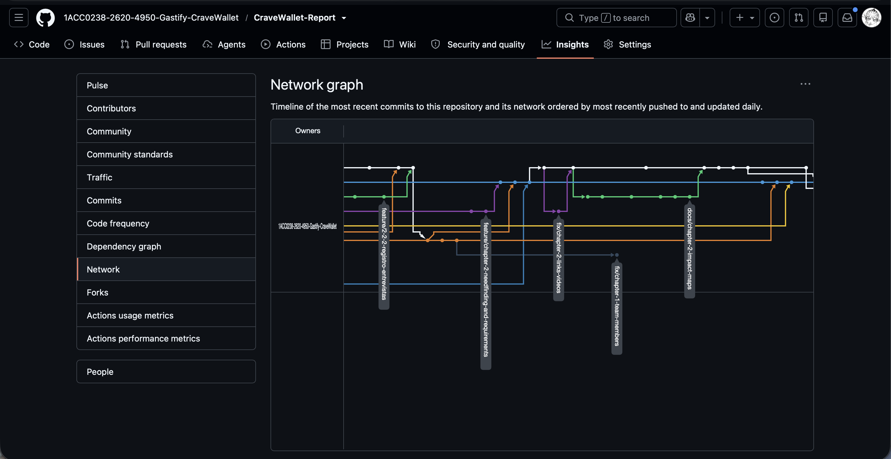

<!-- pdf:omit-start -->

*Figura 107. Network graph de ramas del repositorio CraveWallet-Report en GitHub.*

<!-- pdf:omit-end -->

*Fuente: captura del repositorio en GitHub.*

***

### 4.1.3. Source Code Style Guide & Conventions

Todos los repositorios siguen las mismas convenciones de estilo y nomenclatura. Toda la nomenclatura del código se escribe en **inglés**.

***

#### Convenciones generales de nomenclatura

Cada tipo de elemento usa una convención de capitalización:

* **PascalCase:** Nombres de componentes React, interfaces TypeScript, tipos y clases Java (`UserProfile`, `SubscriptionCard`, `SubscriptionController`).
* **camelCase:** Variables locales, parámetros, métodos Java, hooks y props (`userId`, `isLoading`, `handleSubmit`, `registerSubscription`).
* **lowercase con puntos:** Paquetes Java (`pe.edu.upc.gastify.cravewallet.subscriptions.domain.model`).
* **kebab-case:** Nombres de archivos, rutas de URL, selectores CSS/Tailwind personalizados y nombres de ramas Git (`user-profile.tsx`, `feature/subscription-list`).
* **SCREAMING_SNAKE_CASE:** Constantes globales, constantes `static final` de Java e identificadores de entorno (`API_BASE_URL`, `MAX_SUBSCRIPTIONS`).
* **snake_case:** Tablas y columnas de PostgreSQL (`subscriptions`, `renewal_date`).

***

#### HTML & CSS Style Guide

Basado en la *Google HTML/CSS Style Guide* y las directrices de la W3C:

* **HTML:** Uso obligatorio de etiquetas semánticas (`<header>`, `<main>`, `<section>`, `<footer>`) para mejorar el SEO y la accesibilidad. Indentación de 2 espacios. Uso de comillas dobles para todos los atributos. Los atributos `alt` en imágenes son obligatorios.
* **CSS / Tailwind CSS:** Se prioriza el uso de clases de utilidad de Tailwind CSS sobre hojas de estilo personalizadas. Cuando se requieran estilos globales adicionales, se definen en `globals.css` utilizando variables CSS (`--color-primary`). Se prohíbe el uso de estilos en línea (`style=""`).

***

#### TypeScript & React Style Guide

Siguiendo la *Google JavaScript Style Guide*, las directrices de MDN y la guía oficial de React:

* **TypeScript:** Tipado estricto habilitado (`strict: true` en `tsconfig.json`). Se prefiere `interface` sobre `type` para definir la forma de objetos. Los tipos de retorno de funciones se declaran explícitamente cuando no son evidentes.
* **Sintaxis:** Uso exclusivo de ES6+ (`arrow functions`, `destructuring`, `template literals`, `optional chaining`). Se prefiere `const` para todas las declaraciones; `let` se usa solo cuando la reasignación es estrictamente necesaria. Se prohíbe `var`.
* **React:** Los componentes se escriben exclusivamente como funciones (componentes funcionales). Los nombres de componentes siguen **PascalCase** y multi-word para evitar conflictos con elementos HTML estándar (correcto: `FeatureCard`; incorrecto: `Card`). Los efectos secundarios se gestionan con `useEffect`; el estado local con `useState` o `useReducer`.

***

#### Java & Spring Boot Style Guide

Basado en la *Google Java Style Guide* y las guías de referencia de Spring:

* **Formato:** Indentación de 4 espacios, una clase pública por archivo y llaves en la misma línea de la declaración. Los `import` se declaran de forma explícita, sin comodines (`*`).
* **Capas:** Cada Bounded Context se organiza en los paquetes `domain`, `application`, `interfaces` e `infrastructure`, como se describe en la sección 2.6. La capa `domain` no depende de Spring ni de JPA.
* **Spring:** Inyección de dependencias por constructor (sin `@Autowired` en atributos). Los controladores REST solo traducen peticiones a comandos o consultas y delegan en los servicios de aplicación. Los endpoints usan sustantivos en plural y kebab-case (`/api/v1/subscriptions`, `/api/v1/delivery-expenses`).
* **Modelado:** Los Value Objects y los DTO se declaran como `record` inmutables. Las entidades JPA se mantienen separadas de las entidades de dominio y se convierten mediante mappers.

***

#### Gherkin Conventions

Para la redacción de criterios de aceptación de las User Stories:

* **Formato:** Estructura estricta `Given / When / Then / And`.
* **Lenguaje:** Las especificaciones se redactan desde la perspectiva del negocio y del usuario, evitando detalles técnicos de implementación en los pasos de Gherkin.
* **Idioma:** El contenido de los escenarios se redacta en español para facilitar la validación con stakeholders no técnicos.

***

#### Referencias de estándares adoptados

La tabla 144 relaciona cada tecnología con la guía de estilo de referencia adoptada.

*Tabla 144. Referencias de estándares adoptados.*

| Tecnología | Referencia |
| :--- | :--- |
| HTML / CSS | Google HTML/CSS Style Guide / W3C |
| TypeScript | TypeScript Deep Dive / Microsoft TSConfig Reference |
| JavaScript | Google JS Style Guide / MDN Web Docs |
| React | React Docs — Thinking in React |
| Tailwind CSS | Tailwind CSS Docs — Utility-First Fundamentals |
| Java | Google Java Style Guide |
| Spring Boot | Spring Boot Reference Documentation |
| Gherkin | Gherkin Conventions for Readable Specifications |

*Fuente: elaboración del equipo Gastify.*

***

### 4.1.4. Software Deployment Configuration

Los tres productos del hito TB1 se publican por separado. La tabla 145 resume la plataforma, el mecanismo de despliegue y la dirección pública de cada uno al 9 de octubre de 2026.

*Tabla 145. Plataformas de despliegue de CraveWallet.*

| Producto | Repositorio y rama | Plataforma | Mecanismo de despliegue | Dirección |
| --- | --- | --- | --- | --- |
| Landing page | `cravewallet-landing`, `main` | Vercel (equipo `gastify`) | Build `next build` automático en cada push a `main`. | <https://cravewallet-landing.vercel.app> |
| REST API | `CraveWallet-Backend`, `feature/cloud-deployment` | Render Free (Docker, región Oregon) con PostgreSQL 17 | El `Dockerfile` ejecuta `mvnw verify` y empaqueta el JAR con Java 21; el servicio inicia con el perfil `prod`. | <https://cravewallet-api.onrender.com> |
| Aplicación Android | `CraveWallet-Mobile`, `develop` | Compilación con Gradle | APK `debug` que apunta a la URL del API definida en `API_BASE_URL`. | Sin distribución pública |

*Fuente: [configuración de despliegue del backend](https://github.com/1ACC0238-2620-4950-Gastify-CraveWallet/CraveWallet-Backend/blob/740aba0/docs/cloud-deployment.md), [guía de la aplicación](https://github.com/1ACC0238-2620-4950-Gastify-CraveWallet/CraveWallet-Mobile/blob/e72d283/README.md) y paneles de Vercel y Render.*

#### Landing page en Vercel

**Herramientas y tecnologías desplegadas en el landing page:**

* **Next.js 16:** Framework utilizado como base del landing page, que provee el sistema de build y las optimizaciones de rendimiento en producción.
* **TypeScript:** Lenguaje compilado a JavaScript en tiempo de build; Vercel ejecuta `tsc` y `next build` como parte del pipeline de despliegue.
* **Tailwind CSS 4:** Procesado mediante PostCSS durante el build; los estilos no utilizados son eliminados automáticamente (purge) para reducir el tamaño del bundle.

**Pasos para el despliegue del Landing Page en Vercel:**

1. Conectar el repositorio `cravewallet-landing` a un proyecto en Vercel desde el dashboard de la plataforma.
2. Seleccionar la rama `main` como rama de producción y configurar el framework preset como **Next.js**.
3. Definir las variables de entorno necesarias en la sección *Environment Variables* del proyecto en Vercel.
4. Vercel ejecuta automáticamente `npm run build` (`next build`) al detectar un nuevo push o merge en `main`.
5. Una vez completado el build, el sitio queda publicado en la URL asignada por Vercel y disponible de forma global mediante su CDN.

La figura 108 muestra el panel del proyecto `cravewallet-landing` en Vercel: el deployment de producción en estado `Ready`, la rama `main` como origen y el commit `3cdc4c5`.

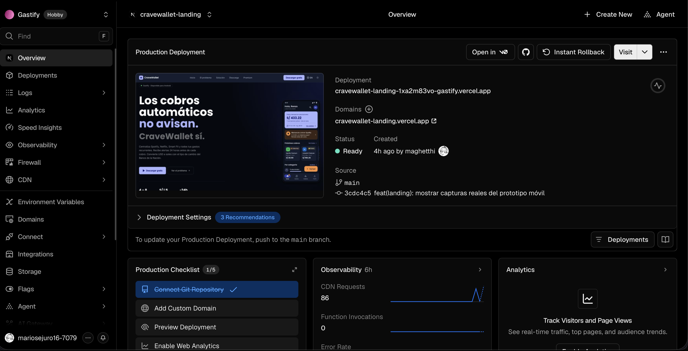

<!-- pdf:omit-start -->

*Figura 108. Panel del proyecto cravewallet-landing en Vercel con el deployment de producción.*

<!-- pdf:omit-end -->

*Fuente: captura del panel de Vercel del equipo Gastify, 9 de octubre de 2026.*

#### REST API en Render

El REST API se ejecuta localmente con Java 21 y el perfil `local`, que utiliza H2 en memoria y escucha en `127.0.0.1:8080`, y en Render con el perfil `prod` sobre PostgreSQL 17. Flyway aplica V1 para usuarios y sesiones, V2 para suscripciones y V3 para gastos de delivery y presupuestos. La tabla 146 distingue los perfiles de ejecución.

*Tabla 146. Configuración de ejecución del backend.*

| Elemento | Configuración |
| --- | --- |
| Proyecto | `CraveWallet-Backend`, paquete raíz `pe.edu.upc.gastify.cravewallet`. |
| Construcción | Java 21, Spring Boot 3.5.16, Maven Wrapper; comando `mvnw.cmd -B verify`. |
| Perfil `local` | H2 2.3.232 en memoria, `spring.jpa.hibernate.ddl-auto=validate` y Flyway habilitado. Puerto 8080 con `/actuator/health`, `/v3/api-docs` y `/swagger-ui.html`. Sin `JWT_SECRET` se genera una clave efímera. |
| Perfil `postgres` | URL, usuario y contraseña mediante `DATABASE_URL`, `DATABASE_USERNAME` y `DATABASE_PASSWORD`; requiere `JWT_SECRET` de al menos 32 bytes. |
| Perfil `prod` | Contenedor Java 21 sin usuario root, escucha en `0.0.0.0` y lee `PORT`. Conexión interna a PostgreSQL 17, pool de cinco conexiones, variables privadas persistentes en Render y Swagger público deshabilitado. |
| Datos y secretos | H2 pierde sus datos al detener el proceso. Las credenciales y el `JWT_SECRET` se definen solo en el proveedor, nunca en Git. |

*Fuente: [configuración, migraciones y guía de ejecución del backend](https://github.com/1ACC0238-2620-4950-Gastify-CraveWallet/CraveWallet-Backend/tree/740aba0) y [resultado de Maven](evidence/backend/maven-verify.txt).*

El plan gratuito de Render suspende el servicio tras un período de inactividad, por lo que la primera solicitud puede tardar unos segundos adicionales, y su base de datos caduca el 7 de noviembre de 2026. La evidencia del despliegue se presenta en la sección 4.2.1.8.

## 4.2. Landing Page & Mobile Application Implementation

Para el hito TB1, el enunciado requiere un landing desplegado, el backend al 70 % y las pantallas core de la aplicación. Esta sección presenta el Sprint 1 con los nueve apartados exigidos y la evidencia disponible al 9 de octubre de 2026. Se documentan las tareas completadas en el Sprint: las del landing page y las del hito TB1 (aplicación Android, backend y despliegue).

### 4.2.1. Sprint 1

#### 4.2.1.1. Sprint Planning 1

El Sprint 1 corresponde a la entrega TB1. En la AV1, el Product Backlog priorizado se distribuyó en cuatro sprints en Trello (sección 2.4.3) y el Sprint 1 recibió las historias del landing page. El sprint se planificó del 16 de septiembre al 9 de octubre de 2026. La tabla 147 resume la reunión de planificación; como es el primer sprint, no existen un Review ni una Retrospectiva anteriores.

*Tabla 147. Sprint Planning 1.*

| Campo | Contenido |
| --- | --- |
| Sprint # | Sprint 1 |
| Date | 2026-09-16 |
| Time | 08:00 PM |
| Location | Reunión virtual del equipo. El alcance se tomó del [tablero del Product Backlog](https://trello.com/b/W0MvIjVH/cravewallet-product-backlog) en Trello. |
| Prepared By | Sejuro Medina, Mario Gabriel |
| Attendees (to planning meeting) | Sejuro Medina, Mario Gabriel / Faustino Hurtado, Anghelo Edwin / Roman Zeballos, Sebastian Jared / Carpio Peña, Josué Francisco / Aliaga, Alexander |
| Sprint 0 Review Summary | No aplica: el Sprint 1 es el primer sprint del proyecto. Parte de la AV1, que entregó los capítulos I y II con el Product Backlog de 40 User Stories, 6 Technical Stories y 6 Spike Stories priorizado y estimado. |
| Sprint 0 Retrospective Summary | No aplica: el Sprint 1 es el primer sprint del proyecto. |
| Sprint 1 Goal | **Our focus is on** publicar un landing que presente la propuesta de valor y los planes de CraveWallet, mostrar las pantallas principales de la aplicación Android y exponer servicios de backend documentados y probados. **We believe it delivers** una presentación pública del producto y una base funcional para registrar suscripciones y gastos **to** jóvenes de Lima que hoy descubren un cobro automático al revisar su banco. **This will be confirmed when** el landing responda en una dirección pública, la aplicación navegue sus pantallas principales y las operaciones del backend se ejecuten con éxito en un servidor accesible. |
| Sprint 1 Velocity | 4 Story Points completados de la planificación del Product Backlog (sección 2.4.3). |
| Sum of Story Points | 4 Story Points: US24 (2) y US25 (2). Las tareas del hito TB1 (aplicación Android, backend y despliegue) no tienen estimación en el tablero. |

*Fuente: elaboración del equipo Gastify.*

#### 4.2.1.2. Aspect Leaders and Collaborators

Los aspectos del Sprint 1 son los tres productos de la TB1: el landing page, la aplicación Android y el backend con su despliegue. La tabla 148 identifica el liderazgo («L») y la colaboración («C») de cada integrante; «—» significa que no consta una asignación. La participación efectiva se contrasta con los commits en la sección 4.2.1.9.

*Tabla 148. Leadership-and-Collaboration Matrix del Sprint 1.*

| Team Member (Last Name, First Name) | GitHub Username | Landing page | Aplicación Android | Backend y despliegue | Informe |
| --- | --- | --- | --- | --- | --- |
| Sejuro Medina, Mario Gabriel | maghetthi | **L** | — | — | C |
| Faustino Hurtado, Anghelo Edwin | Limos05 (`limozz05` en los commits) | — | C | **L** | C |
| Roman Zeballos, Sebastian Jared | Chebas19 | C | **L** | — | C |
| Carpio Peña, Josué Francisco | josf17 | — | — | — | C |
| Aliaga, Alexander | AlexanderAliaga19 | — | — | — | C |

*Fuente: elaboración del equipo Gastify.*

#### 4.2.1.3. Sprint Backlog 1

La figura 109 muestra el [tablero público](https://trello.com/b/W0MvIjVH/cravewallet-product-backlog) del Product Backlog. La tabla 149 presenta las tareas completadas en el Sprint 1, incluido el avance de la aplicación y del backend requerido para la TB1.

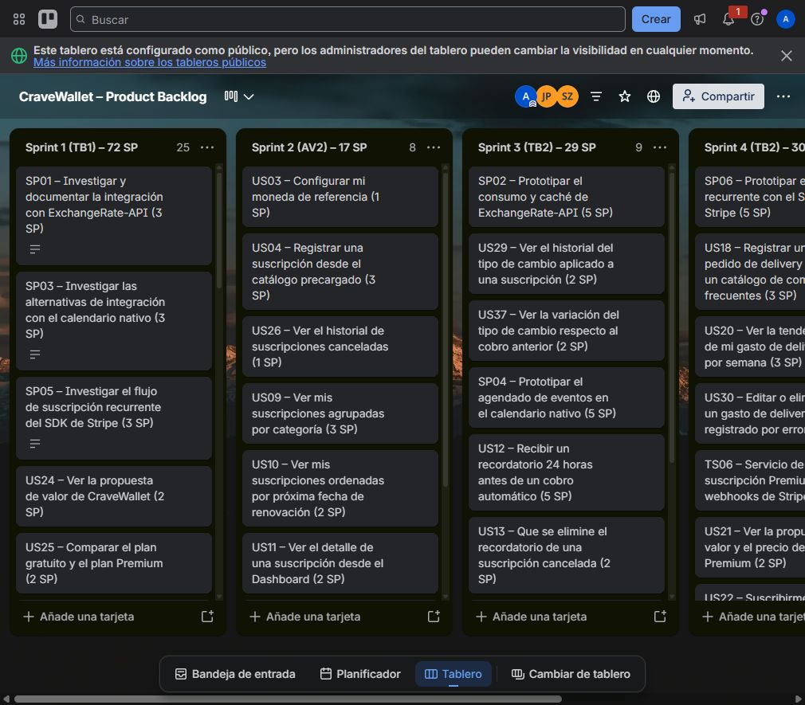

<!-- pdf:omit-start -->

*Figura 109. Tablero del Product Backlog en Trello.*

<!-- pdf:omit-end -->

*Fuente: captura del tablero del equipo Gastify.*

*Tabla 149. Sprint Backlog 1 y avances de la TB1.*

| User Story Id | Task Id | Task Title | Estimation (Hours) | Assigned To | Status |
| --- | --- | --- | ---: | --- | --- |
| US24 | T01 | Presentar propuesta de valor y problema en el landing. | 9 | Mario / Sebastián | Done |
| US25 | T02 | Comparar planes Free y Premium. | 3 | Sebastián | Done |
| Hito TB1 | T03 | Mostrar las pantallas core en Android. | — | Sebastián | Done |
| Hito TB1 | T04 | Implementar y probar los servicios principales del backend. | — | Anghelo | Done |
| Hito TB1 | T05 | Publicar el landing en Vercel. | — | Mario | Done |
| Hito TB1 | T06 | Desplegar el REST API en Render con PostgreSQL. | — | Anghelo | Done |
| Hito TB1 | T07 | Conectar la aplicación Android con el REST API público. | — | Anghelo | Done |

*Fuente: [tablero del Product Backlog](https://trello.com/b/W0MvIjVH/cravewallet-product-backlog) y commits de la sección 4.2.1.4. T03 a T07 no tienen estimación en el tablero.*

#### 4.2.1.4. Development Evidence for Sprint Review

En el Sprint 1 se implementaron los tres productos de la TB1: el landing page, la aplicación Android y los servicios RESTful. Las tablas siguientes relacionan, por repositorio, los commits de implementación con sus fechas en America/Lima. Los commits de pruebas se complementan en la sección 4.2.1.5.

**Landing page.** La tabla 150 lista los commits de `cravewallet-landing`. El landing, construido con Next.js 16, TypeScript y Tailwind CSS 4, se desarrolló en `main` con el Hero y la vista previa de la aplicación, las secciones El problema (con contadores animados), Solución, Preview, Testimonios, Planes y Descarga, el modo oscuro, la versión en español e inglés y las capturas reales de la aplicación.

*Tabla 150. Commits de implementación de cravewallet-landing.*

| Repository | Branch | Commit Id | Commit Message | Commit Message Body | Committed on (Date) |
| --- | --- | --- | --- | --- | --- |
| `cravewallet-landing` | `main` | [fc8605d](https://github.com/1ACC0238-2620-4950-Gastify-CraveWallet/cravewallet-landing/commit/fc8605d04592a8748ea47190a5934d39f3a3d258) | Initial commit from Create Next App | Sin cuerpo | 25/09/2026 |
| `cravewallet-landing` | `main` | [21d55b2](https://github.com/1ACC0238-2620-4950-Gastify-CraveWallet/cravewallet-landing/commit/21d55b230876b46809b9e6ae6c5952fe3869185d) | feat(landing): build CraveWallet landing page | Hero section with phone mockup, headline y CTAs | 25/09/2026 |
| `cravewallet-landing` | `main` | [07d6200](https://github.com/1ACC0238-2620-4950-Gastify-CraveWallet/cravewallet-landing/commit/07d62009e066d35bd73654e1e71186047b7df137) | chore: remove AGENTS.md and CLAUDE.md, add to .gitignore | Sin cuerpo | 25/09/2026 |
| `cravewallet-landing` | `main` | [cdb8c33](https://github.com/1ACC0238-2620-4950-Gastify-CraveWallet/cravewallet-landing/commit/cdb8c33aaca1a16d48c100b13007f2f9d659a46f) | refactor(landing): redesign with Emil Kowalski principles | Headline a clamp(44px,6.5vw,76px) con leading 1.04 | 25/09/2026 |
| `cravewallet-landing` | `main` | [a841252](https://github.com/1ACC0238-2620-4950-Gastify-CraveWallet/cravewallet-landing/commit/a8412523fa1d3f794849cf3de06fa6e970e08561) | feat(landing): complete landing page from Cap. 3 IA | Secciones añadidas segun navegacion del Cap. 3.1.2.5: | 25/09/2026 |
| `cravewallet-landing` | `main` | [5ece888](https://github.com/1ACC0238-2620-4950-Gastify-CraveWallet/cravewallet-landing/commit/5ece88898fd507295254c41369f1ca9937936ab3) | feat(content): actualizar landing con datos reales de Cap. I y II | Hero: titular y body copy basados en enunciado 5W+2H; stats de Statista 2024 | 25/09/2026 |
| `cravewallet-landing` | `feature/landing-sprint-1` | [07300ce](https://github.com/1ACC0238-2620-4950-Gastify-CraveWallet/cravewallet-landing/commit/07300ceff73fe09027ff21717b08b5078176848b) | feat(landing): add problem, plans, FAQ and newsletter sections | Problem section with interview findings and their sample size (US24) | 08/10/2026 |
| `cravewallet-landing` | `feature/landing-sprint-1` | [a7f89df](https://github.com/1ACC0238-2620-4950-Gastify-CraveWallet/cravewallet-landing/commit/a7f89df8e2b8a56bb7ed75cbd8822796040dcacd) | test(landing): add acceptance criteria for Sprint 1 stories | Gherkin features for US24, US25, US32 and US40, taken from the | 08/10/2026 |
| `cravewallet-landing` | `main` | [eec794d](https://github.com/1ACC0238-2620-4950-Gastify-CraveWallet/cravewallet-landing/commit/eec794d5a2e8bb2f616ba3445e970a9ebab90737) | feat(landing): modo oscuro, i18n es/en y cifras alineadas con Figma | Corrige las estadísticas de la sección El problema (2 meses, 41 %, 100 %) | 08/10/2026 |
| `cravewallet-landing` | `main` | [3cdc4c5](https://github.com/1ACC0238-2620-4950-Gastify-CraveWallet/cravewallet-landing/commit/3cdc4c5d72969732a7f597ad62511a542658104f) | feat(landing): mostrar capturas reales del prototipo móvil | Sin cuerpo | 08/10/2026 |

*Fuente: historial de commits de `cravewallet-landing` en GitHub.*

**Aplicación Android.** La tabla 151 lista los commits de `CraveWallet-Mobile`. La aplicación se implementó en Kotlin y Jetpack Compose a partir de los wireframes y el Design System de la sección 3.1.4, con las pantallas Inicio, Gastos, Análisis, Perfil, alta de suscripción y recordatorios. Los commits posteriores corrigen recursos vectoriales, conectan la autenticación, las suscripciones y los gastos de Delivery con el backend, y apuntan la aplicación al API publicado.

*Tabla 151. Commits de implementación de CraveWallet-Mobile.*

| Repository | Branch | Commit Id | Commit Message | Commit Message Body | Committed on (Date) |
| --- | --- | --- | --- | --- | --- |
| `CraveWallet-Mobile` | `develop` | [2d4200e](https://github.com/1ACC0238-2620-4950-Gastify-CraveWallet/CraveWallet-Mobile/commit/2d4200ec2d951dc5c1e06ccc74ee4c432b3a610c) | App móvil CraveWallet en Kotlin + Jetpack Compose | Implementa los wireframes y el Design System del Figma Mobile UX/UI: | 08/10/2026 |
| `CraveWallet-Mobile` | `develop` | [2c7c2b3](https://github.com/1ACC0238-2620-4950-Gastify-CraveWallet/CraveWallet-Mobile/commit/2c7c2b35b30080c05fa2a7880c60ecdf47ab0f5d) | fix: correct mirrored vector drawable attributes | Sin cuerpo | 08/10/2026 |
| `CraveWallet-Mobile` | `develop` | [27c99a2](https://github.com/1ACC0238-2620-4950-Gastify-CraveWallet/CraveWallet-Mobile/commit/27c99a2dcdae1fe24deeed1c0a7590856b9999f8) | feat: connect mobile authentication subscriptions and delivery to backend | Sin cuerpo | 08/10/2026 |
| `CraveWallet-Mobile` | `develop` | [73c5785](https://github.com/1ACC0238-2620-4950-Gastify-CraveWallet/CraveWallet-Mobile/commit/73c5785591b17bbdb4467035161b603a0fcd7141) | feat: connect Android to public HTTPS API and verify cloud flows | Sin cuerpo | 09/10/2026 |
| `CraveWallet-Mobile` | `develop` | [e72d283](https://github.com/1ACC0238-2620-4950-Gastify-CraveWallet/CraveWallet-Mobile/commit/e72d28302cbc229a234e7d9d46b903a806cee5f0) | docs: record completed cloud APK build | Sin cuerpo | 09/10/2026 |

*Fuente: historial de commits de `CraveWallet-Mobile` en GitHub.*

**Servicios RESTful.** La tabla 152 lista los commits de `CraveWallet-Backend`. Los módulos `subscriptions` y `delivery` separan dominio, aplicación, interfaces e infraestructura, y los modelos de dominio no importan Spring ni JPA. IAM proporciona identidad y sesiones como capacidad técnica; `premium` conserva su estructura de paquetes. Las contraseñas se almacenan con BCrypt y los tokens de renovación con hash SHA-256; renovar revoca la sesión anterior y los bloqueos transaccionales protegen el límite Free, los reintentos de gastos y la actualización del presupuesto.

*Tabla 152. Commits de implementación de CraveWallet-Backend.*

| Repository | Branch | Commit Id | Commit Message | Commit Message Body | Committed on (Date) |
| --- | --- | --- | --- | --- | --- |
| `CraveWallet-Backend` | `develop` | [b507e7d](https://github.com/1ACC0238-2620-4950-Gastify-CraveWallet/CraveWallet-Backend/commit/b507e7da455f87be904bd3a55d1989fa80425acc) | Initial commit | Sin cuerpo | 29/09/2026 |
| `CraveWallet-Backend` | `develop` | [1f1b39b](https://github.com/1ACC0238-2620-4950-Gastify-CraveWallet/CraveWallet-Backend/commit/1f1b39b4bc5ab9cc42f96912579a3dc36e944375) | feat: bootstrap Java 21 backend aligned with report contexts | Sin cuerpo | 08/10/2026 |
| `CraveWallet-Backend` | `develop` | [2c188be](https://github.com/1ACC0238-2620-4950-Gastify-CraveWallet/CraveWallet-Backend/commit/2c188be9fef598d8824f49e4fdd44d27e2b83e9c) | feat: implement authentication profile and revocable JWT sessions | Sin cuerpo | 08/10/2026 |
| `CraveWallet-Backend` | `develop` | [adfea26](https://github.com/1ACC0238-2620-4950-Gastify-CraveWallet/CraveWallet-Backend/commit/adfea26a6318673b3cff46425ff1a6ed9debe7ad) | feat: implement owner-scoped subscriptions and cancellation history | Sin cuerpo | 08/10/2026 |
| `CraveWallet-Backend` | `develop` | [70c3f01](https://github.com/1ACC0238-2620-4950-Gastify-CraveWallet/CraveWallet-Backend/commit/70c3f01b3a1407aca8eea33420a74290d609d4f7) | feat: implement idempotent delivery expenses and monthly budgets | Sin cuerpo | 08/10/2026 |
| `CraveWallet-Backend` | `develop` | [2f36260](https://github.com/1ACC0238-2620-4950-Gastify-CraveWallet/CraveWallet-Backend/commit/2f36260dc1aa9b8e4ef71a7184847795e6cb6867) | feat: add cached exchange rates and subscription reminders | Sin cuerpo | 08/10/2026 |
| `CraveWallet-Backend` | `develop` | [67ede2a](https://github.com/1ACC0238-2620-4950-Gastify-CraveWallet/CraveWallet-Backend/commit/67ede2ae8c2b9cb02bb8151f5a163344a7ef3d4f) | feat: prepare production Docker deployment with managed PostgreSQL | Sin cuerpo | 08/10/2026 |
| `CraveWallet-Backend` | `develop` | [740aba0](https://github.com/1ACC0238-2620-4950-Gastify-CraveWallet/CraveWallet-Backend/commit/740aba087efab41b500c4e26860f10bdcee663e8) | docs: record verified public API and persistence after restart | Sin cuerpo | 09/10/2026 |

*Fuente: historial de commits de `CraveWallet-Backend` en GitHub; la implementación puede revisarse en el [código versionado](https://github.com/1ACC0238-2620-4950-Gastify-CraveWallet/CraveWallet-Backend/tree/740aba0/src/main/java/pe/edu/upc/gastify/cravewallet).*

#### 4.2.1.5. Testing Suite Evidence for Sprint Review

**Backend.** El comando `mvnw.cmd -B verify`, ejecutado con Java 21 el 8 de octubre de 2026, terminó con `BUILD SUCCESS`: 32 pruebas, cero fallos, cero errores y ningún caso omitido. La tabla 153 relaciona cada suite con los comportamientos comprobados. El workflow [build.yaml](https://github.com/1ACC0238-2620-4950-Gastify-CraveWallet/CraveWallet-Backend/blob/740aba0/.github/workflows/build.yaml) ejecuta `verify` en GitHub Actions en cada push (sección 4.2.1.8).

*Tabla 153. Suite de pruebas ejecutada del backend.*

| Tipo de prueba | Clase | Casos | Comprobación principal |
| --- | --- | ---: | --- |
| Integración | `AuthIntegrationTest` | 8 | Registro y hashes, login, perfil propio, rotación concurrente, revocación y rechazo de JWT manipulados o vencidos. |
| Integración | `BackendBootstrapTest` | 3 | Health, documentación OpenAPI con esquemas de alta separados y protección de rutas de negocio. |
| Integración | `SubscriptionIntegrationTest` | 7 | Aislamiento entre cuentas, validación, edición, cancelación repetida, cupos concurrentes, filtros, totales, cotización y recordatorios. |
| Integración | `DeliveryIntegrationTest` | 5 | Presupuesto, períodos, validación, aislamiento, deduplicación y altas simultáneas con un reintento. |
| Unitaria de aplicación | `ExchangeRateServiceTest` | 5 | Caché de 24 horas, respaldo antiguo acotado, retroceso tras fallos, tasa inversa, fechas inválidas y concurrencia. |
| Adaptador HTTP aislado | `OpenExchangeRateAdapterTest` | 2 | Traducción HTTP y rechazo de respuestas inválidas o 429 mediante servidor local. |
| Unitaria de aplicación | `PortfolioConversionTest` | 2 | Conversión antes del redondeo mensual anual y conservación del portafolio cuando falta cotización. |
| **Total** | **7 clases** | **32** | **0 fallos, 0 errores, 0 omitidas.** |

*Fuente: [resumen extraído de Surefire](evidence/backend/test-results.json), [salida de Maven](evidence/backend/maven-verify.txt) y [fuentes de las pruebas](https://github.com/1ACC0238-2620-4950-Gastify-CraveWallet/CraveWallet-Backend/tree/740aba0/src/test/java/pe/edu/upc/gastify/cravewallet).*

**Unit Tests.** Siete casos prueban el servicio de cotización y la conversión del portafolio sin iniciar Spring; otros dos verifican el adaptador del proveedor mediante un servidor HTTP de prueba.

**Integration Tests.** Los 23 casos restantes inician el contexto de Spring y comprueban las rutas, la seguridad, la persistencia y las migraciones con H2, mediante MockMvc y JWT. Incluyen solicitudes simultáneas para validar la rotación de sesiones, el cupo de suscripciones y la deduplicación de gastos.

**Aplicación Android.** La tabla 154 presenta las nueve pruebas de la integración con el backend. Se ejecutaron con `gradlew :app:assembleDebug :app:testDebugUnitTest :app:lintDebug`: primero contra el backend local (H2) y después contra el API público de Render con PostgreSQL, en ambos casos con nueve pruebas, cero fallos y cero errores de lint (24 advertencias en la primera ejecución). La prueba de interfaz usa Robolectric y MockWebServer.

*Tabla 154. Pruebas de integración de la aplicación Android.*

| Tipo de prueba | Clase | Casos | Comprobación principal |
| --- | --- | ---: | --- |
| Integración con el backend | `BackendIntegrationTest` | 8 | Escritura con JSON y conflictos, un solo uso del token de renovación en solicitudes concurrentes, ida y vuelta con el backend real, portafolio sin datos de demostración, sesión persistida y cierre de sesión, conversión no disponible, reintento tras 401 y sesión inválida. |
| Interfaz | `AppConnectionUiTest` | 1 | Inicio y cierre de sesión contra el servidor en lugar del perfil de demostración. |
| **Total** | **2 clases** | **9** | **0 fallos, 0 errores, 0 omitidas.** |

*Fuente: [resultados contra el backend local](https://github.com/1ACC0238-2620-4950-Gastify-CraveWallet/CraveWallet-Mobile/blob/27c99a2/docs/integration-test-results.json) y [resultados contra el API público](https://github.com/1ACC0238-2620-4950-Gastify-CraveWallet/CraveWallet-Mobile/blob/73c5785/docs/cloud-integration-results.json).*

**Landing page.** Los criterios de aceptación de las historias del landing se escribieron como [archivos Gherkin](https://github.com/1ACC0238-2620-4950-Gastify-CraveWallet/cravewallet-landing/tree/a7f89df/tests/features)

La tabla 155 relaciona los commits que incorporan pruebas.

*Tabla 155. Commits relacionados con testing.*

| Repository | Branch | Commit Id | Commit Message | Pruebas incorporadas | Committed on (Date) |
| --- | --- | --- | --- | --- | --- |
| `CraveWallet-Backend` | `develop` | [2c188be](https://github.com/1ACC0238-2620-4950-Gastify-CraveWallet/CraveWallet-Backend/commit/2c188be9fef598d8824f49e4fdd44d27e2b83e9c) | feat: implement authentication profile and revocable JWT sessions | `AuthIntegrationTest` y `BackendBootstrapTest`. | 08/10/2026 |
| `CraveWallet-Backend` | `develop` | [adfea26](https://github.com/1ACC0238-2620-4950-Gastify-CraveWallet/CraveWallet-Backend/commit/adfea26a6318673b3cff46425ff1a6ed9debe7ad) | feat: implement owner-scoped subscriptions and cancellation history | `SubscriptionIntegrationTest`. | 08/10/2026 |
| `CraveWallet-Backend` | `develop` | [70c3f01](https://github.com/1ACC0238-2620-4950-Gastify-CraveWallet/CraveWallet-Backend/commit/70c3f01b3a1407aca8eea33420a74290d609d4f7) | feat: implement idempotent delivery expenses and monthly budgets | `DeliveryIntegrationTest`. | 08/10/2026 |
| `CraveWallet-Backend` | `develop` | [2f36260](https://github.com/1ACC0238-2620-4950-Gastify-CraveWallet/CraveWallet-Backend/commit/2f36260dc1aa9b8e4ef71a7184847795e6cb6867) | feat: add cached exchange rates and subscription reminders | `ExchangeRateServiceTest`, `OpenExchangeRateAdapterTest` y `PortfolioConversionTest`. | 08/10/2026 |
| `CraveWallet-Mobile` | `develop` | [27c99a2](https://github.com/1ACC0238-2620-4950-Gastify-CraveWallet/CraveWallet-Mobile/commit/27c99a2dcdae1fe24deeed1c0a7590856b9999f8) | feat: connect mobile authentication subscriptions and delivery to backend | `BackendIntegrationTest` y `AppConnectionUiTest`. | 08/10/2026 |
| `cravewallet-landing` | `feature/landing-sprint-1` | [a7f89df](https://github.com/1ACC0238-2620-4950-Gastify-CraveWallet/cravewallet-landing/commit/a7f89dfe) | test(landing): add acceptance criteria for Sprint 1 stories | Archivos Gherkin de los criterios de aceptación del landing. | 08/10/2026 |

*Fuente: historial de commits de los repositorios del equipo en GitHub.*

#### 4.2.1.6. Execution Evidence for Sprint Review

En el Sprint 1 se ejecutaron los tres productos. La figura 110 muestra el landing publicado en Vercel; la figura 111 muestra la pantalla Inicio y la figura 112, la pantalla Análisis de la aplicación en un emulador Android; y las figuras 113 a 116 muestran operaciones del backend en Swagger. Los enlaces de ejecución de cada producto están en la sección 4.2.1.8.

**Landing page.** La figura 110 presenta el Hero del sitio publicado, con la barra de navegación, el selector de idioma, el interruptor de modo oscuro y la vista previa de la aplicación.

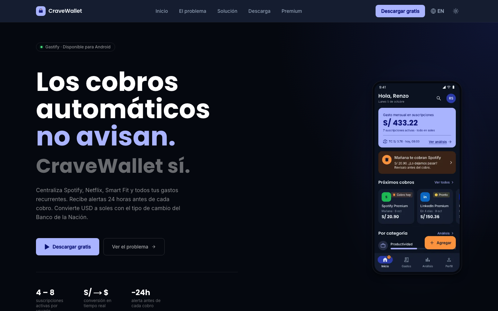

<!-- pdf:omit-start -->

*Figura 110. Hero del landing page publicado en Vercel (Desktop).*

<!-- pdf:omit-end -->

*Fuente: captura de <https://cravewallet-landing.vercel.app/es> del 9 de octubre de 2026, elaboración del equipo Gastify.*

**Aplicación Android.** La aplicación del commit `2d4200e` compiló con `BUILD SUCCESSFUL` y se instaló en un emulador Android. Las pantallas Inicio (figura 111) y Análisis (figura 112) usan datos de demostración.

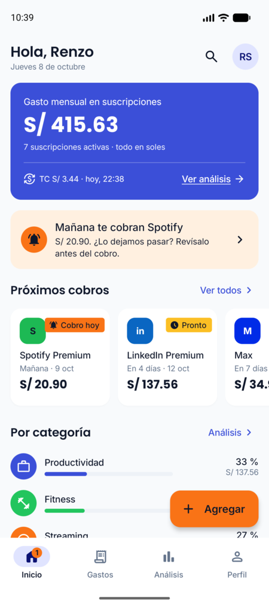

<!-- pdf:omit-start -->

*Figura 111. Inicio de CraveWallet ejecutado en el emulador Android.*

<!-- pdf:omit-end -->

*Fuente: captura propia de `CraveWallet-Mobile` `2d4200e`, 8 de octubre de 2026, con datos de demostración.*

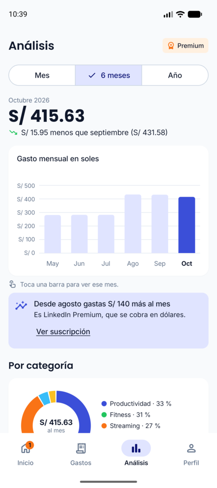

<!-- pdf:omit-start -->

*Figura 112. Análisis de CraveWallet ejecutado en el emulador Android.*

<!-- pdf:omit-end -->

*Fuente: captura propia de `CraveWallet-Mobile` `2d4200e`, 8 de octubre de 2026, con datos de demostración.*

**Servicios RESTful.** Se ejecutó el backend local y se probaron sus 16 métodos mediante HTTP. En Swagger se revisaron registro, login, alta y listado de una suscripción USD, recordatorio, cotización, presupuesto, gasto y resumen. La tabla 156 muestra los resultados del ejercicio reproducible registrado en [live-api-results.json](evidence/backend/live-api-results.json).

*Tabla 156. Resultados observados de ejecución del backend local.*

| Flujo | Resultado observado |
| --- | --- |
| Registro y login | 201 y 200, respectivamente; consulta y actualización del perfil autenticado: 200. |
| Suscripciones | Alta: 201; listado, detalle, edición y cancelación local: 200. La consulta del historial conserva el registro cancelado. |
| Cotización y resumen | USD/PEN real consultado al proveedor; el portafolio devuelve total PEN, fuente y fecha. El valor cambia con cada actualización. |
| Recordatorio | 200 para el propietario; `reminderAt` está 24 horas antes de `billingAt`, con zona America/Lima. |
| Delivery y presupuesto | Presupuesto de S/ 100 y gasto ficticio de S/ 35,50: total S/ 35,50 y saldo S/ 64,50. Reintentar el mismo registro devuelve 200 sin duplicar el gasto. |
| Renovación y logout | Renovación: 200; logout: 204; usar luego el token revocado: 401. |

*Fuente: [registro de ejecución HTTP](evidence/backend/live-api-results.json), [especificación OpenAPI](evidence/backend/openapi.json) y pruebas de integración de la tabla 153.*

La información utilizada fue ficticia y se almacenó en H2 local. El endpoint de recordatorio prepara datos; no agenda un evento ni envía notificaciones. Como el modelo conserva una fecha sin hora, la renovación se representa a las 00:00 de America/Lima.

La figura 113 muestra `POST /api/v1/subscriptions` con una suscripción ficticia en PEN: la respuesta contiene el identificador, el estado `ACTIVE`, la fecha de renovación y la cabecera `Location`.

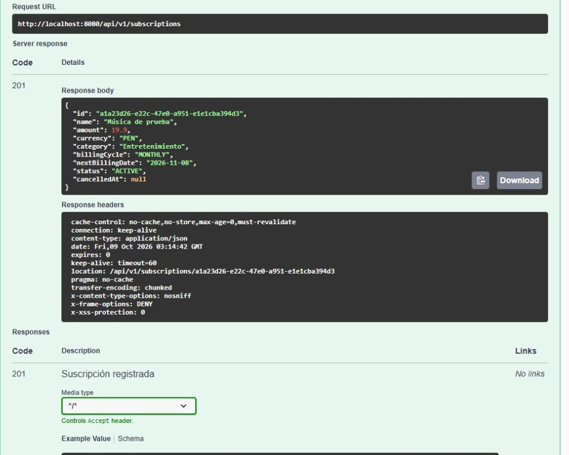

<!-- pdf:omit-start -->

*Figura 113. Registro de una suscripción: HTTP 201 y recurso creado.*

<!-- pdf:omit-end -->

*Fuente: captura propia de Swagger UI, CraveWallet-Backend `2f36260`, entorno local H2, 8 de octubre de 2026 (America/Lima), con datos ficticios.*

Antes del alta, se consultó el portafolio con una suscripción de USD 9,99. El servidor devolvió `monthlyTotalPen=34.37` y `conversionAvailable=true`; la tasa y sus fechas están en el [JSON de la consulta](evidence/backend/swagger-subscriptions-response.json) (figura 114).

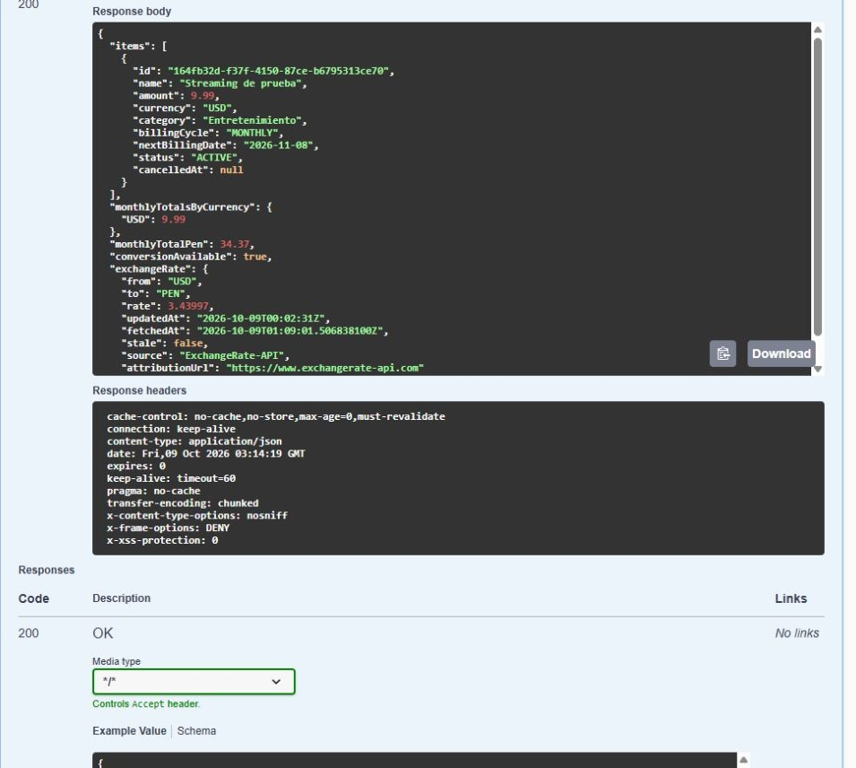

<!-- pdf:omit-start -->

*Figura 114. Consulta del portafolio de suscripciones: HTTP 200 y conversión a PEN.*

<!-- pdf:omit-end -->

*Fuente: captura propia de Swagger UI, CraveWallet-Backend `2f36260`, entorno local H2, 8 de octubre de 2026 (America/Lima), con datos ficticios.*

Con un presupuesto de S/ 100 y un gasto de S/ 35,50 en octubre de 2026, el resumen devuelve el total, el saldo y los desgloses por categoría y semana (figura 115).

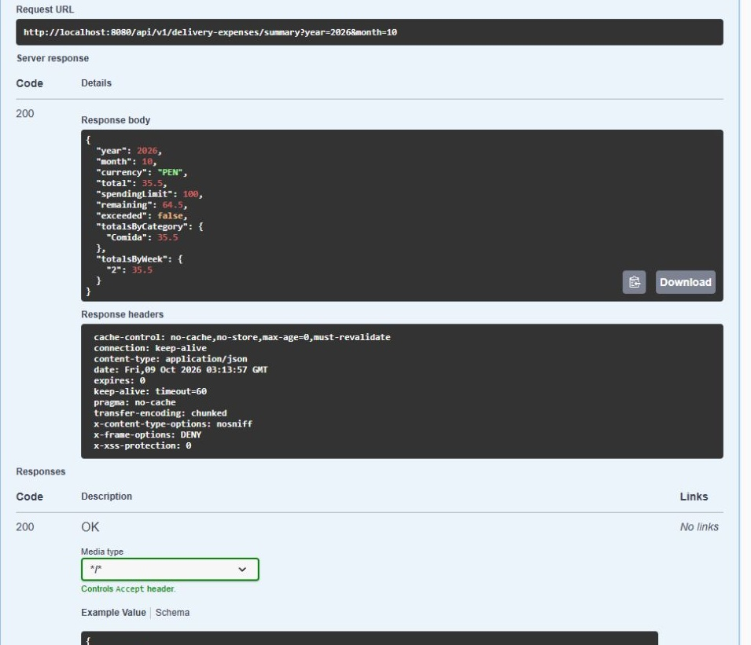

<!-- pdf:omit-start -->

*Figura 115. Resumen de Delivery: HTTP 200, gasto S/ 35,50 y saldo S/ 64,50.*

<!-- pdf:omit-end -->

*Fuente: captura propia de Swagger UI, CraveWallet-Backend `2f36260`, entorno local H2, 8 de octubre de 2026 (America/Lima), con datos ficticios.*

La consulta del recordatorio devuelve `reminderAt=2026-11-07T05:00:00Z` y `billingAt=2026-11-08T05:00:00Z`, con zona `America/Lima` (figura 116).

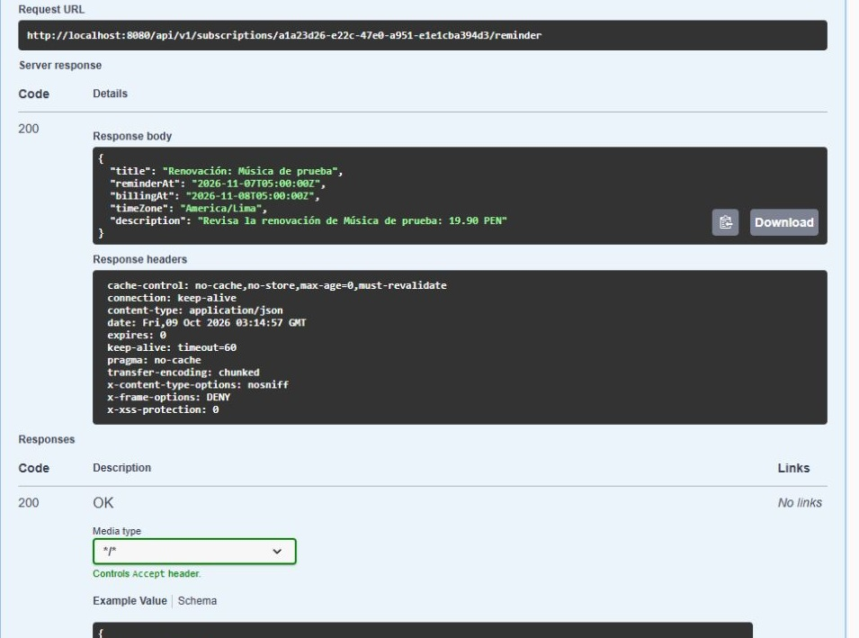

<!-- pdf:omit-start -->

*Figura 116. Datos del recordatorio: HTTP 200 y aviso 24 horas antes de la renovación.*

<!-- pdf:omit-end -->

*Fuente: captura propia de Swagger UI, CraveWallet-Backend `2f36260`, entorno local H2, 8 de octubre de 2026 (America/Lima), con datos ficticios.*

<!-- Falta el enlace al video de navegación del Sprint Review. -->

#### 4.2.1.7. Services Documentation Evidence for Sprint Review

El backend documenta con OpenAPI las 16 operaciones de la tabla 157. La documentación se genera desde el código con springdoc-openapi y se consulta en Swagger UI al ejecutar el servicio localmente (figura 117); el perfil de producción deshabilita Swagger público, por lo que la [especificación capturada](evidence/backend/openapi.json) permite revisar los esquemas, parámetros y respuestas sin depender de un servidor encendido.

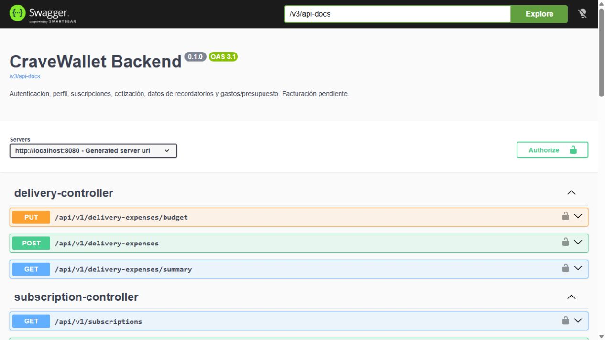

<!-- pdf:omit-start -->

*Figura 117. Documentación OpenAPI del backend CraveWallet en Swagger UI.*

<!-- pdf:omit-end -->

*Fuente: captura propia de Swagger UI, CraveWallet-Backend `2f36260`, entorno local H2, 8 de octubre de 2026 (America/Lima), con datos ficticios.*

Las rutas parten de `https://cravewallet-api.onrender.com/api/v1` y todas requieren el token Bearer, salvo las de registro, login y renovación. La tabla 157 presenta, por cada operación, el verbo HTTP, la ruta, el acceso, los parámetros y la respuesta exitosa.

*Tabla 157. Endpoints implementados y documentados del backend.*

| Método | Ruta | Acceso | Parámetros o cuerpo JSON | Resultado exitoso |
| --- | --- | --- | --- | --- |
| POST | `/api/v1/auth/register` | Sin JWT | JSON: `email`, `password`. | 201; perfil y tokens. |
| POST | `/api/v1/auth/login` | Sin JWT | JSON: `email`, `password`. | 200; perfil y tokens. |
| POST | `/api/v1/auth/refresh` | Token de renovación en el cuerpo | JSON: `refreshToken`. | 200; nuevo par de tokens, anterior revocado. |
| POST | `/api/v1/auth/logout` | Bearer JWT | Sin cuerpo ni parámetros. | 204; sesión revocada. |
| GET | `/api/v1/users/me` | Bearer JWT | Sin parámetros; usuario obtenido del JWT. | 200; perfil propio. |
| PATCH | `/api/v1/users/me` | Bearer JWT | JSON: `referenceCurrency="PEN"`. | 200; moneda de referencia PEN. |
| POST | `/api/v1/subscriptions` | Bearer JWT | JSON: `name`, `amount`, `currency`, `category`, `billingCycle`, `nextBillingDate`. | 201; registro activo y cabecera Location. |
| GET | `/api/v1/subscriptions` | Bearer JWT | Query opcional: `status` (ACTIVE por defecto), `search`, `category`. | 200; registros, desglose por moneda y estimación PEN. |
| GET | `/api/v1/subscriptions/{id}` | Bearer JWT y propiedad | Path: `id` UUID. | 200; detalle. |
| PATCH | `/api/v1/subscriptions/{id}` | Bearer JWT y propiedad | Path: `id` UUID; JSON con al menos uno de `amount`, `category`, `nextBillingDate`. | 200; importe, categoría o fecha actualizados. |
| POST | `/api/v1/subscriptions/{id}/cancel` | Bearer JWT y propiedad | Path: `id` UUID; sin cuerpo. | 200; cancelación local idempotente. |
| GET | `/api/v1/subscriptions/{id}/reminder` | Bearer JWT y propiedad | Path: `id` UUID; sin cuerpo. | 200; datos del aviso para registro activo. |
| GET | `/api/v1/exchange-rate` | Bearer JWT | Query: `from=USD`, `to=PEN` por defecto; monedas admitidas PEN/USD. | 200; tasa PEN/USD, fuente, fechas y condición de antigüedad. |
| POST | `/api/v1/delivery-expenses` | Bearer JWT | JSON: `requestId` UUID, `merchant`, `amount`, `category`, `expenseDate`. | 201 al crear; 200 ante un reintento idéntico. |
| GET | `/api/v1/delivery-expenses/summary` | Bearer JWT | Query: `year`, `month`; ambos numéricos o ninguno para el período actual de Lima. | 200; período, total, límite, saldo, categorías y semanas. |
| PUT | `/api/v1/delivery-expenses/budget` | Bearer JWT | JSON: `year`, `month`, `spendingLimit` (null para retirar el límite). | 200; límite opcional y acumulado del período. |

*Fuente: [OpenAPI capturado](evidence/backend/openapi.json) y [contratos del backend](https://github.com/1ACC0238-2620-4950-Gastify-CraveWallet/CraveWallet-Backend/tree/740aba0/docs).*

Los contratos ampliados se encuentran en [autenticación y perfil](https://github.com/1ACC0238-2620-4950-Gastify-CraveWallet/CraveWallet-Backend/blob/740aba0/docs/auth-api.md), [suscripciones](https://github.com/1ACC0238-2620-4950-Gastify-CraveWallet/CraveWallet-Backend/blob/740aba0/docs/subscriptions-api.md), [Delivery](https://github.com/1ACC0238-2620-4950-Gastify-CraveWallet/CraveWallet-Backend/blob/740aba0/docs/delivery-api.md) y [cotización y recordatorios](https://github.com/1ACC0238-2620-4950-Gastify-CraveWallet/CraveWallet-Backend/blob/740aba0/docs/exchange-and-reminders-api.md); describen cuerpos JSON, límites, filtros y errores. Los importes usan `BigDecimal` y no se suman monedas diferentes sin cotización.

Los errores incluyen 400 para datos inválidos, 401 para autenticación no válida, 404 para recursos inexistentes o ajenos y 409 para conflictos de estado, cupos o reintentos con contenido distinto. La cotización devuelve 503 si no hay un valor utilizable; en ese caso el portafolio conserva los importes originales y devuelve `monthlyTotalPen=null` con `conversionAvailable=false`.

La caché USD/PEN dura 24 horas por instancia; ante un fallo, puede usar una tasa anterior de menos de siete días indicando `stale=true`. La [documentación del proveedor](https://www.exchangerate-api.com/docs/free) exige atribución para el endpoint Open Access, por lo que el contrato devuelve `attributionUrl` para que la interfaz la muestre.

**Ejemplo de alta de suscripción.** La figura 118 muestra el cuerpo enviado desde Swagger a `POST /api/v1/subscriptions`, con `Content-Type: application/json` y una sesión Bearer autorizada. Los seis campos son obligatorios: `currency` admite PEN/USD, `billingCycle` admite MONTHLY/ANNUAL y la fecha debe ser actual o futura en America/Lima.

```json
{
  "name": "Música de prueba",
  "amount": 19.9,
  "currency": "PEN",
  "category": "Entretenimiento",
  "billingCycle": "MONTHLY",
  "nextBillingDate": "2026-11-08"
}
```

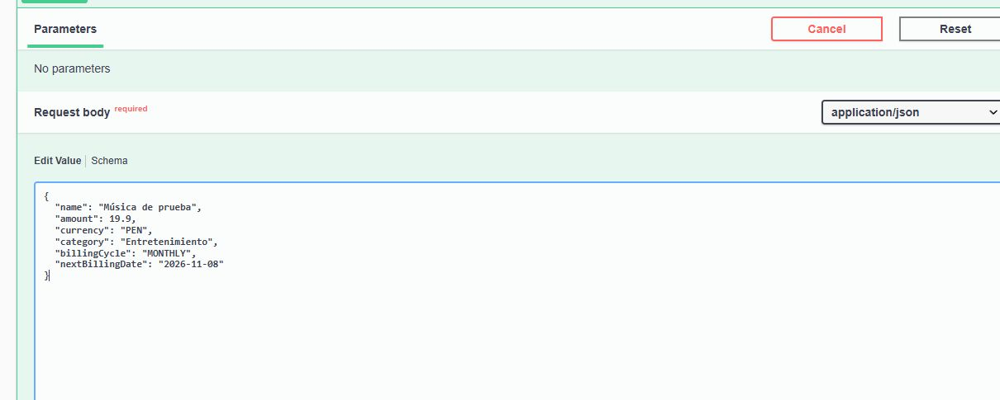

<!-- pdf:omit-start -->

*Figura 118. Cuerpo JSON de alta de una suscripción en Swagger UI.*

<!-- pdf:omit-end -->

*Fuente: captura propia del backend local `2f36260`, 8 de octubre de 2026 (America/Lima). La respuesta real se presenta en la figura 113 y en [swagger-subscription-created.json](evidence/backend/swagger-subscription-created.json).*

**Ejemplo de consulta del resumen mensual.** La figura 119 muestra los parámetros de `GET /api/v1/delivery-expenses/summary?year=2026&month=10`. El propietario se obtiene de la sesión y los importes se expresan en PEN.

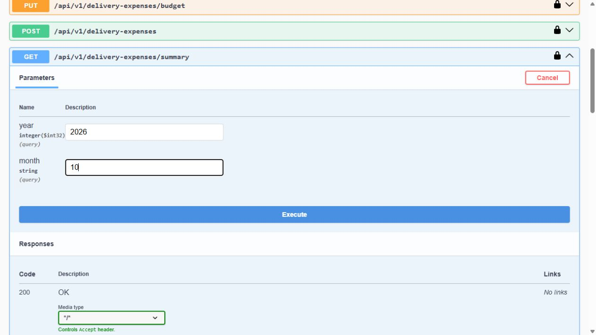

<!-- pdf:omit-start -->

*Figura 119. Parámetros year y month para consultar el resumen de Delivery.*

<!-- pdf:omit-end -->

*Fuente: captura propia del backend local `2f36260`, 8 de octubre de 2026 (America/Lima).*

La respuesta HTTP 200 de la figura 115 contiene el siguiente JSON, [conservado desde Swagger](evidence/backend/swagger-summary-response.json):

```json
{
  "currency": "PEN",
  "exceeded": false,
  "month": 10,
  "remaining": 64.5,
  "spendingLimit": 100,
  "total": 35.5,
  "totalsByCategory": {
    "Comida": 35.5
  },
  "totalsByWeek": {
    "2": 35.5
  },
  "year": 2026
}
```

#### 4.2.1.8. Software Deployment Evidence for Sprint Review

En el Sprint 1 se publicaron el landing page y el REST API; la aplicación Android se compiló como APK y se conectó al API público. La tabla 158 resume el estado de cada producto al 9 de octubre de 2026 y las secciones siguientes presentan su evidencia.

*Tabla 158. Estado de ejecución y despliegue al 9 de octubre de 2026.*

| Producto | Estado | Evidencia |
| --- | --- | --- |
| Landing page | Publicado en Vercel desde `main`; HTTP 200. | [cravewallet-landing.vercel.app](https://cravewallet-landing.vercel.app); dos deployments `Production` correctos (tabla 159 y figura 108). |
| REST API | Publicado en Render con PostgreSQL 17 y perfil `prod`; health `UP`. | [Health público](https://cravewallet-api.onrender.com/actuator/health); figuras 121 a 124. |
| Base de datos | PostgreSQL 17 en Render; Flyway V1–V3. | 22 comprobaciones HTTP remotas y siete tras el reinicio del servicio ([resultados](https://github.com/1ACC0238-2620-4950-Gastify-CraveWallet/CraveWallet-Backend/blob/740aba0/docs/evidence/cloud/remote-api-results.json)). |
| Aplicación Android | APK `debug` generado; pruebas de integración contra el API público. | [Resultados](https://github.com/1ACC0238-2620-4950-Gastify-CraveWallet/CraveWallet-Mobile/blob/73c5785/docs/cloud-integration-results.json); APK `CraveWallet-TB1-cloud-debug.apk`. |

*Fuente: paneles de Vercel y Render, GitHub Actions y los resultados versionados en los repositorios.*

**Landing page.** Se publica con Vercel desde la rama `main` de `cravewallet-landing`, en <https://cravewallet-landing.vercel.app>. Cada push a `main` genera un deployment de producción; la tabla 159 lista los que registra GitHub.

*Tabla 159. Deployments de producción del landing page en Vercel.*

| Commit | Fecha (America/Lima) | Entorno | Estado |
| --- | --- | --- | --- |
| [eec794d](https://github.com/1ACC0238-2620-4950-Gastify-CraveWallet/cravewallet-landing/commit/eec794d5a2e8bb2f616ba3445e970a9ebab90737) | 08/10/2026 21:58 | Production | Correcto |
| [3cdc4c5](https://github.com/1ACC0238-2620-4950-Gastify-CraveWallet/cravewallet-landing/commit/3cdc4c5d72969732a7f597ad62511a542658104f) | 08/10/2026 22:19 | Production | Correcto |

*Fuente: [Deployments de GitHub](https://github.com/1ACC0238-2620-4950-Gastify-CraveWallet/cravewallet-landing/deployments) creados por Vercel para el repositorio `cravewallet-landing` y [registro del deployment Production](evidence/deployment/vercel-production.json).*

La figura 120 muestra el landing servido en su dirección pública.

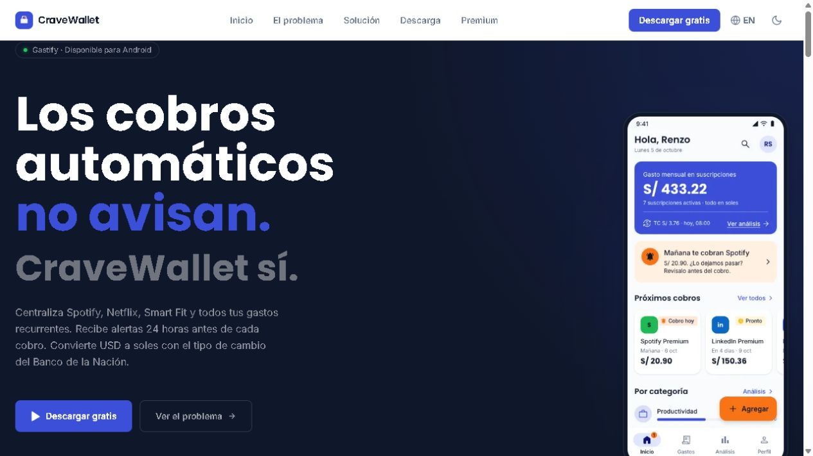

<!-- pdf:omit-start -->

*Figura 120. Landing de CraveWallet publicada en Vercel.*

<!-- pdf:omit-end -->

*Fuente: captura del equipo Gastify de <https://cravewallet-landing.vercel.app/es>, 9 de octubre de 2026; procedencia en [capturas.json](evidence/deployment/capturas.json).*

**Servicios RESTful.** Se publicaron en Render como servicio Docker `cravewallet-api` en el plan gratuito (región Oregon), junto con una base PostgreSQL 17. El servicio compila la rama `feature/cloud-deployment` en el commit `67ede2a` y queda disponible por HTTPS en <https://cravewallet-api.onrender.com>. La figura 121 muestra el servicio en estado Live y la figura 122, el historial de eventos con el despliegue y el reinicio solicitado.

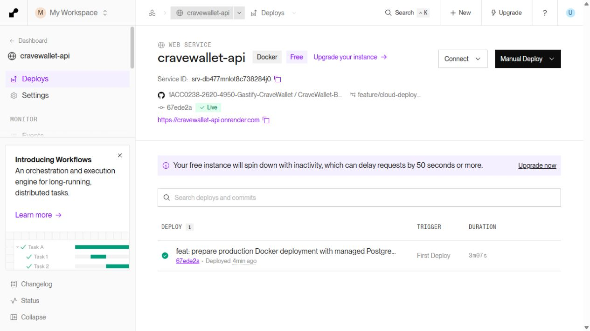

<!-- pdf:omit-start -->

*Figura 121. Servicio cravewallet-api en estado Live en Render.*

<!-- pdf:omit-end -->

*Fuente: captura del panel de Render del equipo Gastify, commit `67ede2a`, 8 de octubre de 2026.*

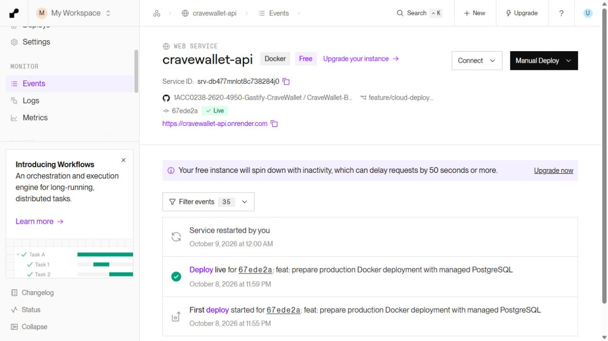

<!-- pdf:omit-start -->

*Figura 122. Eventos del servicio cravewallet-api en Render: despliegue y reinicio.*

<!-- pdf:omit-end -->

*Fuente: captura del panel de Render del equipo Gastify, 9 de octubre de 2026.*

La figura 123 muestra la pantalla de arranque que Render presenta al abrir el health público de un servicio del plan gratuito tras un período de inactividad; la siguiente petición respondió HTTP 200 y `UP` a las 00:57:35 (America/Lima).

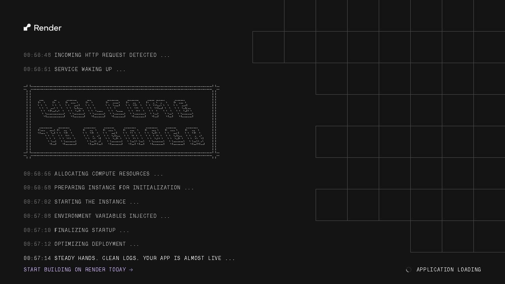

<!-- pdf:omit-start -->

*Figura 123. Pantalla de arranque de Render al acceder al health público.*

<!-- pdf:omit-end -->

*Fuente: captura del equipo Gastify de <https://cravewallet-api.onrender.com/actuator/health>, 9 de octubre de 2026; procedencia en [capturas.json](evidence/deployment/capturas.json).*

Tras el reinicio se comprobó que se conservaron la sesión, la suscripción editada y el presupuesto con su gasto, y que el cierre de sesión revocó el acceso. La figura 124 muestra la respuesta pública de `/actuator/health`.

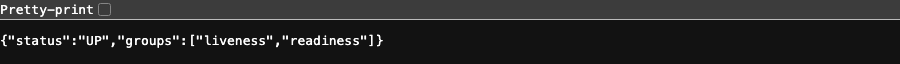

<!-- pdf:omit-start -->

*Figura 124. Respuesta pública de /actuator/health del REST API: estado UP.*

<!-- pdf:omit-end -->

*Fuente: captura de <https://cravewallet-api.onrender.com/actuator/health>, 9 de octubre de 2026; [respuesta registrada](evidence/deployment/health-publico.json).*

La construcción del backend se verifica en GitHub Actions: el workflow `Backend build` terminó con éxito en sus siete ejecuciones, entre el commit `1f1b39b` y el `740aba0`, sobre `develop` y `feature/cloud-deployment` (figura 125).

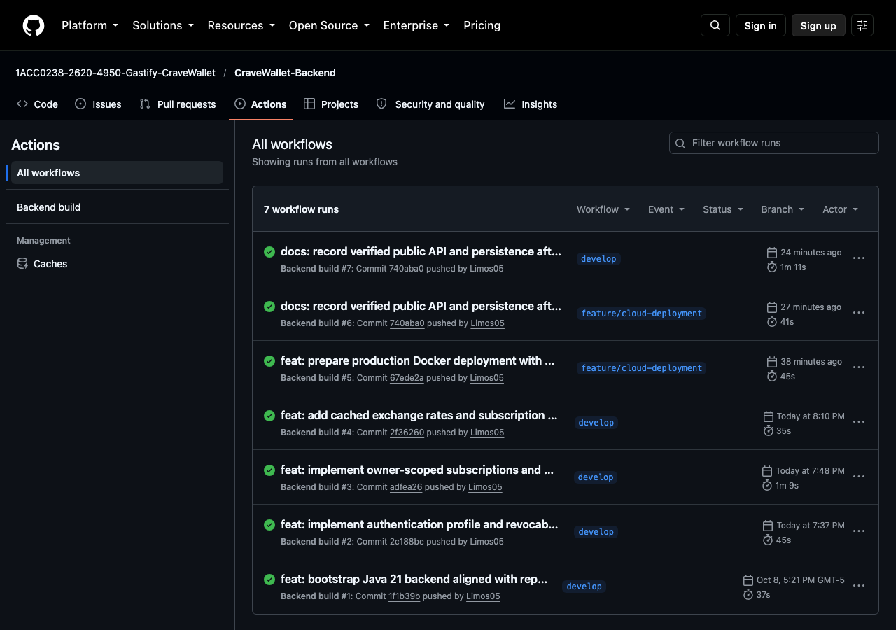

<!-- pdf:omit-start -->

*Figura 125. Ejecuciones del workflow Backend build en GitHub Actions.*

<!-- pdf:omit-end -->

*Fuente: captura de GitHub Actions del repositorio `CraveWallet-Backend`, 9 de octubre de 2026.*

**Aplicación Android.** El APK se genera con Gradle y apunta a la URL pública del API mediante `API_BASE_URL`. La compilación `CraveWallet-TB1-cloud-debug.apk` pesa 15 121 075 bytes y su huella SHA-256 es `5e2ab68b5056adc4a08db0c4cc4ffc2e2e90d5bff6b912fc95bc9b87767c0ec3`. La suite de la tabla 154 se ejecutó contra el API de Render y terminó sin fallos. El APK no se distribuye públicamente.

#### 4.2.1.9. Team Collaboration Insights during Sprint

El historial de los repositorios muestra el aporte de cada integrante en el Sprint 1. La tabla 160 presenta los commits de cada uno por repositorio entre el 16 de septiembre y el 9 de octubre de 2026 (informe hasta el commit `3dbbc36`), y excluye los commits de merge. La figura 126 presenta los mismos datos. Los commits de Anghelo Faustino en los repositorios de código figuran con el usuario `limozz05` y los del informe, con su cuenta `Limos05`.

*Tabla 160. Commits de cada integrante por repositorio en el Sprint 1.*

| Integrante | Landing page | Aplicación Android | Servicios RESTful | Informe |
| --- | ---: | ---: | ---: | ---: |
| Sejuro Medina, Mario Gabriel | 8 | 0 | 0 | 32 |
| Faustino Hurtado, Anghelo Edwin | 0 | 4 | 7 | 32 |
| Roman Zeballos, Sebastian Jared | 2 | 1 | 1 | 30 |
| Carpio Peña, Josué Francisco | 0 | 0 | 0 | 7 |
| Aliaga, Alexander | 0 | 0 | 0 | 3 |

*Fuente: historial de commits de `cravewallet-landing`, `CraveWallet-Mobile`, `CraveWallet-Backend` y `CraveWallet-Report` en GitHub.*

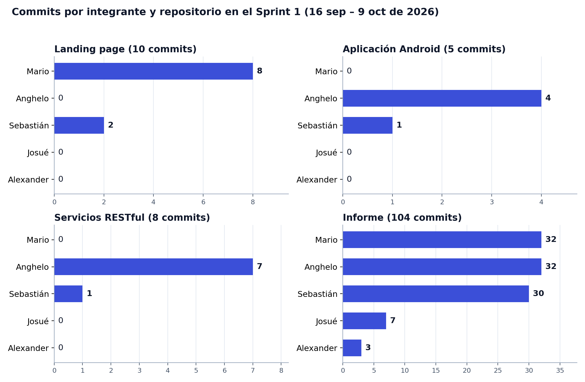

<!-- pdf:omit-start -->

*Figura 126. Commits por integrante y repositorio en el Sprint 1.*

<!-- pdf:omit-end -->

*Fuente: elaboración del equipo Gastify a partir del historial Git de todas las ramas de los cuatro repositorios.*

La implementación se concentra en tres integrantes. Mario Sejuro desarrolló el landing publicado; Sebastián Roman escribió las secciones adicionales del landing, inicializó el repositorio del backend y desarrolló la aplicación Android; y Anghelo Faustino implementó el backend, el despliegue en Render y la conexión de la aplicación con el API.

## 4.3. Validation Interviews

### 4.3.1. Diseño de Entrevistas

### 4.3.2. Registro de Entrevistas

### 4.3.3. Evaluaciones según heurísticas
