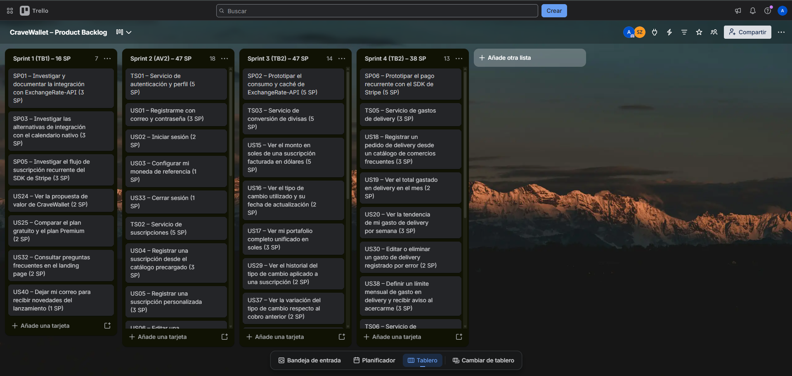

# Conclusiones

[[PENDIENTE: conclusiones del equipo]]

# Glosario

[[PENDIENTE: glosario de términos]]

# Bibliografía

<!-- pdf:only
::: {#refs}
:::
-->

## Papers académicos de dominio (Q2, Scopus-indexed)

Imawan, R., Putra, W. P., Alqahtani, R., Milakis, E. D., & Dumchykov, M. (2025). Enhancing financial literacy in young adults: An Android-based personal finance management tool. *Journal of Hypermedia & Technology-Enhanced Learning*, *3*(1), 64–89. https://doi.org/10.58536/j-hytel.166

Tetteh, F. K., & Owusu Kwateng, K. (2025). The pathways from digital financial literacy to sustained engagement with mobile financial services: A technology continuance theory perspective. *Journal of Financial Services Marketing*, *31*(1). https://doi.org/10.1057/s41264-025-00335-6

## Papers académicos de técnicas de desarrollo móvil (Scopus-indexed)

Mushtaq, F., Azam, F., & Anwar, M. W. (2024). Performance comparison of single code base development tools: Flutter, React Native, and Xamarin. En *2024 14th International Conference on Software Technology and Engineering (ICSTE 2024)* (pp. 17–23). IEEE. https://doi.org/10.1109/ICSTE68572.2024.00011

Zou, D., & Darus, M. Y. (2024). A comparative analysis of cross-platform mobile development frameworks. En *2024 IEEE 6th Symposium on Computers & Informatics (ISCI)* (pp. 1–6). IEEE. https://doi.org/10.1109/ISCI62787.2024.10667693

## Dominio de negocio

Deloitte. (2024). *Digital Media Trends: 18th edition*. Deloitte Insights. https://www2.deloitte.com/us/en/insights/industry/technology/digital-media-trends-consumption-habits-survey.html

Gartner. (2024). *Gartner forecasts worldwide public cloud end-user spending to reach $723 billion in 2025*. Gartner. https://www.gartner.com/en/newsroom/press-releases/2024-11-19-gartner-forecasts-worldwide-public-cloud-end-user-spending-to-reach-723-billion-dollars-in-2025

Kantar. (2024). *Estudio de comportamiento del consumidor digital: Delivery y servicios online en Lima*. Kantar Perú. https://www.kantar.com/peru

Ministerio de Transportes y Comunicaciones. (2023). *Encuesta Nacional de Demanda de Servicios de Telecomunicaciones*. MTC del Perú. https://www.mtc.gob.pe

PricewaterhouseCoopers Perú. (2024). *Digitalización y gasto profesional en Lima: Perspectivas para millennials*. PwC Perú. https://www.pwc.pe

Statista Research Department. (2024). *Number of subscription-based digital services used per person in Latin America*. Statista. https://www.statista.com

Superintendencia de Banca, Seguros y AFP. (2023). *Encuesta Nacional de Capacidades Financieras en el Perú*. SBS. https://www.sbs.gob.pe

## Métodos y técnicas de ingeniería de software

Gothelf, J., & Seiden, J. (2021). *Lean UX: Creating great products with agile teams* (3.a ed.). O'Reilly Media.

Portigal, S. (2013). *Interviewing users: How to uncover compelling insights*. Rosenfeld Media.

## Lenguajes, frameworks y herramientas

BudgetBakers. (2026). *Everything about Premium*. Wallet Help Center. https://support.budgetbakers.com/hc/en-us/articles/7151349344018-Everything-about-Premium

CNBC Select. (2026). *Best subscription trackers of 2026*. CNBC. https://www.cnbc.com/select/best-subscription-trackers/

Diario Financiero. (2023). *Nuestro viaje ha terminado: fintech española Fintonic cierra sus operaciones en Chile*. Diario Financiero. https://www.df.cl/mercados/banca-fintech/nuestro-viaje-ha-terminado-fintech-espanola-fintonic-cierra-sus

Fintonic. (2026). *Organiza tu dinero y ahorra con la app de Fintonic*. https://www.fintonic.com/es-ES/inicio/

Rocket Money. (2026). *The 7 best subscription management apps in 2026*. Rocket Money. https://www.rocketmoney.com/learn/personal-finance/best-subscription-management-apps

Spendee. (2026). *What is Spendee Premium?* Spendee Help Center. https://help.spendee.com/article/202-what-is-spendee-premium

# Anexos

## Anexo A. Product Backlog en Trello

El Product Backlog de CraveWallet se gestiona en Trello. El tablero organiza las 40 User Stories, 6 Technical Stories y 6 Spike Stories de la especificación en cuatro listas, una por sprint, respetando la priorización y estimación descritas en la sección 2.4.3.

**Enlace público del tablero:** [CraveWallet – Product Backlog](https://trello.com/b/W0MvIjVH/cravewallet-product-backlog)

*Figura A1. Product Backlog de CraveWallet en Trello.*
