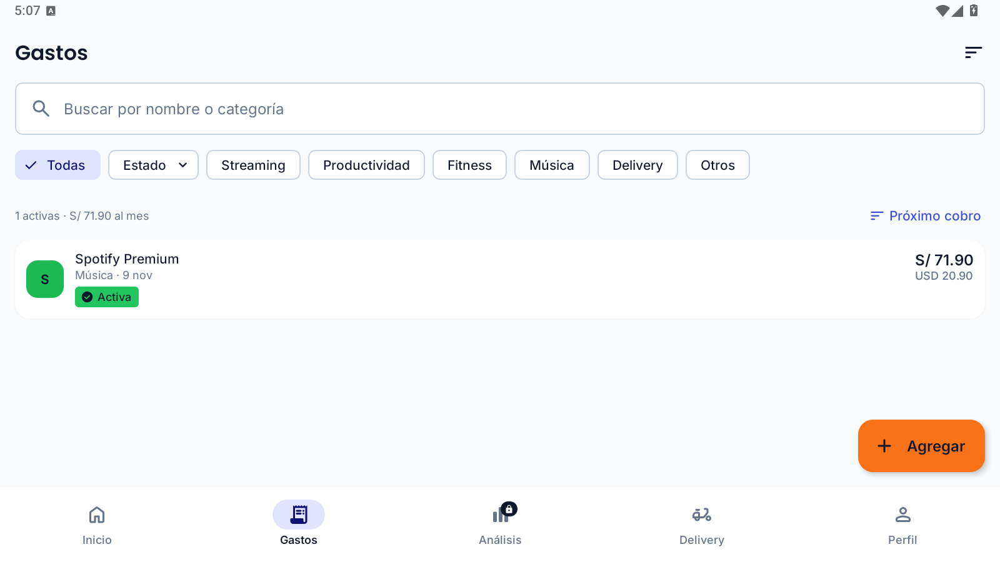
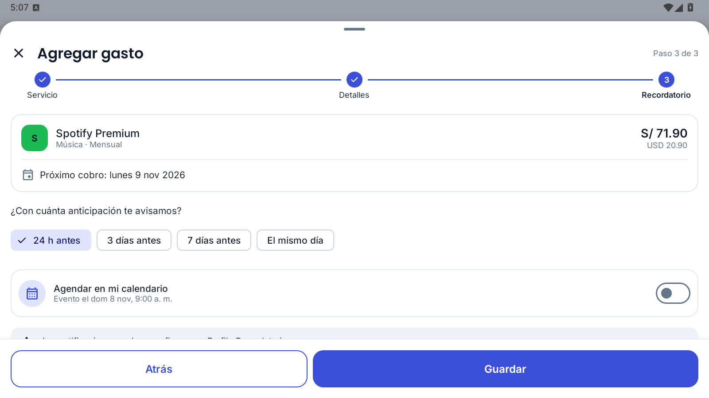
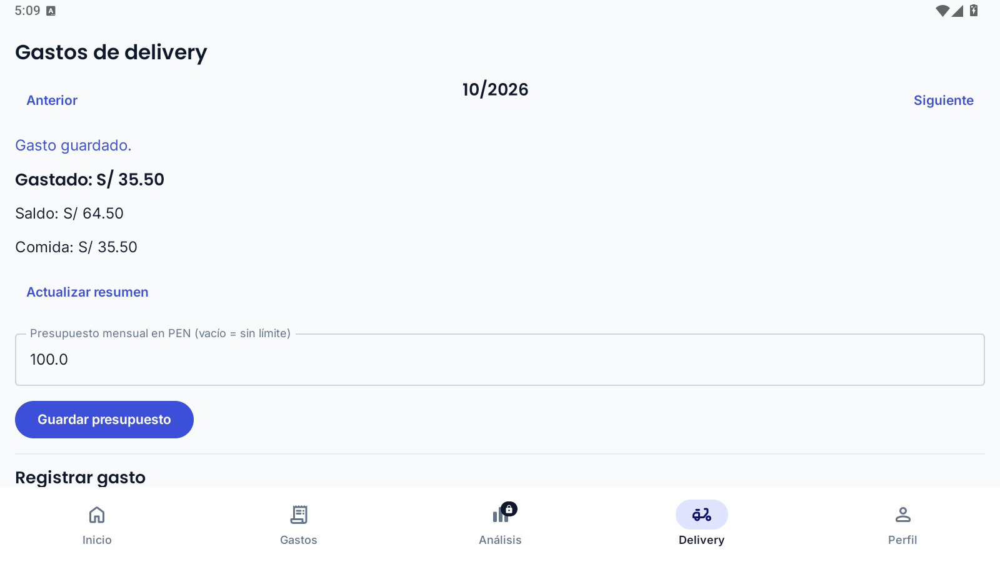
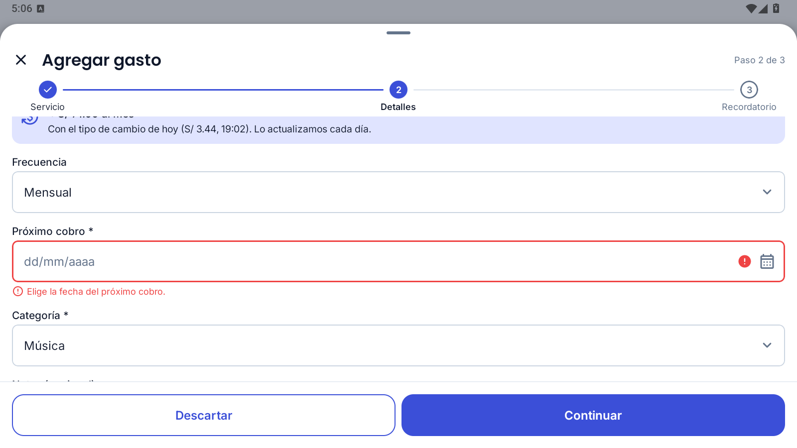
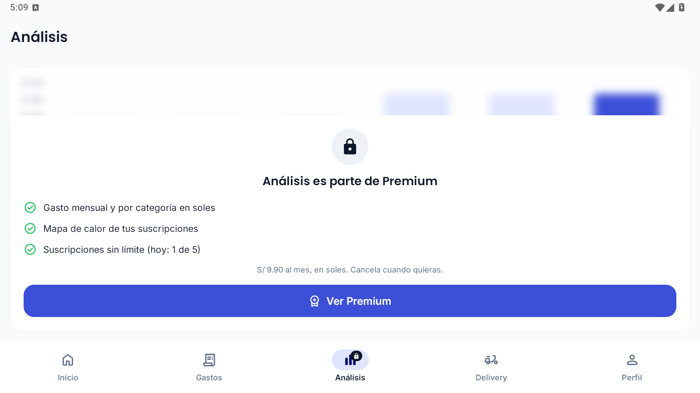
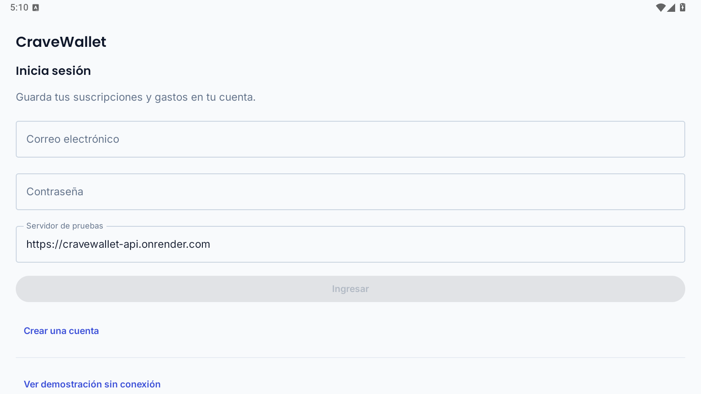

# Evidencia móvil TB1: LDPlayer, 9 de octubre de 2026

**Flujos verificados en emulador. La prueba en celular físico la realizó Alexander Aliaga y no tiene capturas en este registro.**

Se probó la app instalada en LDPlayer 14, Android 14 (API 34), resolución horizontal 1600 × 900. El modelo HD1910 informado por el emulador no corresponde a un teléfono físico probado. Se usó una cuenta ficticia; no se publican sus credenciales ni tokens.

El APK instalado y `CraveWallet-TB1-cloud-debug.apk` de Descargas tienen SHA-256 `5e2ab68b5056adc4a08db0c4cc4ffc2e2e90d5bff6b912fc95bc9b87767c0ec3`, igual al registro `docs/cloud-integration-results.json` del repositorio móvil. La URL pública aparece en el DEX y en el acceso. El checkout `develop` estaba en `e72d28302cbc229a234e7d9d46b903a806cee5f0`; respecto a `73c5785` solo cambia `docs/cloud-build.txt`. El APK no incluye un identificador Git comprobable: su correspondencia se acredita mediante el hash del artefacto documentado, no mediante una etiqueta de commit en la pantalla.

Backend comprobado: <https://cravewallet-api.onrender.com>, health `UP`. Tras las operaciones en la UI, una sesión REST independiente recuperó la misma suscripción y el mismo resumen de delivery. Esa sesión se cerró; sus tokens no se guardaron en la evidencia.

## Acciones y resultados observados

| Flujo | Acción | Resultado | Alcance e historias relacionadas |
| --- | --- | --- | --- |
| Registro | Crear una cuenta ficticia desde el acceso, sin entrar en demostración. | Sesión conectada e inicio inicialmente vacío. | US01, escenario de registro correcto. Otros escenarios no acreditados. |
| Suscripción | Gastos → Agregar mi primera suscripción → Spotify Premium; USD 20.90, Música, mensual, 09/11/2026; guardar sin calendario. | Registro activo en Gastos; USD 20.90 y S/ 71.90 (figuras M1 y M2); recuperado mediante API. | US04; componente de alta relacionado con UG1. No se ensayó el alta personalizada de US05. |
| Persistencia | Detener el proceso, volver a abrir y actualizar desde Perfil. | Inicio conserva la suscripción, importe y fecha; lectura independiente del servidor coincide. | Persistencia del portafolio; complemento de T07. No se verificó tras reiniciar Render. |
| Conversión | Cambiar PEN a USD durante el alta y consultar el portafolio remoto. | USD 20.90 × 3.43997 = S/ 71.90 redondeados; conversión disponible, `stale=false`, proveedor ExchangeRate-API. | US15; estimación, no tasa bancaria. La cotización se actualizó el 08/10/2026 a las 19:02 en America/Lima. |
| Delivery | Guardar presupuesto 100 y gasto 35.50; fecha 09/10/2026, categoría Comida. | Mensaje «Gasto guardado»; total 35.50 y saldo 64.50; coinciden con el servidor (figura M3). | US18, variante de comercio manual; US19, total del mes. No se probó catálogo ni tendencia semanal de US20. |
| Navegación y tema | Recorrer Inicio, Gastos, Análisis, Delivery y Perfil. | Navegación operativa y tema claro. Análisis bloqueado para Free con vista previa de ejemplo (figura M5). | UG2 no acreditado como análisis real; Premium/Stripe pendientes. La implementación `ui/theme/Theme.kt` solo define tema claro. |
| Formulario inválido | Continuar el alta sin próximo cobro. | «Elige la fecha del próximo cobro»; no hubo éxito falso; tras corregir se guardó (figura M4). | Validación del componente de alta; no certifica todos los errores ni credenciales incorrectas. |
| Cierre de sesión | Perfil → Cerrar sesión. | Retorno al acceso con campos vacíos; no se presenta el portafolio de la sesión anterior (figura M6). | US33. No se hizo prueba de aislamiento entre dos cuentas en UI. |

Los identificadores se confirmaron en las secciones 2.4.1, 3.6 (tabla 128) y 4.2.1.3 (Sprint Backlog) del informe base `523afda`. T03 corresponde a mostrar las pantallas core y T07 a conectar Android con la API pública. Este ejercicio complementa su evidencia; no cambia el estado de tareas ni acredita la rúbrica de dispositivo físico.

## Pruebas automatizadas ejecutadas en esta PC

```powershell
$env:CRAVE_LIVE_BACKEND = 'https://cravewallet-api.onrender.com'
./gradlew.bat :app:testDebugUnitTest --no-daemon --console=plain --rerun-tasks
```

Resultado: `BUILD SUCCESSFUL`, nueve casos, cero fallos, cero errores y cero omitidos. `realBackendRoundTrip` creó una cuenta ficticia distinta para comprobar alta, edición, cancelación, propuesta REST de recordatorio, presupuesto, deduplicación, renovación y logout. La prueba de Compose usa Robolectric y MockWebServer. No se ejecutaron assemble ni lint en este recorrido: la compilación y lint anteriores están registrados en el repositorio móvil. Véanse [salida de Gradle](gradle-tests.txt) y [resultados estructurados](results.json).

## Limitaciones y requisito pendiente

- En esta sesión no se conectó un teléfono físico; la prueba de Alexander Aliaga en su celular no está registrada aquí. Para acreditar TB1 falta registrar modelo real, versión Android, instalación del mismo APK y repetir los flujos con capturas o video.
- Calendario y push quedaron desactivados. No se acreditan permisos, eventos, notificaciones, cancelación ni reprogramación en Android. La prueba REST de recordatorio no sustituye esa comprobación.
- Análisis presenta una vista previa difuminada calculada desde `SeedData` bajo el bloqueo de Free; no representa el historial real. No se realizó ni simuló un pago Premium.
- Solo se implementa el tema claro en este APK. En el Inicio vacío horizontal, la acción de alta queda fuera del área visible; se accedió por Gastos. Los formularios requieren desplazamiento para llegar a la fecha y categoría.
- La vista previa de conversión dice «tipo de cambio de hoy» aunque la marca temporal corresponde al día anterior en Lima; Inicio informa «ayer». El valor cotejado corresponde a la cotización remota, no a una tasa bancaria.
- Las capturas antiguas de `2d4200e` conservan su atribución en el informe. No se verificó con su autor la procedencia ni se reutilizan como prueba de la versión conectada.

## Capturas originales del emulador

La numeración M1–M6 pertenece a este registro complementario y no modifica las figuras 1–128 del informe.

La figura M1 documenta suscripción guardada en la sesión conectada. Se observa Spotify Premium activa, USD 20.90 y estimación S/ 71.90.



*Figura M1. Suscripción guardada en la sesión conectada, LDPlayer con Android 14.*

*Fuente: captura original mediante ADB de la app conectada, 9 de octubre de 2026, America/Lima. No corresponde a un teléfono físico.*

La figura M2 documenta vista previa de la suscripción. La vista previa muestra categoría Música, ciclo mensual y próximo cobro el 9 de noviembre de 2026. El calendario estaba desactivado.



*Figura M2. Vista previa de la suscripción, LDPlayer con Android 14.*

*Fuente: captura original mediante ADB de la app conectada, 9 de octubre de 2026, America/Lima. No corresponde a un teléfono físico.*

La figura M3 documenta presupuesto y gasto de delivery. Se observa el gasto confirmado de S/ 35.50, presupuesto de S/ 100.00 y saldo de S/ 64.50.



*Figura M3. Presupuesto y gasto de delivery, LDPlayer con Android 14.*

*Fuente: captura original mediante ADB de la app conectada, 9 de octubre de 2026, America/Lima. No corresponde a un teléfono físico.*

La figura M4 documenta validación de fecha obligatoria. La app muestra «Elige la fecha del próximo cobro» y conserva el formulario para corregirlo.



*Figura M4. Validación de fecha obligatoria, LDPlayer con Android 14.*

*Fuente: captura original mediante ADB de la app conectada, 9 de octubre de 2026, America/Lima. No corresponde a un teléfono físico.*

La figura M5 documenta restricción de análisis para el plan gratuito. Se observa el bloqueo Premium y un gráfico difuminado. Esa vista previa utiliza datos de ejemplo; no acredita el gasto real de la cuenta.



*Figura M5. Restricción de Análisis para el plan gratuito, LDPlayer con Android 14.*

*Fuente: captura original mediante ADB de la app conectada, 9 de octubre de 2026, America/Lima. No corresponde a un teléfono físico.*

La figura M6 documenta acceso después de cerrar sesión. La pantalla vuelve al acceso con los campos de correo y contraseña vacíos y la URL del backend público visible.



*Figura M6. Acceso después de cerrar sesión, LDPlayer con Android 14.*

*Fuente: captura original mediante ADB de la app conectada, 9 de octubre de 2026, America/Lima. No corresponde a un teléfono físico.*
